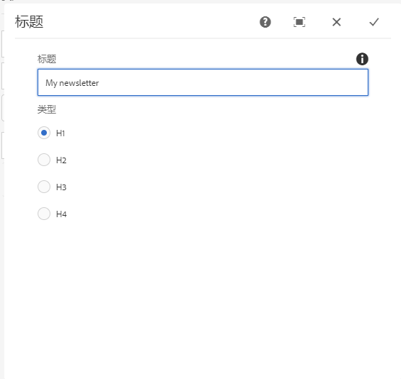
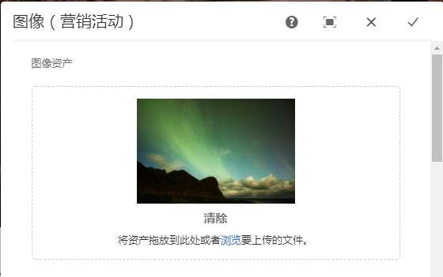
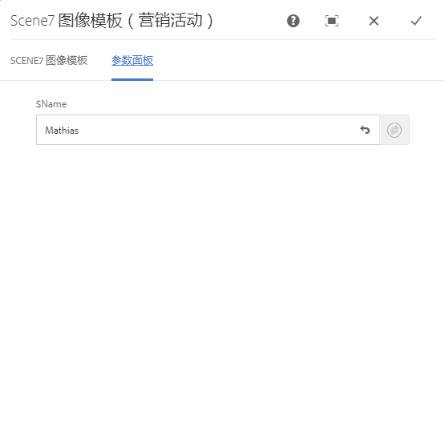
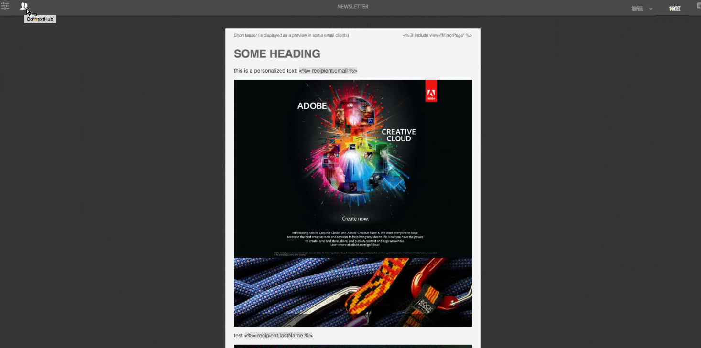
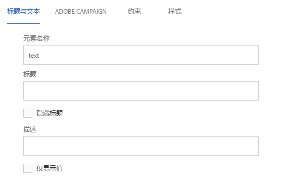
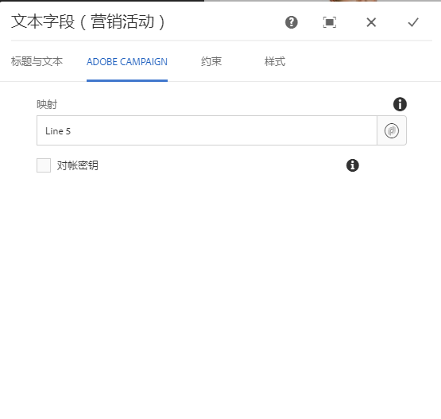
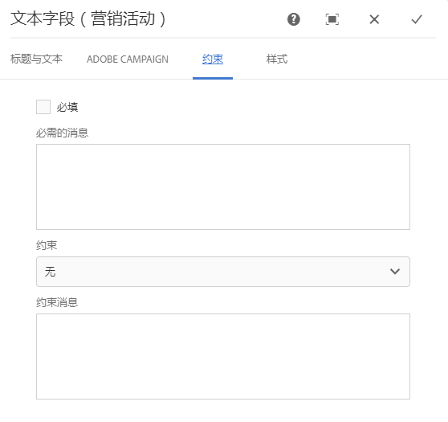
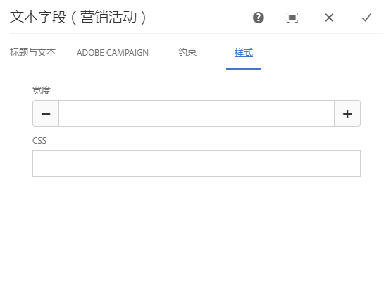
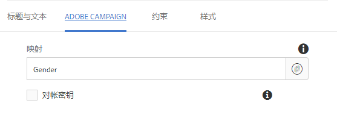

# Adobe Campaign 组件{#adobe-campaign-components}

与 Adobe Campaign 集成后，您可以在处理新闻稿和表单时使用相应的组件。本文档对这两类组件都进行了说明。

## Adobe Campaign 新闻稿组件  {#adobe-campaign-newsletter-components}

所有营销活动组件均遵循[电子邮件模板的最佳实践](/help/sites-administering/best-practices-for-email-templates.md)中列出的最佳实践，并且均基于 Adobe 标记语言 [HTL](https://helpx.adobe.com/cn/experience-manager/htl/using/overview.html)。

如果打开的新闻稿/电子邮件已配置为与 Adobe Campaign 集成，您应会在 **Adobe Campaign 新闻稿**&#x200B;部分看到以下组件：

* 标题（营销活动）
* 图像（营销活动）
* 链接（营销活动）
* Dynamic Media图像模板(活动)
* 目标引用（营销活动）
* 文本与图像（营销活动）
* 文本与个性化（营销活动）

以下部分介绍了这些组件。

各组件如下图所示：

### 标题(活动){#heading-campaign}

标题组件可以：

* 显示当前页面的名称，方法是将&#x200B;**标题**&#x200B;字段留空。
* 显示您在&#x200B;**标题**&#x200B;字段中指定的文本。

您可以直接编辑&#x200B;**标题（营销活动）**&#x200B;组件。留空将使用页面标题。

您可以配置以下各项：

* **标题**&#x200B;如果您要使用页面标题以外的名称，请在此处输入该名称。

* **标题级别（1、2、3、4）**&#x200B;基于 HTML 标题大小 1-4 的标题级别。

以下示例展示了所显示的标题（营销活动）组件。

### 图像(活动){#image-campaign}

图像（营销活动）组件可根据指定的参数显示图像和随附文本。

您可以上传图像，然后对其进行编辑和处理（例如裁剪、旋转、添加链接/标题/文本）。

您可以从[资产浏览器](/help/sites-authoring/author-environment-tools.md#assets-browser)中将图像直接拖放到组件上或其[“配置”对话框](/help/sites-authoring/editing-content.md#edit-configure-copy-cut-delete-paste)中。此外，也可以从“配置”对话框中上传图像；此对话框还控制着图像的所有定义和操作：

>[!NOTE]
>
>必须在&#x200B;**替代文本**&#x200B;字段中输入信息，否则无法保存图像。

上传图像后（而非之前），您可以根据需要使用[就地编辑](/help/sites-authoring/editing-content.md#edit-configure-copy-cut-delete-paste)裁切／旋转图像：

>[!NOTE]
>
>就地编辑器在编辑时使用图像的原始大小和长宽比。您还可以指定高度和宽度属性。在保存编辑更改时，将应用属性中定义的所有大小和长宽比限制。
>
>根据您的实例，[页面设计](/help/sites-developing/designer.md)还可能会强制应用最小和最大限制；这些限制在项目实施过程中开发。

还有其他几个选项在全屏编辑模式下可用；例如，地图和缩放：

加载图像后，您可以配置下列各项：

* **地图**

   要映射图像，请选择“映射”。 您可以指定创建图像映射的方式（矩形、多边形等）以及该区域应指向的位置。

* **裁剪**

   选择裁剪以裁剪图像。 可使用鼠标裁剪图像。

* **旋转**

   要旋转图像，请选择“旋转”。 连续使用“旋转”，直到图像旋转成您需要的外观。

* **清除**

   删除当前图像。

* 缩放栏（仅限经典）

   要放大和缩小图像，请使用图像下方的滚动条（在“确定”和“取消”按钮上方）。

* **标题**

   图像的标题。

* **替换文本**

   用于创建辅助内容的替代文本。

* **链接到**

   创建指向资产或网站中其他页面的链接。

* **描述**

   对图像的说明。

* **大小**

   设置图像的高度和宽度。

>[!NOTE]
>
>您必须在&#x200B;**高级**&#x200B;选项卡的&#x200B;**替换文本**&#x200B;字段中输入相应的信息，否则无法保存图像，同时还会显示以下错误消息：
>
>`Validation failed. Verify the values of the marked fields.`

以下示例展示了所显示的图像（营销活动）组件。

### 链接 (营销活动) {#link-campaign}

通过链接（营销活动）组件，您可以添加指向新闻稿的链接。

您可以在&#x200B;**显示**、**URL 信息**&#x200B;或&#x200B;**高级**&#x200B;选项卡中配置以下各项：

* **链接标题**

   链接的描述。 这是用户看到的文本。

* **链接工具提示**

   添加有关如何使用链接的其他信息。

* **LinkType**

   在下拉列表中，选择&#x200B;**自定义URL**&#x200B;和&#x200B;**自适应文档**。 此字段为必填字段。如果选择“自定义 URL”，则可以提供链接 URL。如果选择“自适应文档”，则可以提供文档路径。

* **其他 URL 参数**

   添加任何其他URL参数。 单击“添加项目”可添加多个项目。

>[!NOTE]
>
>必须在&#x200B;**URL信息**&#x200B;选项卡的&#x200B;**链接类型**&#x200B;字段中输入信息，否则无法保存该组件，并显示以下错误消息：
>
>`Validation failed. Verify the values of the marked fields.`

以下示例展示了所显示的链接（营销活动）组件。

### Scene7图像模板(活动){#scene-image-template-campaign}

[Scene7图](https://experienceleague.adobe.com/docs/dynamic-media-classic/using/template-basics/quick-start-template-basics.html#template-basics) 像模板是分层的图像文件，其中的内容和属性可进行参数化以实现可变性。**图像模板**&#x200B;组件允许您在新闻稿中使用Dynamic Media经典(以前称为Scene7)模板并更改模板参数的值。 此外，您可以在参数中使用Adobe Campaign元数据变量，以便每个用户以个性化的方式体验图像。

单击&#x200B;**编辑**&#x200B;可配置该组件。您可以配置本节中介绍的设置。 此Dynamic Media经典(以前称为Scene7)图像模板在[Scene7图像模板组件](/help/assets/scene7.md#image-template)中有详细说明。

此外，参数面板会列表为Dynamic Media经典(以前称为Scene7)中的模板定义的所有模板参数。 对于其中的每个参数，您都可以调整值、插入变量，或将其重置为默认值。

### 目标引用(活动){#targeted-reference-campaign}

通过目标引用（营销活动）组件，您可以创建对目标段落的引用。

在此组件中，您需要导航到目标段落以将其选定。

单击文件夹图标可导航到要引用的段落。完成后，单击复选标记。

### 文本与图像（营销活动）  {#text-image-campaign}

文本与图像（营销活动）组件可添加文本块和图像。

单击以配置该组件时，可选择“文本”或“图像”。

如果选择&#x200B;**文本**，则会显示内嵌的编辑器：

如果选择&#x200B;**图像**，则会显示图像的就地编辑器：

有关使用图像的更多信息，请参阅[图像（营销活动）组件](#image-campaign)。有关使用文本的更多信息，请参阅[文本与个性化（营销活动）组件](#text-personalization-campaign)。

同文本与个性化（营销活动）组件和图像（营销活动）组件一样，您也可以配置以下各项：

* **文本**

   输入文本。使用工具栏可修改格式，创建列表和添加链接。

* **图像**

   从内容查找器中拖动图像，或单击浏览到图像。根据需要进行裁剪或旋转。

* **图像属性** (**高级图像属性**)

   允许您指定以下内容：

   * **标题**

      块标题；鼠标悬停时将显示。

   * **替换文本**

      无法显示图像时将显示的替换文本。

   * **链接到**

      创建指向资产或网站中其他页面的链接。

   * **描述**

      对图像的说明。

   * **大小**

      设置图像的高度和宽度。

>[!NOTE]
>
>必须填写&#x200B;**高级**&#x200B;选项卡中的&#x200B;**替换文本**&#x200B;字段，否则将无法保存该组件，同时还会显示以下错误消息：
>
>`Validation failed. Verify the values of the marked fields.`

以下示例展示了所显示的文本与图像（营销活动）组件。

### 文本与个性化(活动){#text-personalization-campaign}

通过文本与个性化(活动)组件，您可以使用WYSIWYG编辑器输入文本块，该编辑器具有[富文本编辑器](/help/sites-authoring/rich-text-editor.md)提供的功能。 此外，通过此组件，您还可以使用 Adobe Campaign 提供的上下文字段和个性化基块；另请参阅[插入个性化](/help/sites-authoring/campaign.md#inserting-personalization)。

通过精选的图标可以设置文本格式，包括字体特性、对齐方式、链接、列表和缩进。两种UI](/help/sites-authoring/editing-content.md)中的功能基本相同，但外观不同：[

在就地编辑器中，您可以添加文本、更改对齐方式、添加和删除链接、添加上下文字段或个性化基块，以及进入全屏模式。添加完文本/个性化后，选择复选标记可保存更改（或选择 x 可取消）。有关详细信息，请参阅[就地编辑](/help/sites-authoring/editing-content.md#edit-configure-copy-cut-delete-paste)。

>[!NOTE]
>
>* 可用的个性化字段取决于您的新闻稿所链接到的 Adobe Campaign 模板。
>* 从 ContextHub 中选择某个人物后，个性化字段会自动替换为选定配置文件中的数据。

>
>
请参阅[插入个性化](/help/sites-authoring/campaign.md#inserting-personalization)。

>[!NOTE]
>
>只会考虑 **nms:seedMember** 架构或其某个扩展中定义的字段。链接到 **nms:seedMember** 的表的属性不可用。

## Adobe Campaign 表单组件 {#adobe-campaign-form-components}

使用 Adobe Campaign 组件，您可以创建可供用户填写的表单，以便订阅新闻稿、取消订阅新闻稿，或更新其配置文件。有关更多信息，请参阅[创建 Adobe Campaign 表单](/help/sites-authoring/adobe-campaign-forms.md)。

每个组件字段均可链接到一个 Adobe Campaign 数据库字段。可用的字段因其包含的数据类型而有所不同，如[组件和数据类型](#components-and-data-type)部分中所述。如果在 Adobe Campaign 中扩展收件人架构，则数据类型匹配的组件中将可以使用新字段。

打开配置为与Adobe Campaign集成的表单时，您会在&#x200B;**Adobe Campaign**&#x200B;部分看到以下组件：

* 复选框（营销活动）
* 日期字段（营销活动）和日期字段/HTML 5（营销活动）
* 已加密的主要密钥（营销活动）
* 错误显示（营销活动）
* 隐藏的对帐密钥（营销活动）
* 数字字段（营销活动）
* 选项字段（营销活动）
* 订阅核对清单（营销活动）
* 文本字段（营销活动）

各组件如下图所示：

此部分详细介绍了每个组件。

### 组件和数据类型  {#components-and-data-type}

下表介绍了可用来显示和修改 Adobe Campaign 配置文件数据的各个组件。每个组件均可映射到一个 Adobe Campaign 配置文件字段，以便显示字段值，并在提交表单后更新字段。各个组件只能与具有相应数据类型的字段相匹配。

<table> 
 <tbody> 
  <tr> 
   <td>
<strong>组件</strong>
 </td> 
   <td>
<strong>Adobe Campaign字段的数据类型</strong>
 </td> 
   <td>
<strong>示例字段</strong>
 </td> 
  </tr> 
  <tr> 
   <td>
复选框（营销活动）
 </td> 
   <td>
布尔型
 </td> 
   <td>
不再联系(由任何渠道)
 </td> 
  </tr> 
  <tr> 
   <td>
日期字段（营销活动）
 
日期字段/HTML 5（营销活动）
 </td> 
   <td>
date
 </td> 
   <td>
出生日期
 </td> 
  </tr> 
  <tr> 
   <td>
数字字段（营销活动）
 </td> 
   <td>
数字(字节、短、长、多次)
 </td> 
   <td>
年龄
 </td> 
  </tr> 
  <tr> 
   <td>
选项字段（营销活动）
 </td> 
   <td>
字节与相关值
 </td> 
   <td>
性别
 </td> 
  </tr> 
  <tr> 
   <td>
文本字段（营销活动）
 </td> 
   <td>
字符串
 </td> 
   <td>
电子邮件
 </td> 
  </tr> 
 </tbody> 
</table>

### 大多数组件中的通用设置 {#settings-common-to-most-components}

Adobe Campaign 组件具有所有组件（不包括已加密的主要密钥组件和隐藏的对帐密钥组件）通用的设置。

您可在大多数组件中配置以下各项：

#### 标题与文本  {#title-and-text}

* **标题**

   如果要使用元素名称以外的名称，请在此处输入它。

* **隐藏标题**

   如果不希望显示标题，请选中此复选框。

* **描述**

   向字段添加说明，为用户提供更多信息。

* **仅显示值**

   仅显示值（如果有值）

#### Adobe Campaign {#adobe-campaign}

您可以配置以下各项：

* **映射**

   选择Adobe Campaign个性化字段（如果适用）。

* **对帐密钥**

   如果此字段是合并关键项的一部分，请选中此复选框。

#### 约束 {#constraints}

* **必填**

   选中此复选框可使此组件成为必需组件；即用户必须输入一个值。

* **必需的消息**

   （可选）添加一条消息，说明字段为必填字段。

#### 样式 {#styling}

* **CSS**&#x200B;输入要用于此组件的 CSS 类。

### 复选框(活动){#checkbox-campaign}

通过复选框（营销活动）组件，用户可以修改数据类型为布尔型的 Adobe Campaign 配置文件字段。例如，您可能具有一个复选框（营销活动）组件，允许收件人指定不希望通过任何渠道联系自己。

您可以在复选框（营销活动）组件中[配置大多数 Adobe Campaign 组件通用的设置](#settings-common-to-most-components)。

以下示例展示了所显示的复选框（营销活动）组件。

### 日期字段(活动)和日期字段/HTML 5(活动){#date-field-campaign-and-date-field-html-campaign}

使用日期字段，可以让收件人指定某个日期；例如，您可能希望收件人指定其出生日期。日期格式需匹配 Adobe Campaign 实例中使用的格式。

除了[大多数 Adobe Campaign 组件通用的设置](#settings-common-to-most-components)之外，您还可以配置以下各项：

* **约束-** 约束下拉列表

   可以选择- **无**&#x200B;或&#x200B;**日期**-来添加日期约束或无约束。 如果您选择日期，则用户在字段中输入的回答必须采用某种日期格式。

* **约束消息**

   此外，您还可以添加约束消息，以便用户了解如何正确设置其答案的格式。
* **样式-**
宽度通过单击或点按 
**或** 输 **入** 数字。

以下示例展示了所显示的调整了宽度的日期字段（营销活动）组件。

### 已加密的主密钥(活动){#encrypted-primary-key-campaign}

此组件定义将包含 Adobe Campaign 配置文件标识符的 URL 参数的名称（在 Adobe Campaign Standard 和 6.1 中分别为&#x200B;**主要资源标识符**&#x200B;和&#x200B;**已加密的主要密钥**）。

用于显示和修改 Adobe Campaign 配置文件数据的每个表单都&#x200B;**必须**&#x200B;包含已加密的主要密钥组件。

您可以在已加密的主要密钥（营销活动）组件中配置以下各项：

* **标题和文本——元素名称**

   默认为encryptedPK。 仅当该元素名称与表单中其他元素的名称发生冲突时，才需要对其进行更改。不能有两个表单字段具有相同的元素名称。
* **Adobe Campaign - URL 参数**&#x200B;添加 EPK 的 URL 参数。例如，您可以使用 
**epk**。

以下示例展示了所显示的已加密的主要密钥（营销活动）组件。

### 错误显示(活动){#error-display-campaign}

通过此组件，您可以显示后端错误。需要将表单的错误处理设置为“转发”，才能使此组件正常工作。

以下示例展示了所显示的错误显示（营销活动）组件。

### 隐藏合并关键项(活动){#hidden-reconciliation-key-campaign}

隐藏合并关键项(活动)组件允许您将隐藏字段作为合并关键项的一部分添加到表单。

您可以在隐藏的对帐密钥（营销活动）组件中配置以下各项：

* **标题和文本——元素名称**

   默认为reconcilKey。 仅当该元素名称与表单中其他元素的名称发生冲突时，才需要对其进行更改。不能有两个表单字段具有相同的元素名称。
* **Adobe Campaign - 映射**&#x200B;映射到 Adobe Campaign 个性化字段。

以下示例展示了所显示的隐藏的对帐密钥（营销活动）组件。

### 数字字段(活动){#numeric-field-campaign}

使用数字字段，可以让收件人输入数字，例如他们的年龄。

除了[大多数 Adobe Campaign 组件通用的设置](#settings-common-to-most-components)之外，您还可以配置以下各项：

* **约束-** 约束下拉列表

   可以选择- **无**&#x200B;或&#x200B;**数字** —— 以添加数字约束或不添加任何约束。 如果您选择数字，则用户在字段中输入的回答必须是数字。

* **约束消息**

   此外，您还可以添加约束消息，以便用户了解如何正确设置其答案的格式。
* **样式-**
宽度通过单击或点按 
**或** 输 **入** 数字。

以下示例展示了所显示的配置了宽度的数字字段（营销活动）组件。

### 选项字段(活动){#option-field-campaign}

此下拉列表允许您选择某个选项；例如，收件人的性别或状况。

您可以在选项字段（营销活动）组件中[配置大多数 Adobe Campaign 组件通用的设置](#settings-common-to-most-components)。要填充此下拉列表，请在 Adobe Campaign 个性化字段中选择相应的字段，方法是单击或点按 Adobe Campaign 符号，然后导航到相应的字段。

以下示例展示了所显示的选项字段（营销活动）组件。

### 订阅清单(活动){#subscriptions-checklist-campaign}

使用&#x200B;**订阅核对清单（营销活动）**&#x200B;组件，可修改与 Adobe Campaign 配置文件关联的订阅。

此组件在添加到表单后，会将所有可用的订阅显示为复选框，并允许用户选择所需的订阅。用户提交表单时，此组件会根据表单操作类型(**Adobe Campaign:订阅服务**&#x200B;或&#x200B;**Adobe Campaign:取消订阅服务**)。

>[!NOTE]
>
>此组件不会核查用户已订阅/取消订阅的服务。

您可以在订阅核对清单（营销活动）组件中[配置大多数 Adobe Campaign 组件通用的设置](#settings-common-to-most-components)。（没有可用于此组件的 Adobe Campaign 配置。）

以下示例展示了所显示的订阅核对清单（营销活动）组件。

### 文本字段(活动){#text-field-campaign}

通过文本字段（营销活动）组件，您可以输入字符串类型的数据，例如名字、姓氏、地址、电子邮件地址，等等。

除了[大多数 Adobe Campaign 组件通用的设置](#settings-common-to-most-components)之外，您还可以配置以下各项：

* **约束-** 约束下拉列表

   您可以选择- **无、电子邮件、**&#x200B;或&#x200B;**名称（无变音）**-来添加电子邮件地址、名称或无约束的约束。 如果您选择电子邮件，则用户在字段中输入的回答必须是电子邮件地址。如果您选择名称，则输入的回答必须是名称（不允许包含变音）。

* **约束消息**

   此外，您还可以添加约束消息，以便用户了解如何正确设置其答案的格式。

* **样式——宽度**

   单击或点按&#x200B;**+**&#x200B;和&#x200B;**-**&#x200B;图标或输入数字，调整字段的宽度。

以下示例展示了所显示的文本字段（营销活动）组件。

