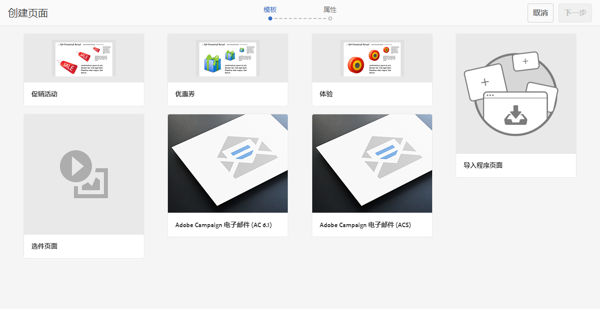
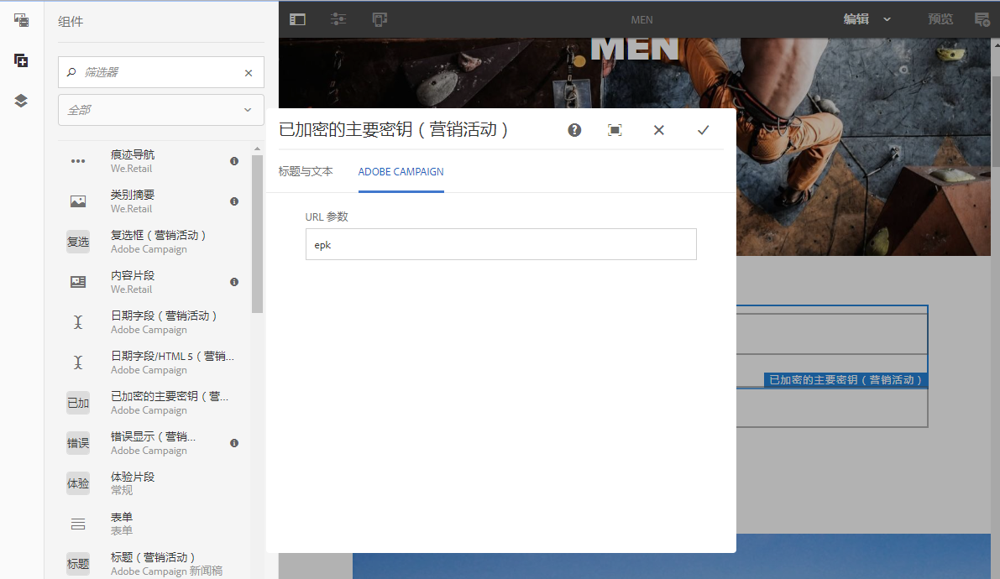

# 在AEM中创建Adobe Campaign Forms {#creating-adobe-campaign-forms-in-aem}

>[!CAUTION]
>
>AEM 6.4已结束扩展支持，本文档将不再更新。 有关更多详细信息，请参阅 [技术支助期](https://helpx.adobe.com/cn/support/programs/eol-matrix.html). 查找支持的版本 [此处](https://experienceleague.adobe.com/docs/).

AEM允许您创建和使用与网站上的Adobe Campaign交互的表单。 可将特定字段插入到表单中并映射到Adobe Campaign数据库。

您可以管理新的联系人订阅、退订和用户配置文件数据，同时将其数据集成到Adobe Campaign数据库中。

要在AEM中使用Adobe Campaign表单，您需要按照本文档中所述的步骤操作：

1. 使模板可用。
1. 创建表单。
1. 编辑表单内容。

默认提供三种类型的表单(特定于Adobe Campaign):

* 保存用户档案
* 订阅服务
* 退订服务

这些表单定义一个URL参数，用于接受Adobe Campaign配置文件的已加密主密钥。 根据此URL参数，表单会更新关联的Adobe Campaign配置文件的数据。

尽管您单独创建这些表单，但在典型用例中，您会在新闻稿内容中生成一个指向表单页面的个性化链接，以便收件人可以打开该链接并调整其用户档案数据（无论是取消订阅、订阅还是更新其用户档案）。

表单会根据用户自动更新。 请参阅 [编辑表单内容](#editing-form-content) 以了解更多信息。

## 使模板可用 {#making-a-template-available}

要创建特定于Adobe Campaign的表单，您必须在AEM应用程序中提供不同的模板。

要实现此目的，请参阅 [模板文档](/help/sites-developing/templates.md#template-availability).

## 创建表单 {#creating-a-form}

首先，检查创作实例和发布实例之间的连接，以便Adobe Campaign正常工作。 请参阅 [与Adobe Campaign Standard集成](/help/sites-administering/campaignstandard.md) 或 [与Adobe Campaign Classic集成](/help/sites-administering/campaignonpremise.md).

>[!NOTE]
>
>确保 **acMapping** 页面上的属性 **jcr:content** 节点设置为 **mapRecipient** 或 **个人资料** 分别使用Adobe Campaign Classic或Adobe Campaign Standard时

1. 在AEM的站点中，导航到要创建新页面的位置。
1. 创建页面并选择 **Adobe Campaign Classic个人资料**&#x200B;或&#x200B;**Adobe Campaign Standard个人资料** 单击 **下一个**.

   

   >[!NOTE]
   >
   >如果所需的模板不可用，请参阅 [模板可用性](/help/sites-developing/templates.md#template-availability).

1. 在 **名称** 字段，添加页面名称。 它必须是有效的JCR名称。
1. 在 **标题** 字段，输入标题并单击 **创建**.
1. 打开页面并选择 **打开属性** 在“Cloud Services”中，添加Adobe Campaign配置并选择复选标记以保存更改。

   

1. 在页面上，在 **表单开始** 组件，请选择其表单类型 —  **订阅、取消订阅、**&#x200B;或&#x200B;**保存配置文件**. 每个表单只能有一种类型。 您现在可以 [编辑表单的内容](#editing-form-content).

## 编辑表单内容 {#editing-form-content}

专门用于Adobe Campaign的Forms具有特定组件。 这些组件提供了一个选项，允许您将表单的每个字段链接到Adobe Campaign数据库中的字段。

>[!NOTE]
>
>如果所需的模板不可用，请参阅 [使模板可用](/help/sites-authoring/adobe-campaign.md).

本节仅详细介绍指向Adobe Campaign的特定链接。 有关如何在Adobe Experience Manager中使用表单的更全面概述，请参阅 [编辑模式组件](/help/sites-authoring/default-components-foundation.md).

1. 选择 **打开属性** 在“Cloud Services”中，添加Adobe Campaign配置并选择复选标记以保存更改。

   

1. 在页面上，在 **表单开始** 组件中，单击配置图标。

   

1. 单击 **高级** 选项卡上，选择表单的类型 —  **订阅、取消订阅、** 或 **保存配置文件** 单击 **好。** 每个表单只能有一种类型。

   * **Adobe Campaign:保存配置文件**:用于在Adobe Campaign中创建或更新收件人（默认值）。
   * **Adobe Campaign:订阅服务**:允许您在Adobe Campaign中管理收件人的订阅。
   * **Adobe Campaign:取消订阅服务**:允许您在Adobe Campaign中取消收件人的订阅。

1. 您必须具有 **已加密的主密钥** 组件。 此组件定义将使用哪个URL参数来接受Adobe Campaign配置文件的已加密主密钥。 在“组件”中，选择Adobe Campaign，以便仅显示这些组件。
1. 拖动组件 **已加密的主密钥** 到表单（任意位置），然后单击或点按 **配置** 图标。 在 **Adobe Campaign** 选项卡，为URL参数指定任何名称。 单击或点按复选标记以保存更改。

   生成的指向此表单的链接需要使用此URL参数，并为其分配Adobe Campaign配置文件的已加密主密钥。 已加密的主密钥必须进行正确的URL（百分比）编码。

   

1. 根据需要向表单中添加组件，如文本字段、日期字段、复选框字段、选项字段等。 请参阅 [Adobe Campaign表单组件](/help/sites-authoring/adobe-campaign-components.md) ，以了解有关每个组件的更多信息。
1. 单击配置图标以打开组件。 例如， **文本字段（营销活动）** ，请更改标题和文本。

   单击 **Adobe Campaign** 将表单字段映射到Adobe Campaign元数据变量。 提交表单后，映射的字段会在Adobe Campaign中更新。 变量选取器中仅提供具有匹配类型的字段（例如，文本字段的字符串变量）。

   

   >[!NOTE]
   >
   >您可以按照以下说明添加/删除在收件人表中显示的字段： [https://blogs.adobe.com/experiencedelivers/experience-management/aem-campaign-integration/](https://blogs.adobe.com/experiencedelivers/experience-management/aem-campaign-integration/)

1. 单击 **发布页面**. 该页面将在您的网站上激活。 您可以转到AEM发布实例来查看它。 您还可以 [测试表单](#testing-a-form).

   >[!CAUTION]
   >
   >您需要向云服务上的匿名用户提供读取权限，才能在发布时使用表单。 但是，请注意向匿名用户提供读取权限时存在的潜在安全问题，并确保通过（例如）配置调度程序来缓解该问题。

## 测试表单 {#testing-a-form}

在创建表单并编辑表单内容后，您可能需要手动测试表单是否可按预期工作。

>[!NOTE]
>
>您必须具有 **已加密的主密钥** 组件。 在“组件”中，选择Adobe Campaign，以便仅显示这些组件。
>
>虽然在此过程中您需手动输入EPK编号，但实际上，用户将在新闻稿中获得指向此页面的链接（无论是取消订阅、订阅还是更新用户档案）。 EPK会根据用户自动更新。
>
>要创建该链接，请使用变量 **主要资源标识符**(Adobe Campaign Standard)或 **加密的标识符** (Adobe Campaign Classic)(例如， **文本与个性化（营销活动）** 组件)，链接到Adobe Campaign中的epk。

为此，您需要手动获取Adobe Campaign配置文件的EPK，然后将其附加到URL:

1. 要获取Adobe Campaign配置文件的已加密的主密钥(EPK)，请执行以下操作：

   * 在Adobe Campaign Standard中 — 导航到 **用户档案和受众** > **用户档案**，其中列出了现有配置文件。 确保表格显示 **主资源标识符** 字段(可通过单击/点按来配置 **配置列表**)。 复制所需配置文件的主资源标识符。
   * 在Adobe Campaign Classic，转到 **用户档案和目标** >  **收件人**，其中列出了现有配置文件。 确保表格显示 **加密的标识符** 字段(可通过右键单击某个条目并选择 **配置列表……**)。 复制所需配置文件的加密标识符。

1. 在AEM中，打开发布实例上的表单页面，并将步骤1中的EPK作为URL参数附加：使用您在创作表单时在EPK组件中定义的相同名称(例如： `?epk=...`)
1. 现在，可以使用表单修改与链接的Adobe Campaign用户档案关联的数据和订阅。 在修改某些字段并提交表单后，您可以在Adobe Campaign中验证相应数据是否已更新。

验证表单后，将更新Adobe Campaign数据库中的数据。
