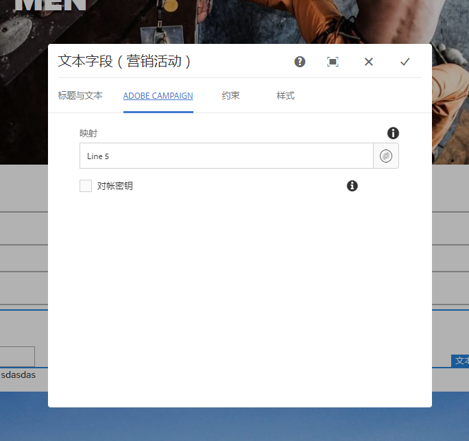

# 在 AEM 中创建 Adobe Campaign 表单 {#creating-adobe-campaign-forms-in-aem}

AEM 允许您在网站上创建和使用与 Adobe Campaign 交互的表单。可以将特定字段插入到表单中，并将其映射到 Adobe Campaign 数据库。

您可以管理新的联系人订阅、取消订阅和用户配置文件数据，同时将他们的数据集成到 Adobe Campaign 数据库中。

要在 AEM 中使用 Adobe Campaign 表单，您需要执行本文档中所述的以下步骤：

1. 启用模板。
1. 创建表单。
1. 编辑表单内容。

默认情况下，可以使用三种特定于 Adobe Campaign 的表单：

* 保存配置文件
* 订阅服务
* 取消订阅服务

这些表单定义了一个 URL 参数，用于接受 Adobe Campaign 配置文件的已加密的主要密钥。根据此 URL 参数，表单会更新关联的 Adobe Campaign 配置文件的数据。

虽然您可以独立创建这些表单，但在典型用例中，您需要在新闻稿内容中生成一个指向表单页面的个性化链接，以使收件人能够打开该链接并调整其配置文件数据（无论是取消订阅、订阅还是更新其配置文件）。

表单会根据用户自动进行更新。有关更多信息，请参阅[编辑表单内容](#editing-form-content)。

## 启用模板 {#making-a-template-available}

您必须先在 AEM 应用程序中启用不同的模板，然后才能创建特定于 Adobe Campaign 的表单。

To do this, see the [Templates documentation](/help/sites-developing/templates.md#template-availability).

## 创建表单 {#creating-a-form}

首先，需检查创作和发布实例之间的连接，并确认 Adobe Campaign 正在运行。请参阅[与 Adobe Campaign Standard 集成](/help/sites-administering/campaignstandard.md)或[与 Adobe Campaign Classic 集成](/help/sites-administering/campaignonpremise.md)。

>[!NOTE]
>
>使用 Adobe Campaign Classic 或 Adobe Campaign Standard 时，请确保页面的 **jcr:content** 节点上的 **acMapping** 属性分别设置为 **mapRecipient** 或 **profile**。

1. 在 AEM 的“站点”中，导航到要创建新页面的位置。
1. Create a page and select **Adobe Campaign Classic Profile** or **Adobe Campaign Standard Profile** and click **Next**.

   

   >[!NOTE]
   >
   >If the desired template is not available, see [Template Availability](/help/sites-developing/templates.md#template-availability).

1. 在&#x200B;**名称**&#x200B;字段中，添加该页面的名称。它必须是有效的 JCR 名称。
1. 在&#x200B;**标题**&#x200B;字段中，输入标题并单击&#x200B;**创建**。
1. 打开该页面，选择&#x200B;**打开属性**，然后在“云服务”中，添加 Adobe Campaign 配置并选择复选标记以保存所做的更改。

   

1. 在该页面的&#x200B;**表单开始**&#x200B;组件中，选择表单的类型 - **订阅、取消订阅**&#x200B;或&#x200B;**保存配置文件**。每个表单只能具有一种类型。You can now [edit the form&#39;s content](#editing-form-content).

## 编辑表单内容 {#editing-form-content}

Adobe Campaign 的专用表单具有特定的组件。这些组件提供了一个选项，允许您将表单的每个字段链接到 Adobe Campaign 数据库中的字段。

>[!NOTE]
>
>If the desired template is not available, see [Making a template available](/help/sites-authoring/adobe-campaign.md).

此部分仅详细介绍了 Adobe Campaign 的特定链接。For more information on a more general overview of how to use forms in Adobe Experience Manager, see [Editmode components](/help/sites-authoring/default-components-foundation.md).

1. 选择&#x200B;**打开属性**，然后在“云服务”中，添加 Adobe Campaign 配置并选择复选标记以保存所做的更改。

   

1. On the page, in the **Form Start** component, click the Configuration icon.

   

1. Click the **Advanced** tab and select the type of form it is - **Subscribe, Unsubscribe,** or **Save Profile** and click **OK.**&#x200B;每个表单只能具有一种类型。

   * **Adobe Campaign: 保存配置文件**：允许您在 Adobe Campaign 中创建或更新收件人（默认值）。
   * **Adobe Campaign: 订阅服务**：允许您在 Adobe Campaign 中管理收件人的订阅。
   * **Adobe Campaign: 取消订阅服务**：允许您在 Adobe Campaign 中取消收件人的订阅。

1. 每个表单上必须具有一个&#x200B;**已加密的主要密钥**&#x200B;组件。此组件定义将用于接受 Adobe Campaign 配置文件的已加密主要密钥的 URL 参数。在组件中，选择Adobe Campaign，以便只显示这些组件。
1. Drag the component **Encrypted Primary Key** to the form (anywhere) and click or tap the **Configuration** icon. 在 **Adobe Campaign** 选项卡中，为 URL 参数指定任意名称。单击或点按复选标记以保存所做的更改。

   为此表单生成的链接需要使用此 URL 参数为其分配 Adobe Campaign 配置文件的已加密主要密钥。已加密的主要密钥必须进行相应的 URL（百分比）编码。

   

1. 根据需要，向表单中添加组件，例如文本字段、日期字段、复选框字段、选项字段等。有关每个组件的更多信息，请参阅 [Adobe Campaign 表单组件](/help/sites-authoring/adobe-campaign-components.md)。
1. 单击“配置”图标以打开组件。For example, in **Text Field (Campaign)** component, change the title and text.

   单击 **Adobe Campaign** 以将表单字段映射到 Adobe Campaign 元数据变量。提交表单后，映射的字段会在 Adobe Campaign 中进行更新。在变量选取器中，只能选择具有匹配类型的字段（例如，对于文本字段，只能选择字符串变量）。

   

   >[!NOTE]
   >
   >You can add/remove fields that are displayed in the recipient table by following the instructions here: [https://blogs.adobe.com/experiencedelivers/experience-management/aem-campaign-integration/](https://blogs.adobe.com/experiencedelivers/experience-management/aem-campaign-integration/)

1. 单击&#x200B;**发布页面**。该页面会在您的站点上激活。您可以通过转到 AEM 发布实例来查看它。此外，您还可以[测试表单](#testing-a-form)。

   >[!CAUTION]
   >
   >您需要为云服务上的匿名用户提供读取权限，才能在发布环境中使用表单。但请注意，为匿名用户提供读取权限会出现潜在的安全问题，应务必通过（例如）配置调度程序来消除此类问题。

## 测试表单 {#testing-a-form}

创建表单并编辑表单内容后，您可能需要手动测试表单是否可以正常工作。

>[!NOTE]
>
>You must have an **Encryted Primary Key** component on each form. 在组件中，选择Adobe Campaign，以便只显示这些组件。
>
>在此过程中，虽然您手动输入了 EPK 编号，但实际上，用户可以在新闻稿中获得此页面的链接（无论是取消订阅、订阅还是更新配置文件）。EPK 会根据用户自动进行更新。
>
>To create that link, you use the variable **Main resource identifier**(Adobe Campaign Standard) or **Encrypted identifier** (Adobe Campaign Classic) (for example, in a **Text &amp; Personalization (Campaign)** component), which links to the epk in Adobe Campaign.

为此，您需要手动获取 Adobe Campaign 配置文件的 EPK，然后将其附加到 URL：

1. 要获取 Adobe Campaign 配置文件的已加密的主要密钥 (EPK)，请执行以下操作：

   * In Adobe Campaign Standard - Navigate to **Profiles and Audiences** > **Profiles**, which lists the existing profiles. Make sure the table displays the **Main Resource Identifier** field in a column (This can be configured by clicking/tapping **Configure list**). 复制所需配置文件的主要资源标识符。
   * In Adobe Campaign Classic, go to **Profiles and Targets** >  **Recipients**, which lists the existing profiles. Make sure the table displays the **Encrypted identifier** field in a column (This can be configured by right-clicking on an entry and selecting **Configure list...**). 复制所需配置文件的已加密标识符。

1. In AEM, open the form page on the publish instance and append the EPK from step 1 as a URL parameter: use the same name that you previously defined in the EPK component when authoring the form (for example: `?epk=...`)
1. 现在，表单可用于修改与链接的 Adobe Campaign 配置文件相关联的数据和订阅。修改某些字段并提交表单后，您可以在 Adobe Campaign 内验证相应数据是否已更新。

验证表单后，Adobe Campaign 数据库中的数据便会更新。
