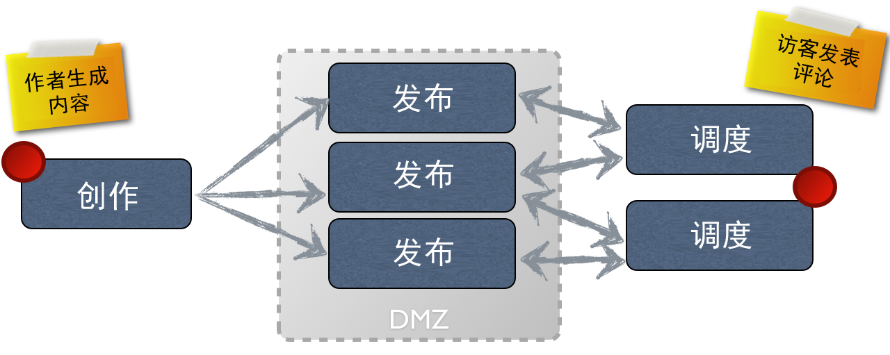

# 创作和发布的概念{#authoring}

>[!CAUTION]
>
>AEM 6.4已结束扩展支持，本文档将不再更新。 有关更多详细信息，请参阅 [技术支助期](https://helpx.adobe.com/cn/support/programs/eol-matrix.html). 查找支持的版本 [此处](https://experienceleague.adobe.com/docs/).

AEM提供了两个环境：

* 创作
* 发布

通过这些交互，您可以在网站上提供内容，以便访客可以阅读。

创作环境提供了在实际发布内容之前创建、更新和审核此内容的机制：

* 作者创建并审阅内容(这可以是几种类型；例如，页面、资产、发布等)
* 将在某个时候发布到您的网站。

在创作环境中，AEM的功能通过两个UI提供。 对于发布环境，可以设计提供给用户使用的界面的整体外观。

## 创作环境 {#author-environment}

作者在称为&#x200B;**[创作环境](/help/sites-authoring/home.md)**&#x200B;的环境中工作。这为创建内容提供了易于使用的界面（图形用户界面（GUI 或 UI））。它通常位于公司防火墙之后，防火墙可提供完全保护，并要求作者使用分配了相应访问权限的帐户登录。

>[!NOTE]
>
>您的帐户需要适当的访问权限才能创建、编辑或发布内容。

根据您的实例和个人访问权限的配置方式，您可以对内容执行许多任务，其中包括（但不限于）：

* 在页面上生成新内容或编辑现有内容
* 使用预定义模板来创建新内容页面
* 创建、编辑和管理资产和收藏集
* 创建、编辑和管理发布内容
* 开发活动和相关资源
* 开发和管理社区站点
* 移动、复制或删除内容页面、资产等
* 发布（或取消发布）页面、资产等

此外，还有一些管理任务可帮助管理内容：

* 控制更改管理方式的工作流；例如。 在发布前实施审核
* 协调各项任务的项目

>[!NOTE]
>
>AEM也 [受管](/help/sites-administering/home.md) （对于大多数任务）。

## 发布环境 {#publish-environment}

准备就绪后，AEM网站的内容会发布到 **发布环境**. 在该环境中，根据设计界面的具体观感，目标受众可以使用网站页面。

通常，发布环境位于非军事区内；换句话说，可以在互联网上使用，但不再处于内部网络的完全保护之下。

当AEM网站为 [社区网站](/help/communities/overview.md)，或包括 [社区组件](/help/communities/author-communities.md)，登录网站访客（成员）可以与社区功能交互。 例如，他们可以发布到论坛、发表评论或关注其他成员。 会员可以被授予执行活动的权限，这些活动通常仅限于创作环境，例如创建新页面（社区组）、博客文章以及审核其他成员的帖子。

>[!NOTE]
>
>遗憾的是，使用的术语有时存在重叠。 这可能发生在：
>
>* **发布/取消发布**
   >  这些是在发布环境中公开提供（或不公开提供）您的内容的主要操作术语。
>
>* **激活／取消激活**
   >  这两个术语与发布/取消发布同义。它们在经典UI中比较常见。
>
>* **复制**
   >  这些是用于指示数据（例如页面内容、文件、代码、用户评论）从一个环境移动到另一个环境的技术术语；例如，在发布或反向复制用户评论时。
>

## Dispatcher {#dispatcher}

为了优化网站访客体验，**[Dispatcher](https://helpx.adobe.com/experience-manager/dispatcher/user-guide.html) 实施了负载平衡和缓存。**
