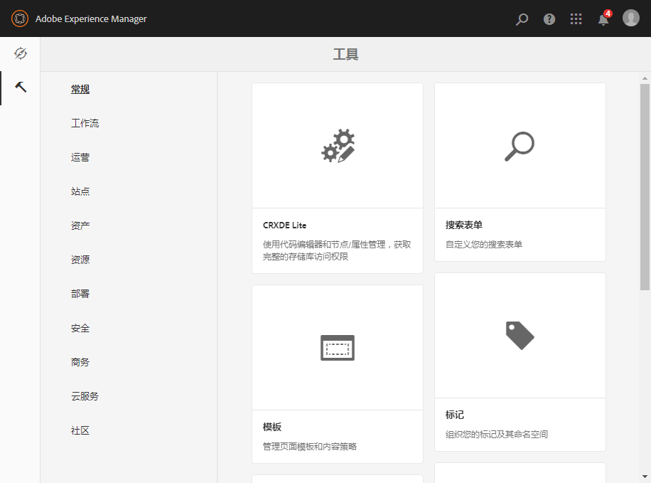
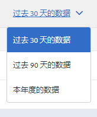
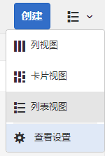
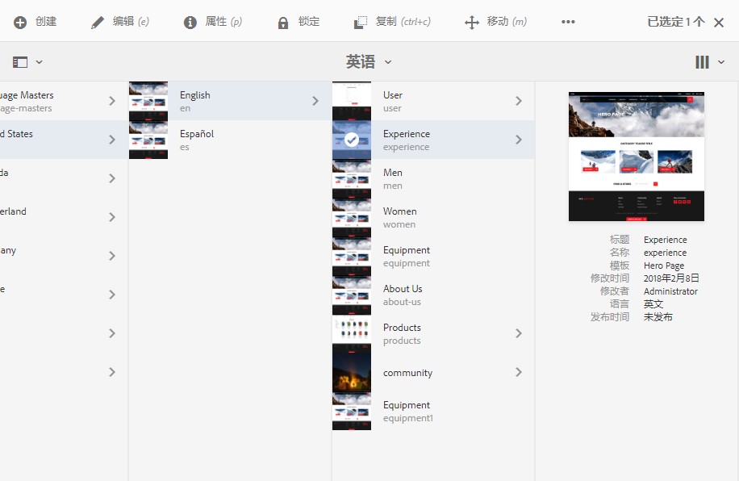
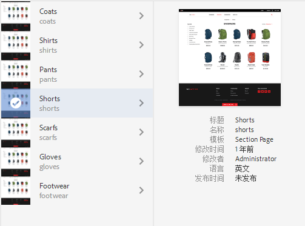
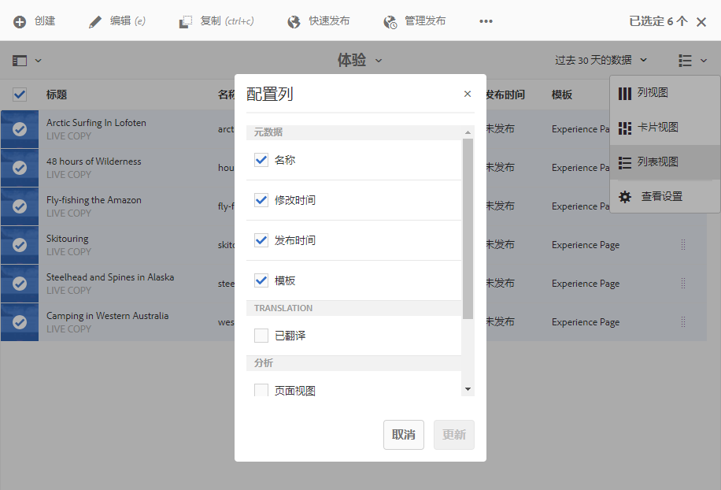
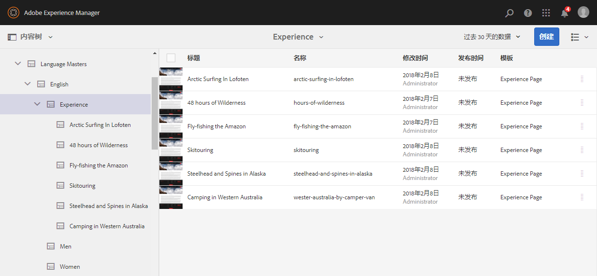
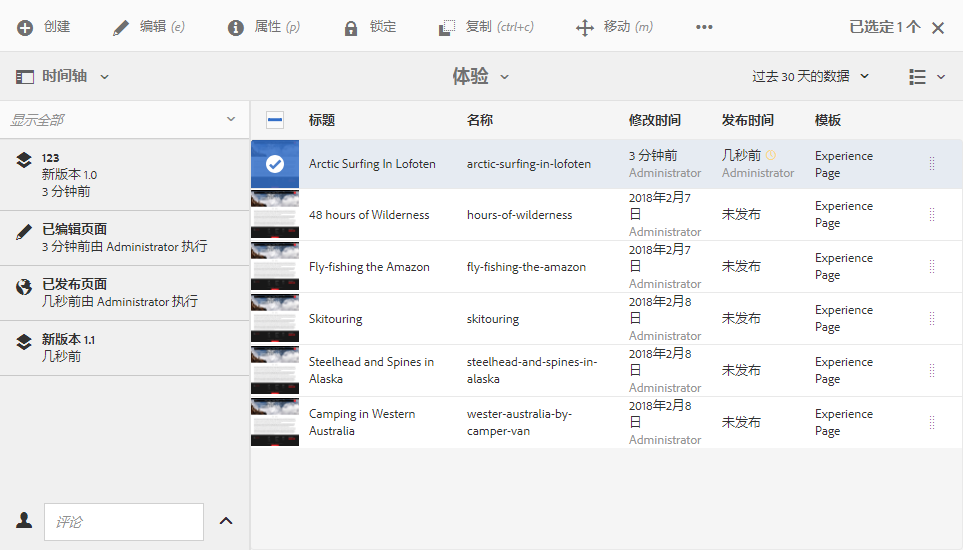

# 基本处理 {#basic-handling}

>[!CAUTION]
>
>AEM 6.4已结束扩展支持，本文档将不再更新。 有关更多详细信息，请参阅 [技术支助期](https://helpx.adobe.com/cn/support/programs/eol-matrix.html). 查找支持的版本 [此处](https://experienceleague.adobe.com/docs/).

>[!NOTE]
>
>* 本页面旨在概述使用AEM创作环境时的基本操作。 它使用&#x200B;**站点**&#x200B;控制台作为基础。
>
>* 某些功能并非在所有控制台中都可用，而且某些控制台中可能会提供其他功能。 其他页面上将更详细地介绍有关各个控制台及其相关功能的特定信息。
>* 用户在整个 AEM 环境中都可以使用各种键盘快捷键，尤其是在[使用控制台](/help/sites-authoring/keyboard-shortcuts.md)和[编辑页面](/help/sites-authoring/page-authoring-keyboard-shortcuts.md)时。
>

## 快速入门 {#getting-started}

### 触屏优化 UI {#a-touch-enabled-ui}

AEM用户界面已为触控启用。 触屏界面允许您使用触屏，通过点按、触控并按住及轻扫之类的手势与软件进行交互。这与传统桌面界面使用鼠标操作（如单击、双击、右键单击和鼠标悬停）的操作方式形成了鲜明对比。 由于只需使用手势，触屏UI在移动平板电脑设备上完全可用，而且桌面上仍具有完整的功能。

### 首要步骤 {#first-steps}

登录后，您将立即转到[“导航”面板](/help/sites-authoring/basic-handling.md#global-navigation)。下节将更详细地讨论此问题。

单击其中一个选项会打开相应的控制台。 为了使您更好地了解 AEM 的基本用法，本文档基于&#x200B;**站点**&#x200B;控制台进行了介绍。

请单击或点按&#x200B;**站点**&#x200B;以开始操作。

### 产品导航 {#product-navigation}

每当用户首次访问控制台时，都会启动产品导航教程。 请花上一分钟的时间，通过单击或点按通读该教程，以大致了解 AEM 的基本处理。

单击或点按 **明白了！** 以前进到概述的下一页。 单击或点按 **关闭** 或者，单击或点按概述对话框外部可关闭。

该概述将在您下次访问控制台时重新启动，除非您选中选项 **不再显示此内容**.

## 全局导航 {#global-navigation}

您可以使用全局导航面板在控制台之间导航。单击或点按屏幕左上角的Adobe Experience Manager链接时，此链接将以全屏下拉菜单的形式触发。

通过单击或点按&#x200B;**关闭**&#x200B;可关闭全局导航面板，以返回到您之前所在的位置。

>[!NOTE]
>
>首次登录时，您会看到 **导航** 的上界。

全局导航有两个面板，它们由屏幕左侧的图标来表示：

* **导航** – 登录到 AEM 时由一个指南针图标
* **工具** – 由一个锤子图标来表示

这些面板上可用的选项如下所述。

1. “导航”面板：

   

   在“导航”中，可用的控制台有：

<table> 
 <tbody>
  <tr>
   <td><strong>控制台</strong></td> 
   <td><strong>用途</strong></td> 
  </tr>
  <tr>
   <td>资源  </td> 
   <td>通过这些控制台，您可以导入和 <a href="/help/assets/assets.md">管理数字资产</a> 例如图像、视频、文档和音频文件。 然后，这些资产便可由在同一AEM实例上运行的任何网站使用。 </td> 
  </tr>
  <tr>
   <td>社区</td> 
   <td>此控制台允许您创建和管理 <a href="/help/communities/sites-console.md">社区站点</a> 表示 <a href="/help/communities/overview.md#engagement-community">参与</a> 和 <a href="/help/communities/overview.md#enablement-community">启用</a>.</td> 
  </tr>
  <tr>
   <td>商务</td> 
   <td>这允许您管理与 <a href="/help/sites-administering/ecommerce.md">商务</a> 站点。</td> 
  </tr>
  <tr>
   <td>体验片段</td> 
   <td>安 <a href="/help/sites-authoring/experience-fragments.md">体验片段</a> 是一个独立的体验，可以跨渠道重复使用，也具有变量，从而避免反复地复制和粘贴体验或体验的某些部分。</td> 
  </tr>
  <tr>
   <td>Forms</td> 
   <td>此控制台允许您创建、管理和处理 <a href="/help/forms/using/introduction-aem-forms.md">表单和文档</a>&gt; 。</td> 
  </tr>
  <tr>
   <td>个性化</td> 
   <td>此控制台提供 <a href="/help/sites-authoring/personalization.md">用于创作目标内容和呈现个性化体验的工具框架</a>.</td> 
  </tr>
  <tr>
   <td>项目</td> 
   <td>的 <a href="/help/sites-authoring/touch-ui-managing-projects.md">通过“项目”控制台，您可以直接访问您的项目</a>. 项目是虚拟功能板。 它们可用于构建团队，然后为该团队提供对资源、工作流和任务的访问权限，从而让人们按照共同的目标工作。   </td> 
  </tr>
  <tr>
   <td>Sites</td> 
   <td>“站点”控制台允许您 <a href="/help/sites-authoring/author-environment-tools.md">创建、查看和管理网站</a> 在AEM实例上运行。 通过这些控制台，您可以创建、编辑、复制、移动和删除网站页面、启动工作流和发布页面。  </td> 
  </tr>
 </tbody>
</table>

1. 在“工具”面板中，侧面板中的每个选项都包含一系列子菜单。 的 [工具控制台](/help/sites-administering/tools-consoles.md) 您可以在此处访问一些专用工具和控制台，帮助您管理网站、数字资产及内容存储库的其他方面。

   

## 标题 {#the-header}

标题始终显示在屏幕顶部。 尽管无论您在系统中的什么位置，标头中的大多数选项都保持不变，但有些选项是特定于上下文的。

* [全局导航](#global-navigation)

   选择 **Adobe Experience Manager** 链接可在各控制台之间进行导航。

   

* [搜索](/help/sites-authoring/search.md)

   

   您还可以使用[快捷键](/help/sites-authoring/keyboard-shortcuts.md) `/`（正斜杠）从任何控制台中调用搜索。

* [帮助](#accessing-help)

   

* [Marketing Cloud解决方案](https://www.adobe.com/marketing-cloud.html)

   

* [通知](/help/sites-authoring/inbox.md)

   

   此图标将带有一个标记，显示当前分配的未完成通知的数量。

   >[!NOTE]
   >
   >现成的AEM预先加载了分配给管理员用户组的管理任务。 请参阅 [您的收件箱 — 即装即用管理任务](/help/sites-authoring/inbox.md#out-of-the-box-administrative-tasks) 以了解详细信息。

* [用户属性](/help/sites-authoring/user-properties.md)

   

* [边栏选择器](/help/sites-authoring/basic-handling.md#rail-selector)

   

   显示的选项取决于您当前所在的控制台。例如， **站点** 您可以选择“仅限内容”（默认）、“时间轴”、“引用”或“过滤器”侧面板。

   

* 痕迹导航

   

   痕迹导航位于边栏中间，且始终显示当前选定项的描述，它允许您在特定控制台内导航。在 Sites 控制台中，您可以导航浏览网站的各个级别。

   只需单击痕迹导航文本，即会显示一个下拉列表，其中列出了当前选定项目的层次结构级别。 单击某个条目以跳转到该位置。

   

* Analytics时间段选择

   

   此选项仅在列表视图中可用。 请参阅 [列表视图](#list-view) 以了解更多信息。

* **创建**&#x200B;按钮

   

   单击此按钮后，会根据当前的控制台/上下文显示相应的选项。

* [视图](/help/sites-authoring/basic-handling.md#viewing-and-selecting-resources)

   

   您可以在列视图、卡片视图、列表视图和视图设置之间切换。

   

## 访问帮助 {#accessing-help}

有各种可用的帮助资源：

* **控制台工具栏**

   根据您所在的位置， **帮助** 图标将打开相应的资源：

   

* **导航**

   首次在系统中导航时，[系统会提供一系列幻灯片来介绍 AEM 导航知识](/help/sites-authoring/basic-handling.md#product-navigation)。

* **页面编辑器**

   首次编辑页面时，系统会提供一系列幻灯片来介绍页面编辑器。

   

   与在首次访问任何控制台时浏览[产品导航概述](/help/sites-authoring/basic-handling.md#product-navigation)一样，浏览此概述。

   在&#x200B;[**页面信息**&#x200B;菜单中，可以随时通过选择&#x200B;**帮助**](/help/sites-authoring/author-environment-tools.md#accessing-help)&#x200B;来再次显示这些幻灯片。

* **工具控制台**

   通过&#x200B;**“工具”**&#x200B;控制台，还可以访问外部&#x200B;**资源**：

   * **文档**
查看Web体验管理文档

   * **开发人员资源**
开发人员资源和下载
   >[!NOTE]
   >
   >在控制台中，您可以随时使用热键 `?`（问号）访问提供的快捷键概述。
   >
   >有关所有键盘快捷键的概述，请参阅以下文档：
   >
   >* [用于编辑页面的键盘快捷键](/help/sites-authoring/page-authoring-keyboard-shortcuts.md)
   >* [控制台的键盘快捷键](/help/sites-authoring/keyboard-shortcuts.md)

## “操作”工具栏 {#actions-toolbar}

每当选择资源（例如页面或资产）时，工具栏中都会通过带有说明性文本的图标来指示各种操作。 这些操作取决于以下要素：

* 当前控制台.
* 当前上下文.
* 是否处于[选择模式](#viewing-and-selecting-resources).

工具栏中可用的操作会发生更改，以反映您可对特定的选定项目执行的操作。

[选择资源](/help/sites-authoring/basic-handling.md#viewing-and-selecting-resources)的方式依视图而定。

由于某些窗口存在空间限制，因此工具栏的长度可能很快就会超过可用空间。如果发生此情况，将会显示额外的选项。单击或点按省略号（三个点或 **...**）会打开下拉选择器，其中包含所有剩余操作。例如，在 **Sites** 控制台中选择了一个页面之后：

>[!NOTE]
>
>可用的各个图标会根据相应的控制台/功能/方案进行记录。

## 快速操作 {#quick-actions}

在[信息卡视图](#quick-actions)中，某些操作以快速操作图标的形式呈现，同时也在工具栏中提供。快速操作图标一次只能用于一个项目，无需您预先选择。

当您将鼠标（桌面设备）悬停在资源信息卡上时，会见到快速操作。可用的快速操作取决于控制台和上下文。 例如，下面是适用于 **Sites** 控制台中的页面的快速操作：

## 查看和选择资源 {#viewing-and-selecting-resources}

从概念上讲，所有视图中的查看、导航和选择操作都相同，只是操作方法根据所使用的视图而略有差异。

在任意可用视图中，您都可以查看、导航和选择资源（以对其执行进一步操作），可通过右上方的图标选择各个视图：

* [列视图](#column-view)
* [卡片视图](#card-view)

* [列表视图](#list-view)

>[!NOTE]
>
>默认情况下，AEM Assets不会在UI中将资产的原始演绎版作为任何视图中的缩略图显示。 如果您是管理员，则可以使用叠加图配置AEM Assets以将原始演绎版显示为缩略图。

### 选择资源 {#selecting-resources}

选择特定的资源取决于视图和设备的组合：

<table> 
 <tbody>
  <tr>
   <td> </td> 
   <td>选择</td> 
   <td>取消选择</td> 
  </tr>
  <tr>
   <td>列视图  </td> 
   <td>
    <ul> 
     <li>台式机：  单击缩略图</li> 
     <li>移动设备：  点按缩略图</li> 
    </ul> </td> 
   <td>
    <ul> 
     <li>台式机：  单击缩略图</li> 
     <li>移动设备：  点按缩略图</li> 
    </ul> </td> 
  </tr>
  <tr>
   <td>卡片视图  </td> 
   <td>
    <ul> 
     <li>台式机：  鼠标悬停，然后使用复选标记快速操作</li> 
     <li>移动设备：  点按并按住卡片</li> 
    </ul> </td> 
   <td>
    <ul> 
     <li>台式机：  单击卡片</li> 
     <li>移动设备：  点按卡片</li> 
    </ul> </td> 
  </tr>
  <tr>
   <td>列表视图</td> 
   <td>
    <ul> 
     <li>台式机：  单击缩略图</li> 
     <li>移动设备：  点按缩略图</li> 
    </ul> </td> 
   <td>
    <ul> 
     <li>台式机：  单击缩略图</li> 
     <li>移动设备：  点按缩略图</li> 
    </ul> </td> 
  </tr>
 </tbody>
</table>

#### 取消全选 {#deselecting-all}

在任何情况下，当您选择项目时，即会在工具栏的右上角显示选定项目的计数。

您可以通过单击或点按计数旁边的X来取消选择所有项目并退出选择模式。

在所有视图中，点按键盘上的Esc键，均可删除所有项目（如果您使用的是桌面设备）。

#### 选择示例 {#selecting-example}

1. 例如在信息卡视图中：

   

1. 在选择了某个资源后，顶部标题被[操作工具栏](#actions-toolbar)覆盖，通过该工具栏可访问当前适用于选定资源的操作。

   要退出选择模式，请选择 **X** 右上角。

### 列视图 {#column-view}

列视图允许通过一系列的层叠列，对内容树进行可视化导航。利用此视图，可查看和遍历网站的树结构。

选择最左侧列中的资源将在右侧的列中显示子资源。 选择右列的资源后，将在右侧的另一列中显示子资源，依此类推。

* 您可以通过点按或单击资源名称或资源名称右侧的V形标记，在树中上下导航。

   * 点按或单击资源名称和V形标记时，将突出显示。

   

   * 已单击/点按资源的子资源将显示在已单击/点按资源右侧的列中。
   * 如果点按或单击的资源名称没有子项，则其详细信息将显示在最终列中。

* 点按或单击缩略图会选择资源。

   * 选择后，缩略图上将叠加一个复选标记，并且资源名称也会突出显示。
   * 最后的列中将显示选定资源的详细信息。

   

   在列视图中选择某个页面后，选定的页面会与以下详细信息一起显示在最终列中：

   * 页面标题
   * 页面名称（页面URL的一部分）
   * 页面所基于的模板
   * 上次修改日期
   * 上次修改页面的用户
   * 页面语言
   * 发布状态

### 信息卡视图 {#card-view}

* 信息卡视图显示各个项目在当前级别的信息信息卡。这些功能提供了以下信息：

   * 页面内容的可视表示形式.
   * 页面标题.
   * 重要日期（例如上次编辑时间、上次发布时间）。
   * 该页面是否被锁定、隐藏或是 Live Copy 的一部分.
   * （在适当时）您何时需要在工作流中采取相应的操作.

      * 指示所需操作的标记可能与 [收件箱](/help/sites-authoring/inbox.md).

* [快速操作](#quick-actions) 此视图中也提供了选项和常用操作（如编辑）。

   

* 您可以通过点按/单击信息卡对树进行向下导航（注意避免快速操作），或使用[标题中的痕迹导航](/help/sites-authoring/basic-handling.md#the-header)再次向上导航。

### 列表视图 {#list-view}

* 列表视图列出各项资源在当前级别的信息。
* 您可以通过点按/单击资源名称对树进行向下导航，并使用[标题中的痕迹导航](/help/sites-authoring/basic-handling.md#the-header)再次向上导航。

* 要轻松选择列表中的所有项目，请使用列表左上角的复选框。

   

   * 选中列表中的所有项目后，此复选框即会显示为选中状态。

      * 单击或点按复选框可取消选择全部。
   * 仅选择某些项目时，会显示减号。

      * 单击或点按复选框以选择全部。
      * 再次单击或点按此复选框可取消选择全部。

* 使用位于“视图”按钮下方的**查看设置**选项选择要显示的列。 以下列可供显示：

   * **名称** – 页面名称，在多语言创作环境中非常有用，因为它是页面 URL 的一部分，无论用户使用何种语言，都不会发生更改
   * **修改时间** – 上次修改日期和上次修改用户
   * **发布时间** – 发布状态
   * **模板** – 页面所基于的模板
   * **页面分析**
   * **独特访客**
   * **页面逗留时间**

   

   默认将显示&#x200B;**名称**&#x200B;列，它构成了页面 URL 的一部分。在某些情况下，作者可能需要访问使用不同语言的页面，如果作者不知道页面的语言，那么查看页面名称（通常不会更改）会非常有用。

* 可使用列表中每个项目最右侧的点状垂直栏更改项目的顺序。

>[!NOTE]
>
>只有在 `jcr:primaryType` 值为 `sling:OrderedFolder` 的已排序文件夹内才能更改顺序。

单击或点按垂直选择栏并将项目拖到列表中的新位置。

* 您可以通过使用“查看设置”对话框显示相应的列来显示Analytics数据。

   您可以使用标题右侧的过滤器选项过滤过去30、90或365天的Anyltics数据。

   

## 边栏选择器 {#rail-selector}

**边栏选择器**&#x200B;位于窗口的左上角，会根据您当前的控制台显示相应的选项。

例如，在站点中，您可以选择“仅限内容”（默认）、“内容树”、“时间轴”、“引用”或“筛选器”侧面板。

如果选择“仅限内容”，则只会显示边栏图标。如果选择其他任何选项，则边栏图标旁边会显示选项名称。

>[!NOTE]
>
>可使用[键盘快捷键](/help/sites-authoring/keyboard-shortcuts.md)快速地在各边栏显示选项之间进行切换。

### 内容树 {#content-tree}

内容树可用于快速导航侧面板中的站点层次结构，并查看有关当前文件夹中页面的许多信息。

通过将内容树侧面板与列表视图或信息卡视图结合使用，用户可以方便地查看项目的层次结构，并通过内容树侧面板在内容结构中轻松导航，还可以在列表视图中查看详细的页面信息。

>[!NOTE]
>
>选择层级视图中的条目后，可以使用箭头键快速导航层级。
>
>请参阅 [键盘快捷键](/help/sites-authoring/keyboard-shortcuts.md) 以了解更多信息。

### 时间线 {#timeline}

时间轴可用于查看和/或启动选定资源上已发生的事件。 要打开时间线列，请使用边栏选择器：

通过时间线列可以：

* 查看与选定项目相关的各种事件。

   * 可以从下拉列表中选择事件类型：

      * [评论](#TimelineAddingandViewingComments)
      * 注释
      * 活动
      * [启动项](/help/sites-authoring/launches.md)
      * [版本](/help/sites-authoring/working-with-page-versions.md)
      * [工作流](/help/sites-authoring/workflows-applying.md)

         * 除 [瞬态工作流](/help/sites-developing/workflows.md#transient-workflows) 因为没有保存这些信息的历史记录信息
      * 和显示全部

* [添加/查看有关选定项目的评论。](#TimelineAddingandViewingComments)**评论**&#x200B;框显示在事件列表的底部。键入评论后按回车键将记录该评论。在选择&#x200B;**评论**&#x200B;或&#x200B;**显示全部**&#x200B;时，将显示该评论。

* 特定的控制台还具有其他一些功能。例如，在“站点”控制台中，您可以：

   * [保存版本](/help/sites-authoring/working-with-page-versions.md)。
   * [建立工作流](/help/sites-authoring/workflows-applying.md).

这些选项可通过&#x200B;**评论**&#x200B;字段旁边的 V 形标记访问。

### 引用 {#references}

**引用** 显示与选定资源的任何连接。 例如，在 **Sites** 控制台中，页面的[引用](/help/sites-authoring/author-environment-tools.md#references)会显示以下项目：

* [启动项](/help/sites-authoring/launches.md#launches-in-references-sites-console)
* [Live Copy](/help/sites-administering/msm-livecopy-overview.md)
* [语言副本](/help/sites-administering/tc-prep.md#seeing-the-status-of-language-roots)
* 内容引用（例如，引用组件借入和/或借出的内容）

### 过滤器 {#filter}

这将打开一个与[搜索](/help/sites-authoring/search.md)类似的面板，其中已设置相应的位置过滤器，允许您进一步筛选希望查看的内容。

