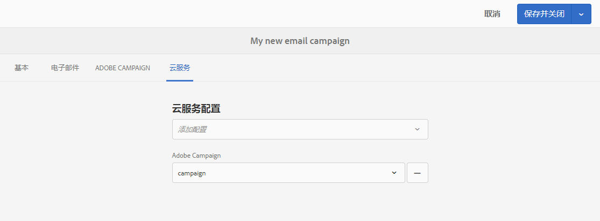
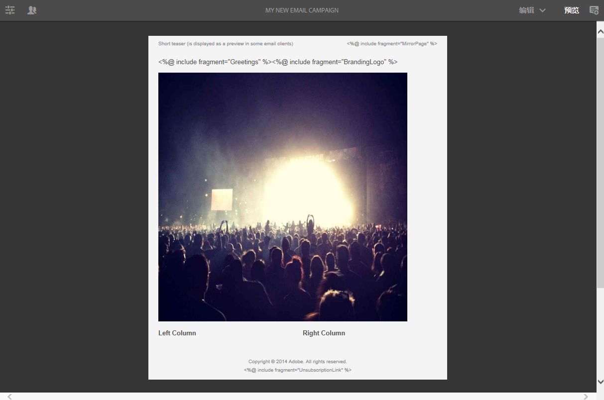
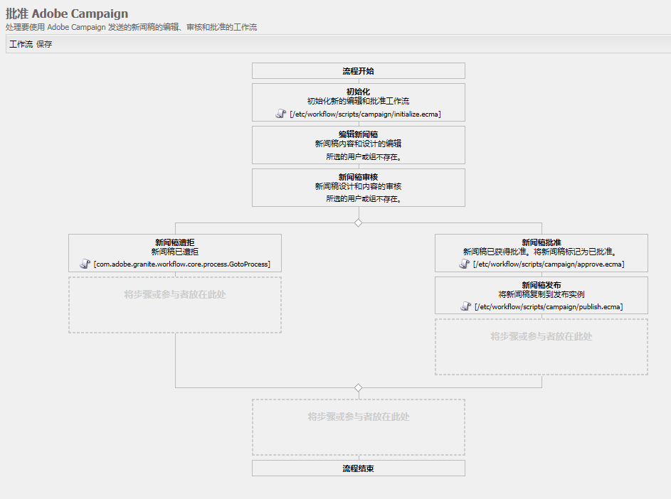

# 使用Adobe Campaign Classic和Adobe Campaign Standard{#working-with-adobe-campaign-classic-and-adobe-campaign-standard}

>[!CAUTION]
>
>AEM 6.4已结束扩展支持，本文档将不再更新。 有关更多详细信息，请参阅 [技术支助期](https://helpx.adobe.com/cn/support/programs/eol-matrix.html). 查找支持的版本 [此处](https://experienceleague.adobe.com/docs/).

您可以在AEM中创建电子邮件内容，然后在Adobe Campaign电子邮件中对其进行处理。 为此，您必须：

1. 在AEM中通过特定于Adobe Campaign的模板创建新闻稿。
1. 选择 [Adobe Campaign服务](#selecting-the-adobe-campaign-cloud-service-and-template) 编辑内容以访问所有功能之前，请执行此操作。
1. 编辑内容。
1. 验证内容。

然后，可以在Adobe Campaign中将内容与分发同步。 本文档中对详细说明进行了描述。

另请参阅 [在AEM中创建Adobe Campaign Forms](/help/sites-authoring/adobe-campaign-forms.md).

>[!NOTE]
>
>在使用此功能之前，您必须配置AEM以与 [Adobe Campaign](/help/sites-administering/campaignonpremise.md) 或 [Adobe Campaign Standard](/help/sites-administering/campaignstandard.md).

## 通过Adobe Campaign发送电子邮件内容 {#sending-email-content-via-adobe-campaign}

配置AEM和Adobe Campaign后，您可以直接在AEM中创建电子邮件投放内容，然后在Adobe Campaign中对其进行处理。

在AEM中创建Adobe Campaign内容时，必须先链接到Adobe Campaign服务，然后才能编辑内容以访问所有功能。

可能有两种情况：

* 内容可以与来自Adobe Campaign的投放同步。 这允许您在投放中使用AEM内容。
* (仅限Adobe Campaign Classic)内容可直接发送到Adobe Campaign，由后者自动生成新的电子邮件投放。 此模式存在限制。

本文档中对详细说明进行了描述。

### 创建新电子邮件内容 {#creating-new-email-content}

>[!NOTE]
>
>添加电子邮件模板时，请确保在 **/content/campaigns** 以便提供。

#### 创建新电子邮件内容 {#creating-new-email-content-1}

1. 在AEM中选择 **站点** then **促销活动**，然后浏览到管理电子邮件促销活动的位置。 在以下示例中，路径为 **站点** > **促销活动** > **Geometrixx Outdoors** > **电子邮件营销活动**.

   >[!NOTE]
   >
   >[电子邮件示例仅在Geometrixx中可用](/help/sites-developing/we-retail.md). 请从包共享下载示例Geometrixx内容。

   

1. 选择 **创建** then **创建页面**.
1. 选择您要连接到的Adobe Campaign的可用模板之一，然后单击 **下一个**. 默认情况下，有三个模板可用：

   * **Adobe Campaign Classic电子邮件**:允许您先将内容添加到预定义模板（两列），然后再将其发送到Adobe Campaign Classic进行交付。
   * **Adobe Campaign Standard电子邮件**:允许您先将内容添加到预定义模板（两列），然后再将其发送到Adobe Campaign Standard进行交付。

1. 填写 **标题** （可选） **描述** 单击 **创建**. 标题将用作新闻稿/电子邮件的主题，除非您在编辑电子邮件时覆盖它。

### 选择Adobe Campaign云服务和模板 {#selecting-the-adobe-campaign-cloud-service-and-template}

要与Adobe Campaign集成，您需要将Adobe Campaign云服务添加到页面。 这样，您就可以访问个性化和其他Adobe Campaign信息。

此外，您还可能需要选择Adobe Campaign模板并更改主题，并为那些不会以HTML方式查看电子邮件的用户添加纯文本内容。

您可以从 **站点** 选项卡，或在创建电子邮件/新闻稿后显示的内容。

从 **站点** tab是推荐的方法。 从电子邮件/新闻稿中选择云服务需要解决方法。

从 **站点** 页面：

1. 在AEM中，选择电子邮件页面，然后单击 **查看属性**.

   

1. 选择 **编辑** 然后 **云服务** 选项卡并向下滚动到底部，单击+符号以添加配置，然后选择 **Adobe Campaign**.

   

1. 从下拉列表中选择与您的Adobe Campaign实例匹配的配置，然后单击以进行确认 **保存**.
1. 您可以通过单击** Adobe Campaign**选项卡，查看电子邮件已应用到的模板。 如果要选择其他模板，则可以在编辑时从电子邮件中访问该模板。

   如果要在 **属性**，选择 **Adobe Campaign** 选项卡。 在相关的Adobe Campaign实例中输入电子邮件投放模板的内部名称。

   您选择的模板可决定哪些个性化字段可从Adobe Campaign中使用。

   

在创作的新闻稿/电子邮件中，您可能无法在 **页面属性** 的问题。 您可以使用下面描述的解决方法：

1. 在AEM中，选择电子邮件页面，然后单击 **编辑**. 单击 **打开属性**.

   

1. 选择 **云服务** 单击 **+** 添加配置。 选择任何可见配置（不管是哪个配置）。 单击或点按 **+** 登录以添加其他配置，然后选择 **Adobe Campaign**.

   >[!NOTE]
   >
   >或者，您也可以通过选择 **查看属性** 在 **站点** 选项卡。

1. 从下拉列表中选择与Adobe Campaign实例匹配的配置，删除您创建的第一个不用于Adobe Campaign的配置，然后单击复选标记进行确认。
1. 继续上一步中的步骤4以选择模板和添加纯文本。

### 编辑电子邮件内容 {#editing-email-content}

要编辑电子邮件内容，请执行以下操作：

1. 打开电子邮件，默认情况下，您会进入编辑模式。

   

1. 如果要更改电子邮件的主题或为那些不在HTML中查看电子邮件的用户添加纯文本，请选择 **电子邮件** 并添加主题和文本。 选择页面图标以从HTML自动生成纯文本版本。 完成后，单击复选标记。

   您可以使用Adobe Campaign个性化字段对新闻稿进行个性化设置。 要添加个性化字段，请单击显示Adobe Campaign徽标的按钮以打开个性化字段选取器。 然后，您可以从所有可用于此新闻稿的字段中进行选择。

   >[!NOTE]
   >
   >如果编辑器中属性中的个性化字段呈灰显状态，请重新检查您的配置。

   

1. 打开屏幕左侧的组件面板，然后选择 **Adobe Campaign新闻稿** 从下拉菜单中查找这些组件。

   

1. 将组件直接拖动到页面上并相应地对其进行编辑。 例如，您可以将 **文本与个性化（营销活动）** 组件和添加个性化文本。

   

   请参阅 [Adobe Campaign组件](/help/sites-authoring/adobe-campaign-components.md) ，以详细了解每个组件。

   

### 插入个性化 {#inserting-personalization}

在编辑内容时，您可以插入：

* Adobe Campaign上下文字段。 这些字段可以插入到文本中，并根据收件人的数据（例如名字、姓氏或目标维度的任何数据）进行相应调整。
* Adobe Campaign个性化块。 这些是与收件人数据无关的预定义内容块，例如品牌徽标或指向镜像页面的链接。

请参阅 [Adobe Campaign组件](/help/sites-authoring/adobe-campaign-components.md) ，以获取营销活动组件的完整说明。

>[!NOTE]
>
>* 只有Adobe Campaign的字段 **用户档案** 定向维度被考虑在内。
>* 从查看属性时 **站点**，则您无权访问Adobe Campaign上下文字段。 您可以在编辑时直接从电子邮件中访问这些源代码。
>

要插入个性化，请执行以下操作：

1. 插入新 **新闻稿** > **文本与个性化（营销活动）** 组件，方法是将其拖动到页面上。

   

1. 单击铅笔图标以打开组件。 此时将打开就地编辑器。

   

   >[!NOTE]
   >
   >**对于Adobe Campaign Standard:**
   >
   >* 可用的上下文字段对应于 **用户档案** 定向维度。Adobe Campaign
   >* 请参阅 [将AEM页面链接到Adobe Campaign电子邮件](#linking-an-aem-page-to-an-adobe-campaign-email-adobe-campaign-standard).

   >
   >**对于Adobe Campaign Classic:**
   >
   >* 可用的上下文字段是从Adobe Campaign中动态恢复的 **nms:seedMember** 架构。 Target扩展数据是从包含与内容同步的投放的工作流中动态恢复的。 (请参阅 [将在AEM中创建的内容与来自Adobe Campaign的投放同步](#synchronizing-content-created-in-aem-with-a-delivery-from-adobe-campaign-classic) )。
   >
   >* 要添加或隐藏个性化元素，请参阅 [管理个性化字段和块](/help/sites-administering/campaignonpremise.md#managing-personalization-fields-and-blocks).
   >* **重要信息**:所有种子表字段也必须位于收件人表（或相应的联系人表）中。

1. 通过键入插入文本。 通过单击Adobe Campaign组件并选择它们，插入上下文字段或个性化块。 完成后，选择复选标记。

   

   插入上下文字段或个性化块后，您可以预览新闻稿并测试字段。 请参阅 [预览新闻稿](#previewing-a-newsletter).

### 预览新闻稿 {#previewing-a-newsletter}

您可以预览新闻稿的外观，也可以预览个性化。

1. 打开新闻稿后，单击 **预览** 的上角。 AEM显示用户收到新闻稿时的外观。

   

   >[!NOTE]
   >
   >如果您使用Adobe Campaign Standard和示例模板，则会显示两个个性化块(即 **&quot;&lt;%@ include view=&quot;MirrorPage&quot; %>&quot;** 和 **&quot;&lt;%@ include view=&quot;UnsubscriptionLink&quot; %>&quot;**  — 在交付过程中导入内容时会引发错误。 您可以通过使用个性化块选取器选择相应的块来调整这些块。

1. 要预览个性化，请单击/点按工具栏中的相应图标以打开ContextHub。 现在，个性化字段标记已被替换为所选角色的种子数据。 了解变量在ContextHub中切换角色时的变化情况。

   

1. 您可以查看来自Adobe Campaign的与当前选定角色关联的种子数据。 要实现此目的，请单击/点按ContextHub栏中的Adobe Campaign模块。 此时将打开一个对话框，其中显示当前用户档案的所有种子数据。 同样，在切换到其他角色时，数据会自适应。

   

### 在AEM中批准内容 {#approving-content-in-aem}

内容完成后，您可以启动批准流程。 转到 **工作流** 选项卡，然后选择 **批准Adobe Campaign** 工作流。

此开箱即用的工作流包含两个步骤：修订后批准，或修订后拒绝。 但是，此工作流可以扩展并适应更复杂的流程。

要批准Adobe Campaign的内容，请通过选择 **工作流** 选择 **批准Adobe Campaign** 单击 **启动工作流**. 完成这些步骤并批准内容。 您还可以通过选择 **拒绝** 而不是 **批准** 在最后一个工作流步骤中。

内容获得批准后，在Adobe Campaign中显示为已批准。 然后，即可发送该电子邮件。

在Adobe Campaign Standard:

在Adobe Campaign Classic:

>[!NOTE]
未批准的内容可以与Adobe Campaign中的投放同步，但无法执行投放。 只能通过Campaign投放发送已批准的内容。

## 将AEM与Adobe Campaign Standard和Adobe Campaign Classic关联 {#linking-aem-with-adobe-campaign-standard-and-adobe-campaign-classic}

如何将AEM与Adobe Campaign链接或同步，取决于您使用的是基于订阅的Adobe Campaign Standard还是基于内部部署的Adobe Campaign Classic。

有关基于您的Adobe Campaign解决方案的说明，请参阅以下部分：

* [将AEM页面链接到Adobe Campaign电子邮件(Adobe Campaign Standard)](#linking-an-aem-page-to-an-adobe-campaign-email-adobe-campaign-standard)
* [将AEM中创建的内容与来自Adobe Campaign Classic的分发同步](#synchronizing-content-created-in-aem-with-a-delivery-from-adobe-campaign-classic)

### 将AEM页面链接到Adobe Campaign电子邮件(Adobe Campaign Standard) {#linking-an-aem-page-to-an-adobe-campaign-email-adobe-campaign-standard}

Adobe Campaign Standard允许您恢复在AEM中创建的内容，并将其关联为：

* 电子邮件。
* 电子邮件模板。

这样，您就可以交付内容。 您可以通过页面上显示的代码，查看新闻稿是否已链接到单个投放。

>[!NOTE]
如果新闻稿已链接到多个投放，则会显示已链接投放的数量（但不会显示每个ID）。

要将在AEM中创建的页面与来自Adobe Campaign的电子邮件关联，请执行以下操作：

1. 根据特定于AEM的电子邮件模板创建新电子邮件。 请参阅 [在Adobe Campaign Standard中创建电子邮件](https://helpx.adobe.com/campaign/standard/channels/using/creating-an-email.html) 以了解更多信息。

   

1. 打开 **内容** 块。

   

1. 选择 **链接Adobe Experience Manager内容** 在工具栏中，访问AEM中可用的内容列表。

   >[!NOTE]
   如果 **链接Adobe Experience Manager** 选项未显示在操作栏中，请检查 **内容编辑模式** 正确配置为 **Adobe Experience Manager** （在电子邮件属性中）。

   

1. 选择要在电子邮件中使用的内容。

   此列表指定：

   * AEM中内容的标签。
   * 内容在AEM中的批准状态。 如果内容未获得批准，您可以同步内容，但必须在内容获得批准后才能发送投放。 但是，您可以执行某些操作，如发送校样或预览测试。
   * 内容上次修改的日期。
   * 已链接到投放的任何内容。

   >[!NOTE]
   默认情况下，已与投放同步的内容会隐藏。 但是，您可以显示并使用它。 例如，如果要将内容用作多个投放的模板。

   将电子邮件链接到AEM内容后，无法在Adobe Campaign中编辑该内容。

1. 从其功能板中指定电子邮件的其他参数（受众、执行计划）。
1. 执行电子邮件投放。 在投放分析期间，会检索AEM内容的最新版本。

   >[!NOTE]
   如果内容在链接到电子邮件时在AEM中更新，则在分析期间会在Adobe Campaign中自动更新。 也可以使用 **刷新Adobe Experience Manager内容** 中。
   您可以使用 **删除包含Adobe Experience Manager内容的链接** 中。 仅当内容已与投放链接时，此按钮才可用。 要将其他内容与投放链接，您必须删除当前内容链接，然后才能建立新链接。
   删除链接后，将保留本地内容，并在Adobe Campaign中可编辑。 如果在修改内容后再次链接内容，则所有更改都将丢失。

### 将在AEM中创建的内容与来自Adobe Campaign Classic的投放同步 {#synchronizing-content-created-in-aem-with-a-delivery-from-adobe-campaign-classic}

Adobe Campaign允许您恢复AEM中创建的内容，并将其与以下内容同步：

* 营销活动投放
* 营销活动工作流中的投放活动
* 定期投放
* 连续投放
* 消息中心投放
* 投放模板

在AEM中，如果新闻稿已链接到单个投放，则页面上会显示投放代码。

>[!NOTE]
如果新闻稿已链接到多个投放，则会显示已链接投放的数量（但不会显示每个ID）。

>[!NOTE]
工作流步骤 **发布到Adobe Campaign** 已在AEM 6.1中弃用。此步骤是AEM 6.0与Adobe Campaign集成的一部分，不再需要执行。

要将在AEM中创建的内容与来自Adobe Campaign的投放同步，请执行以下操作：

1. 通过选择 **包含AEM内容的电子邮件发送(mailAEMContent)** 投放模板。

   

1. 选择 **同步** 在工具栏中，访问AEM中可用的内容列表。

   >[!NOTE]
   如果 **同步** 选项未显示在投放的工具栏中，请检查 **内容编辑模式** 字段在 **AEM** 选择 **属性** > **高级**.

   

1. 选择要与投放同步的内容。

   此列表指定：

   * AEM中内容的标签。
   * 内容在AEM中的批准状态。 如果内容未获得批准，您可以同步内容，但必须在内容获得批准后才能发送投放。 但是，您可以执行某些操作，如发送BAT或预览测试。
   * 内容的上次修改日期。
   * 已链接到投放的任何内容。

   >[!NOTE]
   默认情况下，已与投放同步的内容会隐藏。 但是，您可以显示并使用它。 例如，如果要将内容用作多个投放的模板。

   

1. 指定投放的其他参数（目标等）
1. 如有必要，请在Adobe Campaign中启动投放批准流程。 除了在Adobe Campaign中配置的批准（预算、目标等）之外，还需要在AEM中批准内容。 仅当内容已在AEM中获得批准时，才能在Adobe Campaign中进行内容批准。
1. 执行投放。 在投放分析期间，会恢复AEM内容的最新版本。

   >[!NOTE]
   * 在投放和内容同步后，Adobe Campaign中的投放内容将变为只读。 不能再修改电子邮件主题及其内容。
   * 如果内容在链接到Adobe Campaign中的投放时在AEM中更新，则在投放分析期间会在投放中自动更新。 也可以使用 **立即刷新内容** 按钮。
   * 您可以使用 **取消同步** 按钮。 仅当内容已与投放同步时，此选项才可用。 要将不同内容与投放同步，您必须先取消当前内容同步，然后才能建立新链接。
   * 如果取消同步，则会保留本地内容，并在Adobe Campaign中可编辑。 如果在修改内容后重新同步该内容，则将丢失所有更改。
   * 对于定期和连续的投放，每次执行投放时都会停止与AEM内容的同步。

