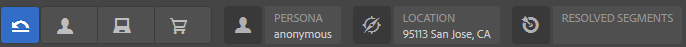
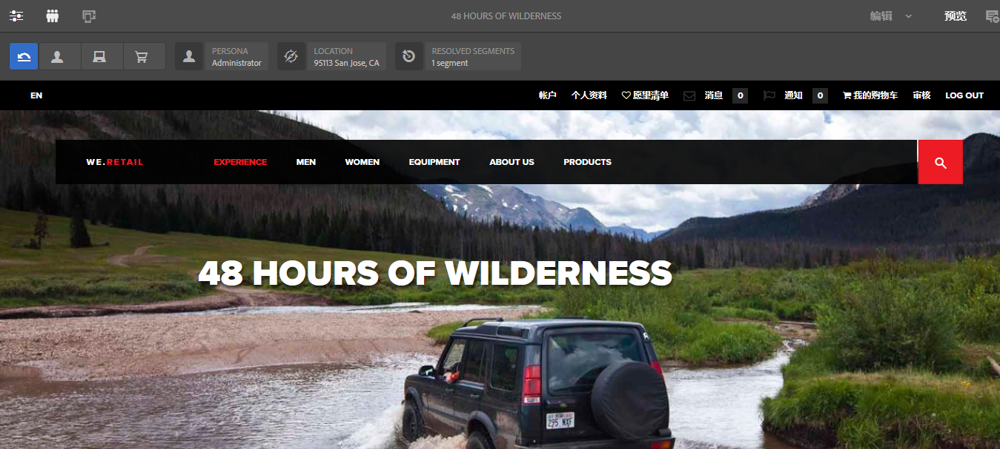
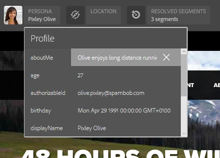

# 使用 ContextHub 数据预览页面{#previewing-pages-using-contexthub-data}

>[!CAUTION]
>
>AEM 6.4已结束扩展支持，本文档将不再更新。 有关更多详细信息，请参阅 [技术支助期](https://helpx.adobe.com/cn/support/programs/eol-matrix.html). 查找支持的版本 [此处](https://experienceleague.adobe.com/docs/).

的 [ContextHub](/help/sites-developing/contexthub.md) 工具栏显示ContextHub存储区中的数据，并允许您更改存储区数据。 ContextHub工具栏可用于预览由ContextHub存储中的数据决定的内容。

工具栏由一系列包含一个或多个UI模块的UI模式组成。

* UI模式是显示在工具栏左侧的图标。 单击或点按图标时，工具栏会显示其包含的UI模块。
* UI模块显示来自一个或多个ContextHub存储区的数据。 某些UI模块还允许您处理存储数据。

ContextHub安装了多个UI模式和UI模块。 您的管理员可能已 [已配置ContextHub](/help/sites-administering/contexthub-config.md) 来显示不同的内容。

## 显示ContextHub工具栏 {#revealing-the-contexthub-toolbar}

ContextHub工具栏在“预览”模式下可用。 该工具栏仅在创作实例中且管理员已将其启用后才可用。

1. 在打开页面以进行编辑时，在工具栏上单击或点按“预览”。

   

1. 要显示工具栏，请单击或点按 ContextHub 图标。

   

## UI模块功能 {#ui-module-features}

每个UI模块提供的功能集不同，但以下类型的功能很常见。 由于UI模块是可扩展的，因此开发人员可以根据需要实施其他功能。

### 工具栏内容 {#toolbar-content}

UI 模块可以在工具栏中显示一个或多个 ContextHub 存储区中的数据。UI 模块使用图标和标题来标识自身。

### 弹出窗口内容 {#popup-content}

某些UI模块在单击或点按时会显示一个弹出式覆盖窗口。 通常，弹出窗口包含的信息比工具栏上显示的信息要多。

### 弹出窗口Forms {#popup-forms}

模块的弹出式叠加可以包含表单元素，这些元素允许您更改ContextHub存储中的数据。 如果页面内容由存储数据决定，则可以使用表单并观察页面内容的更改。

### 全屏模式 {#fullscreen-mode}

弹出式叠加图可以包含一个图标，单击或点按该图标可展开弹出式内容以覆盖整个浏览器窗口或屏幕。

