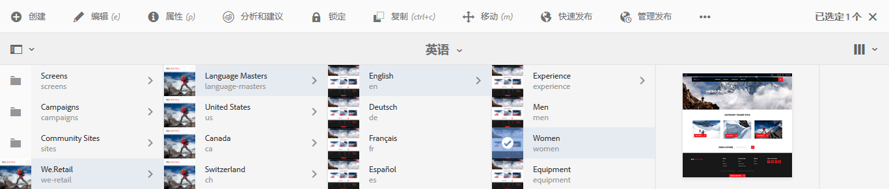
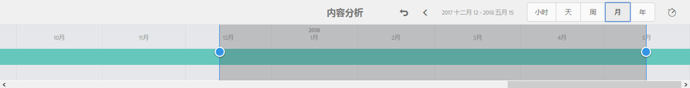
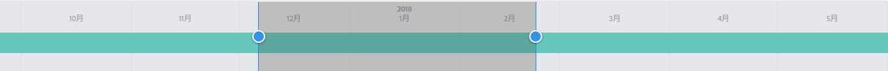
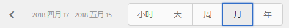
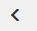

# 分析页面性能{#analyzing-page-performance}

可打开“[内容分析](/help/sites-authoring/content-insights.md)”页面以分析您正在创作的页面的性能。此外，还可配置报表时间段以集中进行分析。

## 打开页面的分析和推荐 {#opening-analytics-and-recommendations-for-a-page}

请按照以下过程查看页面的分析和推荐：

1. 导航到要分析的页面。
1. 在工具栏中，单击或点按&#x200B;**分析和推荐**。

   >[!NOTE]
   >
   >仅在已将 AEM 配置为[与 Adobe Analytics 集成](/help/sites-administering/adobeanalytics-connect.md)时，才会显示页面的分析和推荐。

   

## 更改报表时间段 {#changing-the-reporting-period}

可更改分析报表的以下时间相关方面：

* 要报告的时间段。
* 数据粒度。

用于更改报表的时间相关方面的工具显示在“内容分析”页面的顶部。

### 更改报表时间段 {#changing-the-reporting-period-1}

更改“内容分析”页面的报表时间段，可集中分析特定时间段的页面活动。当您更改报表时间段时，报表会自动刷新。时间范围上的阴影区域表示报表时间段。时间范围上的日期从左到右递增。

要更改“内容分析”页面的报表时间段，请执行以下操作：

1. 如果时间范围未显示在页面顶部，请单击或点按“切换时间范围”图标。

   

1. 要更改报表时间段的开始日期，请将显示在阴影区域左侧的圆圈拖动到所需的开始日期。

   如果看不到阴影区域的左侧，请使用滚动条将其显示在视图中。

1. 要更改报表时间段的结束日期，请将显示在阴影区域右侧的圆圈拖动到所需的结束日期。

### 更改报表时间段的粒度 {#changing-the-granularity-of-the-reporting-period}

更改报表中每个数据点跨越的时间。例如，选择“周”粒度时，“查看次数”报表中的每个数据点表示一周的查看次数。

粒度会影响根据时间绘制数据的报表，例如“查看次数”和“页面平均参与分钟数”报表。粒度还会影响时间范围刻度。

1. 如果未显示粒度控件，请单击或点按“切换粒度”图标。

   

1. 单击或点按所需的粒度。选定后，报表会自动更新以反映该粒度。

## 为 SEO 推荐分配任务 {#assigning-tasks-for-seo-recommendations}

可使用“SEO 推荐”报表来创建任务，以提高页面对搜索引擎的可见性。对于报表中没有复选标记的每个推荐，您可以创建一个任务，以将其分配给用户来执行所需的工作。

当任务已创建但尚未完成时，SEO 推荐的状态会显示相应的指示。

创建后，任务会显示在用户的“任务”列表中。有关任务的信息，请参 [阅使用任务](/help/sites-authoring/task-content.md)。

请按照以下过程为 SEO 推荐创建任务。

1. 单击或点按 SEO 推荐的信息图标。

   

1. 单击信息图标旁边显示的带圆圈的三角形图标。

   

1. 填写显示的表单字段，然后点按“创建”：

   * “项目”：选择要在其中创建任务的项目。
   * “名称”：用于标识任务的名称。默认名称是 SEO 推荐的标题。
   * “分配给”：选择要将任务分配给的用户。可先键入用户名来筛选列表。
   * “描述”：完成任务所需的活动描述。默认描述是 SEO 推荐附带的信息。
   * “任务优先级”：任务的优先级。
   * “到期日期”：应完成任务的日期。

1. 单击或点按“完成”以关闭“任务已创建”消息。

>[!NOTE]
>
>创建的任务还包括应用SEO推荐的页面的路径。