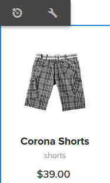
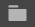

# 使用定位模式创作目标内容{#authoring-targeted-content-using-targeting-mode}

>[!CAUTION]
>
>AEM 6.4已结束扩展支持，本文档将不再更新。 有关更多详细信息，请参阅 [技术支助期](https://helpx.adobe.com/cn/support/programs/eol-matrix.html). 查找支持的版本 [此处](https://experienceleague.adobe.com/docs/).

可使用 AEM 的定位模式创作目标内容。定位模式和Target组件提供了用于为体验创建内容的工具：

* 轻松识别页面上的目标内容。 虚线在所有目标内容周围形成边框。
* 选择品牌和活动以查看体验。
* 向活动添加体验或删除体验。
* 执行A/B测试并转换入选者(仅限Adobe Target)。
* 通过创建选件或使用库中的选件，向体验添加选件。
* 配置目标并监控性能。
* 模拟用户体验。
* 要进行更多自定义，请配置Target组件。

您可以使用AEM或Adobe Target作为定位引擎(您必须拥有有效的Adobe Target帐户才能使用Adobe Target)。 如果您使用的是Adobe Target，则必须先配置集成。 请参阅 [与Adobe Target集成的说明](/help/sites-administering/target.md).

您在Target模式下看到的活动和体验反映了 [“活动”控制台](/help/sites-authoring/activitylib.md):

* 使用定位模式对活动和体验所做的更改会反映在“活动”控制台中。
* “活动”控制台中所做的更改会反映在“定位”模式中。

>[!NOTE]
>
>在 Adobe Target 中创建营销活动时，会为每个营销活动分配名为 `thirdPartyId` 的属性。在 Adobe Target 中删除营销活动时，不会删除 thirdPartyId。您不能为不同类型（AB、XT）的营销活动重复使用 `thirdPartyId`，也不能手动删除此属性。为避免出现此问题，请为每个营销活动指定唯一的名称；这样，营销活动名称便无法在不同的营销活动类型中重复使用。
>
>如果在同一种营销活动类型中使用相同的名称，则会覆盖现有的营销活动。
>
>如果在同步时遇到错误“请求失败。`thirdPartyId` 已存在”，请更改营销活动的名称，然后重新进行同步。

>[!NOTE]
>
>定位时，品牌和活动组合会在用户级别持续保留，而不是在渠道级别。

## 切换到定位模式 {#switching-to-targeting-mode}

切换到Target模式，以访问用于创作目标内容的工具。

要切换到Target模式，请执行以下操作：

1. 打开要为其创作目标内容的页面。
1. 在页面顶部的工具栏中，单击或点按模式下拉菜单，以显示可用的模式类型。

   

1. 单击或点按&#x200B;**定位**。定位选项随即会显示在页面顶部。

   

## 使用定位模式添加活动 {#adding-an-activity-using-targeting-mode}

使用定位模式向品牌添加活动。 添加活动时，该活动包含默认体验。 添加活动后，即可开始活动的内容定位流程。

您还可以通过以下选项从AEM中创建和管理Adobe Target活动：选择目标引擎(AEM或Adobe Target)，然后选择活动类型（体验定位或A/B测试）。

此外，您还可以管理所有Adobe Target活动的目标和量度，以及管理Adobe Target受众。 此外，还包含Adobe Target活动报表，包括A/B测试的入选者转换。

添加活动时，该活动也会显示在 [活动控制台](/help/sites-authoring/activitylib.md).

添加活动：

1. 使用 **品牌** 下拉菜单，选择要为其创建活动的品牌。

   >[!NOTE]
   >
   >建议 [通过“活动”控制台创建品牌](/help/sites-authoring/activitylib.md#creating-a-brand-using-the-activities-console).
   >
   >如果您以任何其他方式创建品牌，请确保存在节点 `/campaigns/<brand>/master`，否则在您尝试创建活动时将产生错误。

1. 单击或点按旁边的+ **活动** 下拉菜单。
1. 键入活动的名称。

   >[!NOTE]
   >
   >在创建新活动时，如果已将 Adobe Target 云配置附加到页面或其某个父页面，则 AEM 会自动将 Adobe Target 视为定位引擎。

1. 在&#x200B;**定位**&#x200B;引擎下拉菜单中，选择您的定位引擎。

   * 如果您选择 **ContextHub AEM**，则其余字段会变暗且不再可用。单击或点按&#x200B;**创建**。
   * 如果您选择 **Adobe Target**，您可以选择配置(默认情况下，它是您在 [配置了帐户](/help/sites-administering/opt-in.md))和活动类型。
   * 如果您使用AEM/Adobe Campaign集成并发送目标内容（新闻稿），请选择 **Adobe Campaign**. 请参阅 [与Adobe Campaign集成](/help/sites-administering/campaign.md) 以了解更多信息。

1. 在活动菜单中，选择 **体验定位** 或 **A/B测试**.

   * 体验定位 — 从AEM中管理Adobe Target活动。
   * A/B测试 — 从AEM在Adobe Target中创建/管理A/B测试活动。

## 定位过程：创建、定位以及目标和设置 {#the-targeting-process-create-target-and-goals-settings}

定位模式允许您配置活动的多个方面。 使用以下三步流程为品牌活动创建目标内容：

1. [创建](#create-authoring-the-experiences):添加或删除体验，并为每个体验添加选件。
1. [Target](#target-configuring-the-audiences):指定每个体验所定位的受众。 您可以定位特定受众，如果使用A/B测试，则可以决定流量中哪个体验所占的百分比。
1. [目标和设置](#goals-settings-configuring-the-activity-and-setting-goals):计划活动并设置优先级。 您还可以设置成功量度目标。

请按照以下过程开始活动的内容定位流程。

>[!NOTE]
>
>要使用该定位流程，您必须是“Target 活动作者”用户组的成员。

添加活动：

1. 在 **品牌** 下拉菜单中，选择包含您正在处理的活动的品牌。
1. 在 **活动** 下拉菜单中，选择要为其创作目标内容的活动。
1. 要显示可指导您完成定位过程的控件，请单击或点按 **开始定位**.

   

   >[!NOTE]
   >
   >要更改您正在使用的活动，请单击或点按 **返回**.

## 创建：创作体验 {#create-authoring-the-experiences}

内容定位的创建步骤涉及创建体验。 在此步骤中，您可以创建或删除活动的体验，并向每个体验添加选件。

### 在定位模式下查看体验选件 {#seeing-experience-offers-in-targeting-mode}

在 [启动定位流程](/help/sites-authoring/content-targeting-touch.md#the-targeting-process-create-target-and-goals-settings)，选择一个体验以查看为该体验提供的选件。 当您选择某个体验时，页面上的目标组件会发生更改，以显示该体验的选件。

>[!CAUTION]
>
>对创作实例中已定向的组件禁用定位时要小心。 相应的活动也将自动从发布实例中删除。

>[!NOTE]
>
>选件是目标组件的内容。

体验显示在“受众”窗格中。 在以下示例中，体验包 **括Default**、 **Female**、Female 30 **岁以上的体验和****** Female 30以下的体验。 此示例显示了目标图像组件的默认 **选件** 。

选择其他体验后，图像组件会显示该所选体验的选件。

选择某个体验且目标组件不包含该体验的选件时，该组件会在半透明的默认选件上叠加显示 **添加选件** 。 尚未为体验创建选件时，系统会为映射 **到该体验的区段显示** “默认选件”。

如果访客属性与映射到体验的任何区段都不匹配，则也会显示默认体验。请参阅[使用定位模式添加体验](#adding-and-removing-experiences-using-targeting-mode)。

### 自定义选件和库选件 {#custom-offers-and-library-offers}

以下选件 [在页面上创作](/help/sites-authoring/content-targeting-touch.md#adding-a-custom-offer) 和用于单个体验称为自定义选件。 以下图像叠加在自定义选件的内容上：

以下图像将叠加显示在[从选件库添加](/help/sites-authoring/content-targeting-touch.md#adding-an-offer-from-an-offer-library)的选件上：

如果您决定要重复使用自定义选件，则可以将其保存到选件库。 如果您想要修改体验的内容，还可以将库选件转换为自定义选件。 编辑后，您可以再次将选件保存回库。

### 使用定位模式添加和删除体验 {#adding-and-removing-experiences-using-targeting-mode}

使用的创建步骤 [定位过程](/help/sites-authoring/content-targeting-touch.md#the-targeting-process-create-target-and-goals-settings)，则可以添加和删除体验。 此外，您还可以复制体验并对其重命名。

#### 使用定位模式添加体验 {#adding-experiences-using-targeting-mode}

添加体验：

1. 要添加体验，请单击或点按&#x200B;**受众**&#x200B;窗格中现有体验下方显示的 **+ 添加体验定位**。
1. 选择和受众。 默认情况下，该名称是体验的名称。 如有需要，可以键入其他名称。 单击或点按 **确定**.

#### 使用定位模式删除体验 {#removing-experiences-using-targeting-mode}

要删除体验，请执行以下操作：

1. 单击或点按体验名称旁边的箭头。

   

1. 单击&#x200B;**删除**。

#### 使用定位模式重命名体验 {#renaming-experiences-using-targeting-mode}

要使用定位模式重命名体验，请执行以下操作：

1. 单击或点按体验名称旁边的箭头。
1. 单击&#x200B;**重命名体验**，然后键入新名称。
1. 单击或点按屏幕上的其他位置以保存更改。

#### 使用定位模式编辑受众 {#editing-audiences-using-targeting-mode}

要使用定位模式编辑受众，请执行以下操作：

1. 单击或点按体验名称旁边的箭头。
1. 单击&#x200B;**编辑受众**，然后选择新受众。
1. 单击&#x200B;**确定**。

#### 使用定位模式复制体验 {#duplicating-experiences-using-targeting-mode}

要使用定位模式复制体验，请执行以下操作：

1. 单击或点按体验名称旁边的箭头。
1. 单击&#x200B;**复制**，然后选择受众。
1. 根据需要重命名体验，然后单击 **确定**.

### 使用定位模式创建选件 {#creating-offers-using-targeting-mode}

定位组件以创建体验的选件。 目标组件提供了用作体验选件的内容。

* [定位现有组件](/help/sites-authoring/content-targeting-touch.md#creating-a-default-offer-by-targeting-an-existing-component). 内容将成为默认体验的选件。
* [添加 Target 组件](/help/sites-authoring/content-targeting-touch.md#creating-an-offer-by-adding-a-target-component)，然后向该组件中添加内容。

定位某个组件后，您可以为每个体验添加选件：

* [添加自定义选件](/help/sites-authoring/content-targeting-touch.md#adding-a-custom-offer).
* [添加库选件](/help/sites-authoring/content-targeting-touch.md#adding-an-offer-from-an-offer-library).

以下工具可用于处理选件：

* [将自定义选件添加到选件库](/help/sites-authoring/content-targeting-touch.md#adding-a-custom-offer-to-a-library).
* [将库选件转换为自定义选件](/help/sites-authoring/content-targeting-touch.md#converting-a-library-offer-to-a-custom-library).
* [打开库选件并编辑内容](/help/sites-authoring/content-targeting-touch.md#editing-a-library-offer).

#### 通过定位现有组件创建默认选件 {#creating-a-default-offer-by-targeting-an-existing-component}

在页面上定位某个组件，以将其用作活动默认体验的选件。 定位组件时，该组件会包含在Target组件中，并且其内容会成为默认体验的选件。

定位组件时，选件中只能使用该组件。 您无法从选件中删除组件或将其他组件添加到选件。

在 [启动定位流程](/help/sites-authoring/content-targeting-touch.md#the-targeting-process-create-target-and-goals-settings).

1. 单击或点按要定位的组件。 此时会显示组件的工具栏，与以下示例类似。

   

1. 单击或点按“定位”图标。

   

   该组件内容随即会成为默认体验的选件。定位某个组件后，其默认节点会被复制到每个体验中。在进行特定于体验的创作时，需要具有此默认节点，才能编辑正确的内容节点。对于默认体验之外的其他体验，可[添加自定义选件](/help/sites-authoring/content-targeting-touch.md#adding-a-custom-offer)或[添加库选件](/help/sites-authoring/content-targeting-touch.md#adding-an-offer-from-an-offer-library)。

#### 通过添加 Target 组件创建选件 {#creating-an-offer-by-adding-a-target-component}

可添加 Target 组件，以创建默认体验的选件。Target 组件是用于存放其他组件的容器，放置在其中的组件会成为目标组件。使用 Target 组件时，可以在其中添加多个组件以创建选件。此外，您还可以在每个体验中使用不同的组件，以创建不同的选件。

有关自定义 Target 组件的信息，请参阅[配置 Target 组件选项](/help/sites-authoring/content-targeting-touch.md#configuring-target-component-options)。

>[!NOTE]
>
>使用[“选件”控制台](/help/sites-authoring/offerlib.md)创建的选件也可以包含多个组件。这些选件属于选件库，可用于多个体验。

由于Target组件是容器，因此会显示为其他组件的放置区域。

在Target模式下，Target组件有一个蓝色边框，并且拖放目标消息会指示目标性质。

在编辑模式下，Target 组件具有一个靶心图标。

将组件拖放到 Target 组件后，它们即成为目标组件。

将组件添加到Target组件后，它会为特定体验提供内容。 要指定体验，请在添加组件之前选择体验。

您可以在编辑模式或目标模式下，将Target组件添加到页面。 您只能在“定位”模式下将组件添加到Target组件。 Target组件属于个性化组件组。

如果编辑目标内容，则必须单击或点按**开始定位**，然后才能执行此操作。

1. 将Target组件拖动到您希望显示选件的页面。
1. 默认情况下，不会设置位置ID。 单击或点按配置齿轮以设置位置。

   >[!NOTE]
   >
   >如果管理员进行了相应设置，您可能需要明确设置此位置。
   >
   >管理员可以决定是否需要在以下位置设置此配置：**https://&lt;host>:&lt;port>/system/console/configMgr/com.day.cq.personalization.impl.servlets.TargetingConfigurationServlet**
   要让用户输入位置，请选中&#x200B;**强制位置**&#x200B;复选框。

1. 选择要为其创建选件的体验。
1. 创建选件：

   * 对于默认体验，请将组件拖动到目标拖放区域，然后按常规方式编辑组件属性以创建选件内容。
   * 对于非默认体验， [添加自定义选件](#adding-a-custom-offer) 或 [添加库选件](/help/sites-authoring/content-targeting-touch.md#adding-an-offer-from-an-offer-library).

#### 添加自定义选件 {#adding-a-custom-offer}

在定位模式下通过创作目标组件的内容来创建选件。 创建自定义选件时，会将其用作单个体验的选件。

如果您决定要将选件用于其他体验，则可以先创建自定义选件，然后再[将其添加到库](/help/sites-authoring/content-targeting-touch.md#adding-a-custom-offer-to-a-library)。有关如何使用“选件”控制台创建可重复使用的选件的信息，请参阅[将选件添加到选件库](/help/sites-authoring/offerlib.md#add-an-offer-to-an-offer-library)。

1. 选择要将选件添加到的体验。
1. 要显示组件菜单，请单击或点按要将选件添加到的目标组件。

   

1. 单击或点按+图标。

   默认选件的内容将用作当前体验的选件。

1. 单击或点按选件以显示选件菜单，然后单击或点按编辑图标。

   

1. 编辑组件的内容。

#### 从选件库添加选件 {#adding-an-offer-from-an-offer-library}

可将[选件库](/help/sites-authoring/offerlib.md)中的选件添加到体验。您可以添加当前定位的品牌的库中包含的任何选件。

您无法将库选件添加到默认体验。

1. 选择要将选件添加到的体验。
1. 要显示组件菜单，请单击或点按要将选件添加到的目标组件。

   

1. 单击或点按文件夹图标。

   

1. 从库中选择选件，然后单击或点按复选标记图标。

   

   选件选取器允许您浏览或筛选选件。 浏览或过滤选件时，您可能还希望对选件进行排序，并更改查看选件的方式。 右上方的数字表示当前库中可用的选件数量。

   * 单击或点按&#x200B;**浏览**&#x200B;可导航到其他文件夹。导航窗格随即会打开，单击箭头可向下浏览文件夹。再次单击或点按&#x200B;**浏览**&#x200B;可关闭导航窗格。

   

   * 单击或点按&#x200B;**过滤器**&#x200B;可按关键字或标记筛选选件。您可以输入关键词，并从下拉菜单中选择标记。 再次单击或点按&#x200B;**过滤器**&#x200B;可关闭筛选窗格。

   

   * 单击或点按&#x200B;**最新到最旧**&#x200B;旁边的箭头可更改选件排序方式。可以按“最新到最旧”或“最旧到最新”方式对选件进行排序。

   

   单击或点按&#x200B;**查看方式**&#x200B;旁边的图标可采用拼贴或列表方式查看选件。

   

#### 将自定义选件添加到库 {#adding-a-custom-offer-to-a-library}

将自定义选件添加到 [优惠库](/help/sites-authoring/offerlib.md) 当您想要将其重新用作多个体验的选件时。 您可以将选件添加到当前定位品牌的库中。

有关如何使用“选件”控制台创建可重复使用的选件的信息，请参阅[将选件添加到选件库](/help/sites-authoring/offerlib.md#add-an-offer-to-an-offer-library)。

1. 选择体验以显示自定义选件。
1. 单击或点按自定义选件以显示选件菜单，然后单击或点按 **将选件保存到选件库** 图标。

   

1. 键入选件的名称，选择要将选件添加到的库，然后单击或点按复选标记图标。

#### 将库选件转换为自定义库 {#converting-a-library-offer-to-a-custom-library}

将库选件转换为自定义选件，以更改当前体验的选件，而不更改其他体验中的选件。

1. 选择体验以显示库选件。
1. 单击或点按库选件以显示选件菜单，然后单击或点按转换为内联选件图标。

   

#### 编辑库选件 {#editing-a-library-offer}

在目标模式下打开体验中的库选件以编辑该选件。 您所做的更改会显示在使用该选件的所有体验中。

1. 选择体验以显示库选件。
1. 将库选件转换为本地/自定义选件。 请参阅[将库选件转换为自定义选件](#converting-a-library-offer-to-a-custom-library)。
1. 编辑选件的内容。

1. 将选件重新保存到库。请参阅[将自定义选件添加到库](#adding-a-custom-offer-to-a-library)。

## 目标：配置受众 {#target-configuring-the-audiences}

的目标步骤 [定位过程](/help/sites-authoring/content-targeting-touch.md#the-targeting-process-create-target-and-goals-settings) 包括将受众与您在创建步骤中处理的体验进行映射。 “定位”页面显示每个体验所定位的受众。 您可以指定或更改每个体验的受众。 如果您使用的是Adobe Target，则还可以创建A/B测试，以便定位特定体验的受众流量百分比。

### 如果您使用的是 AEM 定位或 Adobe Target（体验定位） ... {#if-you-are-using-aem-targeting-or-adobe-target-experience-targeting}

受众会显示在映射图左侧，而体验则会显示在右侧。

可使用区段定义受众。页面的云配置可确定可供您使用的区段。 当页面未与Adobe Target云配置关联时，可以使用AEM区段来定义受众。 当页面与Adobe Target云配置关联时，您会使用Target区段。

有关定位引擎的信息，请参阅 [定位引擎](/help/sites-authoring/personalization.md#targeting-engine).

受众不得被多个体验使用。 将体验映射到已映射到其他体验的受众时，该体验旁边会显示一个警告符号。

### 将体验与受众关联(AEM或Adobe Target) {#associating-experiences-with-audiences-aem-or-adobe-target}

在使用AEM定位(或Adobe Target体验定位)时，请按照以下步骤将体验与受众关联：

1. 单击或点按已映射到体验的受众框中旁边的下拉箭头。
1. （可选）单击或点按&#x200B;**编辑**，然后键入关键字搜索所需区段。
1. 在受众列表中，选择受众，然后单击或点按&#x200B;**确定**。

### 如果您使用的是 A/B 测试 (Adobe Target) ... {#if-you-are-using-a-b-testing-adobe-target}

如果您有A/B测试活动，则受众位于您的左侧，每个体验的查看百分比位于中间，体验位于右侧。

只要百分比相加，您就可以更改百分比。 A/B测试中的受众可由多个体验使用。

### 将受众和流量百分比与A/B测试关联 {#associating-audiences-and-traffic-percentages-with-a-b-testing}

1. 单击或点按已映射到体验的受众旁边的下拉框。
1. （可选）单击 **编辑**，然后键入关键字以搜索所需的区段。
1. 单击或点按&#x200B;**确定**。
1. 以百分比输入以配置如何将受众流量路由到每个体验。 总数必须等于100。
1. （可选）单击体验名称旁边的下拉菜单，以编辑体验名称。

## 目标和设置：配置活动和设置目标 {#goals-settings-configuring-the-activity-and-setting-goals}

[定位流程](/help/sites-authoring/content-targeting-touch.md#the-targeting-process-create-target-and-goals-settings)的“目标和设置”步骤涉及配置品牌活动的行为。指定活动的开始和结束时间以及活动优先级。 此外，您还可以跟踪目标。 具体来说，您可以决定要用活动衡量什么。

目标量度仅在将Adobe Target用于定位引擎时才可用。 您必须至少定义一个目标量度。 如果您已配置Adobe Analytics并且具有A4T Analytics云配置，则可以选择希望报表源是Adobe Target还是Adobe Analytics。

仅测量已发布的营销活动的目标量度。

如果使用AEM作为定位引擎：

如果使用 Adobe Target 作为定位引擎：

如果使用 Adobe Target 作为定位引擎，并且您为帐户配置了 A4T 分析，则您还有一个额外的&#x200B;**报告源**&#x200B;下拉菜单：

可以使用以下成功量度（仅用于发布）：

<table> 
 <tbody> 
  <tr> 
   <td><strong>转化</strong></td> 
   <td>
已单击正在测试的体验的任何部分的访客的百分比。转化可以按每个访客计数一次，也可以在每次访客完成转化时计数一次。转化量度设置为以下项之一: 
 
    <ul> 
     <li><strong>已查看页面</strong>  — 您可以通过选择 <strong>URL为</strong> ，然后定义一个或多个URL，或通过选择 <strong>URL包含</strong> 然后添加路径或关键词。</li> 
     <li><strong>已查看mbox</strong>  — 您可以通过输入mbox的名称来定义受众查看的mbox。 您可以通过单击 <strong>添加Mbox</strong>.</li> 
    </ul> </td> 
  </tr> 
  <tr> 
   <td><strong>收入</strong></td> 
   <td>
访问产生的收入。您可以从以下收入量度中进行选择：
 
    <ul> 
     <li>每位访客带来的收入(RPV)</li> 
     <li>平均订单值 (AOV)</li> 
     <li>销售总额 </li> 
     <li>订单</li> 
    </ul> 
对于这些选项中的任一选项，是否已查看 mbox 指示是否已达到目标。您可以定义一个或多个 mbox。
 </td> 
  </tr> 
  <tr> 
   <td><strong>参与</strong></td> 
   <td>
您可以衡量三种类型的参与: 
 
    <ul> 
     <li>页面视图</li> 
     <li>自定义得分</li> 
     <li>网站停留时间</li> 
    </ul> </td> 
  </tr> 
 </tbody> 
</table>

此外，还提供了一些高级设置，可让您确定如何计算成功量度。 选项包括对每次展示次数的量度进行计数，或对每位访客计数一次，并选择是将用户保留在活动中还是将其删除。

使用高级设置确定会发生什么情况 **after** 用户遇到目标量度。 下表显示了可用选项。

<table> 
 <tbody> 
  <tr> 
   <td><strong>在用户遇到此目标量度后...</strong></td> 
   <td><strong>您选择以下操作...</strong></td> 
  </tr> 
  <tr> 
   <td><strong>增量计数并保持用户处于活动状态</strong></td> 
   <td>指定递增计数的方式： 
    <ul> 
     <li>每个参加者一次</li> 
     <li>每次展示时（不包括页面刷新）</li> 
     <li>每次展示时</li> 
    </ul> </td> 
  </tr> 
  <tr> 
   <td><strong>增量计数、释放用户并允许再次进入</strong></td> 
   <td>选择访客重新进入活动时看到的体验： 
    <ul> 
     <li>相同体验</li> 
     <li>随机体验</li> 
     <li>看不见的体验</li> 
    </ul> </td> 
  </tr> 
  <tr> 
   <td><strong>递增计数、释放用户并再次进入条</strong></td> 
   <td>确定用户看到的内容而不是活动内容： 
    <ul> 
     <li>相同的体验，不进行跟踪</li> 
     <li>默认内容或其他活动内容</li> 
    </ul> </td> 
  </tr> 
 </tbody> 
</table>

请参阅 [Adobe Target文档](https://experienceleague.adobe.com/docs/target/using/activities/success-metrics/success-metrics.html) 以了解有关成功量度的更多信息。

### 配置设置(AEM定位) {#configuring-settings-aem-targeting}

在使用AEM定位时配置设置：

1. 要指定活动的开始时间，请使用 **开始** 下拉菜单，以选择以下值之一：

   * **激活时**:激活包含目标内容的页面时，将开始活动。
   * **指定的日期和时间**:具体时间。 选择此选项时，单击或点按日历图标，选择日期，然后指定活动开始的时间。

1. 要指定活动的结束时间，请使用 **结束** 下拉菜单，以选择以下值之一：

   * **停用时**:活动在停用包含目标内容的页面时结束。
   * **指定的日期和时间**:具体时间。 选择此选项时，单击或点按日历图标，选择日期，然后指定结束活动的时间。

1. 要指定活动的优先级，请使用滑块选择 **低**, **正常**&#x200B;或 **高**.

### 配置目标和设置(Adobe Target) {#configuring-goals-settings-adobe-target}

要在使用Adobe Target时配置目标和设置，请执行以下操作：

1. 要指定活动的开始时间，请使用 **开始** 下拉菜单，以选择以下值之一：

   * **激活时**:激活包含目标内容的页面时，将开始活动。
   * **指定的日期和时间**:具体时间。 选择此选项时，单击或点按日历图标，选择日期，然后指定活动开始的时间。

1. 要指定活动的结束时间，请使用 **结束** 下拉菜单，以选择以下值之一：

   * **停用时**:活动在停用包含目标内容的页面时结束。
   * **指定的日期和时间**:具体时间。 选择此选项时，单击或点按日历图标，选择日期，然后指定结束活动的时间。

1. 要指定活动的优先级，请使用滑块选择 **低**, **正常**&#x200B;或 **高**.
1. 如果您已使用Adobe Target帐户配置了Adobe分析，则您会看到 **报表源** 下拉菜单。 选 **择Adobe Target****或Adobe Analytics** 作为源。

   如果您选择 **Adobe Analytics**，选择公司和报表包。 如果您选择 **Adobe Target**，则无需执行任何操作。

   

1. 在“目 **标量度** ”区域的“我的主要目标 **** ”下，选择要跟踪的成功量度——转化率、收入、参与度——并输入度量的度量方式（或受众采取什么操作指示已达到目标）。 请参阅上表中目标量度的定义，并参阅 [Adobe Target成功量度相关文档](https://experienceleague.adobe.com/docs/target/using/activities/success-metrics/success-metrics.html) 。

   您可以通过单击右上角的三个圆点，然后选择&#x200B;**重命名**&#x200B;来重命名目标。

   如果需要清除所有字段，请单击右上角的三个圆点，然后选择&#x200B;**清除所有字段**。

   所有量度还都具有高级设置，您可以定义这些设置。 选择 **高级设置** 来访问这些。 请参阅上一个表中的成功量度计数方式的定义以及 [Adobe Target 文档](https://experienceleague.adobe.com/docs/target/using/activities/success-metrics/success-metrics.html)。

   >[!NOTE]
   您必须至少定义一个目标。

   

   >[!NOTE]
   如果量度中缺少信息，则量度周围会显示一条红线。

1. 单击 **添加新量度** 以配置其他成功量度。

   

   >[!NOTE]
   您可以通过单击或点按三个圆点，然后单击或点按来删除其他目标 **删除**. AEM要求您至少定义一个目标。

1. 如果您想要更好地控制成功量度的计数方式，请单击或点按&#x200B;**高级设置**&#x200B;以访问相应的设置。
1. 单击&#x200B;**保存**。

配置完成后，您可以 [查看活动的性能](/help/sites-authoring/activitylib.md#viewing-performance-and-converting-winning-experiences-a-b-test) 使用Adobe Target（体验或A/B测试定位）的访客。 此外，通过A/B测试定位，您可以 [转换入选者。](/help/sites-authoring/activitylib.md#viewing-performance-and-converting-winning-experiences-a-b-test)

## 模拟体验 {#simulating-an-experience}

模拟访客的体验，以验证页面内容是否根据目标内容的设计按预期显示。 模拟时，加载不同的用户配置文件并查看该用户的目标内容。

以下标准可确定在模拟访客体验时显示的内容：

* 用户会话存储中的数据（通过Context Hub）。
* 的 [开启的活动](/help/sites-authoring/activitylib.md).
* 的 [定义区段的规则](/help/sites-administering/campaign-segmentation.md).
* Target组件中体验的内容。
* 的 [定位引擎的配置](/help/sites-authoring/activitylib.md).

如果加载用户档案时页面上出现意外内容，请检查此列表中每个项目的配置。

>[!NOTE]
如果您使用A/B测试，则在模拟体验时，会根据流量百分比来显示体验。 这由Adobe Target控制，这可能会导致作者出现意外结果。 （_author活动与允许在模拟期间重新评估的特定设置同步。） 作者可能需要刷新才能根据其流量设置查看其他体验。

要模拟访客的体验，请使用以下工具：

* 定位模式下的模拟活动：该页面会为当前在ContextHub中选择的用户显示选件。 您可以编辑定位用户的选件。
* 预览模式：使用ContextHub选择满足您的体验所基于区段标准的用户和位置。 当您的ContextHub选择发生更改时，目标内容会相应地发生更改。

1. 要切换到预览模式，请在工具栏中单击或点按&#x200B;**预览**。
1. 在工具栏上，单击或点按 Context Hub 图标。

   

1. 使用ContextHub更改上下文属性。 例如，单击或点按角色属性以选择其他用户。

   

   页面会发生更改，以显示针对当前上下文的目标内容。

1. 要更改显示的选件，请切换到定位模式。 选择模拟活动后，编辑在预览模式下配置的上下文的选件。

## 配置Target组件选项 {#configuring-target-component-options}

您可以通过以下两种方式之一访问Target组件的选项，从而自定义该组件：

1. 定位组件后，在Target组件中，单击或点按组件，然后单击或点按设置图标（齿轮）。

   

   AEM 随即会显示 Target 组件选项窗口。

   

1. 或者，要在全屏模式下访问这些设置，请在 Target 组件选项窗口中，单击或点按全屏图标。

   

   AEM 随即会显示 Target 组件选项全屏窗口。

   

1. 请按下表中所述配置 Target 组件设置。

<table> 
 <tbody> 
  <tr> 
   <td><strong>选项</strong></td> 
   <td><strong>描述</strong></td> 
  </tr> 
  <tr> 
   <td><strong>位置</strong></td> 
   <td>
位置是一个字符串，它为目标内容位置提供一个名称，并将选件与其在页面上的放置位置（或组件）连接起来。
 
此字段是一个通用值。
 
如果您将选件放置在某个组件中，则选件会记住位置 ID。执行页面时，引擎会评估用户区段，并据此解析应显示的活动营销活动中的体验。 然后，它会检查页面上的位置ID，并尝试将选件与这些位置ID匹配到它们。
 </td> 
  </tr> 
  <tr> 
   <td><strong>引擎</strong></td> 
   <td>在 <strong>客户端规则（不跟踪）、Adobe Target、ContextHub、 </strong>和<strong> Adobe Campaign </strong>具体取决于您要使用的引擎。</td> 
  </tr> 
 </tbody> 
</table>

如果选择 Adobe Target 作为引擎：

<table> 
 <tbody> 
  <tr> 
   <td><strong>选项</strong></td> 
   <td><strong>描述</strong></td> 
  </tr> 
  <tr> 
   <td><strong>准确定位</strong></td> 
   <td>
启用“准确定位”可告知组件等到客户端上下文或上下文中心数据可用之后，再将请求发送到 Adobe Target。这可能会增加加载时间。在创作时，“准确定位”始终处于启用状态。
 
如果您选择 <strong>准确定位</strong> 复选框，mbox将执行 <code>mboxDefine</code> 第一个和 <code>mboxUpdate</code> 之后，当数据可用时，会生成Ajax请求。
 
如果未选择 <strong>准确定位</strong> 复选框，mbox将执行 <code>mboxCreate</code> 立即导致同步请求（在这种情况下，并非所有上下文数据都可用）。
 
<strong>注意：</strong> 对特定组件启用或禁用准确定位不会影响您全局设置的设置。 您始终可以通过在组件中选择“准确定位”来覆盖全局设置。
 </td> 
  </tr> 
  <tr> 
   <td><strong>包含已解析的区段</strong></td> 
   <td>
选中此复选框可包括 mbox 调用中的所有已解析的区段以及页面和框架中配置的任何参数。
 
这仅适用于通过 XML API 同步 AEM 区段的情况。如果您的 AEM 中存在不由 Adobe Target 处理的区段（如脚本区段），则此选项允许您在 AEM 中解析这些区段，并发送信息告知 Adobe Target 这些区段处于活动状态。
 </td> 
  </tr> 
  <tr> 
   <td><strong>继承的上下文参数</strong></td> 
   <td>列出从 Adobe Target 框架继承的与所选页面关联的上下文参数（如果有）。</td> 
  </tr> 
  <tr> 
   <td><strong>上下文参数</strong></td> 
   <td>单击或点按 <strong>添加字段</strong> 配置其他上下文参数（与Target框架中可用的内容相同）。 向组件添加的上下文参数应用 <i>仅</i> 直接添加到组件，而不是添加到其他组件，与将上下文参数直接添加到框架的情况相同。</td> 
  </tr> 
  <tr> 
   <td><strong>静态参数</strong></td> 
   <td>单击或点按 <strong>添加字段</strong> 配置其他静态参数（与Target框架中可用的功能相同）。 添加到组件的静态参数应用 <i>仅</i> 直接将静态参数添加到框架中时，不会像其他组件那样将其添加到组件。 静态参数不是来自于上下文（内容中心的客户端上下文）。</td> 
  </tr> 
 </tbody> 
</table>

>[!NOTE]
当您选择组件并将其设为可定位时，AEM还会替换该组件并插入Adobe Target组件。 (Adobe Target组件不仅在您将其手动添加到页面时使用，而且在您定位现有组件时也会使用。)

如果选择Client Context（客户端）作为引擎：

<table> 
 <tbody> 
  <tr> 
   <td><strong>选项</strong></td> 
   <td><strong>描述</strong></td> 
  </tr> 
  <tr> 
   <td><strong>客户端选项 — 策略</strong></td> 
   <td>
从以下选项之一中进行选择：
 
    <ul> 
     <li><strong>第一个</strong>:在营销活动中按顺序排列的列表中排名最前的体验。</li> 
     <li><strong>随机</strong>:使用任何体验。</li> 
     <li><strong>点击流得分</strong>:将使用在Client Context中跟踪的标记和相关标记点击。 将比较Teaser页面上定义的标记的点击率。</li> 
    </ul> </td> 
  </tr> 
 </tbody> 
</table>

如果要将 AEM 与 Adobe Campaign 集成，请选择 **Adobe Campaign** 作为引擎。请参阅 [将AEM与Adobe Campaign集成](/help/sites-administering/campaign.md) 以了解更多信息。

如果要使用 ContextHub 进行定位，请选择 **ContextHub** 作为引擎。请参阅 [配置ContextHub。](/help/sites-administering/contexthub-config.md)
