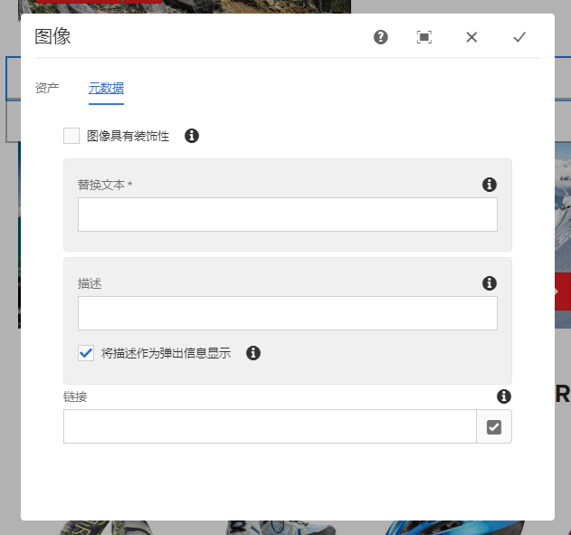
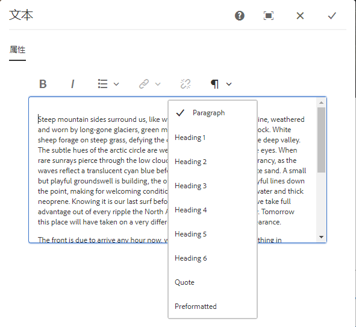
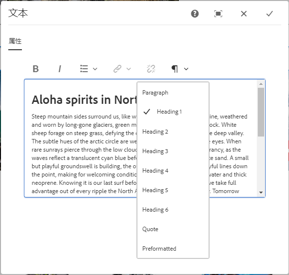
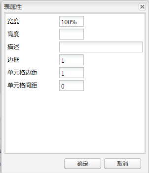
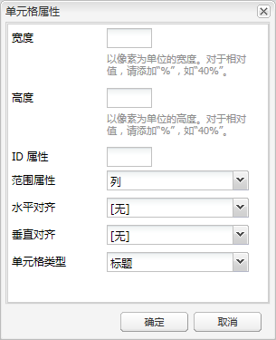
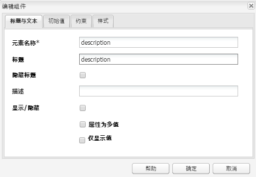
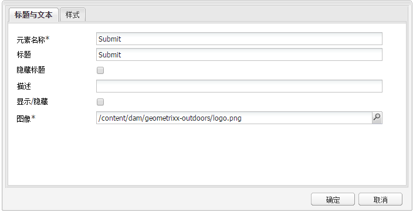
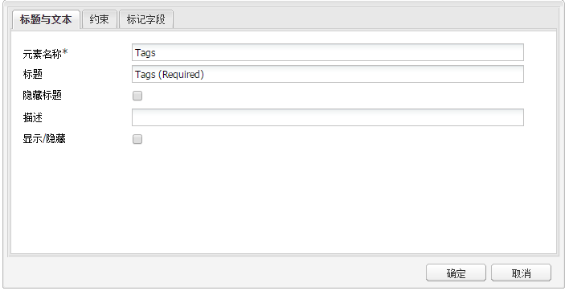

# 创建辅助内容（WCAG 2.0 符合性）{#creating-accessible-content-wcag-conformance}

>[!CAUTION]
>
>AEM 6.4已结束扩展支持，本文档将不再更新。 有关更多详细信息，请参阅 [技术支助期](https://helpx.adobe.com/cn/support/programs/eol-matrix.html). 查找支持的版本 [此处](https://experienceleague.adobe.com/docs/).

WCAG 2.0 包含一系列非技术层面的准则及成功标准，旨在确保残障人士能够访问并使用 Web 内容。

>[!NOTE]
>
>另请参阅：
>
>* 我们的 [WCAG 2.0快速指南](/help/managing/qg-wcag.md) 有关更多详细信息
>* [配置富文本编辑器以创建辅助内容](/help/sites-administering/rte-accessible-content.md)
>


这些内容将根据三个符合性级别进行分级：A级（最低）、AA级和AAA级（最高）。 简要地说，这些级别的定义如下：

* **级别 A：**&#x200B;您的站点满足基本的、最低级别的无障碍性。要达到此级别，需满足所有级别 A 成功标准。
* **AA 级：**&#x200B;这是一个理想的无障碍等级目标，站点达到这一等级即意味着达到了更高级别的无障碍性，大部分人在大多数情况下均可使用大部分技术访问站点内容。要达到这一等级，站点必须满足所有 A 级和 AA 级成功标准。
* **级别 AAA：**&#x200B;您的站点在无障碍方面达到了非常高的级别。要达到此级别，需满足所有级别 A、级别 AA 和级别 AAA 成功标准。

在创建站点时，您应该大体上确定希望自己的站点符合哪个等级。

以下部分介绍 [WCAG 2.0 准则](https://www.w3.org/TR/WCAG20/#guidelines)以及[符合](https://www.w3.org/TR/UNDERSTANDING-WCAG20/conformance.html) A 级和 AA 级的相关成功标准。

>[!NOTE]
>
>由于某些类型的内容无法满足所有AAA级成功标准，因此不建议将此符合级别作为一般策略。

>[!NOTE]
>
>在此文档中，我们将使用：
>
>* [WCAG 2.0 准则](https://www.w3.org/TR/WCAG20/#guidelines)的简称。
>* 在 [WCAG 2.0准则](https://www.w3.org/TR/WCAG20/#guidelines) 以便与WCAG网站进行交叉引用。
>


## 准则 1：可感知 {#principle-perceivable}

[准则 1：可感知 – 信息和用户界面组件必须以可感知的方式呈现给用户。](https://www.w3.org/TR/WCAG20/#perceivable)

### 替换文本 (1.1) {#text-alternatives}

[准则1.1替换文本：为任何非文本内容提供替换文本，以将其更改为人们需要的其他形式，如大字体、盲文、语音、符号或更简单的语言。](https://www.w3.org/TR/WCAG20/#text-equiv)

### 非文本内容(1.1.1) {#non-text-content}

* 成功标准 1.1.1
* A 级
* 非文本内容：呈现给用户的所有非文本内容都具有相同用途的替换文本，以下所列情况除外。

#### 用途 – 非文本内容 (1.1.1) {#purpose-non-text-content}

网页上的信息可以以多种不同的非文本格式提供，例如图片、视频、动画、图表和图形。失明或患有严重视觉障碍的用户无法看到非文本内容，但他们可以通过屏幕阅读器向他们阅读文本内容或通过盲文显示设备以触觉形式呈现文本内容。因此，通过以图形格式提供内容的替换文本，无法看到图形内容的用户可以访问内容提供信息的对等版本。

一个有用的额外好处是替换文本使非文本内容能够通过搜索引擎技术进行索引。

#### 如何达到标准 — 非文本内容(1.1.1) {#how-to-meet-non-text-content}

对于静态图形，基本的要求是为图形提供对等的替换文本。这可以在 **替换文本** 字段：

>[!NOTE]
>
>一些现成的组件（如&#x200B;**轮播**&#x200B;和&#x200B;**幻灯片**&#x200B;放映）不提供向图像添加替代文本描述的方法。在为 AEM 实例实施这些版本时，开发团队需要将此类组件配置为支持 `alt` 属性，以便作者可以将其添加到内容中（请参阅[添加对其他 HTML 元素和属性的支持](/help/sites-administering/rte-accessible-content.md#adding-support-for-additional-html-elements-and-attributes)）。

的 **替换文本** 字段 **图像** 组件对话框 **元数据** 选项卡：



默认情况下，AEM 要求填写&#x200B;**替换文本**&#x200B;字段。如果图像是纯粹的装饰并且替换文本没有实际意义，则 **图像具有装饰性** 选项。

#### 创建有效的替换文本 {#creating-good-text-alternatives}

非文本内容有各种形式，因此替换文本的值取决于图形在网页中扮演的角色。 以下是一些需要遵循的一般经验规则：

* 替换文本应简明扼要，但应清楚地捕获非文本内容提供的基本信息。
* 应避免描述过长（超过100个字符）。 如果替换文本需要更多详细信息：

   * 在替换文本中提供简短的描述
   * 同时，在同一页面的其他位置或在一个单独的网页中提供更加详尽的描述文本。通过将图像设为链接，或通过在图像旁边放置文本链接来链接到此单独的描述。

* 替换文本不应复制同一页面邻近位置以文本形式提供的内容。请记住，许多图像是页面文本中已涵盖的点的插图，因此可能已存在详细的替换文本。
* 如果非文本内容是指向其他页面或文档的链接，并且同一链接中没有其他文本形成部分，则图像的替换文本必须指示链接的目标位置，而不是描述图像。
* 如果非文本内容包含在按钮元素中，并且同一按钮中没有文本形成部分，则图像的替换文本必须指示按钮的功能，而不是描述图像。
* 图像的替代文本指定为空 (null) 是完全可以接受的，但是这仅限于图像没有替代文本的情况（例如，图形仅起装饰作用），或者页面文本中已存在对等的文本。

的 [W3C草稿：HTML5提供有用替换文本的技术](https://dev.w3.org/html5/alt-techniques/) 提供了更多详细信息和示例，说明如何为不同类型的图像提供适当的替换文本。

以下特定类型的非文本内容可能需要替换文本：

* 说明性照片：指人物、对象或地点的图像。想想照片在页面中的作用；相应的对等文本可能 *[对象]的照片*，但是这可能取决于周围的文本。
* 图标：指传递特定信息的小图形符号（图形）。页面和站点上使用的图标必须保持一致。图标在页面或站点上出现的所有实例都应使用相同的简短替换文本，除非这样做会与相邻的文本产生不必要的重复情况。
* 图表和图形：通常用于表示数值数据。因此，替换文本的选择之一就是简要地总结图表或图形中表现出来的主要趋势。如有必要，还可以在&#x200B;**高级**&#x200B;图像属性选项卡中的&#x200B;**描述**&#x200B;字段中以文本形式提供更加详尽的描述。此外，还可以在页面或站点的其他位置以表形式提供源数据。

   

   要为此示例图表提供替代内容，请添加简洁的 `alt` 文本到图像本身，然后在图像后面添加全文替换内容。

   ```xml
   <p></p>
   <p> Figure 1. Distribution of Articles by Journal Category.
   Pie chart: Language=68%, Education=14% and Science=18%.</p>
   ```

   >[!NOTE]
   >
   >上述代码片段仅用于说明顺序。 建议使用 **图像** 组件(而不是 `img src` 上面使用的引用。

   在AEM中，可以使用 **替换文本** 和 **描述** 图像配置对话框中的字段 — 如 [如何达到标准 — 非文本内容(1.1.1)](#how-to-meet-non-text-content).

* 地图、示意图和流程图：对于提供空间数据的图形（例如，用于说明各对象之间关系或某个流程的图形），应确保以文本格式提供关键信息。对于地图，提供完全对等的文本似乎不太现实，但是如果提供地图的目的是帮助人们找到前往特定地点的路线，则地图图像的替代文本可以简要指明 *X 的地图*，然后在页面的其他位置或在&#x200B;**图像**&#x200B;组件&#x200B;**高级**&#x200B;选项卡的&#x200B;**描述**&#x200B;字段中以文本形式提供前往该地点的路线。
* 验证码：验证码是 *全自动化公共图灵测试区分计算机和人类*.它是网页上用于区分人类和恶意软件的安全检查，但可能会造成无障碍问题。这些图像要求用户描述他们看到的内容才能通过安全测试。为图像提供替代文本显然是不可能的，因此您需要考虑使用替代的非图形解决方案。

   W3C提供了许多建议，例如：每种方法各有其优缺点。

   * 逻辑谜题
   * 使用声音输出而不是图像
   * 限制使用帐户和垃圾邮件过滤器。

* 背景图像：这些操作是使用层叠样式表(CSS)而不是HTML实现的。这意味着无法指定替换文本值。因此，背景图像不应提供重要的文本信息 — 如果提供，则这些信息还必须在页面文本中提供。

   但是，当图像无法显示时，务必显示替代背景。

   >[!NOTE]
   >
   >背景与前景文本之间应有适当的对比度级别；在 [对比度（最小）(1.4.3)](#contrast-minimum).

#### 更多信息 — 非文本内容(1.1.1) {#more-information-non-text-content}

* [了解成功标准 1.1.1](https://www.w3.org/TR/UNDERSTANDING-WCAG20/text-equiv-all.html)
* [如何达到成功标准 1.1.1](https://www.w3.org/WAI/WCAG20/quickref/#text-equiv)
* [W3C：用于提供实用替换文本的 HTML5 技术（草案）](https://dev.w3.org/html5/alt-techniques/)
* [CAPTCHA的W3C解释和替代方法](https://www.w3.org/TR/turingtest/)

### 基于时间的媒体 (1.2) {#time-based-media}

[准则1.2基于时间的媒体：为基于时间的媒体提供替代内容。](https://www.w3.org/TR/WCAG20/#text-equiv)

此准则涉及的Web内容 *基于时间*.这包括用户可以播放的内容（如视频、音频和动画内容），这些内容可以是预先录制的，也可以是实时流。

### 纯音频和纯视频（预先录制）(1.2.1) {#audio-only-and-video-only-pre-recorded}

* 成功标准 1.2.1
* A 级
* 纯音频和纯视频（预先录制）：对于预先录制的纯音频媒体和预先录制的纯视频媒体，均存在以下情况，除非音频或视频就是文本的替代媒体 ，且明确进行了如下标记：

   * 预先录制的纯音频：提供了用于基于时间的媒体的替代方法，其针对预先录制的纯音频内容呈现等效信息。
   * 仅预先录制视频：提供了基于时间的媒体的替代内容或音轨，该替代内容呈现预先录制的纯视频内容的对等信息。

#### 用途 — 纯音频和纯视频（预先录制）(1.2.1) {#purpose-audio-only-and-video-only-pre-recorded}

以下用户可能会遇到音频和视频的无障碍问题：

* 患有视觉障碍的用户在没有音轨，或者音轨不足以告知他们视频或动画中正在播放的内容时；
* 患有听力障碍或耳聋的无法听到音轨的用户；
* 可以听到音轨但不了解讲话内容的人员（例如，因为讲话的语言是他们不理解的）。

如果用户使用的浏览器或设备不支持以特定媒体格式(如AdobeFlash)播放内容，则用户也可能无法使用视频或音频。

如果以其他格式提供此信息，例如文本（或对于不含音频的视频，为音频），则无法访问原始内容的用户可以访问该信息。

#### 如何达到标准 — 纯音频和纯视频（预先录制）(1.2.1) {#how-to-meet-audio-only-and-video-only-pre-recorded}

* 如果内容是预先录制的不含视频的音频（如播客）：

   * 在紧靠内容之前或之后的位置提供一个链接，指向音频内容的文本记录。

      这份记录应当是一个HTML页面，其中包含所有讲话内容以及重要的非讲话内容的对等文本，并指明讲话者、背景描述、声音表情以及任何其他重要音频的描述。

* 如果内容是不含音频的动画或预先录制的不含音频的视频：

   * 在紧靠内容之前或之后的位置提供一个链接，指向视频所提供信息的对等文本描述
   * 或以常用音频格式（如MP3）提供的等效音频描述。

>[!NOTE]
>
>如果音频或视频内容是作为替代内容提供的，而该替代内容已经存在于网页上的其他格式中，则无需遵循上述要求。 例如，如果视频说明了文本说明列表，则此视频不需要替代内容，因为文本说明已经充当视频的替代内容。

在AEM网页中插入多媒体(特别是Flash内容)与插入图像类似。 但是，多媒体内容与静态图像相比还是更为复杂，而且在控制多媒体的播放方式时有各种不同的设置和选项。

>[!NOTE]
>
>如果将多媒体与信息性内容结合使用，则也必须创建替代内容的链接。例如，要加入文本记录，应创建一个用于显示记录的 HTML 页面，然后在音频内容旁边或下方添加一个链接。

#### 更多信息 - 纯音频和纯视频（预先录制）(1.2.1) {#more-information-audio-only-and-video-only-pre-recorded}

* [了解成功标准 1.2.1](https://www.w3.org/TR/UNDERSTANDING-WCAG20/media-equiv-av-only-alt.html)
* [如何达到成功标准 1.2.1](https://www.w3.org/WAI/WCAG20/quickref/#media-equiv)

### 字幕（预先录制）(1.2.2) {#captions-pre-recorded}

* 成功标准 1.2.2
* A 级
* 字幕（预先录制）：为同步媒体中所有预先录制的音频内容提供了字幕，除非该媒体是文本的替代媒体，且明确进行了相应标记。

#### 用途 — 字幕（预先录制）(1.2.2) {#purpose-captions-pre-recorded}

耳聋或听力欠佳的用户无法或很难获取音频内容。字幕是讲话和非讲话音频的对等文本，在视频播放过程中会在相应的时间显示在屏幕上。它们允许无法听到音频的用户了解正在发生的事件。

>[!NOTE]
>
>如果视频或动画所在的页面上具有适当的对等文本或非文本内容（提供直接对等的信息），则无需提供字幕。

#### 如何达到标准 — 字幕（预先录制）(1.2.2) {#how-to-meet-captions-pre-recorded}

字幕有以下两种形式：

* 开放式：字幕在视频播放过程中始终可见）
* 隐藏式：字幕可以由用户打开或关闭 

尽量使用隐藏式字幕，因为这样用户可以选择是否观看字幕。

对于隐藏式字幕，您需要以适当的格式创建并提供同步的字幕文件(例如 [SMIL](https://www.w3.org/AudioVideo/))旁边的视频文件(有关如何执行此操作的详细信息不在本指南的范围之内，但我们在下提供了一些教程的链接 [更多信息 — 字幕（预先录制）(1.2.2)](#more-information-captions-pre-recorded))。 请确保提供说明，以告知用户视频有字幕。

如果必须使用开放式字幕，则应将文本嵌入到视频轨道中。 可以使用允许在视频上叠加标题的视频编辑应用程序来实现这一点。

#### 更多信息 — 字幕（预先录制）(1.2.2) {#more-information-captions-pre-recorded}

* [了解成功标准 1.2.2](https://www.w3.org/TR/UNDERSTANDING-WCAG20/media-equiv-captions.html)：
* [如何达到成功标准 1.2.2](https://www.w3.org/WAI/WCAG20/quickref/#media-equiv)
* [W3C：同步的多媒体](https://www.w3.org/AudioVideo/)
* [字幕、记录和音频描述 - WebAIM 文章](https://webaim.org/techniques/captions/)

### 音频描述或替代媒体（预先录制）(1.2.3) {#audio-description-or-media-alternative-pre-recorded}

* 成功标准 1.2.3
* A 级
* 音频描述或替代媒体（预先录制）：为同步媒体提供预先录制的视频内容的基于时间的媒体或音频描述的替代内容，除非该媒体是文本的替代媒体并且明确地被这样标记。

#### 用途 — 音频描述或替代媒体（预先录制）(1.2.3) {#purpose-audio-description-or-media-alternative-pre-recorded}

如果视频或动画中的信息仅以可视形式呈现，或者音轨提供的信息不足以让用户了解视频或动画中正在播放的内容，则失明或患有视觉障碍的用户将会遇到无障碍问题。

#### 如何达到标准 — 音频描述或替代媒体（预先录制）(1.2.3) {#how-to-meet-audio-description-or-media-alternative-pre-recorded}

可采用两种方法来达到此成功标准。 可以接受以下任一条件：

1. 为视频内容包含其他音频描述。 可以通过以下三种方式之一实现此目的：

   * 在现有对话暂停期间，提供关于场景中未作为现有音轨一部分呈现的更改的信息；
   * 提供一段附加的可选新音轨，其中不仅包含原始音轨，而且还包含有关场景变换的额外音频信息。

      * 这允许用户在现有音轨（*不含*&#x200B;音频描述）和新音轨（*含有*&#x200B;音频描述）之间进行切换。
      * 这样可防止不需要附加描述的用户中断。
   * 创建视频内容的第二个版本，以便提供扩展的音频描述。 这通过在适当的时间点暂停音频和视频来减少在现有对话之间的间隙内提供详细音频描述的困难。 因此，在再次开始操作之前，可以提供更长的音频描述。 与上一个示例一样，最好将此音轨作为可选的额外音轨提供，以防止不需要附加描述的用户中断。


1. 提供文本记录，该文本记录是视频或动画的音频和可视元素的适当对等文本。 这应当包括，在适当情况下，指出讲话者，描述讲话背景和声音表情。 根据记录长度的不同，可以将记录放在与视频或动画相同的页面上，或放在单独的页面上；如果选择后一个选项，请在视频或动画旁边提供一个指向记录的链接。

至于如何创建带有音频描述的视频，具体细节不在本指南的范围之内。创建视频和音频描述非常耗时，但是 Adobe 的其他产品可以帮助您完成这些任务。如果在 Adobe Flash Professional 中创建内容，则还应当创建一个脚本来提示用户下载合适的插件，并通过 `<noscript>` 元素提供替换文本。

#### 更多信息 - 音频描述或替代媒体（预先录制）(1.2.3) {#more-information-audio-description-or-media-alternative-pre-recorded}

* [了解成功标准 1.2.3](https://www.w3.org/TR/UNDERSTANDING-WCAG20/media-equiv-audio-desc.html)：
* [如何达到成功标准 1.2.3](https://www.w3.org/WAI/WCAG20/quickref/#qr-media-equiv-audio-desc)
* [Adobe Encore CS5](https://www.adobe.com/cn/products/premiere/encore/)

### 字幕（实时）(1.2.4)  {#captions-live}

* 成功标准 1.2.4
* AA 级
* 字幕（实时）：为同步媒体中的所有实时音频内容提供了字幕。

#### 用途 — 字幕（实时）(1.2.4) {#purpose-captions-live}

该成功标准与[字幕（预先录制）](#captions-pre-recorded)的标准完全相同，因为其用途在于解决耳聋或听力欠佳的用户遇到的无障碍问题，两者的不同之处在于该成功标准需要处理网络直播等实时演示。

#### 如何达到标准 – 字幕（实时）(1.2.4) {#how-to-meet-captions-live}

遵循上面[字幕（预先录制）](#captions-pre-recorded)所提供的指南。但鉴于媒体的实时性质，必须尽可能以最快的速度提供字幕并对正在发生的情况做出回应。因此，应当考虑使用实时字幕工具或语音转文本工具。

与此相关的详细说明不在本指南的范围之内，但是以下资源提供了有用的信息：

* [WebAIM：实时字幕](https://www.webaim.org/techniques/captions/realtime.php)
* [AccessIT（华盛顿大学）：能否利用语音识别技术自动生成字幕？](https://www.washington.edu/accessit/articles?1209)

#### 更多信息 – 字幕（实时）(1.2.4) {#more-information-captions-live}

* [了解成功标准 1.2.4](https://www.w3.org/TR/UNDERSTANDING-WCAG20/media-equiv-real-time-captions.html)
* [如何达到成功标准 1.2.4](https://www.w3.org/WAI/WCAG20/quickref/#qr-media-equiv-real-time-captions)

### 音频描述（预先录制）(1.2.5)  {#audio-description-pre-recorded}

* 成功标准 1.2.5
* AA 级
* 音频描述（预先录制）：为同步媒体中的所有预先录制的视频内容提供了音频描述。

#### 用途 — 音频描述（预先录制）(1.2.5) {#purpose-audio-description-pre-recorded}

此成功标准与 [音频描述或替代媒体（预先录制）](#audio-description-or-media-alternative-pre-recorded)，但作者必须提供更加详细的音频描述才能符合AA级。

#### 如何达到标准 — 音频描述（预先录制）(1.2.5) {#how-to-meet-audio-description-pre-recorded}

遵循所提供的指导 [音频描述或替代媒体（预先录制）](#audio-description-or-media-alternative-pre-recorded).

#### 更多信息 — 音频描述（预先录制）(1.2.5) {#more-information-audio-description-pre-recorded}

* [了解成功标准 1.2.5](https://www.w3.org/TR/UNDERSTANDING-WCAG20/media-equiv-audio-desc-only.html)
* [如何达到成功标准 1.2.5](https://www.w3.org/WAI/WCAG20/quickref/#qr-media-equiv-audio-desc-only)

### 适应性(1.3) {#adaptable}

[准则1.3适应性：创建可以以不同方式呈现的内容（例如更简单的布局），而不会丢失信息或结构。](https://www.w3.org/TR/WCAG20/#content-structure-separation)

此准则涵盖支持以下人员所需的要求：

* 可能无法访问作者在 *标准* 二维、多列、彩色网页布局

* 可能使用纯音频或替代可视显示，如大文本或高对比度。

### 信息和关系 (1.3.1)  {#info-and-relationships}

* 成功标准 1.3.1
* A 级
* 信息和关系：通过呈现传递的信息、结构和关系可以通过编程方式确定或以文本形式提供。

#### 用途 — 信息和关系(1.3.1) {#purpose-info-and-relationships}

残障人士使用的许多辅助型技术都依赖结构性信息才能有效地显示或输出内容。 此结构信息可以采用页面标题、表行和列标题以及列表类型的形式。 例如，屏幕阅读器允许用户在页面中从标题导航到标题。 但是，当页面内容似乎只通过可视样式而不是基础HTML具有结构时，辅助型技术便没有可用的结构性信息，从而限制了它们支持更轻松浏览的能力。

此成功标准旨在确保通过HTML提供此类结构性信息，以便浏览器和辅助型技术可以访问并利用这些信息。

#### 如何达到标准 – 信息和关系 (1.3.1) {#how-to-meet-info-and-relationships}

AEM 允许轻松地使用相应的 HTML 元素构建网页。可在 RTE（一种文本组件）中打开页面内容，然后使用&#x200B;**段落格式**&#x200B;菜单（段落符号）指定相应的结构元素（例如，段落、标题等）。

下图显示了样式为段落文本的文本。



可以通过以下方式确保网页指定了合适的结构：

* **使用标题：**

   只要启用了RTE的辅助功能(请参阅 [AEM和辅助功能](#AdobeExperienceManagerandAccessibility))，则AEM提供3个级别的页面标题。 您可以使用这些标题标识内容的章节和子章节。标题 1 是最高级别的标题，标题 3 是最低级别的标题。系统管理员可以配置系统以允许使用更多标题级别。

   下图演示了不同类型标题的示例。

   

* **强调文本**:

   使用或元素指示重点。 切勿在段落中使用标题突出显示文本。

   * 突出显示要强调的文本；
   * 单击 **B** 图标(对于 &lt;strong>)或 **我** 图标(对于 &lt;em>) **属性** 面板(确保已选择HTML)。

   >[!NOTE]
   >
   >标准 AEM 安装中的 RTE（富文本编辑器）设置为：
   >
   >* &lt;b> 表示 &lt;strong>
   * &lt;i> 表示 &lt;em>

   虽然两种形式效果相同，但最好是和，因为从语义上来讲，它们才是正确的HTML标记。 开发团队在开发项目实例时，可以将RTE配置为使用和（而不是和）。

* **使用列表**：可以使用 HTML 指定三种不同类型的列表：

   * 的 `<ul>` 元素用于 *未排序* 列表（项目符号）列表。 单个列表项使用 `<li>` 元素进行标识。


      在RTE中，使用 **项目符号列表** 图标。

   * 的 `<ol>` 元素用于 *编号列表*. 单个列表项使用 `<li>` 元素进行标识。


      在 RTE 中，使用&#x200B;**编号列表**&#x200B;图标。
   如果要将现有内容更改为特定列表类型，请突出显示相应的文本，然后选择相应的列表类型。 正如前面显示如何输入段落文本的示例一样，相应的列表元素会自动添加到您的HTML中。

   在全屏模式下，单个&#x200B;**项目符号列表**&#x200B;和&#x200B;**编号列表**&#x200B;图标可见。 当不处于全屏模式时，这两个选项在单个&#x200B;**列表**&#x200B;图标的后面可用。

   

   >[!NOTE]
   `<dl>` RTE不支持。

* **使用表**:

   数据表必须使用HTML表元素进行标识：

   * 一个 `<table>` 元素
   * 每个表行均使用 `<tr>` 元素进行标识
   * 每个行标题和列标题均使用 `<th>` 元素进行标识
   * 每个数据单元格均使用 `<td>` 元素进行标识

   >[!NOTE]
   在经典UI中，应使用 **表** 组件。

   此外，辅助表会使用以下元素和属性：

   * `<caption>` 元素用于为表提供可视描述。默认情况下，字幕显示在表格上方居中的位置，但可以使用CSS正确放置字幕。 描述采用编程方式与表相关联，因此这是一种提供内容简介的有用方法。
   * `<summary>` 元素通过总结视力正常的用户可以看到的内容，帮助失明的用户更加轻松地了解表中提供的信息。当使用了复杂或非常规的表布局时，这种方法尤其有用（该属性不会显示在浏览器中，只会由辅助型技术读取）。
   * `<th>` 元素的 `scope` 属性用于指示某个单元格表示特定行的标题，还是特定列的标题。在复杂的表中，即数据单元格可能与一个或多个标题相关联的情况下，类似的方法是使用标题和 id 属性。

   >[!NOTE]
   默认情况下，这些元素和属性不直接可用，但系统管理员可以在&#x200B;**表属性**&#x200B;对话框中添加对这些值的支持（请参阅[添加对其他 HTML 元素和属性的支持](/help/sites-administering/rte-accessible-content.md#adding-support-for-additional-html-elements-and-attributes)）。

   添加 **表** 您可以配置 **表属性** 使用对话框。

   * 适当 **题注**.
   * 理想情况下，请删除 **Width**、 **Height**、Border **、** Border Border Sell PaddingSpacing **、****** Cell Spacing的默认值。 因为这些属性可以在全局样式表中设置。

   

   然后，您可以使用 **电池特性** 选择单元格是数据单元格还是标题单元格，如果是标题单元格，则选择该单元格与行或列相关还是与两者都相关：

   

* **复杂数据表：**

   在某些情况下，如果存在具有两个或多个标题级别的复杂表，则基本的“表属性”可能不足以提供所有必需的结构信息。 对于此类复杂表，需要使用&#x200B;**标题**&#x200B;和 **id** 属性在标题和与之相关的单元格之间建立关系。例如，在下表中，标题和 ID 是相匹配的，以便为辅助型技术用户建立程序化关联。

   >[!NOTE]
   id属性在即装即用安装中不可用。 可通过在RTE中配置HTML规则和序列化器来启用此功能。

   >[!NOTE]
   在经典UI中，应使用 **表** 组件。

   ```xml
   <table>
      <tr>
        <th rowspan="2" id="h">Homework</th>
        <th colspan="3" id="e">Exams</th>
        <th colspan="3" id="p">Projects</th>
      </tr>
      <tr>
        <th id="e1" headers="e">1</th>
        <th id="e2" headers="e">2</th>
        <th id="ef" headers="e">Final</th>
        <th id="p1" headers="p">1</th>
        <th id="p2" headers="p">2</th>
        <th id="pf" headers="p">Final</th>
      </tr>
      <tr>
       <td headers="h">15%</td>
       <td headers="e e1">15%</td>
       <td headers="e e2">15%</td>
       <td headers="e ef">20%</td>
       <td headers="p p1">10%</td>
       <td headers="p p2">10%</td>
       <td headers="p pf">15%</td>
      </tr>
   </table>
   ```

   要在AEM中实现此目的，必须直接使用源代码编辑模式添加标记。

   >[!NOTE]
   此功能并非在标准安装中立即可用。 它需要配置RTE、HTML规则和序列化器。

#### 更多信息 – 信息和关系 (1.3.1) {#more-information-info-and-relationships}

* [了解成功标准 1.3.1](https://www.w3.org/TR/UNDERSTANDING-WCAG20/content-structure-separation-programmatic.html)
* [如何达到成功标准 1.3.1](https://www.w3.org/WAI/WCAG20/quickref/#qr-content-structure-separation-programmatic)

### 感官特性 (1.3.3)  {#sensory-characteristics}

* 成功标准1.3.3
* A 级
* 感官特性：为了解和操作内容而提供的说明不仅依赖于组件的感官特性，如形状、大小、可视位置、方向或声音。

#### 用途 — 感官特性(1.3.3) {#purpose-sensory-characteristics}

设计者往往关注可视设计特征，如颜色、形状、文本样式，或者内容在展示信息时所在的绝对或相对位置。在传递信息时，这些可能是非常强大的设计技术，但是失明或患有视觉障碍的用户可能无法访问需要视觉识别属性（如位置、颜色或形状）的信息。

同样，如果用户在获取信息时必须辨认不同的声音（例如，男性或女性讲话的内容），而且音频内容没有反映在任何替换文本中，则患有听觉障碍的用户就会遇到无障碍问题。

>[!NOTE]
有关颜色替代项的要求，请参阅 [使用颜色](#use-of-color).

#### 如何达到标准 — 感官特性(1.3.3) {#how-to-meet-sensory-characteristics}

确保任何依赖于页面内容可视化特征的信息也以替代格式显示。

* 切勿依赖可视位置来提供信息。 例如，如果您希望将用户引荐到页面右侧的菜单，以访问更多信息，请勿参考 *右侧的菜单*;相反，请命名菜单（例如，通过标题），并在文本中引用该名称。
* 切勿将文本样式（例如，粗体或斜体文本）作为传递信息的唯一方式。

>[!NOTE]
如果用户在非可视化上下文中可以理解使用的描述性术语的含义，则可以接受使用描述性术语。例如，使用 *以上* 和 *下面* （因为它们分别表示特定内容项目之前和之后的内容）；在朗读内容时，这仍然有意义。

#### 更多信息 - 感官特性 (1.3.3) {#more-information-sensory-characteristics}

* [了解成功标准 1.3.3](https://www.w3.org/TR/UNDERSTANDING-WCAG20/content-structure-separation-understanding.html)
* [如何达到成功标准 1.3.3](https://www.w3.org/WAI/WCAG20/quickref/#qr-content-structure-separation-understanding)

### 可辨别性(1.4) {#distinguishable}

[准则1.4可辨别性：使用户更轻松地查看和收听内容，包括将前景与背景分开。](https://www.w3.org/TR/WCAG20/#visual-audio-contrast)

### 使用颜色(1.4.1)  {#use-of-color}

* 成功标准 1.4.1
* A 级
* 颜色的使用：颜色不是传递信息、指示操作、提示响应或区分可视元素的唯一可视方式。

>[!NOTE]
此成功标准专门针对颜色感知。 其他形式的感知在 [适应性(1.3)](#adaptable);包括以编程方式访问颜色和其他可视呈现编码。

#### 用途 — 使用颜色(1.4.1) {#purpose-use-of-color}

颜色是增强网页美感的明显有效方式，也有助于传递信息。 但是，从失明到色盲，存在一系列视觉障碍，这意味着有些人无法区分某些颜色。 这就使颜色编码无法可靠地提供信息。

例如，患有红绿色视觉障碍的用户将无法区分绿色和红色阴影。 他们可能将这两种颜色视为第三种颜色（例如，棕色），在这种情况下，他们将无法区分红色、绿色和棕色。

此外，使用纯文本浏览器、单色显示设备或查看页面黑白打印输出的用户无法感知到颜色。

#### 如何达到标准 – 使用颜色 (1.4.1) {#how-to-meet-use-of-color}

无论在何处使用颜色传递信息，都应确保无需看到颜色即可获取相应的信息。

例如，确保通过颜色传递的信息也明确地提供在文本中。下图显示了颜色和文本如何都指示演出的座位空余情况：

<table> 
 <tbody> 
  <tr> 
   <td><p><strong>性能</strong></p> </td> 
   <td><p><strong>可用性</strong></p> </td> 
  </tr> 
  <tr> 
   <td><p>星期二3月16日<sup>th</sup></p> </td> 
   <td><p>可用座位</p> </td> 
  </tr> 
  <tr> 
   <td><p>3月17日星期三</p> </td> 
   <td><p>可用座位</p> </td> 
  </tr> 
  <tr> 
   <td><p>星期四3月18日<sup>th</sup></p> </td> 
   <td><p>售罄</p> </td> 
  </tr> 
 </tbody> 
</table>

如果使用颜色作为提供信息的提示，则应提供其他可视提示，如更改样式（如粗体、斜体）或字体。这有助于视力不佳或具有色觉辨认障碍的人识别信息。但是，不能完全依赖它，因为它不会帮助根本无法看到页面的用户。

#### 更多信息 – 使用颜色 (1.4.1) {#more-information-use-of-color}

* [了解成功标准 1.4.1](https://www.w3.org/TR/2008/NOTE-WCAG20-TECHS-20081211/working-examples/G183/link-contrast.html)
* [如何达到成功标准 1.4.1](https://www.w3.org/TR/2008/NOTE-WCAG20-TECHS-20081211/working-examples/G183/link-contrast.html)
* [有关达到3:1对比度的指南，其中包含“Web安全”颜色列表](https://www.w3.org/TR/2008/NOTE-WCAG20-TECHS-20081211/working-examples/G183/link-contrast.html)

### 对比度（最小）(1.4.3) {#contrast-minimum}

* 成功标准 1.4.3
* AA 级
* 对比度（最小）：文本和文本图像的可视呈现至少具有4.5:1的对比度，以下情况除外：

   * 大文本：大尺寸文本和大尺寸文本的图像的对比度至少为3:1。
   * 附属内容：文本或文本的图像是未激活的用户界面组件的一部分，只是纯粹的装饰，对任何人都不可见，或者只是包含其他重要可视内容的图片的一部分，对于此类文本或文本的图像，没有对比度要求。
   * 商标标志：文本是徽标或品牌名称的一部分，对于此类文本，没有最低对比度要求。

#### 用途 – 对比度（最小）(1.4.3) {#purpose-contrast-minimum}

患有某些视觉障碍的用户可能无法区分某些低对比度颜色对。 如果出现以下任一情况，此类用户便可能遇到无障碍问题：

* 文本与其背景颜色之间的对比度极低。
* 文本的颜色编码（如链接文本和非链接文本）在识别信息时很重要。

>[!NOTE]
此成功标准中排除了仅用于装饰目的的文本。

#### 如何达到标准 — 对比度（最小）(1.4.3) {#how-to-meet-contrast-minimum}

确保文本与其背景之间有充分的对比度。 对比度取决于相关文本的大小和样式：

* 对于大小小于 18 点（或粗体为小于 14 点）的文本，文本中的文字/图像与背景之间的对比度至少应为 4.5:1。
* 对于大小至少为18点（或粗体为14点）的文本，对比度应至少为3:1。
* 如果背景已构图，则任何文本周围的背景应当着色，以保持4.5:1或3:1的比率。

要检查对比度，请使用颜色对比度工具，例如 [Paciello Group Color Contrast Analyser](https://www.paciellogroup.com/resources/contrast-analyser.html) 或 [WebAIM颜色对比度检查程序](https://www.webaim.org/resources/contrastchecker/). 这些工具允许您检查颜色对并报告任何对比度问题。

或者，如果您不太在意页面外观的指定，则可以选择不指定背景和前景文本颜色。无需检查对比度，因为用户的浏览器将确定文本和背景的颜色。

如果无法满足建议的对比度级别，您需要提供一个指向页面的对等替代版本的链接（该版本不存在颜色对比度问题），或者允许用户根据自己的要求调整页面颜色方案的对比度。

#### 更多信息 - 对比度（最小）(1.4.3) {#more-information-contrast-minimum}

* [了解成功标准 1.4.3](https://www.w3.org/TR/UNDERSTANDING-WCAG20/visual-audio-contrast-contrast.html)
* [如何达到成功标准 1.4.3](https://www.w3.org/WAI/WCAG20/quickref/#qr-visual-audio-contrast-contrast)

### 文本的图像 (1.4.5) {#images-of-text}

* 成功标准 1.4.5
* AA 级
* 文本的图像：如果使用的技术可以达到可视呈现效果，使用文本来传递信息而不使用文本的图像，以下情况除外：

   * 可自定义：文本图像可以根据用户的要求进行可视化定制；
   * 基本：文本的特定呈现方式对于要传递的信息至关重要。

>[!NOTE]
商标标志（文本是徽标或品牌名称的一部分）被视为必要内容。

#### 用途 — 文本的图像(1.4.5) {#purpose-images-of-text}

当偏好特定文本样式时，通常会使用文本的图像；例如，日志类型或如果文本是从其他源生成的（例如，纸质文档的扫描）。 但是，与以HTML呈现的文本以及使用CSS设置样式的文本相比，文本的图像在更改大小或外观方面缺乏灵活性，这可能是患有视觉障碍或阅读困难的用户所必需的。

#### 如何达到标准 — 文本的图像(1.4.5) {#how-to-meet-images-of-text}

如果必须使用文本的图像，请使用CSS将文本的图像替换为HTML中的对等文本，以便文本以可自定义的方式可用。 有关如何实现此目的的示例，请参阅 [C30:使用CSS将文本替换为文本的图像，并提供用于切换的用户界面控件](https://www.w3.org/TR/2008/NOTE-WCAG20-TECHS-20081211/C30).

#### 更多信息 - 文本的图像 (1.4.5) {#more-information-images-of-text}

* [了解成功标准 1.4.5](https://www.w3.org/TR/UNDERSTANDING-WCAG20/visual-audio-contrast-text-presentation.html)
* [如何达到成功标准 1.4.5](https://www.w3.org/WAI/WCAG20/quickref/#qr-visual-audio-contrast-text-presentation)

## 原则2:可操作 {#principle-operable}

[准则 2：可操作 – 用户界面组件和导航必须可以操作。](https://www.w3.org/TR/WCAG20/#operable)

### 暂停、停止、隐藏 (2.2.2)  {#pause-stop-hide}

* 成功标准 2.2.2
* A 级
* 暂停、停止、隐藏：对于移动、闪烁、滚动或自动更新的信息，符合以下情况：

   * 移动、闪烁、滚动：对于(a)自动启动的移动、闪烁或滚动信息，(b)持续时间超过五秒，并且(c)与其他内容并行显示，有一种机制可供用户暂停、停止或隐藏该信息，除非移动、闪烁或滚动是活动必不可少的一部分；
   * 自动更新：对于任何(a)自动启动和(b)与其他内容并行呈现的自动更新信息，有一种机制可供用户暂停、停止或隐藏该信息，或者控制更新的频率，除非自动更新是活动必不可少的一部分。

注意要点：

1. 有关闪烁或闪烁内容的要求，请参阅 [切勿设计会导致癫痫发作的内容(2.3)](#seizures).
1. 由于任何不符合此成功标准的内容都可能干扰用户使用整个页面的能力，因此网页上的所有内容（无论是否用于满足其他成功标准）都必须符合此成功标准。 请参阅[符合性要求 5：不干涉](https://www.w3.org/TR/WCAG20/#cc5)。
1. 通过软件定期更新或流向用户代理的内容不需要保留或呈现在启动暂停和恢复呈现之间生成或接收的信息，因为这在技术上可能不可行，并且在许多情况下这样做可能具有误导性。
1. 如果在预加载阶段或类似情况下发生的动画对于所有用户而言都在该阶段期间无法进行交互，或者如果没有指示进度可能会令用户感到困惑，或者导致用户认为内容被冻结或损坏，则可以认为该动画至关重要。

#### 用途 — 暂停、停止、隐藏(2.2.2) {#purpose-pause-stop-hide}

某些用户可能会认为移动的内容会让人分心，并且难以将注意力集中在页面的其他部分。 此外，对于无法跟上移动文本的用户，可能难以阅读此类内容。

#### 如何达到标准 - 暂停、停止、隐藏 (2.2.2) {#how-to-meet-pause-stop-hide}

根据内容的性质，在创建包含移动、闪烁或闪烁内容的网页时，您可以应用以下一个或多个建议：

* 提供一种可使滚动的内容暂停的方法，以便让用户有充足的时间进行阅读。例如，新闻滚动条或自动更新文本。
* 确保闪烁的内容会在 5 秒钟后停止闪烁。
* 使用适当的技术来显示可由浏览器禁用的闪烁内容。例如，Graphics Interchange Format (GIF) 或 Animated Portable Network Graphics (APNG) 文件。
* 在网页上提供一个表单控件，以允许用户禁用页面上的所有闪烁内容。
* 如果无法使用上述任何内容，请提供一个指向包含所有内容但没有任何闪烁的页面的链接。

#### 更多信息 – 暂停、停止、隐藏 (2.2.2) {#more-information-pause-stop-hide}

* [了解成功标准 2.2.2](https://www.w3.org/TR/UNDERSTANDING-WCAG20/time-limits-pause.html)
* [如何达到成功标准 2.2.2](https://www.w3.org/WAI/WCAG20/quickref/#qr-time-limits-pause)

### 癫痫发作(2.3) {#seizures}

[准则2.3癫痫发作：切勿设计会导致癫痫发作的内容。](https://www.w3.org/TR/WCAG20/#seizure)

### 闪光三次或低于阈值 (2.3.1) {#three-flashes-or-below-threshold}

* 成功标准 2.3.1
* A 级
* 三个Flash或低于阈值：网页不包含任何在任一秒内闪光三次以上的内容，或者闪光低于一般闪光和红色闪光阈值。

>[!NOTE]
由于任何不符合此成功标准的内容都可能干扰用户使用整个页面的能力，因此网页上的所有内容（无论是否用于满足其他成功标准）都必须符合此成功标准。 请参阅[符合性要求 5：不干涉](https://www.w3.org/TR/WCAG20/#cc5)。

#### 用途 – 闪光三次或低于阈值 (2.3.1) {#purpose-three-flashes-or-below-threshold}

在某些情况下，闪光的内容可能会导致光敏癫痫发作。 此成功标准允许此类用户访问和体验所有内容，而无需担心闪光的内容。

#### 如何达到标准 — 三个Flash或低于阈值(2.3.1) {#how-to-meet-three-flashes-or-below-threshold}

您应该采取措施，确保应用以下技术：

* 确保组件在任何一秒内的闪光次数均不超过三次；
* 如果无法满足上述条件，则应在屏幕上以像素为单位将闪光的内容显示在&#x200B;*小块安全区域*&#x200B;内。这块区域的面积通过一个复杂的公式来计算（详见 [G176：尽量缩小闪光区域的面积](https://www.w3.org/TR/2008/NOTE-WCAG20-TECHS-20081211/G176)），因此，仅当闪光的内容&#x200B;*绝对*&#x200B;有必要时，才应使用这种技术。

#### 更多信息 – 闪光三次或低于阈值 (2.3.1) {#more-information-three-flashes-or-below-threshold}

* [了解成功标准 2.3.1](https://www.w3.org/TR/UNDERSTANDING-WCAG20/seizure-does-not-violate.html)
* [如何达到成功标准 2.3.1](https://www.w3.org/WAI/WCAG20/quickref/#seizure)

### 页面带有标题 (2.4.2)  {#page-titled}

* 成功标准2.4.2
* A 级
* 页面带有标题：网页的标题可描述主题或用途。

#### 用途 — 页面带有标题(2.4.2) {#purpose-page-titled}

此成功标准可帮助每个人（无论是否患有任何特定障碍）快速识别网页内容，而无需阅读完整页面。 当在浏览器选项卡中打开多个网页时，此选项特别有用，因为页面标题显示在选项卡中，因此可以快速找到。

#### 如何达到标准 — 页面带有标题(2.4.2) {#how-to-meet-page-titled}

在 AEM 中创建新 HTML 页面时，可以指定页面标题。确保标题能够充分描述页面内容，以便访客能够快速识别该内容是否与其需求切实相关。

您也可以在编辑页面时编辑页面标题，通过&#x200B;**页面信息** – **属性**&#x200B;可访问该设置。

#### 更多信息 – 页面带有标题 (2.4.2) {#more-information-page-titled}

* [了解成功标准 2.4.2](https://www.w3.org/TR/UNDERSTANDING-WCAG20/navigation-mechanisms-title.html)
* [如何达到成功标准 2.4.2](https://www.w3.org/WAI/WCAG20/quickref/#qr-navigation-mechanisms-title)

### 链接目的（在上下文中）(2.4.4)  {#link-purpose-in-context}

* 成功标准2.4.4
* A 级
* 链接目的（在上下文中）：每个链接的目的可以单独从链接文本确定，也可以从链接文本及其以编程方式确定的链接上下文一起确定，除非链接的目的对于用户来说通常不明确。

#### 用途 — 链接目的（在上下文中）(2.4.4) {#purpose-link-purpose-in-context}

对于所有用户而言，无论是否受到损害，通过适当的链接文本明确指示链接方向都至关重要。 这有助于用户确定是否确实希望跟踪链接。 对于视力正常的用户，当页面上有多个链接时（尤其是当页面包含大量文本时），有意义的链接文本会非常有用，因为有意义的链接文本可以更明确地指示目标页面的功能。 而使用辅助型技术的用户，他们可以在单个页面上生成所有链接的列表，从而更加轻松地脱离上下文理解链接文本。

#### 如何达到标准 – 链接目的（在上下文中）(2.4.4) {#how-to-meet-link-purpose-in-context}

首先，确保链接文本清晰地描述了链接目的。

* 错误示例：

   * 文本：有关2010年秋季晚间课程的详细信息，请单击 <u>此处</u>.
   * 原因分析：没有清晰明确地指明链接目标位置。

* 正确示例：

   * 文本： <u>2010年秋季晚间课程</u>  — 详细信息。
   * 原因：通过稍微调整链接元素的文本和位置，可以改进链接文本：

链接用词在各个页面中应保持一致，尤其是导航栏的链接。例如，如果特定页面的链接在某个页面中被命名为&#x200B;**出版物**，则在其他页面中也应使用该文本，以确保一致性。

但是，在编写本文时，在标题的使用方面存在一些问题：

* 通常，只有鼠标用户才能使用标题属性中包含的文本作为工具提示弹出窗口，并且无法使用键盘访问该文本。
* 屏幕阅读器可以读出标题属性，但此功能可能默认未启用；因此，用户可能不知道存在标题属性。
* 标题文本的外观很难改变，这意味着有些人可能很难阅读或无法阅读。

因此，尽管标题属性可用于为链接提供额外的上下文，但请注意其限制，不要将其用作相应链接文本的替代内容。

如果链接是由图像构成的，则应确保该图像的替代文本描述了链接的目标位置。例如，如果将一个书架的图像设置为某人出版物的链接，则替代文本应该写成&#x200B;**张三的出版物**，而不是&#x200B;**书架**。

或者，如果链接锚点包含的文本除了描述图像元素之外还描述了链接目的（因此文本会显示在图像旁边），则对图像使用空的alt属性：

```xml
<a href="publications.html">

John Smith’s publications
</a>
```

>[!NOTE]
上面的代码片段是一个插图，建议使用 **图像** 组件。

虽然提供无需附加上下文即可标识链接目的的链接文本是一种可取的方法，但该方法并不认为始终可行。与上下文无关的链接可用于以下情况，其 HTML 示例详见：[如何达到成功标准 2.4.4](https://www.w3.org/WAI/WCAG20/quickref/#qr-navigation-mechanisms-refs)。

* 当链接文本是由紧密相关的链接组成的列表的一部分时，以及当链接周围的列表项提供了足够的上下文时。
* 当可以通过&#x200B;*之前*（而非之后）的段落文本清晰识别链接目的时。
* 当链接包含在数据表中，从而可以从关联的标题中清晰识别目的时。
* 当链接列表包含在一组标题中且标题本身提供了合适的上下文时。
* 当链接列表包含在嵌套链接中且嵌套链接上方的父列表项提供了合适的上下文时。

在某些情况下，如果页面上有多个链接（每个链接都以复杂但必要的详细信息提供链接方向），则最好提供网页的替代版本，以显示完全相同的内容，但链接文本并不如此详细。

或者，也可以使用脚本，这样就能够最大限度地减少链接本身中提供的文本；但是，在将位于页面顶部的相应控件激活后，链接文本就会&#x200B;*扩展*&#x200B;成更多的详细信息。类似的方法还有使用 CSS 为视力正常的用户&#x200B;*隐藏*&#x200B;完整的链接，但是仍然将完整的链接呈现给屏幕阅读器用户。与此相关的说明不在本文档的范围之内，但是可以在[更多信息 - 链接目的（在上下文中）(2.4.4)](#more-information-link-purpose-in-context) 部分获取有关如何实现此操作的更多信息。

#### 更多信息 – 链接目的（在上下文中）(2.4.4) {#more-information-link-purpose-in-context}

* [了解成功标准 2.4.4](https://www.w3.org/TR/UNDERSTANDING-WCAG20/navigation-mechanisms-refs.html)
* [如何达到成功标准 2.4.4](https://www.w3.org/WAI/WCAG20/quickref/#qr-navigation-mechanisms-refs)
* [C7:使用CSS隐藏部分链接文本](https://www.w3.org/TR/2008/NOTE-WCAG20-TECHS-20081211/C7)

## 准则 3：可理解 {#principle-understandable}

[原则3:可理解 — 信息和用户界面的操作必须可理解。](https://www.w3.org/TR/WCAG20/#understandable)

### 使文本内容可读且可理解(3.1) {#make-text-content-readable-and-understandable}

[准则3.1可读：使文本内容可读且可理解。](https://www.w3.org/TR/WCAG20/#meaning)

### 页面语言(3.1.1) {#language-of-page}

* 成功标准 3.1.1
* A 级
* 页面语言：每个网页的默认人类语言可以采用编程方式来确定。

#### 用途 — 页面语言(3.1.1) {#purpose-language-of-page}

此成功标准旨在确保文本和其他语言内容正确呈现。 对于屏幕阅读器用户，这可确保内容发音正确，而可视化浏览器更有可能正确显示某些字符集。

#### 如何达到标准 — 页面语言(3.1.1) {#how-to-meet-language-of-page}

要达到此成功标准，可以使用页面顶部 `<html>` 元素中的 `lang` 属性来识别网页的默认语言。例如：

* 如果页面采用英式英语编写，则 `<html>` 元素应该写成： `<html lang = “en-gb”>`

* 而要以美式英语呈现的页面应采用以下标准： `<html lang = “en-us”>`

在 AEM 中，创建页面时会设置页面的默认语言，但是也可以在编辑页面时更改该语言，通过 **Sidekick** - **页面**&#x200B;选项卡 - **页面属性...** - **高级**&#x200B;选项卡可访问该设置。

#### 更多信息 – 页面语言 (3.1.1) {#more-information-language-of-page}

* [了解成功标准 3.1.1](https://www.w3.org/TR/UNDERSTANDING-WCAG20/meaning-doc-lang-id.html)
* [如何达到成功标准 3.1.1](https://www.w3.org/WAI/WCAG20/quickref/#qr-meaning-doc-lang-id)
* 代码基于ISO 639-1。 您可以在 [W3学校站点](https://www.w3schools.com/tags/ref_language_codes.asp).

### 局部语言(3.1.2)  {#language-of-parts}

* 成功标准 3.1.2
* AA 级
* 局部语言：内容中每个段落或短语的人类语言可以通过编程方式确定，但适当的名称、技术术语、不确定语言的词语，以及已成为紧靠周围文本的本地语言一部分的词语或短语除外。

#### 用途 — 局部语言(3.1.2) {#purpose-language-of-parts}

此成功标准的用途与成功标准类似 [页面语言](#language-of-page)，但不同之处在于它适用于在单个页面上包含多种语言内容的网页（例如，由于引用或不常见的外来词）。

应用此成功标准的页面允许：

* 盲文转换软件插入重音字符。
* 屏幕阅读器正确朗读那些不使用默认语言的单词。
* 翻译工具(如Google翻译)可正确将内容从一种语言翻译成另一种语言。

#### 如何达到标准 — 局部语言(3.1.2) {#how-to-meet-language-of-parts}

`lang` 属性可用于标识内容语言的更改。例如，德语（ISO 639-1代码“de”）中的引号如下所示：

```xml
<blockquote cite = "John F. Kennedy" lang = "de"> 
     <p>Ich bin ein Berliner</p>
 </blockquote>
```

>[!NOTE]
现成实例不支持blockquote。 可以开发自定义组件以支持该功能。

同样，如果通过以下方式使用 `span` 元素，则浏览器可以准确地呈现不常见的外来词或短语：

```xml
<p>The only French phrase I know is <span lang = “fr”>je ne sais quoi</span>.</p>
```

>[!NOTE]
如果包含使用不同语言的人名或城市，或者使用默认语言中常用的外来词或短语（如英语中的 *schadenfreude*），则不必遵循此成功标准。

要添加包含相应语言的 span 元素，可以在 RTE 的源代码编辑模式下手动编辑 HTML 标记，以将其写成如上显示的方式。或者，也可以由系统管理员将 `lang` 属性添加到 RTE 中（请参阅[添加对其他 HTML 元素和属性的支持](/help/sites-administering/rte-accessible-content.md#adding-support-for-additional-html-elements-and-attributes)）。

#### 更多信息 – 局部语言 (3.1.2) {#more-information-language-of-parts}

* [了解成功标准 3.1.2](https://www.w3.org/TR/2016/NOTE-UNDERSTANDING-WCAG20-20161007/meaning-other-lang-id.html)
* [如何达到成功标准 3.1.2](https://www.w3.org/WAI/WCAG20/quickref/#qr-meaning-other-lang-id)

### 帮助用户避免和更正错误(3.3) {#help-users-avoid-and-correct-mistakes}

[准则 3.3 辅助输入：帮助用户避免和更正错误。](https://www.w3.org/TR/WCAG20/#minimize-error)

### 标签或说明 (3.3.2) {#labels-or-instructions}

* 成功标准 3.3.2
* A 级
* 标签或说明：当内容需要用户输入时，会提供标签或说明。

#### 用途 — 标签或说明(3.3.2) {#purpose-labels-or-instructions}

在界面可用性方面，提供说明以帮助用户完成表单是最佳实践的一个基本部分。 这样做对于患有视觉或认知障碍的用户特别有用，否则他们可能无法理解表单的布局以及要在特定表单字段中提供的数据类型。

在AEM中，添加表单组件(如 **文本字段**，到页面。 此默认标题取决于组件类型，您可以在 **标题和文本** 选项卡。 应务必确保标签能够帮助用户理解与每个表单组件相关的数据。



此 **标题** 字段必须用于字段元素，因为它提供了可用于辅助型技术的标签。 仅在字段旁边以文本形式编写标签是不够的。

对于某些形式的组件而言，还可以使用&#x200B;**隐藏标题**&#x200B;复选框来隐藏显示的标签。通过这种方式隐藏的标签仍可用于辅助型技术，但不会显示在屏幕上。尽管在某些情况下这不失为一种好方法，但是通常最好尽可能保留可视的标签，因为有些用户可能只查看屏幕上很小的一部分（每次一个字段），并且需要借助标签来准确地识别字段。

#### 图像按钮 {#image-buttons}

使用了图像按钮（如&#x200B;**图像按钮**&#x200B;组件）后，编辑对话框&#x200B;**标题与文本**&#x200B;选项卡中的&#x200B;**标题**&#x200B;字段实际上会为图像提供替换文本，而不是提供标签。因此，在以下示例中，包含文本 `Submit` 的图像，其替代文本就是 `Submit`，该文本是使用编辑对话框中的&#x200B;**标题**&#x200B;字段添加的。



#### 表单字段组 {#groups-of-form-fields}

如果存在一组相关控件(如 **Radio Group**)，则可能需要该组以及单个控件的标题。 在 AEM 中添加一组单选按钮时，**标题**&#x200B;字段会提供此组标题，而单个标题会在创建单选按钮（**项目**）时指定。


但是，组标题和单选按钮本身之间并没有编程关联。模板编辑器需要将标题包装在必需的 `fieldset` 和 `legend` 标记中，以便创建此关联，而且该操作只能通过编辑页面源代码来完成。或者，系统管理员也可以添加对这些元素的支持，以便这些元素显示在 **字段属性** 对话框(请参阅 [添加对其他HTML元素和属性的支持](/help/sites-administering/rte-accessible-content.md#adding-support-for-additional-html-elements-and-attributes))。

#### 有关 Forms 的其他考虑事项 {#additional-considerations-for-forms}

如果必须按照特定的格式输入数据，应在标签文本中予以清楚说明。例如，如果必须以 `DD-MM-YYYY` 格式输入日期，应在标签中特别指明这一点。这意味着当屏幕阅读器用户遇到该字段时，标签会自动声明，以及有关格式的其他信息。

如果必须输入表单字段，请在标签中使用“必填”一词来说明。AEM 会为必填字段添加一个星号，但是最好在标签本身中也包含 `required` 一词（在编辑对话框的&#x200B;**标题**&#x200B;字段中）。



标签的位置也很重要，因为它有助于标签找到相应的字段。 当用户面对复杂的表单时，这一点尤为重要。 请遵循以下公约：

* 复选框或单选按钮：
标签放在紧靠字段右侧的位置。
* 所有其他表单组件（例如，文本框和组合框）：
标签放在紧靠字段上方或左侧的位置。

在功能非常有限的简单表单中，可以相应地标记 `Submit` 按钮，以将其用作相邻字段的标签（如 `Search`）。当很难找到标签文本的空间时，此功能非常有用。

#### 更多信息 — 标签或说明(3.3.2) {#more-information-labels-or-instructions}

* [了解成功标准 3.3.2](https://www.w3.org/TR/UNDERSTANDING-WCAG20/minimize-error-cues.html)
* [如何达到成功标准 3.3.2](https://www.w3.org/WAI/WCAG20/quickref/#qr-minimize-error-cues)
