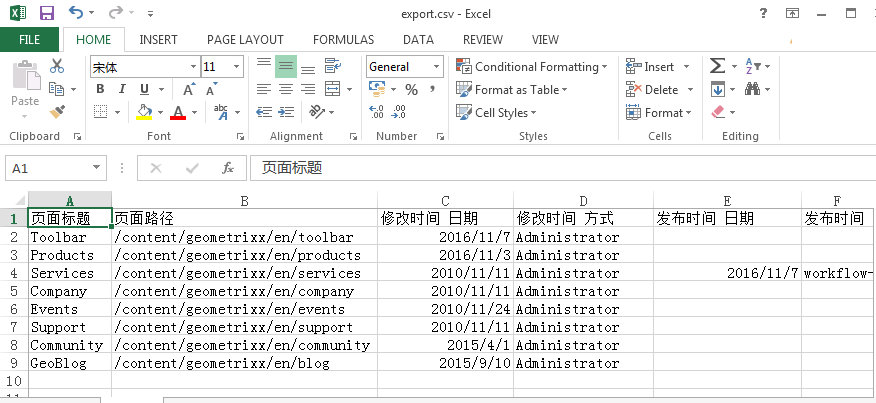
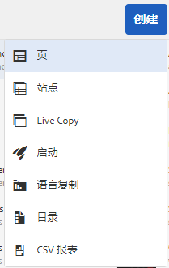
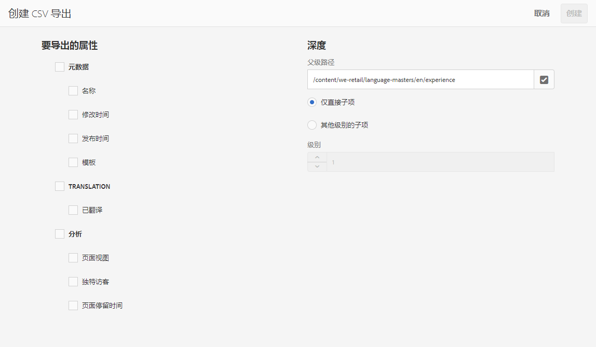

# 导出到 CSV{#export-to-csv}

**创建 CSV 导出**&#x200B;允许您将页面的相关信息导出到本地系统上的 CSV 文件。

* 所下载的文件名为 `export.csv`
* 其内容取决于您选择的属性。
* 您可以定义导出的路径以及深度。

>[!NOTE]
>
>系统将使用您浏览器的下载功能及默认目标位置。

创建 CSV 导出向导允许您选择以下内容：

* 要导出的属性

   * 元数据

      * 修改时间
      * 发布时间
   * 分析

      * 页面查看次数
      * 独特访客
      * 页面停留时间

* 深度

   * 父级路径
   * 仅直接子项
   * 其他级别的子项
   * 级别

生成的 `export.csv` 文件可以用 Excel 或任何其他兼容的应用程序打开。

在浏览&#x200B;**站点**&#x200B;控制台时，可以使用创建&#x200B;**CSV导出**&#x200B;选项(在列表视图下):它是&#x200B;**创建**&#x200B;下拉菜单的选项：

要创建 CSV 导出，请执行以下操作：

1. 必要时，打开&#x200B;**站点**&#x200B;控制台并导航到所需的位置。
1. 在工具栏中，选择&#x200B;**创建**，然后选择&#x200B;**CSV导出**&#x200B;以打开向导：

   

1. 选择需要导出的属性。
1. 选择&#x200B;**创建**。

