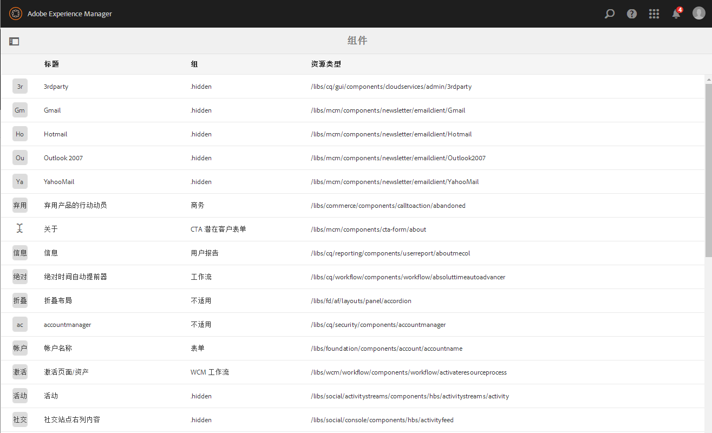
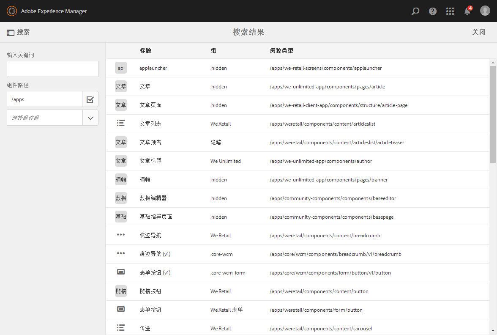
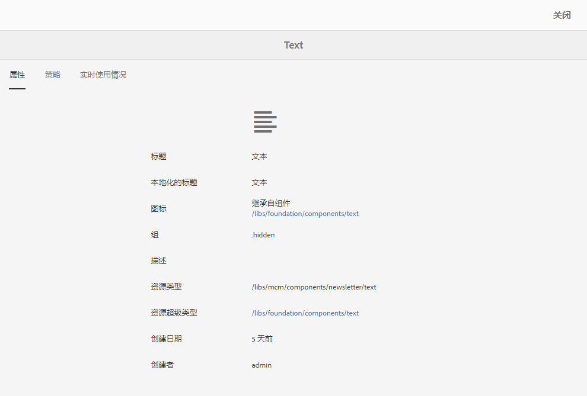
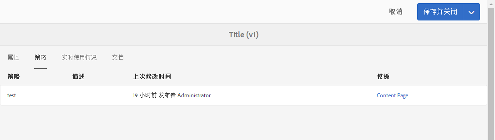
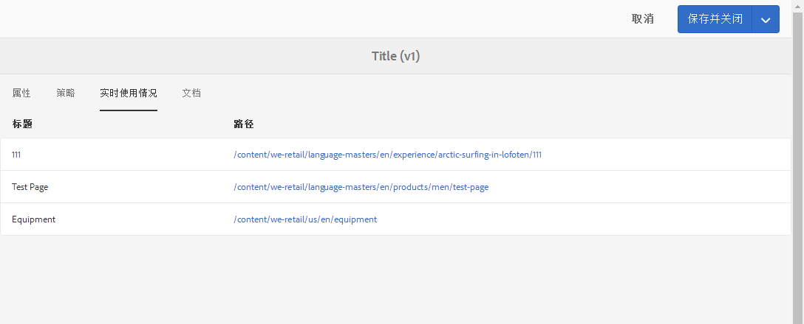

# 组件控制台{#components-console}

组件控制台允许您浏览针对实例定义的所有组件，并查看每个组件的关键信息。

It can be accessed from **Tools** -> **General** -> **Components**. 在控制台中，卡片视图和列表视图均可用。 由于组件没有树结构，因此列视图不可用。

>[!NOTE]
>
>组件控制台显示系统中的所有组件。[组件浏览器](/help/sites-authoring/author-environment-tools.md#components-browser)显示可用于创作的组件，并隐藏任何以句点 (`.`) 开头的组件组。

## 搜索 {#search-features}

通过&#x200B;**仅限内容**&#x200B;图标（左上方），您可以打开&#x200B;**搜索**&#x200B;面板以搜索和/或筛选组件：

## 组件详细信息 {#component-details}

要查看有关特定组件的详细信息，请点按/单击所需的资源。三个选项卡提供以下内容：

* **属性**

   

   在“属性”选项卡上，您可以：

   * 查看组件的常规属性。
   * 查看组件的[图标或缩写定义](/help/sites-developing/components-basics.md#component-icon-in-touch-ui)的方式。

      * 单击图标的源将转到该组件。
   * 查看组件的&#x200B;**资源类型**&#x200B;和&#x200B;**资源超级类型**（如果定义）。

      * 单击“资源超级类型”将转到该组件。
   >[!NOTE]
   >
   >由于 `/apps` 在运行时不可编辑，因此组件控制台为只读。

* **策略**

   

* **实时使用情况**

   

   >[!CAUTION]
   >
   >由于为此视图收集的信息的性质所致，它可能需要一段时间才能进行整理/显示。

* **文档**

   如果开发人员提供了[组件相关文档](/help/sites-developing/developing-components.md#documenting-your-component)，则该文档将会显示在&#x200B;**文档**&#x200B;选项卡中。如果没有可用文档，则不会显示&#x200B;**文档**&#x200B;选项卡。

   

