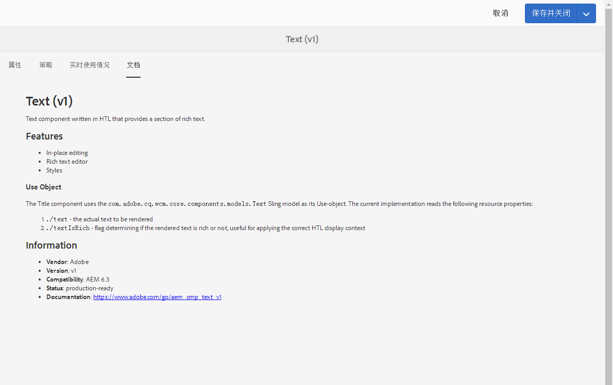

# 组件控制台{#components-console}

>[!CAUTION]
>
>AEM 6.4已结束扩展支持，本文档将不再更新。 有关更多详细信息，请参阅 [技术支助期](https://helpx.adobe.com/cn/support/programs/eol-matrix.html). 查找支持的版本 [此处](https://experienceleague.adobe.com/docs/).

组件控制台允许您浏览为实例定义的所有组件，并查看每个组件的关键信息。

可从 **工具** -> **常规** -> **组件**. 在控制台中，卡片视图和列表视图均可用。 由于组件没有树结构，因此列视图不可用。

>[!NOTE]
>
>组件控制台显示系统中的所有组件。 [组件浏览器](/help/sites-authoring/author-environment-tools.md#components-browser)显示可用于创作的组件，并隐藏任何以句点 (`.`) 开头的组件组。

## 搜索 {#search-features}

通过&#x200B;**仅限内容**&#x200B;图标（左上方），您可以打开&#x200B;**搜索**&#x200B;面板以搜索和/或筛选组件：

## 组件详细信息 {#component-details}

要查看有关特定组件的详细信息，请点按/单击所需的资源。 提供了三个选项卡：

* **属性**

   

   在“属性”选项卡上，您可以：

   * 查看组件的常规属性。
   * 查看 [图标或缩写已定义](/help/sites-developing/components-basics.md#component-icon-in-touch-ui) 的子菜单。

      * 单击图标的源将会转到该组件。
   * 查看 **资源类型** 和 **资源超类型** （如果已定义）。

      * 单击资源超级类型会将您转到该组件。
   >[!NOTE]
   >
   >由于 `/apps` 在运行时不可编辑，因此组件控制台为只读。

* **策略**

   

* **实时使用情况**

   

   >[!CAUTION]
   >
   >由于为此视图收集的信息的性质所致，它可能需要一段时间才能进行整理/显示。

* **文档**

   如果开发人员已提供 [组件文档](/help/sites-developing/developing-components.md#documenting-your-component)，它将显示在 **文档** 选项卡。 如果没有可用文档，则不会显示&#x200B;**文档**&#x200B;选项卡。

   
