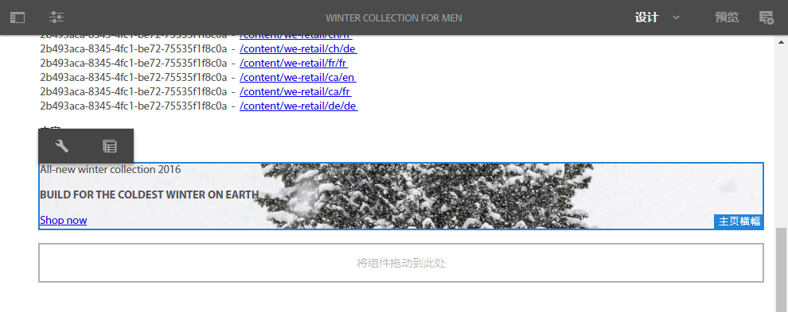
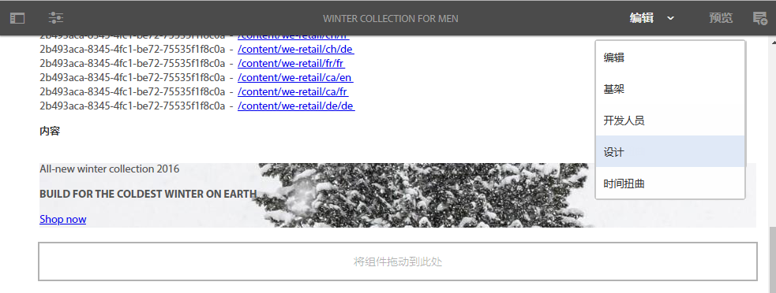
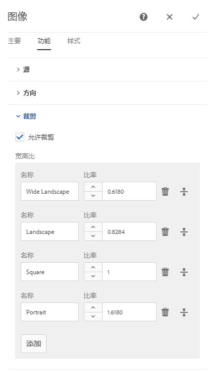

# 在设计模式下配置组件{#configuring-components-in-design-mode}

>[!CAUTION]
>
>AEM 6.4已结束扩展支持，本文档将不再更新。 有关更多详细信息，请参阅 [技术支助期](https://helpx.adobe.com/cn/support/programs/eol-matrix.html). 查找支持的版本 [此处](https://experienceleague.adobe.com/docs/).

当开箱即用安装AEM实例时，组件浏览器中会立即提供一系列组件。

除了这些组件之外，还提供了各种其他组件。 您可以使用设计模式来 [启用/禁用此类组件](#enable-disable-components). 在页面上启用并找到该组件后，您可以使用设计模式 [配置组件设计的方面](#configuring-the-design-of-a-component) 编辑属性参数。

>[!NOTE]
>
>编辑这些组件时必须小心。 设计设置通常是整个网站设计中不可缺少的部分，因此只应由具有相应权限和经验的人更改设置，通常是管理员或开发人员。 请参阅 [开发组件](/help/sites-developing/components.md) 以了解更多信息。

>[!NOTE]
>
>设计模式仅适用于静态模板。 使用可编辑模板创建的模板，应使用 [模板编辑器](/help/sites-authoring/templates.md).

>[!NOTE]
>
>设计模式仅适用于存储为( `/etc`)。
>
>从AEM 6.4开始，建议将设计作为配置数据存储在 `/apps` 支持连续部署方案。 存储在 `/apps` 在运行时不可编辑，并且此类模板的非管理员用户将无法使用“设计”模式。

这包括添加或删除在页面的段落系统中允许使用的组件。 段落系统( `parsys`)是包含所有其他段落组件的复合组件。 段落系统允许作者向页面中添加不同类型的组件，因为它包含所有其他段落组件。 每个段落类型都表示为一个组件。

例如，产品页面的内容可能包含具有以下内容的段落系统：

* 产品的图像（以图像或文本时间段的形式）
* 产品描述（作为文本段落）
* 具有技术数据的表（作为表段落）
* 用户填写的表单（在表单开始、表单元素和表单结束段落时）

>[!NOTE]
>
>请参阅 [开发组件](/help/sites-developing/components.md) 和 [模板和组件的使用准则](/help/sites-developing/dev-guidelines-bestpractices.md#guidelines-for-using-templates-and-components) 有关 `parsys`.

>[!CAUTION]
>
>使用设计模式编辑设计（如本文所述）是定义静态模板设计的推荐方法
>
>例如，在CRX DE中修改设计不是最佳做法，此类设计的应用可能会因预期行为而异。 请参阅开发人员文档 [页面模板 — 静态](/help/sites-developing/page-templates-static.md#how-template-designs-are-applied) 以了解更多信息。

## 启用/禁用组件 {#enable-disable-components}

启用或禁用组件：

1. 选择 **设计** 模式。

   

1. 点按或单击组件。 选择组件后，该组件将显示蓝色边框。

   

1. 单击或点按 **父项** 图标。

   

   这将选择包含当前组件的段落系统。

1. 的 **配置** 段落系统的图标将显示在父项的操作栏中。

   

   选择此选项可显示对话框。

1. 使用对话框定义编辑当前页面时组件浏览器中可用的组件。

   

   该对话框包含两个选项卡：

   * 允许的组件
   * 设置

   **允许的组件**

   在 **允许的组件** 选项卡，可定义可用于parsys的组件。

   * 这些组件按其组件组进行分组，这些组件组可以展开和折叠。
   * 通过勾选组名称可以选择整个组，通过取消选中可取消选择所有组。
   * 减号表示至少选择了组中的一个项目，但并非选择了组中的所有项目。
   * 可通过搜索按名称筛选组件。
   * 无论是否应用了过滤器，组件组名称右侧列出的数字都表示这些组中选定组件的总数。

   您可以为每个页面组件定义配置。 如果子页面使用相同的模板和/或页面组件（通常一致），则相同的配置将应用于相应的段落系统。

   >[!NOTE]
   >
   >自适应表单组件可在自适应表单容器内使用，以利用Forms生态系统。 因此，这些组件必须仅在自适应表单编辑器中使用，并且无法在站点页面编辑器中正常使用。

   **设置**

   在 **设置** 选项卡，您可以定义其他选项，例如为每个组件绘制锚点，以及定义每个容器的单元格边距。

1. 选择 **完成** 以保存配置。

## 配置组件的设计 {#configuring-the-design-of-a-component}

1. 选择 **设计** 模式。

   

1. 点按或单击具有蓝色边框的组件。 在此示例中，选择了主页图像组件。

   

1. 使用 **配置** 图标以打开对话框。

   

   在设计对话框中，您可以根据可用的设计参数配置组件。

   

   该对话框包含三个选项卡：

   * 主要
   * 功能
   * 样式

   **属性**

   的 **属性** 选项卡，用于配置组件的重要设计参数。 例如，对于图像组件，您可以定义允许的图像最大大小和最小大小。

   **功能**

   的 **功能** 选项卡，用于启用或禁用组件的其他功能。 例如，对于图像组件，您可以定义图像的方向、可用的裁剪选项以及是否可以上传图像。

   **样式**

   的 **样式** 选项卡，用于定义要与组件一起使用的CSS类和样式。

   

   使用 **添加** 按钮向多条目对话框列表添加其他条目。

   

   使用**删除**图标可从多条目对话框列表中删除条目。

   

   使用 **移动** 图标，以重新排列多条目对话框列表中条目的顺序。

   

1. 单击或点按 **完成** 图标以保存并关闭对话框。
