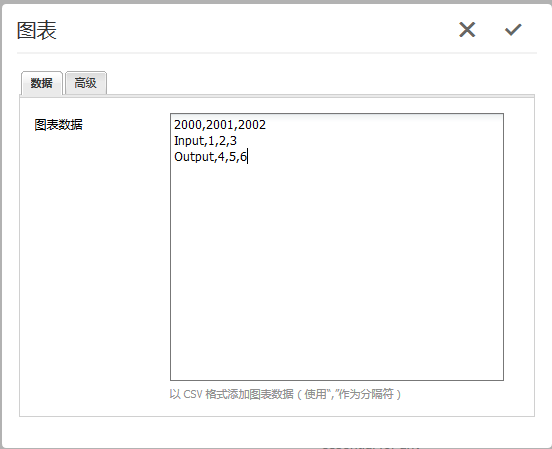
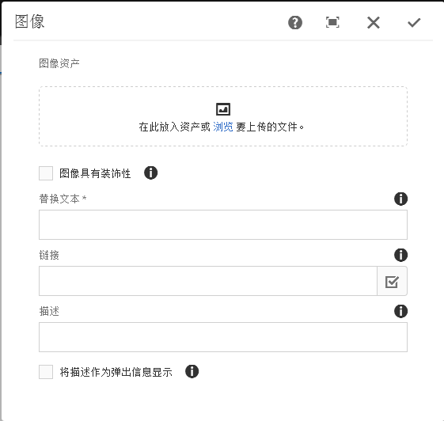
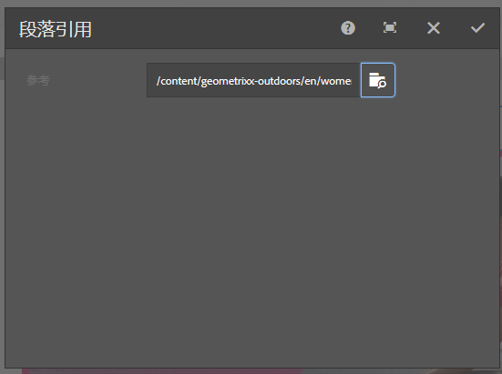
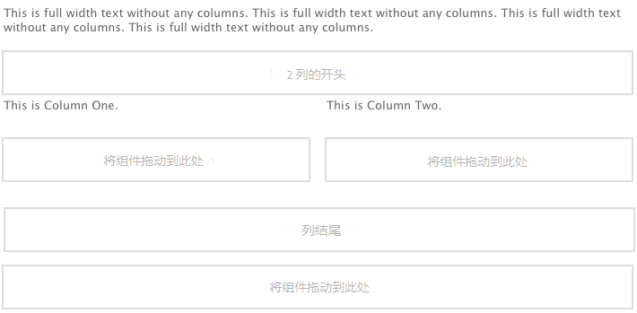
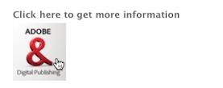

# 基础组件{#foundation-components}

>[!CAUTION]
>
>AEM 6.4已结束扩展支持，本文档将不再更新。 有关更多详细信息，请参阅 [技术支助期](https://helpx.adobe.com/cn/support/programs/eol-matrix.html). 查找支持的版本 [此处](https://experienceleague.adobe.com/docs/).

>[!NOTE]
>
>此部分介绍基础组件，这些组件已在AEM的许多版本中提供，并可在标准AEM安装中现成使用。 但是，AEM 6.4中已弃用许多基础组件。
>
>Adobe建议利用更现代、可扩展的 [核心组件](https://helpx.adobe.com/experience-manager/core-components/using/authoring.html). 这些是 [We.Retail示例内容](/help/sites-developing/we-retail.md) 也可以 [独立安装及用于开发](https://helpx.adobe.com/experience-manager/core-components/using/using.html) 由您的管理员。

基础组件旨在用于为标准网页创作内容。 它们构成了可用于标准安装AEM的现成组件的子集。

有些组件可通过组件浏览器立即使用，而其他各种组件也可使用 [设计模式](/help/sites-authoring/default-components-designmode.md) （如果页面基于静态模板）或 [编辑模板](/help/sites-authoring/templates.md) （如果页面基于可编辑的模板）。

基础组件的使用受支持，但已被核心组件取代，这些组件提供了更大的可扩展性和灵活性。

>[!NOTE]
>
>本节仅讨论标准AEM安装中现成可用的组件。
>
>根据您的实例，您可能具有明确根据您的要求开发的自定义组件。 这些组件甚至可能与此处讨论的某些组件具有相同的名称。

组件在 **组件** 页面编辑器侧面板的选项卡 [编辑页面](/help/sites-authoring/editing-content.md).

您可以选择组件并将其拖动到页面上的所需位置。 然后，您可以使用以下方式编辑该组件：

* [配置属性](/help/sites-authoring/editing-page-properties.md)
* [编辑内容](/help/sites-authoring/editing-content.md)
* [编辑内容 – 全屏模式](/help/sites-authoring/editing-content.md#edit-content-full-screen-mode)

组件按称为组件组的各种类别进行排序，包括：

* [常规](#general):包括基本组件，包括文本、图像、表和图表。
* [列](#columns):包括组织内容布局所需的组件。
* [表单](#form):包括创建表单所需的所有组件。

## 常规 {#general}

常规组件是用于创建内容的基本组件。

### 帐户项 {#account-item}

>[!CAUTION]
>此基础组件已弃用。 Adobe建议利用 [核心组件](https://experienceleague.adobe.com/docs/experience-manager-core-components/using/introduction.html?lang=zh-Hans) 中。

您可以定义包含标题和描述的链接。


### 自适应图像 {#adaptive-image}

>[!CAUTION]
>此基础组件已弃用。 Adobe建议利用 [核心组件图像组件](https://experienceleague.adobe.com/docs/experience-manager-core-components/using/components/image.html) 中。

自适应图像基础组件会生成一些图像，这些图像的大小适合网页打开时所在的窗口。 要使用组件，请从文件系统或DAM提供图像资源。 打开网页时，Web浏览器会下载已调整大小的图像副本，以便该副本适合当前窗口。

以下特征可确定窗口的大小：

* 设备屏幕：移动设备通常会显示网页，以便它们可以跨整个屏幕进行扩展。
* Web浏览器窗口大小：笔记本电脑和台式计算机的用户可以调整Web浏览器窗口的大小。

例如，当在手机上打开网页时，组件会生成一个小图像，而在平板电脑上打开一个中等大小的图像。 在笔记本电脑上，当页面在最大化的Web浏览器中打开时，组件会创建并交付大图像。 当Web浏览器的大小调整为适合屏幕的一部分时，组件会根据自身的需要来提供较小的图像并刷新视图。

#### 支持的图像格式 {#supported-image-formats}

您可以在自适应图像组件中使用以下文件扩展名的图像文件：

* .jpg
* .jpeg
* .png
* .gif &amp;ast;&amp;ast;

>[!CAUTION]
>
>&amp;ast;&amp;ast;AEM不支持.gif动画文件进行自适应呈现。

#### 图像大小和质量 {#images-sizes-and-quality}

下表列出了为给定视区宽度生成的图像的宽度。 将计算生成图像的高度以保持恒定的宽高比，并且图像边缘内部不会出现空白。 可使用裁剪来避免出现空格。

当图像是JPEG图像时，视区大小也会影响JPEG质量。 可以具备以下JPEG质量：

* 低(0.42)
* 中(0.82)
* 高(1.00)

| 视区宽度范围（像素） | 图像宽度（像素） | JPEG 质量 | 目标设备类型 |
|---|---|---|---|
| 宽度&lt;= 319 | 320 | 低 |  |
| 宽度= 320 | 320 | 中 | 手机（纵向） |
| 320 &lt;宽度&lt; 481 | 480 | 中 | 手机（横向） |
| 480 &lt;宽度&lt; 769 | 476 | 高 | 平板电脑（纵向） |
| 768 &lt;宽度&lt; 1025 | 620 | 高 | 平板电脑（横向） |
| 宽度&lt;= 1025 | 完全（原始大小） | 高 | 桌面 |

#### 属性 {#properties}

利用对话框，可编辑自适应图像组件实例的属性，其中许多属性与其所基于的图像组件通用。 这些属性位于两个选项卡中：

* **图像**

   * **图像**

      从内容查找器中拖动图像，或单击以打开一个浏览窗口，您可以在该窗口中加载图像。 加载图像后，您可以裁剪、旋转或删除图像。 要放大和缩小图像，请使用图像下方的滑条（在“确定”和“取消”按钮上方）

   * **裁剪**

      裁剪图像。 拖动边框以裁剪图像。

   * **旋转**

      重复单击“旋转”，直到图像旋转到所需位置。

   * **清除**
删除当前图像。

* **高级**

   * **标题**

      自适应图像组件不使用此属性。

   * **替换文本**

      用于图像的替换文本。

   * **链接到**

      自适应图像组件不使用此属性。

   * **描述**

      自适应图像组件不使用此属性。

#### 扩展自适应图像组件 {#extending-the-adaptive-image-component}

有关自定义自适应图像组件的信息，请参阅 [了解自适应图像组件](/help/sites-developing/responsive.md#using-adaptive-images).

### 轮盘 {#carousel}

轮播组件允许您显示与各个页面关联的图像：

* 一次一个
* 很短的时间
* 按您指定的顺序
* 具有您指定的

可单击控件还允许用户根据需要实时循环查看显示的页面。 单击当前可见的页面图像即会转到该页面。 换言之，轮播可充当导航控件。

#### 属性 {#properties-1}

这些选项可在两个选项卡中使用：

* **轮盘**

   在此，您可以指定轮播的操作方式：

   * 播放速度

      显示下一张幻灯片之前的时间（以毫秒为单位）。

   * 过渡时间

      两张幻灯片之间过渡的时间（以毫秒为单位）。

   * 控件样式

      下拉菜单提供各种选项；例如，“上一个”/“下一个”按钮、“右上”开关。

* **列表**

   在此，您可以指定页面在轮播中的包含方式：

   * **生成列表对象**

      生成页面列表的方法有多种：“子页面”、“固定列表”、“搜索”或“高级搜索”（全部如下所述）。

      请注意，无论选择哪种方法，列表中包含的页面都应该已经有一个与页面关联的图像，该图像将显示在轮播中。 如果给定页面的“页面属性”下没有该页面的图像，则应该在开始之前将图像与页面相关联，否则传送将显示空白（或大部分为空白）页面。 请参阅 [编辑页面属性](/help/sites-authoring/editing-page-properties.md).

      根据您选择的项目，将显示一个新面板：

      * **子页面选项**

         * **父页面**
手动或使用选择器指定路径。 将留空，以使用当前页面作为父页面。
      * **固定列表选项**

         * **页面**
选择页面列表。 使用 
`+` 添加更多条目，并使用向上/向下按钮调整顺序。
      * **搜索选项**

         * **开始**

            手动或使用选择器输入起始路径。

         * **搜索查询**

            您可以输入纯文本搜索查询。
      * **高级搜索选项**

         * **QueryBuilder 谓词记号**

            您可以使用QueryBuilder谓词记号输入搜索查询。 例如，您可以输入“fulltext=Marketing”，以使内容中具有“Marketing”的所有页面都显示在轮播中。

            请参阅 [QueryBuilder API](/help/sites-developing/querybuilder-api.md) ，以了解有关查询表达式和更多示例的完整讨论。
   * **排序依据**

      选择 `jcr:title`, `jcr:created`, `cq:lastModified`或 `cq:template` 下拉菜单中。

   * **限制**

      您希望在轮播中使用的最大项目数；这是可选的。


>[!NOTE]
>
>您可以为Adobe Experience Manager创建一个自定义轮播组件，以显示位于AEM DAM中的数字资产。 有关信息，请参阅 [为Adobe Experience Manager创建自定义轮播组件](https://helpx.adobe.com/experience-manager/using/custom-carousel-components.html).

### 图表 {#chart}

图表组件允许您添加条形图、折线图或饼图。 AEM会根据您提供的数据创建一个图表。 您可以通过直接在“数据”选项卡中键入内容或通过复制和粘贴电子表格来提供数据。

* **数据**

   * **图表数据**

      使用CSV格式输入图表数据；逗号分隔值格式使用逗号(&quot;,&quot;)作为字段分隔符。

* **高级**

   * **图表类型**

      从饼图、折线图和条形图中选择。

   * **替换文本**

      显示的替换文本，而不是图表。

   * **宽度**

      图表的宽度（以像素为单位）。

   * **高度**

      图表的高度（以像素为单位）。

下面显示了图表数据的示例，后跟生成的条形图：

 

>[!NOTE]
>
>您可以创建一个自定义AEM图表控件，以显示位于AEM JCR中的数据。 有关信息，请参阅 [在图表中显示Adobe Experience Manager数据](https://helpx.adobe.com/experience-manager/using/displaying-experience-manager-data-chart.html).

### 内容片段 {#content-fragment}

[内容片段](/help/sites-authoring/content-fragments.md) 作为独立于页面的资产创建和管理。 您随后可以在创作内容页面时使用这些片段及其变体。

### 设计导入程序 {#design-importer}

这允许您上传包含设计包的zip文件。

### 下载 {#download}

下载组件会在选定的网页上创建一个链接以下载特定文件。 您可以从内容查找器中拖动资产，或上传文件。

* **下载**

   * **描述**

      随下载链接一起显示的简短描述。

   * **文件**

      可在生成的网页上下载的文件。 从内容查找器中拖动资产或单击相应区域以上传可供下载的文件。

以下示例显示了下载组件在Geometrixx中的显示：


### 外部 {#external}

外部应用程序集成组件(**外部**)允许您使用iframe将外部应用程序嵌入到AEM页面。

* **外部**

   * **目标应用程序**

      指定要集成的Web应用程序的URL;例如：

      ```
      https://en.wikipedia.org/wiki/Main_Page
      ```

   * **传递参数**

      根据需要选中要传递到应用程序的参数复选框。

   * **宽度和高度**

      定义iframe的大小

将外部应用程序整合到AEM页面的段落系统中；例如，在使用 `https://en.wikipedia.org/wiki/Main_Page`:


>[!NOTE]
>
>根据您的用例，还有其他选项可用于外部应用程序的集成，例如。 the [Portlet的集成](/help/sites-administering/aem-as-portal.md).

### 闪光灯 {#flash}

>[!CAUTION]
>此基础组件已弃用。 Adobe建议利用 [核心组件](https://experienceleague.adobe.com/docs/experience-manager-core-components/using/introduction.html?lang=zh-Hans) 中。

>[!CAUTION]
>
>如果没有进行广泛的项目级别自定义，此组件将不再能够开箱即用运行。

Flash组件允许您加载Flash影片。 您可以将Flash资产从内容查找器拖动到组件上，也可以使用对话框：

* **闪光灯**

   * **Flash 影片**

      Flash影片文件。 从内容查找器中拖动资产，或单击以打开浏览窗口。

   * **大小**

      Dimension（以包含影片的显示区域的像素为单位）。

* **备用图像**

   要显示的替代图像

* **高级**

   * **上下文菜单**

      指示应显示还是隐藏上下文菜单。

   * **窗口模式**

      窗口的显示方式，例如不透明、透明或作为非重复（实体）窗口。

   * **背景颜色**

      从提供的颜色图表中选择的背景颜色。

   * **最低版本**

      运行影片所需的最低AdobeFlash Player版本。 默认值为9.0.0。

   * **属性**

      需要任何其他属性。

### 图像 {#image}

图像组件会根据指定的参数显示图像和随附文本。

您可以上传图像，然后对其进行编辑和处理（例如，裁剪、旋转、添加链接/标题/文本）。

您可以从 [资产浏览器](/help/sites-authoring/author-environment-tools.md#assets-browser) 直接放到组件或其 [“配置”对话框](/help/sites-authoring/editing-content.md#component-edit-dialog). 您还可以从“配置”对话框上传图像；此对话框还控制图像的所有定义和操作：



上传图像后（而不是之前），您可以使用 [就地编辑](/help/sites-authoring/editing-content.md#edit-content) 要根据需要裁剪/旋转图像，请执行以下操作：


>[!NOTE]
>
>就地编辑器在编辑时使用图像的原始大小和宽高比。 您还可以指定高度和宽度属性。 在保存编辑更改时，将应用属性中定义的任何大小和宽高比限制。
>
>根据您的实例，可能还会对 [页面设计](/help/sites-developing/designer.md);这些是在项目实施期间制定的。

在全屏编辑模式下，还有其他几个选项可供使用；例如，映射和缩放：


>[!NOTE]
>
>无法使用Internet Explorer监控上传进度。
>
>Internet Explorer用户需要上传图像并单击 **确定** 然后，重新打开图像，以在预览中查看已上传的文件，并能够执行修改（即裁剪）。
>
>请参阅 [支持的平台](/help/release-notes/release-notes.md#supported-platforms) 部分以了解有关AEM使用的HTML5功能的更多信息。

加载图像后，您可以配置以下内容：

* **地图**

   要映射图像，请选择“映射”。 您可以指定创建图像映射的方式（矩形、多边形等）以及区域应指向的位置。

* **裁剪**

   选择“裁剪”以裁剪图像。 使用鼠标裁剪图像。

* **旋转**

   要旋转图像，请选择“旋转”。 反复使用，直到图像旋转到您想要的方式为止。

* **清除**

   删除当前图像。

* **标题**

   图像的标题。

* **替换文本**

   用于创建辅助内容时使用的替换文本。

* **链接到**

   创建指向资产或您网站中其他页面的链接。

* **描述**

   图像的描述。

* **大小**

   设置图像的高度和宽度。

>[!NOTE]
>
>某些选项仅在全屏编辑器中可用。

最终图像( **标题** 和 **描述**)可能显示为：


### 布局容器 {#layout-container}

此组件提供了一个网格段落系统，允许您在 [响应式网格](/help/sites-authoring/responsive-layout.md). 这允许您根据目标设备（包括一系列手机、平板电脑和台式机）的宽度来定义不同的内容布局。


>[!NOTE]
>
>此组件已通过 [HTML模板语言(HTL)](https://helpx.adobe.com/experience-manager/htl/user-guide.html).

### 列表 {#list}

列表组件允许您配置用于显示列表的搜索条件：

* **列表**

   * **生成列表对象**

      在此，您可以指定列表将检索其内容的位置。 有以下几种方法：

   * 根据您选择的项目，将显示一个新面板：

      * **子页面选项**

         * **子项** （父页面）

            手动或使用选择器指定路径。 将留空，以使用当前页面作为父页面。
      * **固定列表选项**

         * **页面**

            选择页面列表。 使用+添加更多条目，然后使用向上/向下按钮调整顺序。
      * **搜索选项**

         * **开始**

            手动或使用选择器输入起始路径。

         * **搜索查询**

            您可以输入纯文本搜索查询。
      * **高级搜索选项**

         * **QueryBuilder 谓词记号**

            您可以使用QueryBuilder谓词记号输入搜索查询。 例如，您可以输入“fulltext=Marketing”，以使内容中具有“Marketing”的所有页面都显示在轮播中。

            请参阅 [QueryBuilder API](/help/sites-developing/querybuilder-api.md) ，以了解有关查询表达式和更多示例的完整讨论。
      * **标记**

         指定 **父页面**, **标记/关键词** 和所需的匹配条件。
   * **显示方式**

      您希望如何列出项目；包括链接、Teaser和新闻。

   * **排序依据**

      是否对列表进行排序，如果排序，则使用标准进行排序。 您可以输入标准或从提供的下拉列表中选择一个标准。

   * **限制**

      指定您希望在列表中显示的最大项目数。

   * **启用信息源**

      指示是否应为列表激活RSS馈送。

   * **每页显示条目数**

      您可以在此处指定一次要显示的列表项目数。 项目多于指定数量的列表将使用分页来按多个部分显示列表。


以下示例显示了 **列表** 组件显示子页面列表的方式（设计由网站设计的自定义CSS定义控制）。


### 登录 {#login}

>[!CAUTION]
>此基础组件已弃用。 Adobe建议利用 [核心组件](https://experienceleague.adobe.com/docs/experience-manager-core-components/using/introduction.html?lang=zh-Hans) 中。

>[!CAUTION]
>
>如果没有进行广泛的项目级别自定义，此组件将不再能够开箱即用运行。

这些字段提供“用户名”和“密码”字段。


您可以配置：

* 登录

   * 区域标签

      输入字段的导入文本。

   * 用户名标签

      用于标记用户名字段的文本。

   * 密码标签

      用于标记密码字段的文本。

   * “登录”按钮标签

      登录按钮的文本。

   * 重定向到

      您可以在网站上指定用户登录后应打开的页面。

* 已登录

   * “继续”按钮标签

      用于指示用户已登录的文本。

### 订单状态 {#order-status}

>[!CAUTION]
>
>如果没有进行广泛的项目级别自定义，此组件将不再能够开箱即用运行。

* **标题**

   * **标题**

      指定要显示的标题文本。

   * **链接**

      指定应显示订单状态的页面（产品）。

   * **类型/大小**

      从提供的选择中进行选择。


### 引用 {#reference}

的 **参考** 组件允许您从AEM网站的其他页面引用文本（在当前实例中）。 引用段落的内容随后会像在当前页面上一样显示。 当源段落发生更改时，内容将会更新（可能需要刷新页面）。

* **段落引用**

   * **引用**

      指定要引用的页面和段落的路径（包括内容）。

要指定段落的路径，您需要在路径（页面）的后缀中添加：

`.../jcr:content/par/<paragraph-ID>`

例如：

`/content/geometrixx-outdoors/en/equipment/biking/cajamara/jcr:content/par/similar-products`

除了引用特定段落之外，还可以修改路径以指定整个段落系统。 为此，您可以在路径后面附加以下后缀：

`/jcr:content/par`

例如：

`/content/geometrixx-outdoors/en/equipment/biking/cajamara/jcr:content/par`

配置完毕后，内容将完全像在源页面上一样显示。 只有在打开组件进行编辑时，才会看到它是引用：



### 搜索 {#search-features}

>[!CAUTION]
>此基础组件已弃用。 Adobe建议利用 [快速搜索核心组件](https://experienceleague.adobe.com/docs/experience-manager-core-components/using/components/quick-search.html) 中。

搜索组件会将搜索功能添加到您的页面。

您可以配置：

* 搜索

   * **节点类型**

      如果搜索限制为特定的节点类型，请在此处列出它们；例如， `cq:Page`.

   * **搜索路径**

      指定要搜索的分支的根页面。

   * **搜索按钮文本**

      实际搜索按钮上显示的名称。

   * **统计文本**

      搜索结果上方显示的文本。

   * **无结果文本**

      如果没有结果，则显示在此处输入的文本。

   * **拼写检查文本**

      如果某人输入了类似的术语，则此文本将显示在该术语之前。

      例如，如果键入geometrixxe，则系统会显示“您是说？ geometrixx”。

   * **相似页面文本**

      类似页面的结果旁边显示的文本。 单击此链接可查看具有相似内容的页面。

   * **相关搜索文本**

      在搜索相关术语和主题旁边显示的文本。

   * **搜索趋势文本**

      用户输入的搜索词上方的标题。

   * **结果页面标签**

      此列表底部显示的文本，其中包含指向其他结果页面的链接。

   * **上一标签**

      指向先前搜索页面的链接上显示的名称。

   * **下一个标签**

      指向后续搜索页面的链接上显示的名称。

以下示例显示搜索单词后的“搜索”组件 *geometrixx* 从标准安装的根目录中。 此外，还说明了结果的分页：


以下示例显示了一个拼写错误且不可用的搜索词：


### Sitemap {#sitemap}

>[!CAUTION]
>此基础组件已弃用。 Adobe建议利用 [导航](https://experienceleague.adobe.com/docs/experience-manager-core-components/using/components/navigation.html), [语言导航](https://experienceleague.adobe.com/docs/experience-manager-core-components/using/components/language-navigation.html)和 [痕迹导航核心组件](https://experienceleague.adobe.com/docs/experience-manager-core-components/using/components/breadcrumb.html) 中。

自动站点地图列表，该列表（具有默认设置）列出了当前网站中的所有页面（作为活动链接）。 例如，提取内容显示：


如果需要，您可以配置：

* **Sitemap**

   * **根路径**

      列表开始的路径。

### 幻灯片放映 {#slideshow}

>[!CAUTION]
>此基础组件已弃用。 Adobe建议利用 [轮播核心组件](https://experienceleague.adobe.com/docs/experience-manager-core-components/using/components/carousel.html) 中。

>[!CAUTION]
>
>如果没有进行广泛的项目级别自定义，此组件将不再能够开箱即用运行。

此组件允许您加载一系列图像以在页面上以幻灯片形式显示。您可以添加或删除图像并为每个图像分配一个标题。 在“高级”(Advanced)下，您还可以指定显示区域的大小。

您可以配置：

* **幻灯片**

   * **新幻灯片**

      您可以使用 **添加** (和 **删除**)按钮。

   * **标题**

      根据需要指定标题。 该内容会覆盖在相应的幻灯片上。

* **高级**

   * **大小**

      以像素为单位指定宽度和高度。

然后，幻灯片放映组件会在较短的时间内按顺序重复显示每个幻灯片，然后淡入下一张幻灯片：


### 表 {#table}

>[!CAUTION]
>此基础组件已弃用。 Adobe建议利用 [文本核心组件](https://experienceleague.adobe.com/docs/experience-manager-core-components/using/components/text.html) 中。

>[!NOTE]
>
>的 **表** 组件基于 [富文本编辑器](/help/sites-authoring/rich-text-editor.md)，与 **[文本](#text)** 组件。
>
>建议使用 **表** 组件，但也可以使用 **文本** 组件。

的 **表** 组件已进行预配置，允许您构建、填充和设置表格式。 使用对话框，您可以配置表并通过以下任一方式创建内容：

* 从头开始
* 从外部编辑器（如Excel、OpenOffice、记事本等）复制和粘贴电子表格或表格。

您可以使用内嵌编辑器对内容进行基本更改：


在全屏模式下，您可以配置表布局：


以下屏幕截图显示了表组件示例；设计由特定于站点的CSS决定：


### 标记云 {#tag-cloud}

标记云以图形方式显示了应用于您网站内容的标记选项：


配置标记云组件时，您可以指定：

* **要显示的标记**

   从中收集要显示的标记的位置。 从包含所有子项或所有标记的页面中进行选择。

* **页面**

   选择要引用的页面。

* **标记上无链接**

   显示的标记是否应用作链接。

有关应用标记的更多信息，请访问 [使用标记](/help/sites-authoring/tags.md).

### 文本 {#text}

>[!NOTE]
>
>的 **文本** 组件基于 [富文本编辑器](/help/sites-authoring/rich-text-editor.md)，与 **[表](#table)** 组件。
>
>建议使用 **表** 组件，但也可以使用 **文本** 组件。

文本组件允许您使用所见即所得(WYSIWYG)编辑器输入文本块，该编辑器的功能由 [富文本编辑器](/help/sites-authoring/rich-text-editor.md). 利用精选的图标，可设置文本格式，包括字体特性、对齐方式、链接、列表和缩进。


当您打开 **配置** 对话框中，您还可以设置：

* **分隔条**
* **文本样式**

格式化的文本随后将显示在页面上；实际设计将取决于网站CSS:


有关文本组件和富文本编辑器提供的功能的更多详细信息，请参阅 [富文本编辑器](/help/sites-authoring/rich-text-editor.md) 页面。

#### 就地编辑 {#inplace-editing}

除了基于对话框的富文本编辑模式之外，AEM还提供 [就地编辑](/help/sites-authoring/editing-content.md)，当文本在页面布局中显示时，允许直接编辑文本。

### 文本与图像 {#text-image}

文本和图像组件可添加文本块和图像。 您还可以单独添加和编辑文本和图像。 请参阅 [文本](#text) 和 [图像](#image) 组件以了解详细信息。


您可以配置：

* **组件样式** (**样式**)

   在这里，您可以左对齐或右对齐图像。 默认值为 **左** 对齐，与左侧的图像对齐。

* **图像属性** (**高级图像属性**)

   用于指定以下内容：

   * **图像资源**

      上传所需的图像。

   * **标题**

      块的标题；将由鼠标悬停显示。

   * **替换文本**

      无法显示图像时要显示的替换文本。 如果留空，则使用标题。

   * **链接到**

      指定目标路径。

   * **描述**

      图像的描述。

   * **大小**

      设置图像的高度和宽度。

以下示例显示图像左对齐的文本图像组件：


### 标题 {#title}

标题组件可以：

* 显示当前页面的名称；这是通过将“标题”字段留空来完成的
* 显示您在标题字段中指定的文本。

您可以配置：

* **标题**
如果要使用页面标题以外的名称，请在此处输入该名称。

* **链接**
如果标题将作为链接运行，则输入URI。

* **类型/大小**
从下拉列表中选择“小”或“大”。 “小”生成为图像。 “大”(Large)生成为文本。

以下示例显示了 **标题** 组件显示；设计由特定于站点的CSS决定。


### 视频 {#video}

>[!CAUTION]
>
>如果没有进行广泛的项目级别自定义，此组件将不再能够开箱即用运行。

的 **视频** 组件允许您在页面上放置一个预定义的现成视频元素。

另请参阅 [配置视频组件](/help/sites-administering/config-video.md) 用于HTML5元素。

将组件的实例放置到页面上后，您可以配置：

* 视频

   * **视频资产**

   上传或拖放视频资产。

   * **大小**

      视频的本机大小（宽x高，以像素为单位）将显示在“大小”（请参阅上文）旁边的框中。 如果要覆盖视频的本机尺寸，请在此处手动输入宽度和高度尺寸。 单击 **确定** 关闭对话框。


>[!NOTE]
>
>支持的格式包括：
>
>* `.mp4`
>* `Ogg`
>* `FLV` (Flash视频)
>


## 列 {#columns}

列是一种控制AEM中内容布局的机制。 在标准安装中，提供了用于创建两列和/或三列的组件。

以下示例显示了正在使用的2列组件。 您可以对新组件使用占位符：



### 2 列 {#columns-1}

列控件组件，其默认为2个相等的列。

### 3 列 {#columns-2}

默认为3个相等列的列控件组件。

### 列控件 {#column-control}

列控件组件允许用户选择如何将网页主面板中的内容拆分为多个列。 用户可以选择所需的列数（从预定义列表中），然后创建、删除或移动每个列中的内容。

* **列控件**

   * **列布局**

      选择要呈现的列数。 创建后，每列都有其自己的链接，用于在添加内容时拖动组件或资产。

## 表单 {#form}

表单组件用于为访客创建表单以提交输入。 Forms和表单组件可用于收集包括用户反馈（例如，客户满意度调查表）和用户信息（例如，用户注册）在内的信息。

>[!NOTE]
>
>请参阅 [AEM Forms帮助](/help/forms/home.md) 以了解有关AEM Forms的信息。

Forms由多个不同的组件构建：

* **表单**

   表单组件定义页面上新表单的开始和结尾。 然后，可以将其他组件放置在这些元素之间，例如表、下载等。

* **表单字段和元素**

   表单字段和元素可以包含文本框、单选按钮、图像等。 用户通常在表单字段中完成操作，如键入文本。 有关更多信息，请参阅单个表单元素。

* **配置文件组件**

   配置文件组件与用于社交协作的访客配置文件以及需要访客个性化的其他区域相关。

下面显示了一个示例表单。 它由 **表单** 组件（开始和结束），带两个 **表单文本** 用于输入的字段， **常规文本** 用于潜在客户文本的字段，以及 **提交** 按钮。


>[!NOTE]
>
>有关开发和进一步自定义表单的信息，请参阅 [开发Forms页面](/help/sites-developing/developing-forms.md). 这包括添加操作、约束、预加载字段和使用脚本调用服务以执行操作等。

### （许多）表单组件通用的设置 {#settings-common-to-many-form-components}

尽管每个表单组件具有不同的用途，但许多表单组件都由相似的选项和参数组成。

配置任何表单组件时，对话框中都提供以下选项卡：

* **标题与文本**

   您需要在此指定基本信息，如表单的标题和任何附带的文本。 在适当情况下，您还可以定义其他关键信息，例如字段是否可多选以及可供选择的项目。

* **初始值**

   用于指定默认值。

* **约束**

   在此，您可以指定字段是否为必填字段以及是否对该字段施加约束（例如，必须为数字等）。

* **样式**

   指示字段的大小和样式。

>[!NOTE]
>
>您看到的字段会因各个组件而显着不同。

这些选项卡为您提供了必要的参数；这取决于单个组件类型，但可能包括：

* **标题与文本**

   * **元素名称**

      表单元素的名称。 这表示数据在存储库中的存储位置。

      这是必填字段，只能包含以下字符：

      * 字母数字字符
      * `_ . / : -`
   * **标题**

      显示的字段标题。 如果留空，将显示默认标题。

   * **描述**

      允许您在必要时为用户提供其他信息。 在窗体中，该字段显示在字段下方，字体比标题字体小。

   * **显示/隐藏**

      确定字段的可见时间。


* **初始值**

   * **默认值**

      打开表单时在字段中显示的值；即在用户进行任何输入之前。

* **约束**

   * **必填**

      这取决于表单组件类型，但会提供一个或多个单击框，以指示此字段或此字段的某些部分是必需的。

   * **必需的消息**

      通知用户此字段为必填字段的消息；必填字段还将标有星号和。

   * **约束**

      可供选择的约束取决于表单组件类型。

   * **约束消息**

      用于告知用户所需内容的消息。

* **样式**

   * **大小**

      在行和列中。

   * **宽度**

      按像素。

   * **CSS**

### 表单（组件） {#form-component}

表单组件使用 **表单开始** 和 **表单结尾** 元素。 这些表单始终是成对的，以确保正确定义表单。


在表单开始和结束之间，您可以添加表单组件，以定义用户的实际输入字段。

>[!NOTE]
>
>基础组件表单组件仅支持使用其他基础组件表单组件（按钮、文本、隐藏等）。 使用 [核心组件](https://experienceleague.adobe.com/docs/experience-manager-core-components/using/introduction.html?lang=zh-Hans) 不支持基础组件表单中的表单组件（反之亦然）。

#### 表单的开头 {#start-of-form}

定义页面上新表单的开始时需要此组件。 您可以配置：

* **表单**

   * **感谢页面**

      为感谢访客提供其意见而引用的页面。 如果留空，表单将在提交后重新显示。

   * **启动工作流**
确定提交表单后触发的工作流。

* **高级**

   * **操作类型**
表单需要操作。 该操作定义通过用户提交的数据触发执行的操作(与HTML中的action=类似)。 有些客户需要相应的 
**操作配置**.

      标准AEM安装中包含一系列操作类型：

      * **帐户请求**
      * **创建内容**
      * **创建潜在客户**
      * **创建和更新帐户**
      * **电子邮件服务: 创建订阅者并添加到列表**
      * **电子邮件服务: 发送自动回复的电子邮件**
      * **电子邮件服务: 使用户从列表中取消订阅**
      * **编辑社区**
      * **编辑资源**
      * **编辑工作流控制的资源**
      * **邮件**
      * **所下的订单明细**
      * **个人资料更新**
      * **重置密码**
      * **设置密码**
      * **存储内容**

         这是默认的操作类型。

      * **通过上传存储内容**
      * **提交订单**
      * **取消订阅者的订阅**
      * **更新订单**
   * **表单标识符**

      表单标识符可唯一标识表单。 如果单个页面上有多个表单，请使用表单标识符；确保它们具有不同的标识符。

   * **加载路径**

      用于将预定义值加载到表单字段的节点属性的路径。

      这是一个可选字段，用于指定存储库中节点的路径。 如果此节点具有与字段名称匹配的属性，则表单上的相应字段将预先加载这些属性的值。 如果不存在匹配项，则字段包含默认值。

      使用 **加载路径** 您可以预载必填字段中包含值的表单。 请参阅 [预加载表单值](/help/sites-developing/developing-forms.md#preloading-form-values).

   * **客户端验证**

      指示此表单是否需要客户端验证（服务器验证） *always* 发生。) 这可以与 **Forms验证码** 组件。

   * **验证资源类型**

      如果要验证整个表单（而不是单个字段），请定义表单验证资源类型。 如果您要验证完整表单，还应包括以下任一内容：

      * 客户端验证脚本：

         `/apps/<myApp>/form/<myValidation>/formclientvalidation.jsp`

      * 服务器端验证的脚本：

         `/apps/<myApp>/form/<myValidation>/formservervalidation.jsp`
   * **操作配置**

      中的可用选项 **操作配置** 取决于 **操作类型** 选定项：

      * **帐户请求**

         * **创建帐户页**

            创建新帐户时使用的页面。
      * **创建内容**

         * 内容路径

            表单转储的任何内容的内容路径。 输入以斜杠结尾的路径 `/`. 斜杠表示对于每个表单端口，在给定位置创建一个新节点；例如：

            `/forms/feedback/`

         * **类型**

            选择所需类型。

         * **表单**

            指定表单。

         * **呈现工具**

            从列表中选择所需的选项。

         * **资源类型**

            如果已设置，则会将此内容作为 `sling:resourceType`

         * **视图选择器**
      * **创建潜在客户**

         * **潜在客户会添加到此列表中**

            指定所需的潜在客户列表。
      * **创建和更新帐户**

         * **初始的组**

            要将新用户分配到的组。

         * **起始**

            成功登录后显示的页面。

         * **路径**

            创建和存储新帐户的路径（相对）。

         * **查看数据...**

            单击此按钮可访问有关批量编辑器中表单结果的信息。 从此处，您可以将信息导出到 `.tsv` （制表符分隔）文件（例如，在Excel电子表格中使用）。
      * **邮件**

         * **发件人**

            输入电子邮件应来自的电子邮件地址。

         * **发送到**

            输入表单要发送到的电子邮件地址。

         * **抄送**

            输入抄送电子邮件地址。

         * **BCC**

            输入密送电子邮件地址。

         * **主题**

            输入电子邮件的主题。
      * **重置密码**

         * **更改密码页**

            更改密码时使用的页面。
      * **存储内容**

         * **内容路径**

            表单转储的任何内容的内容路径。 输入以斜杠结尾的路径 `/`. 斜杠表示对于每个表单端口，在给定位置创建一个新节点；例如：

            `/forms/feedback/`

         * **查看数据...**

            单击此按钮可访问有关批量编辑器中表单结果的信息。 从此处，您可以将信息导出到.tsv（制表符分隔）文件（例如，在Excel电子表格中使用）。
      * **通过上传存储内容**

         此选项与 **存储内容**.

      * **取消订阅者的订阅**

         * **潜在客户将从此列表中删除**

            指定所需的潜在客户列表。


#### 表单结尾 {#end-of-form}

此标记表单的结尾。 您可以配置：

* **表单结尾**

   * **显示提交按钮**

      指示是否应显示“提交”按钮。

   * **提交名**

      在表单中使用多个提交按钮时的标识符。

   * **提交标题**

      按钮上显示的名称，如“提交”或“发送”。

   * **显示重设按钮**

      选中复选框可使重置按钮可见。

   * **重置标题**

      “重置”按钮上显示的名称。

   * **描述**

      按钮下方显示的信息。

### 帐户名称 {#account-name}

这允许用户输入帐户名称：


### 地址 {#address}

这允许您添加具有以下格式的国际地址字段：


该组件已配置为可立即使用，但您可以根据需要更改配置。 例如，可以为地址的各个元素添加约束。 将字段留空将使用默认设置。

### 验证码 {#captcha}

>[!CAUTION]
>此基础组件已弃用。 Adobe建议利用 [核心组件](https://experienceleague.adobe.com/docs/experience-manager-core-components/using/introduction.html?lang=zh-Hans) 中。

>[!CAUTION]
>
>如果没有进行广泛的项目级别自定义，此组件将不再能够开箱即用运行。

验证码组件要求用户键入屏幕上显示的字母数字字符串。 字符串会随每次刷新而更改。


您可以为此组件配置各种参数，包括在captcha字符串无效时显示的消息。

### 复选框组 {#checkbox-group}

利用复选框，可构建一个或多个复选框的列表，其中多个复选框可能同时选中。


您可以指定各种参数，包括标题、描述和元素名称。 使用+和 — 按钮，您可以添加或删除项目，然后使用向上和向下箭头定位这些项目。

>[!NOTE]
>
>使用 **项目加载路径** 您可以预载包含值的复选框群组列表。
>
>请参阅 [预加载具有多个值的表单字段](/help/sites-developing/developing-forms.md#preloading-form-fields-with-multiple-values).

### 信用卡详细信息 {#credit-card-details}

>[!CAUTION]
>此基础组件已弃用。 Adobe建议利用 [核心组件](https://experienceleague.adobe.com/docs/experience-manager-core-components/using/introduction.html?lang=zh-Hans) 中。

这允许您提供输入信用卡详细信息所需的字段。 您可以对其进行配置以指定接受的卡类型和所需的信息（例如，安全代码）。


### 下拉列表 {#dropdown-list}

可以将下拉列表配置为为用户提供一系列值供您选择：


您可以指定标题和项目以在列表中显示。 使用+和 — 按钮，您可以添加或删除列表项目，然后使用向上和向下按钮定位这些项目。 您可以指定是否允许用户从列表中选择多个项目，以及在用户首次打开列表时应自动选择的任何项目（初始值）。

>[!NOTE]
>
>使用 **项目加载路径** 您可以预载包含值的下拉列表。
>
>请参阅 [预加载具有多个值的表单字段](/help/sites-developing/developing-forms.md#preloading-form-fields-with-multiple-values).

### 文件上传 {#file-upload}

文件上传组件为用户提供了一种选择和上传文件的机制。


>[!NOTE]
>
>您可以创建自定义上传组件以将文件上传到Sling Servlet。 有关信息，请参阅 [将文件上传到Adobe Experience Manager](https://helpx.adobe.com/experience-manager/using/uploading-files-aem1.html).

### 隐藏字段 {#hidden-field}

此组件允许您创建隐藏字段。 这些功能可用于多种用途；例如，当您在提交表单后需要执行某项操作，或在帖子处理中需要隐藏数据时。


>[!NOTE]
>
>您还可以自定义表单，以根据表单中其他字段的值显示或隐藏特定表单组件。 仅当仅在特定条件下需要表单字段时，更改表单字段的可见性非常有用。
>
>请参阅 [显示和隐藏表单组件](/help/sites-developing/developing-forms.md#showing-and-hiding-form-components).

### 图像按钮 {#image-button}

图像按钮允许您使用自己的图像和文本创建按钮：



### 图像上传 {#image-upload}

图像上传组件为用户提供了一种选择和上传图像文件的机制。


### 链接字段 {#link-field}

链接字段允许用户指定URL:


最常用于日历事件表单，其中用于事件的URL/链接字段。

### 密码字段 {#password-field}

用于允许用户输入其密码：


### 密码重置 {#password-reset}

此组件为用户提供了两个字段：

* 输入密码
* 重复输入密码以检查输入是否正确。

使用默认设置时，组件将显示为：


### 单选按钮组 {#radio-group}

单选按钮组会为您提供一个或多个单选复选框的列表，在任何特定时间都只能选择其中一个复选框。

您可以指定元素名称以及标题和描述。使用+和 — 按钮，您可以添加或删除项目，使用向上和向下箭头定位这些项目，并根据需要指定默认值：


>[!NOTE]
>
>使用 **项目加载路径** 您可以预载包含值的单选按钮组。
>
>请参阅 [预加载具有多个值的表单字段](/help/sites-developing/developing-forms.md#preloading-form-fields-with-multiple-values).

### “提交”按钮 {#submit-button}

此组件允许您创建提交按钮，其中包含默认文本：


或者，使用您自己的文本：


### 标记字段 {#tags-field}

此字段允许您选择标记：


您可以指定各种参数，包括可使用专用选项卡使用的命名空间：

* **标记字段**

   * **允许的命名空间**

      * **Geometrixx Outdoors**
      * **工作流**
      * **论坛**
      * **Stock摄影**
      * **Geometrixx Media**
      * **标准标记**
      * **营销**
      * **资产属性**
   * **以像素为单位的宽度**
   * **弹出窗口大小**


### 文本字段 {#text-field}

可以将标准文本字段配置为所需的大小，并在消息中使用您自己的潜在客户：


### 工作流提交按钮 {#workflow-submit-button-s}

这允许您创建一个“提交”按钮以在工作流中使用。


