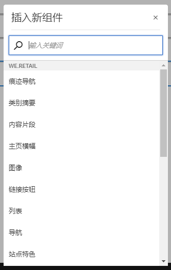
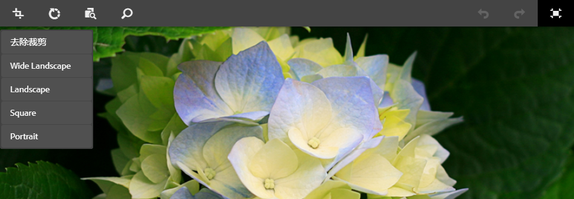
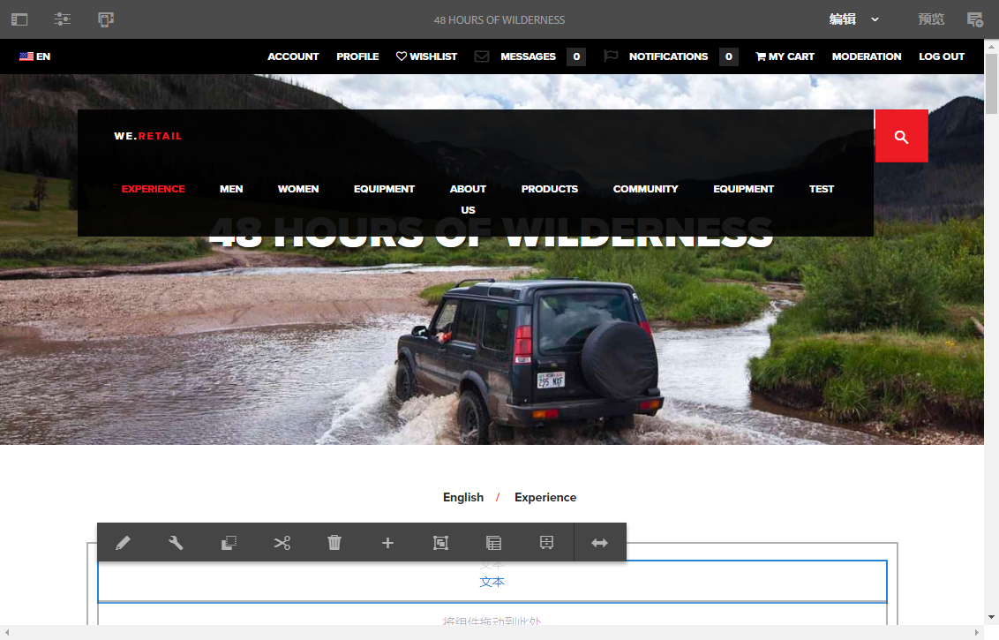

# 编辑页面内容{#editing-page-content}

创建页面（新页面或者作为启动项或 Live Copy 的一部分）后，您可以编辑内容，以进行所需的更新。

内容使用可拖动到页面上的[组件](/help/sites-authoring/default-components-console.md)（适用于内容类型）进行添加。然后，可以就地编辑、移动或删除这些内容。

>[!NOTE]
>
>您的帐户需要拥有[适当的访问权](/help/sites-administering/security.md)以及[相应的权限](/help/sites-administering/security.md#permissions)才能进行编辑。
>
>如果您遇到任何问题，我们建议您与系统管理员联系。

>[!NOTE]
>
>If your page and/or template has been appropriately set up, then you can use [responsive layout](/help/sites-authoring/responsive-layout.md) when editing.

>[!NOTE]
>
>When in **Edit** mode, links in your content are visible, but **not accessible**. Use [Preview mode](#previewing-pages) if you want to navigate using the links in your content.

## 页面工具栏 {#page-toolbar}

根据页面配置，用户可以通过页面工具栏访问相应的功能。

工具栏允许访问许多选项。根据您当前的上下文和配置，某些选项可能不可用。

* **切换侧面板**

   打开/关闭侧面板，其中包含[资产浏览器](/help/sites-authoring/author-environment-tools.md#assets-browser)、[组件浏览器](/help/sites-authoring/author-environment-tools.md#components-browser)和[内容树](/help/sites-authoring/author-environment-tools.md#content-tree)。

   

* **页面信息**

   允许访问[页面信息](/help/sites-authoring/author-environment-tools.md#page-information)菜单，其中包括页面详细信息以及可对页面执行的操作，例如查看和编辑页面信息、查看页面属性以及发布/取消发布页面。

   

* **模拟器**

   切换[模拟器工具栏](/help/sites-authoring/responsive-layout.md#selecting-a-device-to-emulate)，它用于在其他设备上模拟页面的外观。它在布局模式下会自动切换。

   

* **ContextHub**

   打开 [Context Hub](/help/sites-authoring/ch-previewing.md)。仅在预览模式下可用。

   

* **页面标题**

   它是纯信息性的。

   

* **模式选择器**

   显示当前的[模式](/help/sites-authoring/author-environment-tools.md#page-modes)并允许您选择其他模式，例如编辑、布局、时间扭曲或定位。

   

* **预览**

   启用[预览模式](/help/sites-authoring/editing-content.md#preview-mode)。这会显示页面在发布后将呈现的样子。

   

* **注释**

   允许您在审核页面时向页面中添加[注释](/help/sites-authoring/annotations.md)。添加第一个注释后，该图标将切换为数字，以指示页面上的注释数量。

   

### 状态通知 {#status-notification}

If a page is part of a [workflow](/help/sites-authoring/workflows.md) or multiple workflows, this information is shown in a notification bar at the top of the screen when editing the page.

>[!NOTE]
>
>状态栏仅对具有相应权限的用户帐户可见。

通知会列出正在针对页面运行的工作流。如果用户参与了当前工作流步骤，还可以使用[影响工作流状态](/help/sites-authoring/workflows-participating.md)和获取更多工作流相关信息的选项，例如：

* **完成** -打开完成工 **作项对话框**

* **委派** -打开“完成工 **作项”对话框**

* **查看详细信息** -打开工作流 **的** “详细信息”窗口

Completing and delegating workflow steps via the notification bar works as it does when [participating in workflows](/help/sites-authoring/workflows-participating.md) from the Notification inbox.

如果页面从属于多个工作流，则在通知的右侧端将显示工作流的数量，并且还提供有箭头按钮以允许您滚动浏览工作流。

## 组件占位符 {#component-placeholder}

组件占位符是一个指示器，用于显示组件在放置时将占据的位置 - 在您当前悬停鼠标的组件上方显示。

* 在将新组件添加到页面时（从组件浏览器拖动）：

   

* 移动现有组件时：

   

## 插入组件 {#inserting-a-component}

### 使用组件浏览器插入组件 {#inserting-a-component-from-the-components-browser}

您可以使用[组件浏览器](/help/sites-authoring/author-environment-tools.md#components-browser)添加新组件。[组件占位符](#component-placeholder)显示组件在放置时将占据的位置：

1. 确保页面处于[**编辑&#x200B;**模式](/help/sites-authoring/author-environment-tools.md#page-modes)。
1. 打开[组件浏览器](/help/sites-authoring/author-environment-tools.md#components-browser)。
1. 将所需的组件拖动到[所需位置](#component-placeholder)。

1. [编辑](#edit-configure-copy-cut-delete-paste)组件。

>[!NOTE]
>
>在移动设备上，组件浏览器将填满整个屏幕。在开始拖动组件后，浏览器将关闭以再次显示页面，以便您能够放置组件。

### 使用段落系统插入组件 {#inserting-a-component-from-the-paragraph-system}

您可以使用段落系统的&#x200B;**将组件拖动到此处**&#x200B;框添加新组件：

1. 确保页面处于[**编辑&#x200B;**模式](/help/sites-authoring/author-environment-tools.md#page-modes)。
1. 可通过以下两种方式在段落系统中选择和添加新组件：

   * 从现有组件的工具栏或&#x200B;**将组件拖动到此处**&#x200B;框中选择&#x200B;**插入组件**&#x200B;选项 (+)。
   

   * If you are on a desktop device you can double-click on the **Drag components here** box.
   **插入新组件**&#x200B;对话框将打开以允许您选择需要的组件：

   

1. 选定的组件将添加到页面底部。根据需要[编辑](#edit-content)组件。

### 使用资产浏览器插入组件 {#inserting-a-component-using-the-assets-browser}

您还可以通过从[资产浏览器](/help/sites-authoring/author-environment-tools.md#assets-browser)拖动资产来向页面添加新组件。这将自动创建相应类型的新组件（并且包含资产）。

此操作适用于以下资产类型（其中一些类型取决于页面/段落系统）：

<table> 
 <tbody>
  <tr>
   <th>资产类型</th> 
   <th>生成的组件类型</th> 
  </tr>
  <tr>
   <td>图像</td> 
   <td>图像</td> 
  </tr>
  <tr>
   <td>文档</td> 
   <td>下载</td> 
  </tr>
  <tr>
   <td>产品</td> 
   <td>产品</td> 
  </tr>
  <tr>
   <td>视频</td> 
   <td>Flash</td> 
  </tr>
  <tr>
   <td>内容片段</td> 
   <td>内容片段  </td> 
  </tr>
 </tbody>
</table>

>[!NOTE]
>
>可针对您的安装配置此行为。有关更多详细信息，请参阅[配置段落系统以便可通过拖动资产创建组件实例](/help/sites-developing/developing-components.md#configuring-a-paragraph-system-so-that-dragging-an-asset-creates-a-component-instance)。

要通过拖动以上某一资产类型创建组件，请执行以下操作：

1. 确保页面处于[**编辑&#x200B;**模式](/help/sites-authoring/author-environment-tools.md#page-modes)。
1. 打开[资产浏览器](/help/sites-authoring/author-environment-tools.md#assets-browser)。
1. 将所需的资产拖动到所需位置。[组件占位符](#component-placeholder)显示组件在放置时将占据的位置。

   此时将在所需位置创建与该资产类型对应的组件 - 组件将包含选定的资产。

1. 根据需要[编辑](#edit-content)组件。

>[!NOTE]
>
>在移动设备上，资产浏览器将填满整个屏幕。在开始拖动资产后，浏览器将关闭以再次显示页面，以便您能够放置资产。

如果您在浏览资产时发现需要对某个资产进行快速更改，则可以直接从浏览器中单击该资产名称旁边的编辑图标，以启动[资产编辑器](/help/assets/managing-assets-touch-ui.md)。

## 编辑/配置/复制/剪切/删除/粘贴 {#edit-configure-copy-cut-delete-paste}

选择组件后将打开工具栏。通过工具栏可访问能够对组件执行的各种不同操作。

用户实际可用的操作将会根据相应的情况来显示，此处并未介绍所有这些操作。

* **编辑**

   [根据组件类型](/help/sites-authoring/default-components.md) ，此操作将允许您 [编辑组件的内容](#edit-content)。 通常会提供一个工具栏。

   

* **配置**

   [根据组件类型](/help/sites-authoring/default-components.md) ，此操作将允许您编辑和配置组件的属性。 通常会打开一个对话框。

   

* **复制**

   此操作会将组件复制到剪贴板。粘贴操作完成后，原始组件将保留在原位置。

   

* **剪切**

   此操作会将组件复制到剪贴板。粘贴操作完成后，原始组件将会被删除。

   

* **删除**

   此操作将在获得您的确认后从页面中删除组件。

   

* **插入组件**

   此操作将打开用于[添加新组件](/help/sites-authoring/editing-content.md#inserting-a-component-from-the-paragraph-system)的对话框。

   

* **粘贴**

   此操作会将组件从剪贴板粘贴至页面。原始组件是否保留取决于您使用的是复制还是剪切。

   * 您可以粘贴到同一页面或其他页面。
   * 粘贴的项目将被粘贴到选择粘贴操作时所在的项目上方。
   * 仅当剪贴板中含有内容时，才会显示“粘贴”操作。
   

   >[!NOTE]
   >
   >如果粘贴到剪切/复制操作之前已打开的其他页面，则必须刷新该页面才能看到粘贴的内容。

* **组**

   此操作允许您一次选择多个组件。在桌面设备上&#x200B;**按住 Ctrl 并单击**&#x200B;或&#x200B;**按住 Command 并单击**&#x200B;可实现同样的操作。

   

* **父项**

   允许您选择选定组件的父组件。

   

* **布局**

   允许您修改选定组件的[布局](/help/sites-authoring/editing-content.md#edit-component-layout)。此操作仅适用于选定组件，而不会激活整个页面的[布局模式](/help/sites-authoring/author-environment-tools.md#page-modes)。

   

* **转换为体验片段变量**

   允许您从选定的组件创建一个新的[体验片段](/help/sites-authoring/experience-fragments.md)，或将其添加到现有的体验片段中。

   

## 编辑（内容）{#edit-content}

有两种方法可以在组件中添加和/或编辑内容：

* 打开[组件编辑对话框](#component-edit-dialog)。
* 通过从资产浏览器中[拖放资产](#inserting-a-component-using-the-assets-browser)来直接添加内容。

### 组件编辑对话框 {#component-edit-dialog}

您可以打开一个组件以使用[组件工具栏的编辑（铅笔）图标](#edit-configure-copy-cut-delete-paste)来编辑内容。

具体的编辑选项取决于组件。对于某些组件，[所有操作仅在全屏模式下才可用](#edit-content-full-screen-mode)。例如：

* [文本组件](/help/sites-authoring/rich-text-editor.md)

   

* 图像组件

   

   >[!NOTE]
   >
   >无法对空的图像组件执行编辑操作。
   >
   >
   >您必须先[拖动或上传图像（使用“配置”）](/help/sites-authoring/default-components-foundation.md#image)，然后才能开始编辑。

* 图像组件 - 全屏

   [进入图像组件的全屏模式](/help/sites-authoring/editing-content.md#edit-content-full-screen-mode) ，可以留出更多空间来编辑图像，并显示额外的编辑选项，如“启动映射”和“重 **置缩放”******。 此外，全屏模式还允许选择裁剪预设。

   

* 从多个基本组件（例如[“文本和图像”基础组件](/help/sites-authoring/default-components-foundation.md#text-image)）构建的组件会首先要求您确认所需的编辑选项集合：

   

### 将资产拖放到组件中 {#drag-and-drop-assets-into-component}

对于特定的组件类型，您可以直接从资产浏览器中将资产拖放到组件中，从而更新内容：

| 资产类型 | 组件类型 |
|---|---|
| 图像 | 图像 |
| 文档 | 下载 |
| 产品 | 产品 |
| 视频 | Flash |
| 内容片段 | 内容片段 |

## 编辑（内容）全屏模式 {#edit-content-full-screen-mode}

对于所有组件，都可以通过以下图标进入（和退出）全屏模式：

例如，**文本**&#x200B;组件：

>[!NOTE]
>
>对于某些组件，全屏模式比基本的就地编辑器具有更多的可用选项。

## 移动组件 {#moving-a-component}

要移动段落组件，请执行以下操作：

1. 通过点按住或单击并按住来选择要移动的段落。
1. 将该段落移到新位置。AEM 会指示该段落可存放的位置。将其拖动到所需位置。

   

1. 此时会移动您的段落。

>[!NOTE]
>
>您也可以使用[剪切并粘贴](/help/sites-authoring/editing-content.md#edit-configure-copy-cut-delete-paste)来移动组件。

## 编辑组件布局 {#edit-component-layout}

您可以为组件选择 [Layout](/help/sites-authoring/responsive-layout.md)**** （布局）动作，以更改该组件的布局，并且不必退出编辑模式，从而节省时间，而不必反复从编辑模式切换到布局模式来调整组件。

1. When in **Edit** mode of the sites console, selecting a component reveals the component&#39;s toolbar.

   

   Click or tap the **Layout** action to adjust the layout of the component.

   

1. 在选择“布局”操作后：

   * 将显示用于调整组件大小的手柄。
   * 在屏幕的顶部将显示模拟器工具栏。
   * 在组件工具栏中将显示布局操作而不是标准编辑操作。
   

   You can now modify the layout of the component as you would in [layout mode](/help/sites-authoring/responsive-layout.md#defining-layouts-layout-mode).

1. After making the necessary layout changes, click the **Close** button in the component action menu to stop modifying the layout of the component. 组件的工具栏会返回到其正常的编辑状态。

   

>[!NOTE]
>
>“布局”操作仅限用于选定的组件。例如，如果编辑一个组件的布局，然后单击另一个组件，则新选择的组件将显示标准编辑工具栏（而非布局工具栏），并且大小调整手柄和模拟器工具栏将消失。
>
>如果您需要编辑影响到多个组件的总体页面布局，请切换到[布局模式](/help/sites-authoring/responsive-layout.md)。

## 继承组件 {#inherited-components}

继承组件可能是多种情况的产物，包括：

* [多站点管理](/help/sites-administering/msm.md)
* [启动项](/help/sites-authoring/launches.md)（当基于 Live Copy 时）。
* 特定组件，例如 Geometrixx 中的“继承的段落系统”。

您可以取消（随后也可以重新启用）继承。根据具体的组件，可从以下位置执行此操作：

* **Live Copy**

   组件工具栏（如果组件所在的页面是 Live Copy 或启动项的一部分，即基于 Live Copy）。例如：

   

   有“取消继承”选项可用：

   

   或者重新启用已取消的继承：

   

   “转出”操作也在 Blueprint 或 Live Copy 源中可用：

   

* **继承的段落系统**

   配置对话框。例如，“继承的段落系统”：

   

## 编辑页面模板 {#editing-the-page-template}

如果页面基于[可编辑的模板](/help/sites-authoring/templates.md#editable-and-static-templates)，则可以通过选择[“页面信息”菜单](/help/sites-authoring/author-environment-tools.md#page-information)中的&#x200B;**编辑模板**，轻松地切换到[模板编辑器](/help/sites-authoring/templates.md#editing-templates-template-authors)。

If the page is based on a [static template](/help/sites-authoring/templates.md#editable-and-static-templates), you can switch to [Design mode](/help/sites-authoring/default-components-designmode.md) using the [page mode selector](/help/sites-authoring/author-environment-tools.md#page-modes) on the toolbar to enable/disable components for use on the page.

您在[列视图](/help/sites-authoring/basic-handling.md#column-view)或[列表视图](/help/sites-authoring/basic-handling.md#list-view)中选择页面时，可以轻松地查看该页面所基于的模板。

## Live Copy 状态 {#live-copy-status}

[“Live Copy 状态”页面模式](/help/sites-authoring/author-environment-tools.md#page-modes)允许快速查看 Live Copy 状态以及继承/未继承的组件。

* 绿色边框：已继承
* 粉色边框：继承已被取消

例如：

## 添加注释 {#adding-annotations}

[注释](/help/sites-authoring/annotations.md)允许审核者和其他作者对内容提出反馈。该功能通常作审核和验证之用。

## 预览页面 {#previewing-pages}

可通过以下两个选项预览页面：

* [预览模式](#preview-mode) - 快速就地预览

* [查看已发布的项目](#view-as-published) - 在新选项卡中打开页面的完整预览

>[!NOTE]
>
>* 链接会在内容中显示，但在“编辑”模式下无法访问。
>* 如果您希望使用链接进行导航，请使用任一预览选项。
>* 使用[键盘快捷键](/help/sites-authoring/keyboard-shortcuts.md) `Ctrl-Shift-M` 可在预览和最后选择的模式之间切换。
>

>[!NOTE]
>
>这两个选项均可设置 WCM 模式 Cookie。

### 预览模式 {#preview-mode}

在编辑内容时，您可以使用预览[模式](/help/sites-authoring/author-environment-tools.md#page-modes)预览页面。此模式：

* 会隐藏各种编辑机制，以便让您快速查看页面在发布时是什么样子。
* 允许您使用链接进行导航。
* **不会**&#x200B;刷新页面内容。

进行创作时，可以使用页面编辑器右上角的图标进入预览模式：

### 查看已发布的项目 {#view-as-published}

**查看已发布的项目**&#x200B;选项可从[页面信息](/help/sites-authoring/author-environment-tools.md#page-information)菜单中获取。这会在新选项卡中打开页面，刷新内容并准确显示页面在发布环境中呈现的原貌。

## 锁定页面 {#locking-a-page}

AEM 允许您锁定页面，这样其他人就无法修改页面内容。当您要对某个特定页面做出大量编辑，或者需要冻结页面一段时间时，此功能非常有用。

可以通过以下任一方式锁定页面：

* **站点**&#x200B;控制台

   1. 在[选择模式](/help/sites-authoring/basic-handling.md#viewing-and-selecting-resources)中选择页面。
   1. 选择锁定图标。
   

* **页面编辑器**

   1. 选择&#x200B;**页面信息**&#x200B;图标来打开菜单。
   1. 选择&#x200B;**锁定页面**&#x200B;选项。

锁定后，控制台视图信息便会更新；编辑时，工具栏中会出现锁定符号。

>[!CAUTION]
>
>[模拟用户身份](/help/sites-administering/security.md#impersonating-another-user)时可以执行页面锁定。但是，以这种方式锁定的页面随后只能由被模拟的用户或管理员用户解锁。
>
>不能通过模拟锁定页面的用户的身份来解锁页面。

## 解锁页面 {#unlocking-a-page}

Unlocking a page is very similar to [locking the page](#locking-a-page). Once the page is locked the lock options are replaced by unlock actions.

“页面信息”菜单将 **“解锁** ”列为一个选项，站点控制台中的“锁定”图标将替换为“解锁 **** ”图标。

>[!CAUTION]
>
>[模拟用户身份](/help/sites-administering/security.md#impersonating-another-user)时可以执行页面锁定。但是，以这种方式锁定的页面随后只能由被模拟的用户或管理员用户解锁。
>
>不能通过模拟锁定页面的用户的身份来解锁页面。

## 撤消和重做页面编辑 {#undoing-and-redoing-page-edits}

通过以下图标可撤消或重做某项操作。这些图标会适时地出现在工具栏中：

>[!NOTE]
>
>也可使用[键盘快捷键](/help/sites-authoring/page-authoring-keyboard-shortcuts.md) `Ctrl-Z` 撤消页面编辑操作。
>
>The keyboard shortcut `Ctrl-Y` is also availalbe to redo page edit actions.

>[!NOTE]
>
>有关撤消和重做页面编辑时可执行操作的完整详细信息，请参阅[撤消和重做页面编辑 - 理论](#undoing-and-redoing-page-edits-the-theory)。

## 撤消和重做页面编辑 - 理论 {#undoing-and-redoing-page-edits-the-theory}

>[!NOTE]
>
>系统管理员可以根据您实例的要求，[配置撤消/重做功能的各个方面](/help/sites-administering/config-undo.md)。

AEM 会按照您执行操作的顺序来存储这些操作的历史记录，这样，您便可以按照执行顺序撤消多个操作，然后在必要时重做它们，以重新应用一个或多个操作。

如果选择了内容页面上的某个元素（例如文本组件），则撤消和重做命令将适用于选定的项目。

撤消和重做命令的行为与其他软件程序中的类似。使用这些命令可在您做出内容决策时恢复网页的近期状态。例如，如果您将文本段落移至页面上的其他位置，可以使用撤消命令移回该段落。如果您稍后又认定之前的位置更好，可使用重做命令“撤消之前的撤消操作”。

>[!NOTE]
>
>您可以：
>
>* 只要您在执行撤消操作之后没有进行任何页面编辑，就可以执行重做操作。
>* 最多可撤消 20 次编辑操作（默认设置）。
>* 也可以使用[键盘快捷键](/help/sites-authoring/page-authoring-keyboard-shortcuts.md)执行撤消和重做操作。
>

您可以对以下类型的页面更改使用撤消和重做：

* 添加、编辑、删除和移动段落
* 段落内容的就地编辑
* 在页面内复制、剪切和粘贴项目

呈现表单组件的表单字段不表示在创作页面时指定了值。因此，撤消和重做命令不会影响您对这些类型的组件值所进行的更改。例如，您不能撤消选中下拉列表中的某个值。

>[!NOTE]
>
>对文件和图像的更改执行撤消和重做操作需要特殊的权限。

>[!NOTE]
>
>对文件和图像进行更改的历史记录将保留至少 10 个小时。但在超过此时间后，将无法保证可以撤消这些更改。您的管理员可以更改 10 个小时的默认保留时间。

