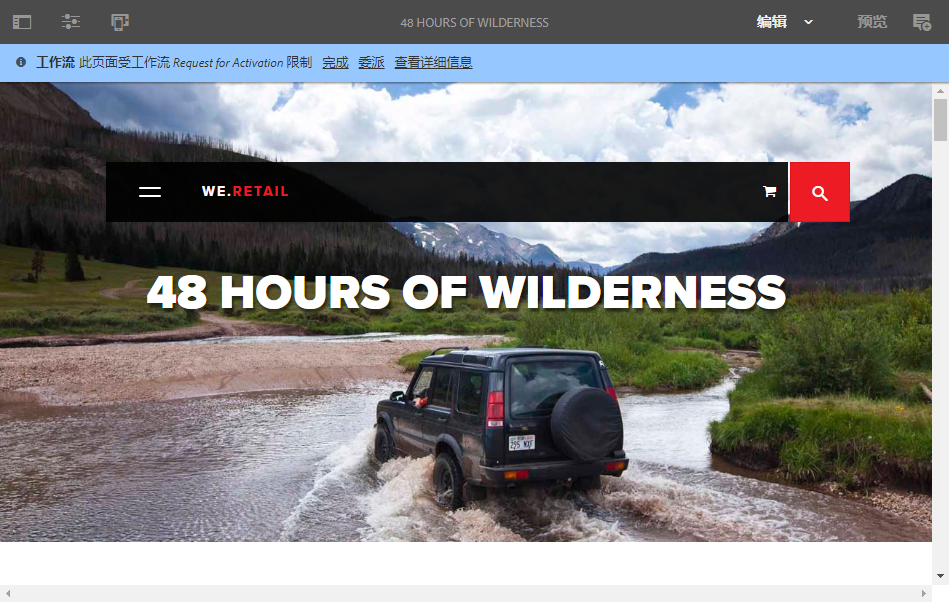
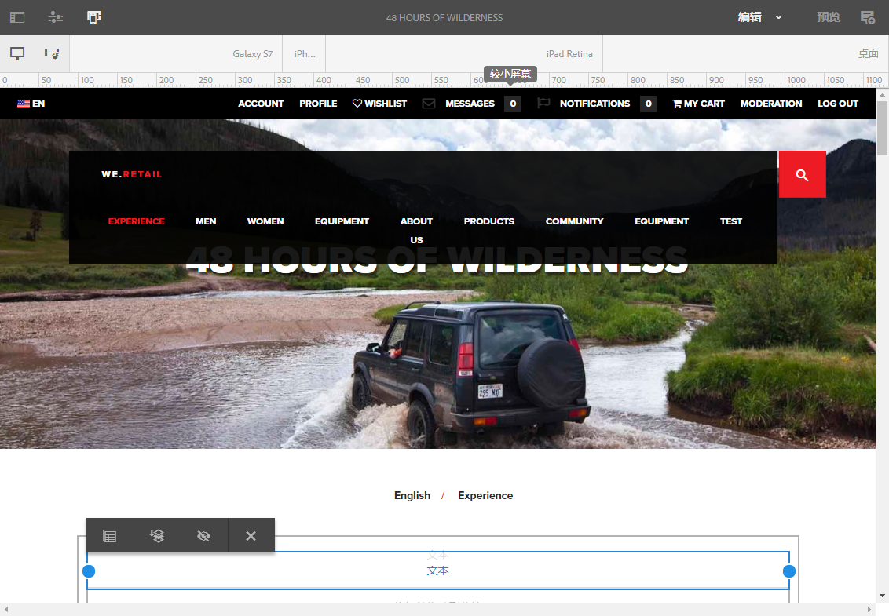
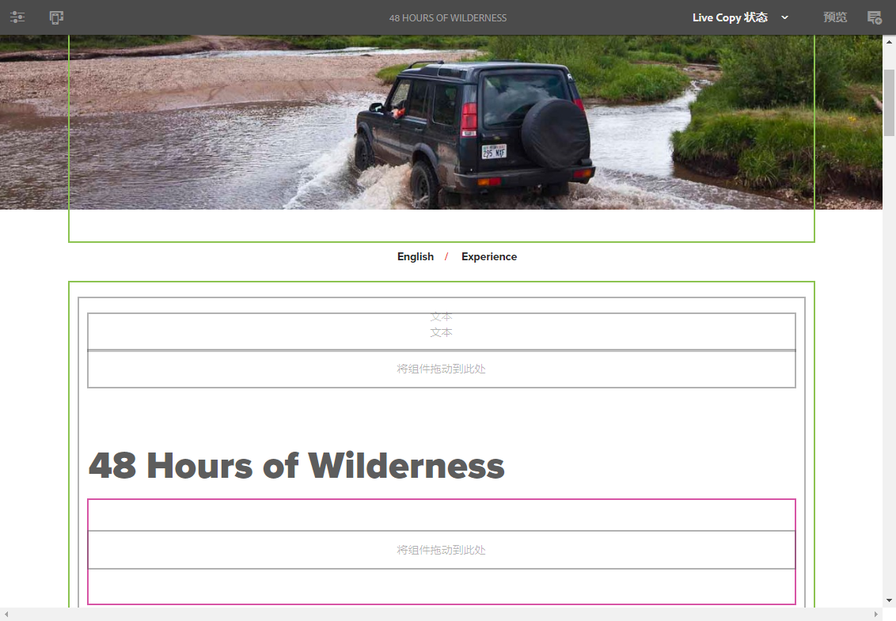

# 编辑页面内容{#editing-page-content}

>[!CAUTION]
>
>AEM 6.4已结束扩展支持，本文档将不再更新。 有关更多详细信息，请参阅 [技术支助期](https://helpx.adobe.com/cn/support/programs/eol-matrix.html). 查找支持的版本 [此处](https://experienceleague.adobe.com/docs/).

创建页面（新页面或者作为启动项或 Live Copy 的一部分）后，您可以编辑内容，以进行所需的更新。

使用 [组件](/help/sites-authoring/default-components-console.md) （适用于内容类型）。 然后，可以就地编辑、移动或删除这些内容。

>[!NOTE]
>
>您的帐户需要 [适当的访问权限](/help/sites-administering/security.md) 和 [权限](/help/sites-administering/security.md#permissions) 来编辑页面。
>
>如果您遇到任何问题，我们建议您与系统管理员联系。

>[!NOTE]
>
>如果您的页面和/或模板进行了适当设置，那么您可以在编辑时使用[响应式布局](/help/sites-authoring/responsive-layout.md)。

>[!NOTE]
>
>在&#x200B;**编辑**&#x200B;模式下，内容中的链接是可见的，但是&#x200B;**不可访问**。如果您要使用内容中的链接进行导航，请使用[预览模式](#previewing-pages)。

## 页面工具栏 {#page-toolbar}

根据页面配置，用户可以通过页面工具栏访问相应的功能。

通过工具栏可访问许多选项。 根据您当前的上下文和配置，某些选项可能不可用。

* **切换侧面板**

   此操作将打开/关闭侧面板，该侧面板将保持 [资产浏览器](/help/sites-authoring/author-environment-tools.md#assets-browser), [组件浏览器](/help/sites-authoring/author-environment-tools.md#components-browser)和 [内容树](/help/sites-authoring/author-environment-tools.md#content-tree).

   

* **页面信息**

   提供对 [页面信息](/help/sites-authoring/author-environment-tools.md#page-information) 菜单，包括页面详细信息和可对页面执行的操作，包括查看和编辑页面信息、查看页面属性以及发布/取消发布页面。

   

* **模拟器**

   切换 [模拟器工具栏](/help/sites-authoring/responsive-layout.md#selecting-a-device-to-emulate)，用于在其他设备上模拟页面的外观。 在布局模式下，将自动切换此设置。

   

* **ContextHub**

   打开 [上下文中心](/help/sites-authoring/ch-previewing.md). 仅在预览模式下可用。

   

* **页面标题**

   这纯粹是信息性的。

   

* **模式选择器**

   显示当前 [模式](/help/sites-authoring/author-environment-tools.md#page-modes) 和允许您选择其他模式，如编辑、布局、时间扭曲或定位。

   

* **预览**

   启用 [预览模式](/help/sites-authoring/editing-content.md#preview-mode). 这会显示发布后将显示的页面。

   

* **批注**

   用于添加 [批注](/help/sites-authoring/annotations.md) 页面时添加到页面。 第一个注释后，图标将切换为数字，以指示页面上的注释数。

   

### 状态通知 {#status-notification}

如果页面是一个[工作流](/help/sites-authoring/workflows.md)或多个工作流的一部分，则在编辑该页面时，将在屏幕顶部的通知栏中显示此信息。

>[!NOTE]
>
>状态栏仅对具有相应权限的用户帐户可见。

通知会列出针对页面运行的工作流。 如果用户参与了当前工作流步骤，则 [影响工作流状态](/help/sites-authoring/workflows-participating.md) 以及获取有关工作流的更多信息，例如：

* **完成**  — 打开 **完成工作项** 对话框

* **委派**  — 打开 **完成工作项** 对话框

* **查看详细信息** - 打开工作流的&#x200B;**详细信息**&#x200B;窗口

通过通知栏完成和委派工作流步骤，与从“通知”收件箱中[参与工作流](/help/sites-authoring/workflows-participating.md)的操作方式相同。

如果页面从属于多个工作流，则在通知的右侧端将显示工作流的数量，并且还提供有箭头按钮以允许您滚动浏览工作流。

## 组件占位符 {#component-placeholder}

组件占位符是一个指示器，用于显示将组件放置到当前悬停在其上方的组件上方时，组件在放置时将占据的位置。

* 向页面添加新组件时（从组件浏览器中拖动）：

   

* 移动现有组件时：

   

## 插入组件 {#inserting-a-component}

### 使用组件浏览器插入组件 {#inserting-a-component-from-the-components-browser}

您可以使用[组件浏览器](/help/sites-authoring/author-environment-tools.md#components-browser)添加新组件。[组件占位符](#component-placeholder)显示组件在放置时将占据的位置：

1. 确保页面处于&#x200B;[**编辑**&#x200B;模式](/help/sites-authoring/author-environment-tools.md#page-modes)。
1. 打开[组件浏览器](/help/sites-authoring/author-environment-tools.md#components-browser)。
1. 将所需的组件拖动到[所需位置](#component-placeholder)。

1. [编辑](#edit-configure-copy-cut-delete-paste) 组件。

>[!NOTE]
>
>在移动设备上，组件浏览器将填满整个屏幕。 开始拖动组件后，浏览器将关闭以再次显示页面，以便您放置组件。

### 使用段落系统插入组件 {#inserting-a-component-from-the-paragraph-system}

您可以使用段落系统的&#x200B;**将组件拖动到此处**&#x200B;框添加新组件：

1. 确保页面处于&#x200B;[**编辑**&#x200B;模式](/help/sites-authoring/author-environment-tools.md#page-modes)。
1. 有两种方法可从段落系统中选择和添加新组件：

   * 选择 **插入组件** 选项(+) **将组件拖动到此处** 框中。

   

   * 如果您使用的是桌面设备，则可以双击&#x200B;**将组件拖动到此处**&#x200B;框。

   **插入新组件**&#x200B;对话框将打开以允许您选择需要的组件：

   

1. 所选组件将添加到页面底部。 [编辑](#edit-content) 组件（根据需要）。

### 使用资产浏览器插入组件 {#inserting-a-component-using-the-assets-browser}

您还可以通过从 [资产浏览器](/help/sites-authoring/author-environment-tools.md#assets-browser). 这将自动创建相应类型（并包含资产）的新组件。

这适用于以下资产类型（某些类型将取决于页面/段落系统）：

<table> 
 <tbody>
  <tr>
   <th>资产类型</th> 
   <th>生成的组件类型</th> 
  </tr>
  <tr>
   <td>图像</td> 
   <td>图像</td> 
  </tr>
  <tr>
   <td>文档</td> 
   <td>下载</td> 
  </tr>
  <tr>
   <td>产品</td> 
   <td>产品</td> 
  </tr>
  <tr>
   <td>视频</td> 
   <td>闪光灯</td> 
  </tr>
  <tr>
   <td>内容片段</td> 
   <td>内容片段  </td> 
  </tr>
 </tbody>
</table>

>[!NOTE]
>
>可针对您的安装配置此行为。请参阅 [配置段落系统以便拖动资产可创建组件实例](/help/sites-developing/developing-components.md#configuring-a-paragraph-system-so-that-dragging-an-asset-creates-a-component-instance) 以了解更多详细信息。

要通过拖动以上某一资产类型创建组件，请执行以下操作：

1. 确保页面处于&#x200B;[**编辑**&#x200B;模式](/help/sites-authoring/author-environment-tools.md#page-modes)。
1. 打开 [资产浏览器](/help/sites-authoring/author-environment-tools.md#assets-browser).
1. 将所需的资产拖动到所需位置。 的 [组件占位符](#component-placeholder) 显示组件在放置时的位置。

   将在所需位置创建与资产类型相应的组件 — 组件将包含选定的资产。

1. [编辑](#edit-content) 组件（如果需要）。

>[!NOTE]
>
>在移动设备上，资产浏览器将填满整个屏幕。 开始拖动资产后，浏览器将关闭以再次显示页面，以便您放置资产。

如果您在浏览资产时发现需要对某个资产进行快速更改，则可以启动 [资产编辑器](/help/assets/managing-assets-touch-ui.md) 单击资产名称旁边的编辑图标，可直接从浏览器访问。

## 编辑/配置/复制/剪切/删除/粘贴 {#edit-configure-copy-cut-delete-paste}

选择组件后将打开工具栏。通过工具栏可访问能够对组件执行的各种不同操作。

用户实际可用的操作将会根据相应的情况来显示，此处并未介绍所有这些操作。

* **编辑**

   [根据组件类型](/help/sites-authoring/default-components.md)，此操作将允许您[编辑组件的内容](#edit-content)。通常会提供一个工具栏。

   

* **配置**

   [根据组件类型](/help/sites-authoring/default-components.md)，此操作将允许您编辑和配置组件的属性。通常会打开一个对话框。

   

* **复制**

   这会将组件复制到剪贴板。 粘贴操作完成后，原始组件将保留在原位置。

   

* **剪切**

   这会将组件复制到剪贴板。 粘贴操作完成后，将删除原始组件。

   

* **删除**

   这将在确认后从页面中删除组件。

   

* **插入组件**

   此时将打开用于 [添加新组件](/help/sites-authoring/editing-content.md#inserting-a-component-from-the-paragraph-system).

   

* **粘贴**

   这会将组件从剪贴板粘贴到页面。 原始内容是否保留取决于您是使用复制还是剪切。

   * 您可以粘贴到同一页面或其他页面。
   * 粘贴的项目将粘贴到您选择粘贴操作的项目上方。
   * 仅当剪贴板中包含内容时，才会显示“粘贴”操作。

   

   >[!NOTE]
   >
   >如果粘贴到剪切/复制操作之前已打开的其他页面，则必须刷新该页面才能查看粘贴的内容。

* **组**

   这允许您一次选择多个组件。 在桌面设备上，可以通过 **按住Ctrl并单击** 或 **按住Command并单击**.

   

* **父项**

   用于选择所选组件的父组件。

   

* **布局**

   这允许您修改 [布局](/help/sites-authoring/editing-content.md#edit-component-layout) 的子代。 此操作仅适用于选定的组件，而不会激活 [布局模式](/help/sites-authoring/author-environment-tools.md#page-modes) 的页面。

   

* **转换为体验片段变体**

   允许您从选定的组件创建一个新的[体验片段](/help/sites-authoring/experience-fragments.md)，或将其添加到现有的体验片段中。

   

## 编辑（内容） {#edit-content}

有两种方法可以在组件中添加和/或编辑内容：

* 打开 [“组件”对话框，用于编辑](#component-edit-dialog).
* [拖放资产](#inserting-a-component-using-the-assets-browser) ，以直接添加内容。

### 组件编辑对话框 {#component-edit-dialog}

您可以打开组件以使用组件工具栏 [的编辑（铅笔）图标编辑内容](#edit-configure-copy-cut-delete-paste)。

具体的编辑选项取决于组件。 对于某些组件 [所有操作将仅在全屏模式下可用](#edit-content-full-screen-mode). 例如：

* [文本组件](/help/sites-authoring/rich-text-editor.md)

   

* 图像组件

   

   >[!NOTE]
   >
   >无法对空的图像组件执行编辑操作。
   >
   >
   >您必须 [拖动或上传图像（使用配置）](/help/sites-authoring/default-components-foundation.md#image) 才能开始编辑。

* 图像组件 — 全屏

   [进入图像组件的全屏模式](/help/sites-authoring/editing-content.md#edit-content-full-screen-mode) ，可以留出更多空间来编辑图像，并显示额外的编辑选项，如“启动映射”和“重 **置缩放”******。 此外，全屏模式还允许选择裁剪预设。

   

* 由多个基本组件(如 [文本和图像基础组件](/help/sites-authoring/default-components-foundation.md#text-image)，首先要求您确认所需的编辑选项集：

   

### 将资产拖放到组件中 {#drag-and-drop-assets-into-component}

对于特定的组件类型，您可以直接从资产浏览器中将资产拖放到组件中，以更新内容：

| 资产类型 | 组件类型 |
|---|---|
| 图像 | 图像 |
| 文档 | 下载 |
| 产品 | 产品 |
| 视频 | 闪光灯 |
| 内容片段 | 内容片段 |

## 编辑（内容）全屏模式 {#edit-content-full-screen-mode}

对于所有组件，都可以通过以下图标进入（和退出）全屏模式：

例如，**文本**&#x200B;组件：

>[!NOTE]
>
>对于某些组件，全屏模式比基本就地编辑器具有更多的可用选项。

## 移动组件 {#moving-a-component}

要移动段落组件，请执行以下操作：

1. 通过点按并按住或单击并按住选择要移动的段落。
1. 将段落拖到新位置。 AEM指示段落可存放的位置。 将其拖放到所需位置。

   

1. 此时会移动您的段落。

>[!NOTE]
>
>您也可以使用[剪切并粘贴](/help/sites-authoring/editing-content.md#edit-configure-copy-cut-delete-paste)来移动组件。

## 编辑组件布局 {#edit-component-layout}

您无需为了调整组件而反复不停地从编辑模式切换到[布局模式](/help/sites-authoring/responsive-layout.md)，而是可以为组件选择&#x200B;**布局**&#x200B;操作来更改该组件的布局，在此过程中，由于不必离开编辑模式，从而节省了大量时间。

1. 在站点控制台的&#x200B;**编辑**&#x200B;模式下，选择某个组件会显示该组件的工具栏。

   

   单击或点按&#x200B;**布局**&#x200B;操作可调整组件的布局。

   

1. 选择布局操作后：

   * 将显示组件的调整大小手柄。
   * 模拟器工具栏显示在屏幕顶部。
   * 组件工具栏上会显示布局操作而不是标准编辑操作。

   

   此时，您便可以像在[布局模式](/help/sites-authoring/responsive-layout.md#defining-layouts-layout-mode)中一样修改组件布局。

1. 在进行必要的布局更改后，单击组件操作菜单中的&#x200B;**关闭**&#x200B;按钮以停止修改组件的布局。组件的工具栏会返回到其正常的编辑状态。

   

>[!NOTE]
>
>“布局”操作仅限用于选定的组件。例如，如果您正在编辑一个组件的布局，然后单击另一个组件，则会为新选择的组件显示标准编辑工具栏（而非布局工具栏），大小调整手柄以及模拟器工具栏将消失。
>
>如果您需要编辑影响多个组件的页面整体布局，请切换到 [布局模式](/help/sites-authoring/responsive-layout.md).

## 继承组件 {#inherited-components}

继承组件可能是多种情况的产物，包括：

* [多站点管理](/help/sites-administering/msm.md)
* [启动项](/help/sites-authoring/launches.md)（当基于 Live Copy 时）。
* 特定组件，如Geometrixx中的继承段落系统。

您可以取消（随后也可以重新启用）继承。根据组件的不同，可从以下位置执行此操作：

* **Live Copy**

   组件工具栏（如果组件位于Live Copy或启动项的一部分的页面上）。 例如：

   

   取消继承选项可用：

   

   或者，如果已取消继承，则重新启用继承：

   

   “转出”操作也在Blueprint或Live Copy源中可用：

   

* **继承的段落系统**

   配置对话框。 例如，与继承段落系统一样：

   

## 编辑页面模板 {#editing-the-page-template}

如果页面基于 [可编辑模板](/help/sites-authoring/templates.md#editable-and-static-templates)，则可以轻松切换到 [模板编辑器](/help/sites-authoring/templates.md#editing-templates-template-authors) 选择 **编辑模板** 在 [“页面信息”菜单](/help/sites-authoring/author-environment-tools.md#page-information).

如果页面基于 [静态模板](/help/sites-authoring/templates.md#editable-and-static-templates)，您可以切换到 [设计模式](/help/sites-authoring/default-components-designmode.md) 使用 [页面模式选择器](/help/sites-authoring/author-environment-tools.md#page-modes) 启用/禁用组件以在页面上使用。

在[列视图](/help/sites-authoring/basic-handling.md#column-view)或[列表视图](/help/sites-authoring/basic-handling.md#list-view)中选择页面时，您可以轻松查看该页面所基于的模板。

## Live Copy 状态 {#live-copy-status}

的 [Live Copy状态页面模式](/help/sites-authoring/author-environment-tools.md#page-modes) 允许您快速概述live copy状态以及继承/未继承的组件：

* 绿色边框：继承
* 粉红色边框：继承已取消

例如：

## 添加注释 {#adding-annotations}

[批注](/help/sites-authoring/annotations.md) 允许审阅人和其他作者对您的内容提供反馈。 它们通常用于审阅和验证目的。

## 预览页面 {#previewing-pages}

可通过以下两个选项预览页面：

* [预览模式](#preview-mode) - 快速就地预览

* [查看已发布的项目](#view-as-published)  — 在新选项卡中打开页面的完整预览

>[!NOTE]
>
>* 内容中的链接是可见的，但在编辑模式下无法访问。
>* 如果您希望使用链接进行导航，请使用任一预览选项。
>* 使用[键盘快捷键](/help/sites-authoring/keyboard-shortcuts.md) `Ctrl-Shift-M` 可在预览和最后选择的模式之间切换。
>

>[!NOTE]
>
>这两个选项均可设置WCM模式Cookie。

### 预览模式 {#preview-mode}

在编辑内容时，您可以使用预览预览页面 [模式](/help/sites-authoring/author-environment-tools.md#page-modes). 此模式：

* 会隐藏各种编辑机制，以便让您快速查看页面在发布时是什么样子。
* 允许您使用链接进行导航。
* 是 **not** 刷新页面内容。

创作时，可使用页面编辑器右上角的图标进入预览模式：

### 以发布的形式查看 {#view-as-published}

的 **查看已发布的项目** 选项 [页面信息](/help/sites-authoring/author-environment-tools.md#page-information) 菜单。 这会在新选项卡中打开页面，刷新内容并完全显示页面在发布环境中的显示效果。

## 锁定页面 {#locking-a-page}

AEM 允许您锁定页面，这样其他人就无法修改页面内容。当您要对某个特定页面做出大量编辑，或者需要冻结页面一段时间时，此功能非常有用。

可以通过以下任一方式锁定页面：

* **站点** 控制台

   1. 选择具有 [选择模式](/help/sites-authoring/basic-handling.md#viewing-and-selecting-resources).
   1. 选择锁图标。

   

* **页面编辑器**

   1. 选择 **页面信息** 图标以打开菜单。
   1. 选择 **锁定页面** 选项。

锁定后，控制台视图信息便会更新；编辑时，工具栏中会出现锁定符号。

>[!CAUTION]
>
>锁定页面时，可以执行 [模拟用户](/help/sites-administering/security.md#impersonating-another-user). 但是，以这种方式锁定的页面随后只能由模拟的用户或管理员用户解锁。
>
>不能通过模拟锁定页面的用户的身份来解锁页面。

## 解锁页面 {#unlocking-a-page}

解锁页面的方法与[锁定页面](#locking-a-page)非常相似。在锁定页面后，锁定选项就会被替换为解锁操作选项。

“页面信息”菜单会将&#x200B;**解锁**&#x200B;列为一个选项，并且站点控制台中的“锁定”图标会被替换为&#x200B;**解锁**&#x200B;图标。

>[!CAUTION]
>
>锁定页面时，可以执行 [模拟用户](/help/sites-administering/security.md#impersonating-another-user). 但是，以这种方式锁定的页面随后只能由模拟的用户或管理员用户解锁。
>
>不能通过模拟锁定页面的用户的身份来解锁页面。

## 撤消和重做页面编辑 {#undoing-and-redoing-page-edits}

通过以下图标可撤消或重做某项操作。这些图标会适时地出现在工具栏中：

>[!NOTE]
>
>的 [键盘快捷键](/help/sites-authoring/page-authoring-keyboard-shortcuts.md) `Ctrl-Z` 也可撤消页面编辑操作。
>
>键盘快捷键 `Ctrl-Y` 也可用于重做页面编辑操作。

>[!NOTE]
>
>有关撤消和重做页面编辑时可执行操作的完整详细信息，请参阅[撤消和重做页面编辑 - 理论](#undoing-and-redoing-page-edits-the-theory)。

## 撤消和重做页面编辑 – 理论 {#undoing-and-redoing-page-edits-the-theory}

>[!NOTE]
>
>系统管理员可以 [配置撤消/重做功能的各个方面](/help/sites-administering/config-undo.md) 根据实例的要求。

AEM 会按照您执行操作的顺序来存储这些操作的历史记录，这样，您便可以按照执行顺序撤消多个操作，然后在必要时重做它们，以重新应用一个或多个操作。

如果选择了内容页面上的某个元素（例如文本组件），则撤消和重做命令将适用于选定的项目。

撤消和重做命令的行为与其他软件程序中的行为类似。 在您对内容做出决策时，可使用命令恢复网页的最近状态。 例如，如果您将文本段落移至页面上的其他位置，可以使用撤消命令移回该段落。如果您随后确定上一个位置更好，请使用重做命令“撤消撤消”。

>[!NOTE]
>
>您可以：
>
>* 只要您在执行撤消操作后没有进行页面编辑，就可以执行重做操作。
>* 最多可撤消20个编辑操作（默认设置）。
>* 还使用 [键盘快捷键](/help/sites-authoring/page-authoring-keyboard-shortcuts.md) 以执行撤消和重做操作。
>

您可以对以下类型的页面更改使用撤消和重做：

* 添加、编辑、删除和移动段落
* 段落内容的就地编辑
* 在页面中复制、剪切和粘贴项目

在创作页面时，表单组件渲染的表单字段不会指定值。 因此，撤消和重做命令不会影响您对这些类型组件的值所做的更改。 例如，您无法撤消在下拉列表中选择某个值的操作。

>[!NOTE]
>
>对文件和图像的更改执行撤消和重做操作需要特殊的权限。

>[!NOTE]
>
>文件和图像更改的历史记录至少持续10小时。 但是，在此之后，将无法保证可以撤消这些更改。 管理员可以更改10小时的默认时间。
