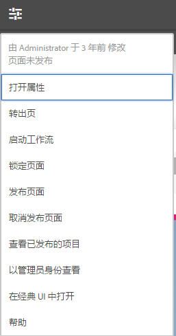
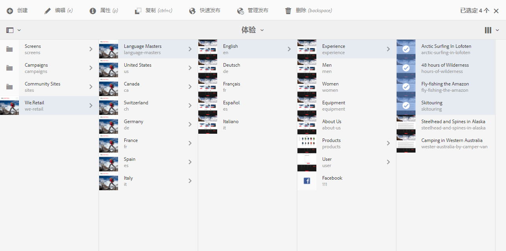

# 编辑页面属性{#editing-page-properties}

您可以为页面定义所需的属性。这些属性会因页面性质而异。例如，某些页面可能会连接到 Live Copy，而其他页面则可能不会，Live Copy 信息将在适当情况下才可用。

## 页面属性 {#page-properties}

属性分布于多个选项卡中。

### 基本 {#basic}

* **标题**

   页面的标题会显示在各种不同的位置。例如，**网站**&#x200B;选项卡列表和&#x200B;**站点**&#x200B;卡片/列表视图。

   这是必填字段。

* **标记**

   在此，可以通过更新选择框中的列表在页面中添加或删除标记：

   * 选择标记后，它会列在选择框下。您可以使用“x”从此列表中删除标记。
   * 可通过在空白选择框中键入名称输入全新标记。

      * 按 Enter 将创建新标记。
      * 随后将会显示新标记，其右侧带有一个小星星，表示该标记为新标记。
   * 使用下拉列表功能，可从现有标记中进行选择。
   * 当您将鼠标悬停在选择框中的标记条目上时，会显示 x，用于为此页面删除该标记。

   有关标记的更多信息，请访问[使用标记](/help/sites-authoring/tags.md)。

* **隐藏导航**

   指示在生成的站点的页面导航中是显示还是隐藏页面。

* **页面标题**

   要在页面中使用的标题。通常由标题组件使用。如果留空，则将使用&#x200B;**标题**。

* **导航标题**

   您可以指定单独的标题以便在导航中使用（例如，如果您想用一种更加简洁明了的说法）。如果留空，则将使用&#x200B;**标题**。

* **子标题**

   要在页面中使用的子标题。

* **描述**

   页面及其用途的描述，或要添加的任何其他详细信息。

* **开始时间**

   将激活已发布页面的日期和时间。发布后，此页面在指定时间之前将一直保持休眠。

   对于要立即发布的页面，将这些字段保留为空（正常情况）。

* **结束时间**

   将取消激活已发布页面的时间。

   再次将这些字段留空以便立即执行操作。

* **虚 URL**

   允许您输入此页面的虚 URL，以便使用更短并且/或者含意更清楚的 URL。

   For example, if the Vanity URL is set to w `elcome`to the page identified by the path / `v1.0/startpage`for the website h `ttp://example.com,` then h `ttp://example.com/welcome`would be the vanity URL of h `ttp://example.com/content/v1.0/startpage`

   >[!CAUTION]
   >
   >虚 URL：
   >
   >* 必须是唯一的，因此您应该确保该值没有被其他页面使用。
   >* 不支持正则表达式模式。

* **重定向虚 URL**

   指示您是否希望页面使用虚 URL。

### 高级 {#advanced}

* **语言**

   页面语言。

* **重定向**

   指示此页面应自动重定向到的页面。

* **设计**

   指示要用于此页面的[设计](/help/sites-developing/designer.md)。

* **别名**

   指定要用于此页面的别名。

   >[!NOTE]
   >
   > 别名会设置 `sling:alias` 属性以定义资源的别名（这仅会影响资源，不会影响路径）。
   >
   >例如：如果您为节点 `/content/we-retail/spanish` 定义别名 `latin-lang`，则可以通过 `/content/we-retail/latin-language` 访问此页面。
   >
   >For further details see [Localized page names under SEO and URL Management Best Practices](/help/managing/seo-and-url-management.md#localized-page-names)

* **允许的模板**

   [定义将在此子分支内可用的模板列表](/help/sites-authoring/templates.md#enabling-and-allowing-a-template-template-author)。

* **身份验证要求**

   启用（或禁用）身份验证来访问页面。

   可以在此处随指定的登录页面一起设置进行身份验证的要求。已关闭的用户组在&#x200B;**[权限](/help/sites-authoring/editing-page-properties.md#permissions)**选项卡上定义。

   >[!CAUTION]
   >
   >The **[Permissions](/help/sites-authoring/editing-page-properties.md#permissions)**tab allows editing of CUG configurations based on the presence of the`granite:AuthenticationRequired`mixin. If page permissions are configured using deprecated CUG configurations, based on the presence of cq:cugEnabled property, a warning message will be shown under **Authentication Requirement**and the option will not be editable, nor will the[Permissions](/help/sites-authoring/editing-page-properties.md#permissions)be editable.
   >
   >
   >对于此类情况，必须在[经典 UI](/help/sites-classic-ui-authoring/classic-page-author-edit-page-properties.md) 中编辑 CUG 权限。

* **登录页面**

   要用于登录的页面。

* **导出配置**

   指定导出配置。

### 缩略图 {#thumbnail}

1. **页面缩略图**

   显示页面缩略图图像。您可以：

   * **生成预览**

      生成要用作缩略图的页面预览。

   * **上传图像**

      上传要用作缩略图的图像。

### 社交媒体 {#social-media}

* **社交媒体共享**

   定义页面上可用的共享选项。显示可用于[共享核心组件](https://helpx.adobe.com/experience-manager/core-components/using/sharing.html)的选项。

   * **为 Facebook 启用用户共享**
   * **为 Pinterest 启用用户共享**
   * **首选体验片段变量**
定义用于为页面生成元数据的体验片段变量

### 云服务 {#cloud-services}

* **云服务**

   为[云服务](/help/sites-developing/extending-cloud-config.md)定义属性。

### 个性化 {#personalization}

* **个性化**

   选择一个[品牌以指定定位的范围](/help/sites-authoring/personalization.md)。

### 权限 {#permissions}

* **权限**

   在此选项卡中，您可以：

   * [添加权限](/help/sites-administering/user-group-ac-admin.md)
   * [编辑已关闭的用户组](/help/sites-administering/cug.md#applying-your-closed-user-group-to-content-pages)
   * 查看[有效权限](/help/sites-administering/user-group-ac-admin.md)

   >[!CAUTION]
   >
   >The **Permissions** tab allows editing of CUG configurations based on the presence of the `granite:AuthenticationRequired` mixin. 如果页面权限是使用已弃用的 CUG 配置来配置的，则在存在 `cq:cugEnabled` 属性的情况下，将会显示一条警告消息，且 CUG 权限将不可编辑，同时[高级](/help/sites-authoring/editing-page-properties.md#advanced)选项卡上的“身份验证要求”也将不可编辑。
   >
   >
   >对于此类情况，必须在[经典 UI](/help/sites-classic-ui-authoring/classic-page-author-edit-page-properties.md) 中编辑 CUG 权限。

   >[!NOTE]
   >
   >“权限”选项卡不允许创建空 CUG 组，这可用作拒绝每个用户访问的简单方式。为此，必须使用 CRX 资源管理器。See the document [User, Group and Access Rights Administration](/help/sites-administering/user-group-ac-admin.md) for more information.

### Blueprint {#blueprint}

* **Blueprint**

   在[多站点管理](/help/sites-administering/msm.md)中为 Blueprint 页面定义属性。控制将修改传播到 Live Copy 的情况。

### Live Copy {#live-copy}

* **Live Copy**

   在[多站点管理](/help/sites-administering/msm.md)中为 Live Copy 页面定义属性。控制将从 Blueprint 中传播修改的情况。

### 站点结构 {#site-structure}

* 提供具有全站点功能的页面的链接，例如&#x200B;**注册页面**、**脱机页面**&#x200B;以及其他。

## 编辑页面属性 {#editing-page-properties-2}

您可以通过以下方式定义页面属性：

* 从&#x200B;**站点**&#x200B;控制台中：

   * [创建一个新页面](/help/sites-authoring/managing-pages.md#creating-a-new-page)（一部分属性）
   * 单击或点按&#x200B;**属性**

      * 单个页面
      * 多个页面（只有一部分属性可用于整体编辑）

* 在页面编辑器中：

   * 使用&#x200B;**页面信息**（然后&#x200B;**打开属性**）

### 从“站点”控制台中 - 单个页面 {#from-the-sites-console-single-page}

单击或点按&#x200B;**属性**&#x200B;以定义页面属性：

1. 使用&#x200B;**站点**&#x200B;控制台，导航到要查看和编辑属性的页面位置。

1. 使用以下任一方式为所需的页面选择&#x200B;**属性**&#x200B;选项：

   * [快速操作](/help/sites-authoring/basic-handling.md#quick-actions)
   * [选择模式](/help/sites-authoring/basic-handling.md#viewing-and-selecting-resources)

   此时将使用相应的选项卡显示页面属性。

1. 查看或编辑所需的属性。

1. 然后，使用&#x200B;**保存**&#x200B;以保存您的更新，接着使用&#x200B;**关闭**&#x200B;以返回到控制台。

### 编辑页面时 {#when-editing-a-page}

在编辑页面时，您可以使用&#x200B;**页面信息**&#x200B;来定义页面属性：

1. 打开要编辑属性的页面。

1. 选择&#x200B;**页面信息**&#x200B;图标以打开选择菜单：

   

1. Select **Open Properties** and a dailog will open allowing you to edit the properties, sorted by the appropriate tab. 工具栏右侧还提供以下按钮：

   * **取消**
   * **保存并关闭**

1. 使用&#x200B;**保存并关闭**&#x200B;按钮以保存更改。

### 从“站点”控制台中 - 多个页面 {#from-the-sites-console-multiple-pages}

从“站 **点** ”控制台中，您可以选择多个页面，然后使用&#x200B;**查看属性** ，以查看和／或编辑页面属性。 这称为批量编辑页面属性。

>[!NOTE]
>
>也可以对资产使用批量编辑属性功能。其操作大体相同，只有少数几点差别。有关详细信息，请参阅[编辑多个资产的属性](/help/assets/managing-multiple-assets.md)。
>
>还有一个[批量编辑器](/help/sites-administering/bulk-editor.md)，通过该编辑器，您可以使用 GQL（Google 查询语言）从多个页面中搜索内容，接着直接在批量编辑器中编辑内容，然后将更改保存到原始页面中。

可以通过多种方法选择要批量编辑的多个页面，这些方法包括：

* 在浏览&#x200B;**站点**&#x200B;控制台时
* 在使用&#x200B;**搜索**&#x200B;找到一组页面后

After selecting the pages and then clicking or tapping the **Properties** option, the bulk properties will be shown:

只有符合以下条件的页面才能进行批量编辑：

* 属于同一资源类型
* 不是 Live Copy 的一部分

   * 如果有任何页面在 Live Copy 中，将会在属性打开时显示一条消息。

进入“批量编辑”后，您可以：

* **查看**

   在查看多个页面的“页面属性”时，您可以看到：

   * 受影响的页面列表

      * 您可以根据需要进行选择/取消选择
   * 选项卡

      * 与查看单个页面的属性时一样，这些属性按选项卡进行排序。
   * 一部分属性

      * 将显示所有选定页面的可用属性，这些属性已明确定义为可批量编辑。
      * 如果将选择的页面减少到一页，则会显示所有属性。
   * 具有相同值的通用属性

      * 在“查看”模式中，只显示具有相同值的属性。
      * 当字段有多个值时（例如“标记”），只有在&#x200B;*所有值*&#x200B;均相同的情况下，才会显示这些值。如果只有部分值相同，则仅在编辑时才显示它们。

   如果不存在具有相同值的属性，则会显示一条消息。

* **编辑**

   在编辑多个页面的页面属性时：

   * 您可以更新可用字段中的值。

      * 当您选择&#x200B;**完成**&#x200B;时，新值将会应用于所有选定页面。
      * 当字段有多个值时（例如“标记”），您可以附加一个新值，也可以删除相同的值。
   * 如果不同页面具有相同的字段，但这些字段的值不同，则会用一个特殊的值表示它们，例如，文本 `<Mixed Entries>`。编辑此类字段时应格外小心，以防数据丢失。

>[!NOTE]
>
>可以对页面组件进行配置，以指定可批量编辑的字段。请参阅[配置页面以批量编辑页面属性](/help/sites-developing/bulk-editing.md)。

