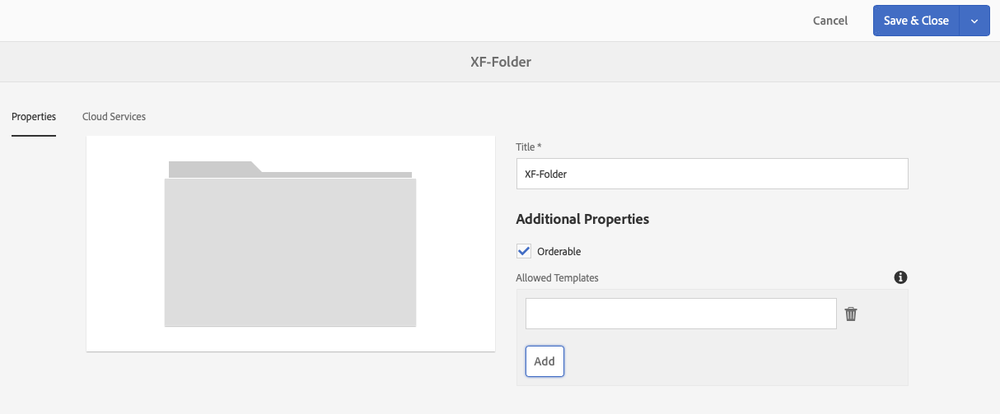
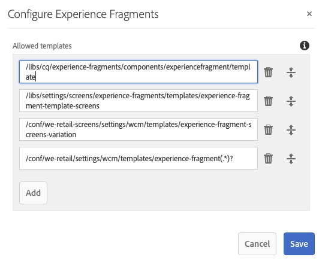
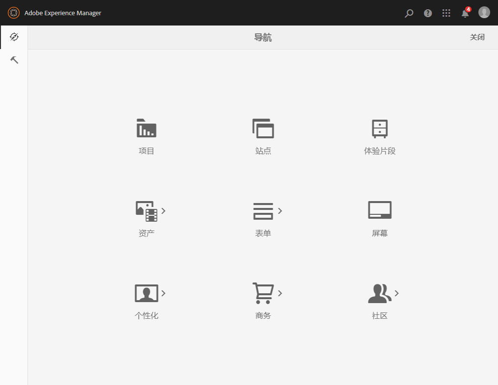
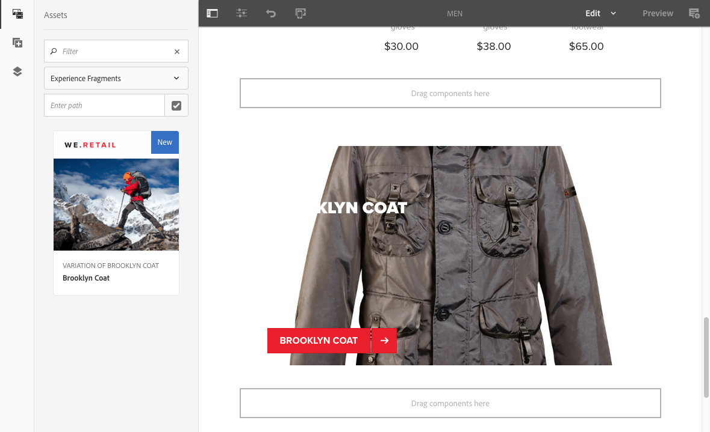

# 体验片段{#experience-fragments}

>[!CAUTION]
>
>AEM 6.4已结束扩展支持，本文档将不再更新。 有关更多详细信息，请参阅 [技术支助期](https://helpx.adobe.com/cn/support/programs/eol-matrix.html). 查找支持的版本 [此处](https://experienceleague.adobe.com/docs/).

体验片段是由一个或多个组件组成的组，这些组件包括可在页面中引用的内容和布局。 它们可以包含任何组件。

体验片段：

* 是体验（页面）的一部分。
* 可跨多个页面使用。
* 基于模板（仅可编辑）来定义结构和组件。
* 由段落系统中一个或多个具有布局的组件组成。
* 可以包含其他体验片段。
* 可以与其他组件（包括其他体验片段）组合，以形成完整的页面（体验）。
* 可以具有不同的变体，这些变体可能共享内容和/或组件。
* 可以划分为可在片段的多个变体中使用的构建基块。

您可以使用体验片段：

* 如果作者希望重复使用页面的各个部分（体验的片段），则需要复制并粘贴该片段。 创建并维护这些复制/粘贴体验非常费时，而且容易导致用户错误。体验片段无需复制/粘贴。
* 支持 headless CMS 用例。
作者希望仅将 AEM 用于创作，而不是用于提供给客户。第三方系统/触点会使用该体验，然后将其提供给最终用户。

>[!NOTE]
>
>对体验片段的写访问权限要求在组中注册用户帐户：
>
>`experience-fragments-editors`
>
>如果您遇到任何问题，请联系您的系统管理员。

## 何时应使用体验片段？ {#when-should-you-use-experience-fragments}

体验片段的使用说明：

* 当您想要重复使用体验时。

   * 将重复使用且内容相同或相似的体验

* 当您使用 AEM 作为第三方的内容投放平台时。

   * 任何需要使用 AEM 作为内容投放平台的解决方案
   * 在第三方触点中嵌入内容

* 如果您的体验具有不同的变体或演绎版。

   * 特定于渠道或上下文的变量
   * 对组有意义的体验（例如，跨渠道具有不同体验的营销活动）

* 当您使用全渠道商业时。

   * 在社交媒体渠道中大规模共享商务相关内容
   * 使接触点具有事务性

## 组织您的体验片段 {#organizing-your-experience-fragments}

建议执行以下操作：
* 使用文件夹组织您的体验片段；

* [在这些文件夹中配置允许的模板](#configure-allowed-templates-folder)。

创建文件夹允许您：

* 为您的体验片段创建有意义的结构；例如，根据分类

   >[!NOTE]
   >
   >无需将体验片段的结构于站点的页面结构保持一致。

* [在文件夹级别分配允许的模板](#configure-allowed-templates-folder)

   >[!NOTE]
   >
   >您可以使用[模板编辑器](/help/sites-authoring/templates.md)创建自己的模板。

以下示例显示了根据 `Contributors`. 使用的结构还说明了如何使用其他功能，如多站点管理（包括语言副本）。

>[!CAUTION]
>
>以下屏幕截图是使用Adobe Experience Manager as a Cloud Service从WKND站点拍摄的。

## 为体验片段创建和配置文件夹 {#creating-and-configuring-a-folder-for-your-experience-fragments}

要为体验片段创建和配置文件夹，建议执行以下操作：

1. [创建文件夹](/help/sites-authoring/managing-pages.md#creating-a-new-folder)。

1. [为该文件夹配置允许的体验片段模板](#configure-allowed-templates-folder)。

>[!NOTE]
>
>还可以配置 [实例允许的模板](#configure-allowed-templates-instance)，但此方法 **not** 建议使用，因为升级时可能会覆盖这些值。

### 为文件夹配置允许的模板 {#configure-allowed-templates-folder}

>[!NOTE]
>
>这是指定&#x200B;**[!UICONTROL 允许的模板]**&#x200B;的推荐方法，因为升级时不会覆盖这些值。

1. 导航到所需的&#x200B;**[!UICONTROL 体验片段]**&#x200B;文件夹。

1. 选择文件夹，然后选择&#x200B;**[!UICONTROL 属性]**。

1. 在&#x200B;**[!UICONTROL 允许的模板]**&#x200B;字段中指定用于检索所需模板的正则表达式。

   例如：
   `/conf/(.*)/settings/wcm/templates/experience-fragment(.*)?`

   

1. 选择&#x200B;**[!UICONTROL 保存并关闭]**。

### 为实例配置允许的模板 {#configure-allowed-templates-instance}

>[!CAUTION]
>
>不建议更改 **[!UICONTROL 允许的模板]** 使用此方法，因为指定的模板在升级时可能会被覆盖。
>
>此对话框仅供参考之用。

1. 导航到所需的&#x200B;**[!UICONTROL 体验片段]**&#x200B;控制台。

1. 选择&#x200B;**[!UICONTROL 配置选项]**：

   

1. 在&#x200B;**[!UICONTROL 配置体验片段]**&#x200B;对话框中指定所需的模板：

   

1. 选择&#x200B;**[!UICONTROL 保存]**。

## 创建体验片段 {#creating-an-experience-fragment}

要创建体验片段，请执行以下操作：

1. 从全局导航中选择&#x200B;**[!UICONTROL 体验片段]**。

   

1. 导航到所需的文件夹并选择 **[!UICONTROL 创建]**.

1. 选择&#x200B;**[!UICONTROL 体验片段]**，以打开&#x200B;**[!UICONTROL 创建体验片段]**&#x200B;向导。

   选择所需的&#x200B;**[!UICONTROL 模板]**，然后选择&#x200B;**[!UICONTROL 下一步]**：

   

1. 输入&#x200B;**[!UICONTROL 体验片段]**&#x200B;的属性。

   A **[!UICONTROL 标题]** 为必填项。 如果 **[!UICONTROL 名称]** 留空，它将从 **[!UICONTROL 标题]**.

   

1. 单击&#x200B;**[!UICONTROL 创建]**。

   将显示一条消息。 选择:

   * **[!UICONTROL 完成]**，可返回至控制台
   * **[!UICONTROL 打开]**，可打开片段编辑器

## 编辑您的体验片段 {#editing-your-experience-fragment}

体验片段编辑器提供了与普通页面编辑器类似的功能。 请参阅 [编辑页面内容](/help/sites-authoring/editing-content.md) 以了解有关如何使用它的更多信息。

以下示例过程说明了如何为产品创建Teaser:

1. 拖放 **[!UICONTROL 类别Teaser]** 从 [组件浏览器](/help/sites-authoring/author-environment-tools.md#components-browser).

   

1. 选择 **[[!UICONTROL 配置]](/help/sites-authoring/editing-content.md#edit-configure-copy-cut-delete-paste)** 中。
1. 添加&#x200B;**[!UICONTROL 资产]**，并根据需要定义&#x200B;**[!UICONTROL 属性]**。
1. 使用确认定义 **[!UICONTROL 完成]** （勾号图标）。
1. 根据需要添加更多组件。

## 创建体验片段变体 {#creating-an-experience-fragment-variation}

您可以根据自己的需求创建体验片段的变体：

1. 打开片段 [编辑](/help/sites-authoring/experience-fragments.md#editing-your-experience-fragment).
1. 打开&#x200B;**[!UICONTROL 变体]**&#x200B;选项卡。

   

1. **创建** 允许您创建：

   * **[!UICONTROL 变体]**
   * **[!UICONTROL live-copy 形式的变量]**.

1. 定义所需的属性：

   * **[!UICONTROL 模板]**
   * **[!UICONTROL 标题]**
   * **[!UICONTROL 名称]**;如果留空，则从“标题”派生
   * **[!UICONTROL 描述]**
   * **[!UICONTROL 变体标记]**

   

1. 使用确认 **[!UICONTROL 完成]** （勾号图标），则新变量将显示在面板中：

   

## 使用您的体验片段 {#using-your-experience-fragment}

您现在可以在创作页面时使用您的体验片段：

1. 打开任意页面进行编辑。

   例如： [http://localhost:4502/editor.html/content/we-retail/language-masters/en/products/men.html](http://localhost:4502/editor.html/content/we-retail/language-masters/en/products/men.html)

1. 通过将组件从组件浏览器拖动到页面段落系统，创建体验片段组件的实例：

   

1. 向组件实例添加实际的体验片段；通过：

   * 将所需片段从资产浏览器拖放到组件上
   * 选择 **[!UICONTROL 配置]** 从组件工具栏中，指定要使用的片段，使用确认 **完成** （勾号）

   

   >[!NOTE]
   >
   >组件工具栏中的“编辑”将用作在片段编辑器中打开片段的快捷方式。

## 构建块 {#building-blocks}

您可以选择一个或多个组件来创建用于在片段中回收的构建块：

### 创建构建块 {#creating-a-building-block}

要创建构建块，请执行以下操作：

1. 在体验片段编辑器中，选择要重复使用的组件：

   

1. 从组件工具栏中选择&#x200B;**[!UICONTROL 转换为构建块]**：

   

   例如：

   

1. 输入&#x200B;**[!UICONTROL 构建块]**&#x200B;的名称，然后使用&#x200B;**[!UICONTROL 转换]**&#x200B;进行确认：

   

1. **构建基块**&#x200B;将显示在选项卡中，并可在段落系统中进行选择：

   

### 管理构建块 {#managing-a-building-block}

您的构建块会显示在&#x200B;**[!UICONTROL 构建块]**&#x200B;选项卡中。对于每个块，可以执行以下操作：

* 转至母版：在新选项卡中打开母版变体
* 重命名
* 删除

### 使用构建块 {#using-a-building-block}

您可以将构建块拖动到任何片段的段落系统，就像对任何组件一样。

## 纯 HTML 演绎版 {#the-plain-html-rendition}

使用 `.plain.` 选择器中，您可以访问纯HTML呈现版本。

可以从浏览器获取该功能，但其主要用途是允许其他应用程序（例如，第三方Web应用程序、自定义移动设备实施）仅使用URL直接访问体验片段的内容。

纯HTML呈现将协议、主机和上下文路径添加到以下路径：

* 类型： `src`, `href`或 `action`

* 或结束于： `-src`或 `-href`

例如：

`.../brooklyn-coat/master.plain.html`

>[!NOTE]
>
>链接始终引用发布实例。 这些链接将由第三方使用，因此链接将始终从发布实例中调用，而不是从作者调用。

## 导出体验片段 {#exporting-experience-fragments}

默认情况下，体验片段以HTML格式交付。 此操作可同时由AEM和第三方渠道使用。

要导出到Adobe Target，请使用HTML。 请参阅 [Target与体验片段集成](/help/sites-administering/experience-fragments-target.md) 以了解完整信息。
