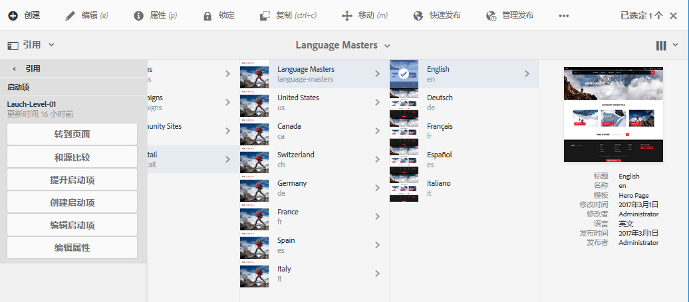
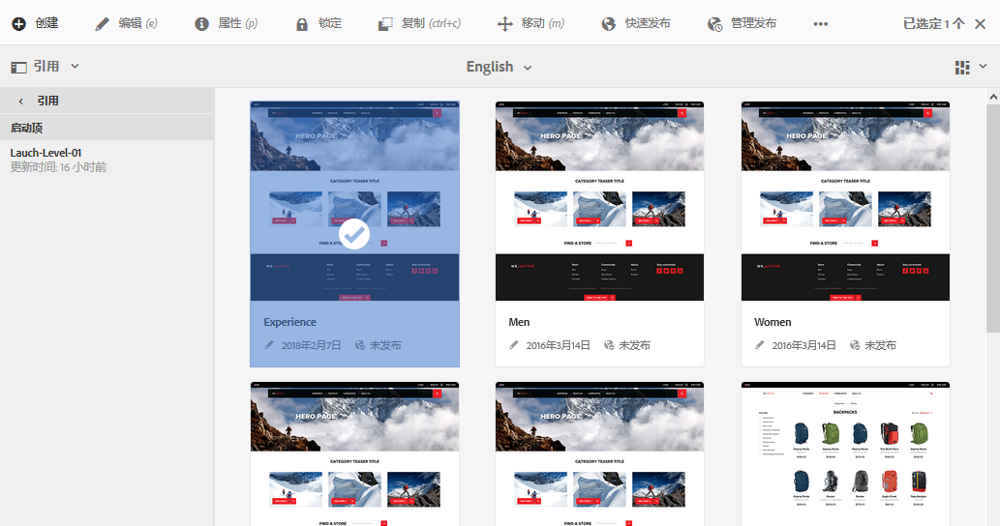

# 编辑启动项{#editing-launches}

>[!CAUTION]
>
>AEM 6.4已结束扩展支持，本文档将不再更新。 有关更多详细信息，请参阅 [技术支助期](https://helpx.adobe.com/cn/support/programs/eol-matrix.html). 查找支持的版本 [此处](https://experienceleague.adobe.com/docs/).

## 编辑启动页面 {#editing-launch-pages}

为页面（或一组页面）创建启动项后，您可以编辑页面启动项副本中的内容。

1. [从“引用”（站点控制台）中访问启动项](/help/sites-authoring/launches.md#launches-in-references-sites-console)以显示可用的操作。
1. 选择 **转到页面** 打开页面进行编辑。

### 编辑基于 Live Copy 的启动页面 {#editing-launch-pages-subject-to-a-live-copy}

如果您的启动基于 [live copy](/help/sites-administering/msm.md) 然后，您将：

* 在编辑组件（内容和/或属性）时，请参阅锁符号（小挂锁）。
* 请参阅 **Live Copy** 选项卡 **页面属性**

Live Copy 用于将&#x200B;**&#x200B;源分支&#x200B;**&#x200B;中的内容同步到启动分支（以使启动项与源中所做的更改保持最新）。

您可以采用与编辑标准Live Copy相同的方式进行更改；例如：

* 单击已关闭的挂锁将中断此同步，并允许您对启动项中的内容进行新更新。 解锁（打开挂锁）后，您所做的更改将不会被源分支中同一位置所做的任何更改覆盖。
* 特定页面的&#x200B;**暂停**（和&#x200B;**继续**）继承。

请参阅 [更改Live Copy内容](/help/sites-administering/msm-livecopy.md#changing-live-copy-content) 以了解更多信息。

## 比较启动页面与其源页面 {#comparing-a-launch-page-to-its-source-page}

要跟踪您所做的更改，您可以在&#x200B;**引用**&#x200B;中查看启动项，并将启动页面与其源页面进行比较：

1. 在 **站点** 控制台， [导航到启动项的源页面并将其选中](/help/sites-authoring/basic-handling.md#viewing-and-selecting-resources).
1. 打开 **[引用](/help/sites-authoring/basic-handling.md#references)** 面板和选择 **启动项**.
1. 选择您的特定启动项，然后 **与源比较**:

   

1. 将并排打开两个页面（启动项和源）。

   有关使用此功能的完整信息，请参阅 [页面差异](/help/sites-authoring/page-diff.md).

## 更改使用的源页面 {#changing-the-source-pages-used}

您可以随时向启动项的源页面范围中添加页面或从中删除页面：

1. 从以下任一位置访问并选择启动项：

   * the [启动项控制台](/help/sites-authoring/launches.md#the-launches-console):

      * 选择&#x200B;**编辑**。
   * [引用（站点控制台）](/help/sites-authoring/launches.md#launches-in-references-sites-console) 要显示可用的操作，请执行以下操作：

      * 选择&#x200B;**编辑启动项**。

   将显示源页面。

1. 进行所需的更改，然后使用&#x200B;**保存**&#x200B;进行确认。

   >[!NOTE]
   >
   >要将页面添加到启动项，页面必须位于通用语言根目录下；即在单个网站中。

## 编辑启动配置 {#editing-a-launch-configuration}

您可以随时编辑启动项的属性：

1. 从以下任一位置访问并选择启动项：

   * the [启动项控制台](/help/sites-authoring/launches.md#the-launches-console):

      * 选择 **属性**.
   * [引用（站点控制台）](/help/sites-authoring/launches.md#launches-in-references-sites-console) 要显示可用的操作，请执行以下操作：

      * 选择&#x200B;**编辑属性**。

   将显示详细信息。

1. 进行所需的更改，然后使用&#x200B;**保存**&#x200B;进行确认。

   有关启 [动日期和生产就绪字段的用途和交互的信息](/help/sites-authoring/launches.md#launches-the-order-of-events)******** ，请参阅启动项——事件的顺序。

## 了解页面的启动状态 {#discovering-the-launch-status-of-a-page}

当您从引用选项卡中选择特定的启动项时，将显示状态(请参阅 [引用中的启动项（站点控制台）](/help/sites-authoring/launches.md#launches-in-references-sites-console))。

