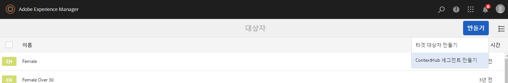
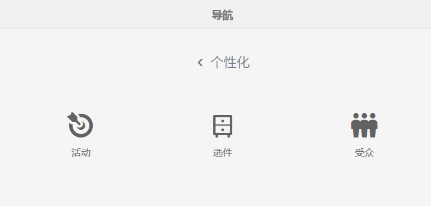
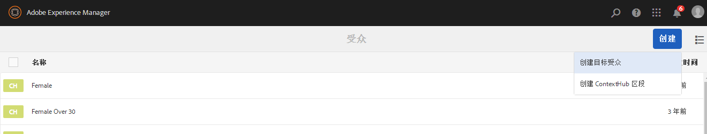

# 管理受众{#managing-audiences}

>[!CAUTION]
>
>AEM 6.4已结束扩展支持，本文档将不再更新。 有关更多详细信息，请参阅 [技术支助期](https://helpx.adobe.com/cn/support/programs/eol-matrix.html). 查找支持的版本 [此处](https://experienceleague.adobe.com/docs/).

通过“受众”控制台，您可以创建、组织和管理Adobe Target帐户的受众，或管理ContextHub或Client Context的区段：

* 添加受众 — Adobe Target受众或ContextHub区段。
* 管理受众。

受众，称为 *区段* 在ContextHub和Client Context中，是由特定条件定义的一类访客，可确定哪些人会看到目标活动。 定位活动时，您可以直接在“定位”流程中选择受众，也可以在“受众”控制台中创建新受众。

在“受众”控制台中，受众按品牌进行组织。

在“定位”模式下，可以使用受众来[创作目标内容](/help/sites-authoring/content-targeting-touch.md)，您也可以在该模式下创建受众（但您需要在“受众”控制台中创建 Adobe Target 受众）。在“定位”模式下创建的受众将显示在“受众”控制台中。

受众会显示一个标签，用于描述定义的受众类型：

* CH - ContextHub区段
* CC - Client Context区段
* AT - Adobe Target受众

## 在“受众”控制台中创建ContextHub区段 {#creating-a-contexthub-segment-in-the-audiences-console}

您可以在“受众”控制台中或在定位过程中创建ContextHub区段。

要在“受众”控制台中创建 ContextHub 区段，请执行以下操作：

1. 在“导航”控制台中，单击或点按&#x200B;**个性化**。单击或点按&#x200B;**受众**。
1. 点按或单击&#x200B;**创建 ContextHub 区段**。

   

1. 在&#x200B;**新 ContextHub 区段**&#x200B;对话框中，输入标题并调整提升，然后单击&#x200B;**创建**。新 ContextHub 区段随即会显示在受众列表中。

   >[!NOTE]
   >
   >您可以通过点按或单击&#x200B;**已修改**&#x200B;来对修改列表进行降序排序，以查看任何新创建的受众。

有关使用ContextHub创建区段的更多详细信息，请参阅 [使用ContextHub配置分段](/help/sites-administering/segmentation.md) 文档。

## 使用受众控制台创建Adobe Target受众 {#creating-an-adobe-target-audience-using-the-audience-console}

您可以使用“受众”控制台直接在AEM中创建Adobe Target受众。

受众由确定目标活动中包含哪些访客的规则来定义。 受众定义可以包含多个规则，每个规则可以包含多个参数。

当您使用多个规则时，这些规则将由布尔运算符AND组合，这意味着任何潜在受众成员都必须满足要包含在活动中的所有定义条件。 例如，如果您定义操作系统规则和浏览器规则，则活动中只包含同时使用定义的操作系统和定义浏览器的访客。

>[!NOTE]
>
>如果“创建”菜 **单中未显示** “创建 **** 目标受众”，则您没有创建受众的必要权限。 您需要在 **/etc/segmentation** 才能创建受众。 默认情况下，组内容作者具有写权限。

要创建 Adobe Target 受众，请执行以下操作：

1. 在“导航”控制台中，单击或点按&#x200B;**个性化**。单击或点按&#x200B;**受众**。

   

1. 在“受众”控制台中，依次点按或单击&#x200B;**创建**&#x200B;和&#x200B;**创建目标受众**。

   

1. 在 **Adobe Target配置** 对话框中，选择目标配置，然后点按或单击 **确定**.
1. 在规则#1区域，点按或单击属性类型，然后在可用的字段中输入任何属性信息。 完成后，选择属性右侧的复选标记以保存。 请参阅 [属性及其选项](#attributes-and-their-options) 以了解有关所有属性的信息。
1. 单击 **添加规则** ，以添加其他规则。 根据需要输入任意数量的规则。 规则与布尔运算符AND相结合，这意味着受众必须满足每个规则的所有要求才能符合活动条件。
1. 点按或单击&#x200B;**下一步**。
1. 输入受众的名称，然后点按或单击 **保存**.
1. 点按或单击&#x200B;**保存**。您的受众列在受众列表中。

### 属性及其选项 {#attributes-and-their-options}

您可以为以下每个属性创建定位规则：

| **属性** | **描述** | **有关更多信息** |
|---|---|---|
| **移动设备** | 根据移动设备、设备类型、设备供应商、屏幕尺寸（按像素）等参数定位移动设备。 | 请参阅 Adobe Target 上的[移动设备文档](https://experienceleague.adobe.com/docs/target/using/audiences/create-audiences/categories-audiences/mobile.html)。 |
| **自定义** | 自定义参数都是 mbox 参数。如果您将任何 mbox 参数传递给 mbox，或者使用 targetPageParams 函数，这些参数将会显示在此处以供在受众中使用。 | 请参阅 Adobe Target 上的[自定义参数文档](https://experienceleague.adobe.com/docs/target/using/audiences/create-audiences/categories-audiences/custom-parameters.html)。 |
| **操作系统** | 您可以定位使用特定操作系统的访客。 | 定位使用 Linux、Macintosh 或 Windows 的用户。 |
| **站点页面** | 定位特定页面的访客或具有特定 mbox 参数的访客。 | 请参阅 Adobe Target 上的[站点页面文档](https://experienceleague.adobe.com/docs/target/using/audiences/create-audiences/categories-audiences/site-pages.html)。 |
| **浏览器** | 您可以定位在访问您的页面时使用特定浏览器或特定浏览器选项的用户。 | 请参阅 Adobe Target 上的[浏览器选项文档](https://experienceleague.adobe.com/docs/target/using/audiences/create-audiences/categories-audiences/browser.html)。 |
| **访客配置文件** | 定位满足特定配置文件参数的访客。 | 请参阅 Adobe Target 上的[访客配置文件文档](https://experienceleague.adobe.com/docs/target/using/audiences/visitor-profiles/visitor-profile.html)。 |
| **流量源** | 根据将访客转至您的站点的搜索引擎或登陆页来定位访客。 | 请参阅 Adobe Target 上的[流量源文档](https://experienceleague.adobe.com/docs/target/using/audiences/create-audiences/categories-audiences/traffic-sources.html)。 |

## 在受众控制台中修改受众 {#modifying-an-audience-in-the-audiences-console}

>[!NOTE]
>
>您只能编辑在所编辑的同一AEM实例中创建的Adobe Target受众。 无法编辑在不同AEM环境中创建的Target受众。

您可以从“受众”控制台中编辑任何ContextHub或Client Context受众。 您可以编辑Adobe Target受众，但只能编辑在AEM中创建的受众：

1. 在“导航”控制台中，单击或点按&#x200B;**个性化**。单击或点按&#x200B;**受众**。
1. 点按或单击要编辑的ContextHub或Client Context区段旁边的图标，然后点按或单击 **编辑**.
1. 在区段编辑器中进行任何编辑。请参阅 [Client Context](/help/sites-administering/campaign-segmentation.md) 或 [ContextHub](/help/sites-administering/contexthub-config.md) 文档。
