# 创意项目和PIM集成{#creative-project-and-pim-integration}

>[!CAUTION]
>
>AEM 6.4已结束扩展支持，本文档将不再更新。 有关更多详细信息，请参阅 [技术支助期](https://helpx.adobe.com/cn/support/programs/eol-matrix.html). 查找支持的版本 [此处](https://experienceleague.adobe.com/docs/).

如果您是营销人员或创意专业人士，则可以使用Adobe Experience Manager(AEM)中的创意项目工具来管理与电子商务相关的产品摄影以及组织内相关的创意流程。

特别是，您可以使用创意项目简化照片拍摄工作流中的以下任务：

* 生成照片拍摄请求
* 上传照片拍摄
* 协作拍摄照片
* 打包已批准的资产

>[!NOTE]
>
>请参阅 [项目用户角色以了解信息](/help/sites-authoring/projects.md#user-roles-in-a-project) 为特定类型的用户分配用户角色和工作流时，不会将这些工作流分配给用户。

## 浏览产品照片拍摄工作流  {#exploring-product-photo-shoot-workflows}

创意项目提供了各种项目模板，以满足各种项目要求。 **产品照片拍摄项目**模板现成可用。 此模板包含照片拍摄工作流，可让您启动和管理产品照片拍摄请求。 它还包含一系列任务，使您能够通过适当的审核和批准流程来获取产品的数字图像。

模板包括以下工作流：

* **产品照片拍摄（商务集成）工作流**:此工作流利用与产品信息管理(PIM)系统的商务集成，为选定产品（层次结构）自动生成拍摄列表。 完成工作流后，您可以在资产元数据中查看产品数据。
* **产品照片拍摄工作流**:利用此工作流，可提供拍摄列表，而不依赖于商务集成。 它会将上传的图像映射到项目资产文件夹中的CSV文件。

>[!NOTE]
>
>在产品照片拍摄工作流的上传拍摄列表任务中上传的CSV文件的文件名应为shotlist.csv。

## 创建产品照片拍摄项目 {#create-a-product-photo-shoot-project}

1. 在 **项目** 控制台，点按/单击 **创建** 然后选择 **创建项目** 列表。

   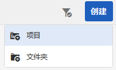

1. 在 **创建项目** ，选择照片拍摄项目模板，然后点按/单击 **下一个**.

   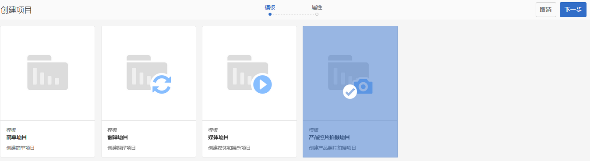

1. 输入项目详细信息，包括标题、说明和到期日期。 添加用户并为其分配各种角色。 您还可以为项目添加缩略图。

   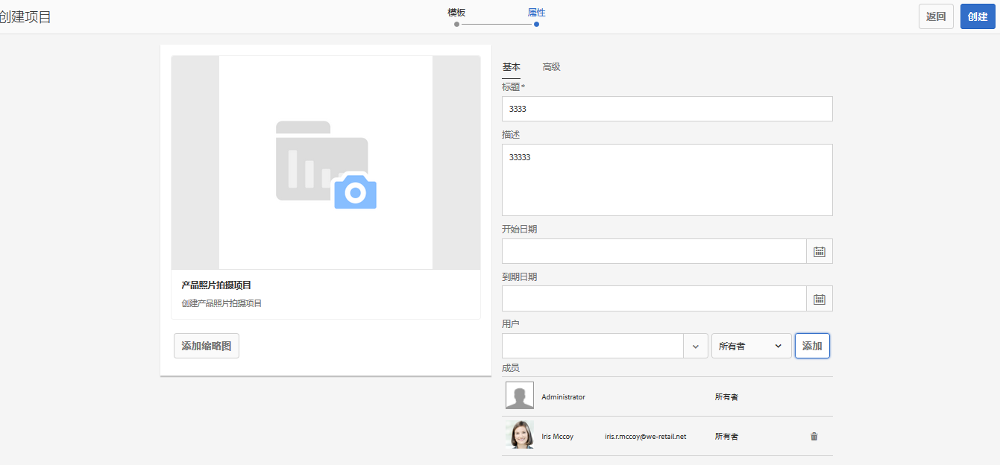

1. 点按/单击&#x200B;**创建**。确认消息会通知已创建项目。
1. 点按/单击 **完成** 返回 **项目** 控制台。 或者，点按/单击 **打开** 查看照片拍摄项目中的资产。

## 在产品照片拍摄项目中开始工作 {#starting-work-in-a-product-photo-shoot-project}

要启动照片拍摄请求，请点按或单击某个项目，然后点按/单击 **添加工作** 以启动工作流。

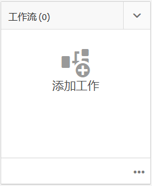

产品照片拍摄项目包括以下现成的工作流：

* 产品照片拍摄（商务集成）工作流
* 产品照片拍摄工作流

使用产品照片拍摄（商务集成）工作流将图像资产与AEM中的产品进行映射。 此工作流可利用商务集成将已批准的图像链接到位置的现有产品数据 */etc/commerce*.

产品照片拍摄（商务集成）工作流包含以下任务：

* 创建拍摄列表
* 上传照片拍摄
* 修饰照片拍摄
* 审核和批准
* 移动到生产任务

如果AEM中没有产品信息，请使用产品照片拍摄工作流，根据您在CSV文件中上传的详细信息，将图像资产与产品进行映射。 CSV文件必须包含基本的产品信息，如产品ID、类别和描述。 工作流会获取产品的已批准资产。

此工作流包含以下任务：

* 上传拍摄列表
* 上传照片拍摄
* 修饰照片拍摄
* 审核和批准
* 移动到生产任务

您可以使用工作流配置选项自定义此工作流。

两个工作流都包括将产品与其批准的资产相关联的步骤。 每个工作流包含以下步骤：

* 工作流配置：介绍用于自定义工作流的选项
* 启动项目工作流：说明如何启动产品照片拍摄
* 工作流任务详细信息：提供工作流中可用任务的详细信息

## 跟踪项目进度 {#tracking-project-progress}

您可以通过监控项目中的活动/已完成任务来跟踪项目的进度。

使用以下方法监控项目进度：

* **任务卡**

* **任务列表**

任务卡描述项目的整体进度。 仅当项目具有任何相关任务时，它才会显示在“项目详细信息”页面上。 任务卡根据已完成的任务数显示项目的当前完成状态。 它不包括将来的任务。

任务卡提供以下详细信息：

* 活动任务的百分比
* 已完成任务的百分比

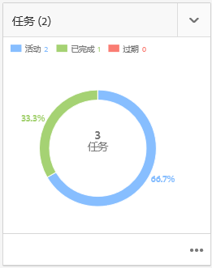

任务列表提供有关项目当前活动工作流任务的详细信息。 要显示该列表，请点按/单击任务卡。 任务列表还显示元数据，如开始日期、到期日期、被分派人、优先级和任务状态。

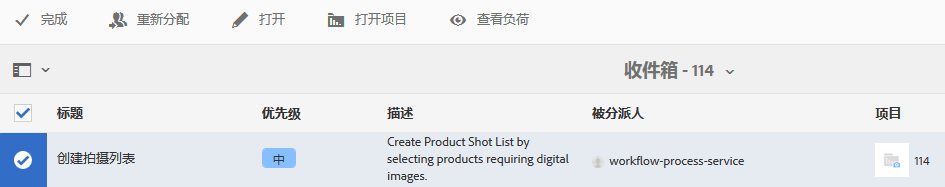

## 工作流程配置 {#workflow-configuration}

此任务包括根据用户的角色为用户分配工作流步骤。

配置 **产品照片拍摄** 工作流：

1. 导航到 **工具** > **工作流**，然后点按 **模型** 用于打开的拼贴 **工作流模型** 页面。
1. 选择 **产品照片拍摄** 工作流，然后点按 **编辑** 图标以在编辑模式下将其打开。

   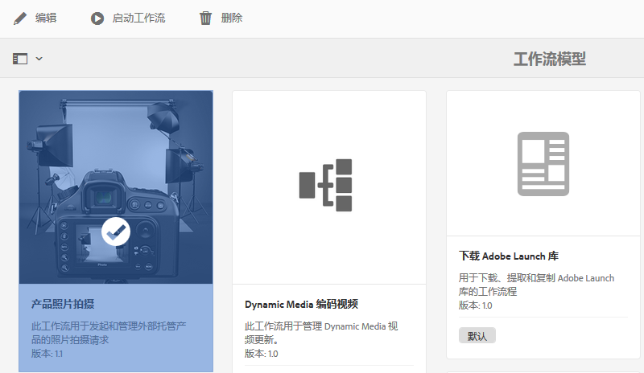

1. 在 **产品照片拍摄工作流** ，打开项目任务。 例如，打开 **上传拍摄列表** 任务。

   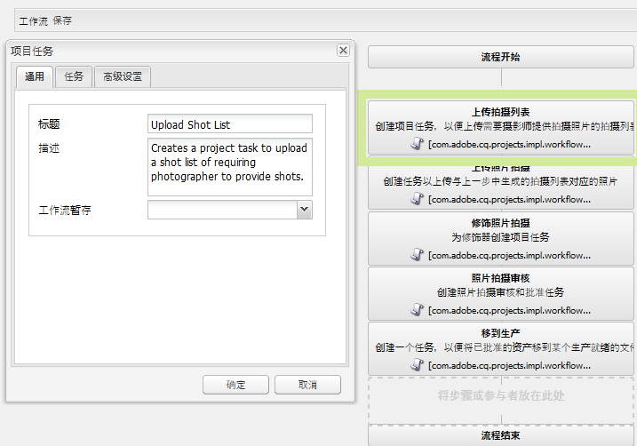

1. 单击 **任务** 选项卡，以配置以下内容：

   * 任务的名称
   * 接收任务的默认用户（角色）
   * 任务的默认优先级，该优先级显示在用户的任务列表中
   * 任务描述，在被分派人打开任务时显示
   * 任务的到期日期，根据任务开始的时间计算

1. 单击 **确定** 以保存配置设置。

   同样，您也可以为 **产品照片拍摄** 工作流：

   * 上传照片拍摄
   * 修饰产品照片拍摄
   * 照片拍摄审核
   * 迁移到生产环境

   执行类似的过程，以在 **产品照片拍摄（商务集成）工作流**.

本节介绍如何将产品信息管理与您的创意项目集成。

## 启动项目工作流 {#starting-a-project-workflow}

1. 导航到产品照片拍摄项目，然后点按/单击 **添加工作** 图标 **工作流** 卡。
1. 选择 **产品照片拍摄（商务集成）** 用于启动产品照片拍摄（商务集成）工作流的工作流卡。 如果/etc/commerce下没有产品信息，请选择 **产品照片拍摄** 工作流，并启动产品照片拍摄工作流。

   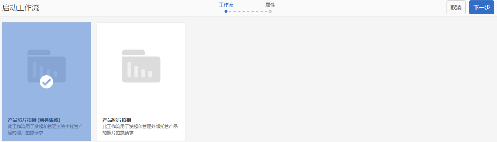

1. 点按/单击 **下一个** 以在项目中启动工作流。
1. 在下一页输入工作流详细信息。

   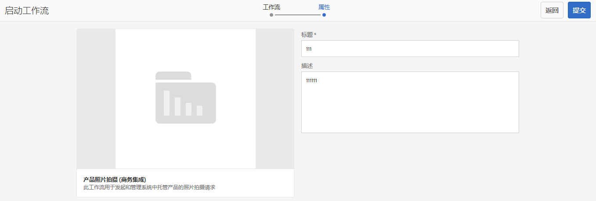

   单击 **提交** 以启动照片拍摄工作流。 此时会显示照片拍摄项目的项目详细信息页面。

   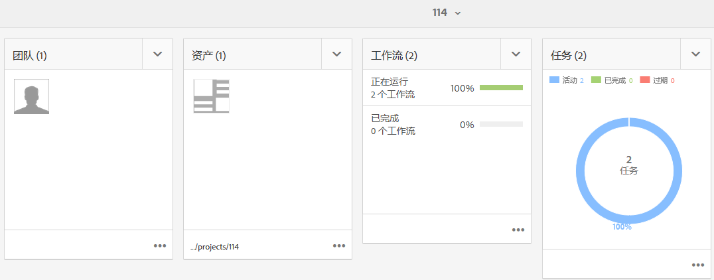

### 工作流任务详细信息 {#workflow-tasks-details}

照片拍摄工作流包含多项任务。 每个任务都根据为任务定义的配置分配给用户组。

#### 创建拍摄列表任务 {#create-shot-list-task}

的 **创建拍摄列表** 任务允许项目所有者选择需要图像的产品。 根据用户选择的选项，将生成一个包含基本产品信息的CSV文件。

1. 在项目文件夹中，点按/单击 [任务卡](#tracking-project-progress) 查看工作流中的任务项。

   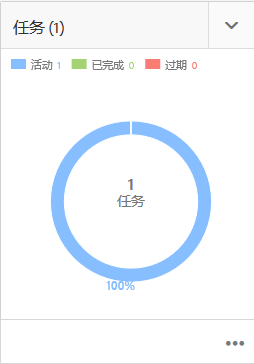

1. 选择 **创建拍摄列表** 任务，然后点按/单击 **打开** 图标。

   

1. 查看任务详细信息，然后点按/单击 **创建拍摄列表** 按钮。

   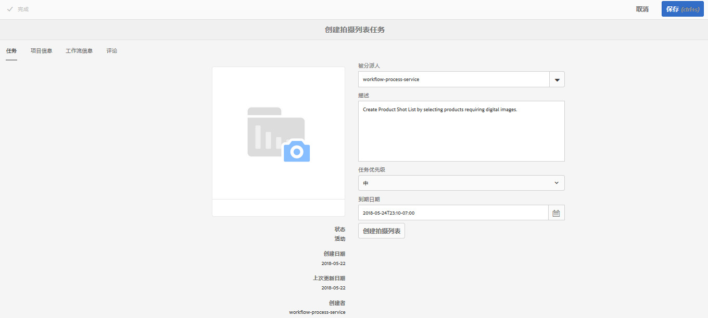

1. 选择存在产品数据但没有关联图像的产品。

   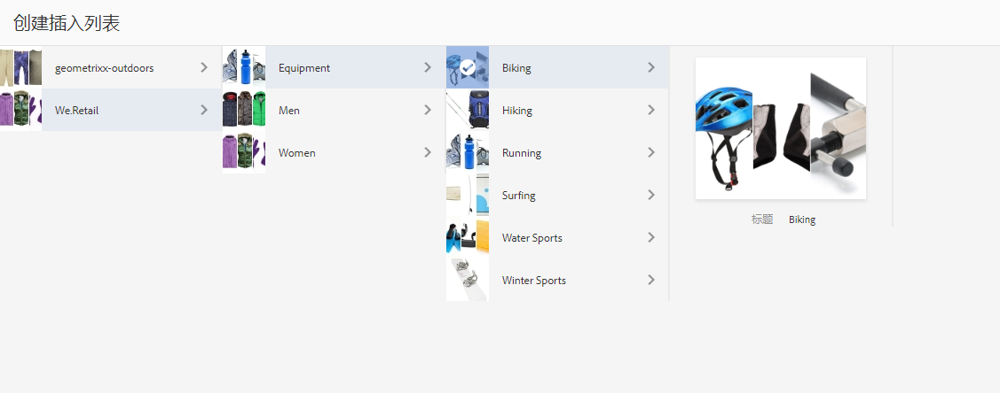

1. 点按/单击 **添加到拍摄列表** 图标创建包含所有此类产品列表的CSV文件。 系统会显示一条消息，确认已为选定的产品创建拍摄列表。 单击 **关闭** 以完成工作流。
1. 创建拍摄列表后， **查看拍摄列表** 链接。 要向拍摄列表添加更多产品，请点按/单击 **添加到拍摄列表**. 在这种情况下，数据会附加到最初创建的拍摄列表。

   

1. 点按/单击 **查看拍摄列表** 查看新拍摄列表。

   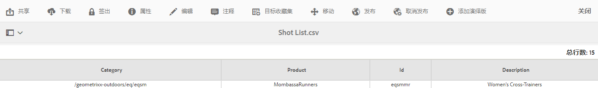

   要编辑现有数据或添加新数据，请点按/单击 **编辑** 中。 仅**产品**和 **描述** 字段可编辑。

   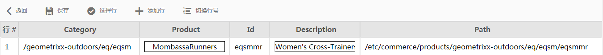

   更新文件后，点按/单击 **保存** 来保存文件。

1. 添加产品后，点按/单击 **完成** “创建拍摄列表”**“任务详细信息”**页上的图标，将任务标记为已完成。 您可以添加可选注释。

   任务的完成在项目中引入了以下更改：

   * 与产品层次结构对应的资产会在与工作流标题同名的文件夹中创建。
   * 资产的元数据会使用“资产”控制台变得可编辑，即使摄影师没有提供图像也是如此。
   * 将创建一个照片拍摄文件夹，用于存储摄影师提供的图像。 照片拍摄文件夹包含拍摄列表中每个产品条目的子文件夹。

   对于产品照片拍摄（无商务集成）工作流，上传拍摄列表是第一项任务。 点按/单击 **上传拍摄列表** 上载 **shotlist.csv** 文件。 CSV文件应包含产品ID。 其他字段为可选字段。 您可以使用这些资产将资产映射到产品。

### 上传拍摄列表任务 {#upload-shot-list-task}

此任务是产品照片拍摄工作流的一部分。 如果产品信息在AEM中不可用，则执行此任务。 在这种情况下，您需要以CSV文件形式上传需要图像资产的产品列表。 根据CSV文件中的详细信息，您可以将图像资产与产品进行映射。

使用 **查看拍摄列表** 链接（位于上一步中的项目卡片下）以下载CSV示例文件。 查看样例文件，了解CSV文件的常见内容。

产品列表或CSV文件可以包含字段，例如 **类别、产品、Id、描述**&#x200B;和 **路径**. 的 **Id** 字段为必填字段，且包含产品ID。 其他字段为可选字段。

产品可以属于特定类别。 产品类别可以以CSV格式列出，其中 **类别** 列。 的 **产品** 字段中包含产品的名称。 在 **描述** 字段中，输入产品说明或摄影师说明。

>[!NOTE]
>
>要上传的图像名称应以“**&lt;productid>_&quot;** 其中，产品ID引用自 **Id** 字段 *shotlist.csv* 文件。 例如，对于拍摄列表中的产品， **编号397122**，则可以上传具有名称的文件 **397122_highcontrast.jpg**, **397122_lowlight.png**，等等。

1. 在项目文件夹中，点按/单击 [任务卡](#tracking-project-progress) 查看工作流中的任务列表。
1. 选择 **上传拍摄列表** 任务，然后点按/单击 **打开** 图标。

   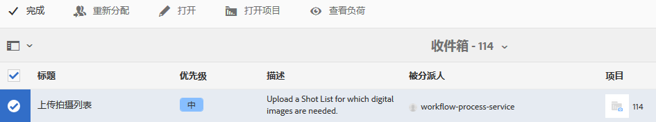

1. 查看任务详细信息，然后点按/单击 **上传拍摄列表** 按钮。

   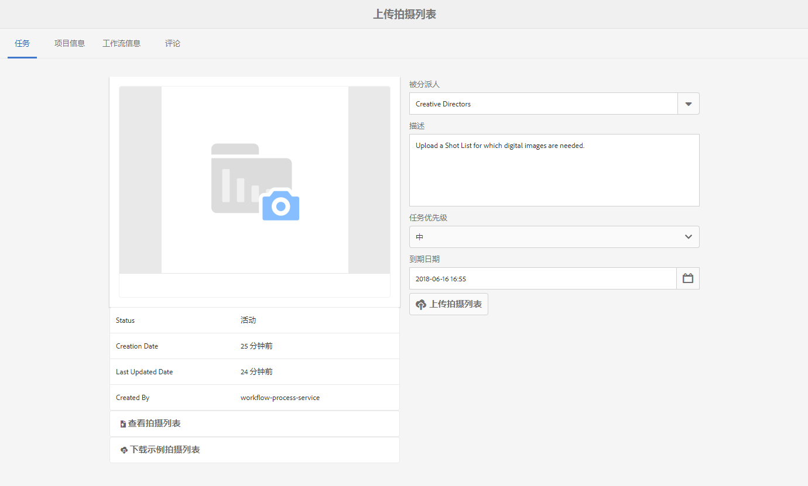

1. 点按/单击 **上传拍摄列表** 按钮上传文件名为shotlist.csv的CSV文件。 工作流会将此文件识别为用于提取下一项任务的产品数据的源。
1. 上传包含相应格式产品信息的CSV文件。 上传CSV文件后，卡片下会显示**查看已上传的资产**链接。

   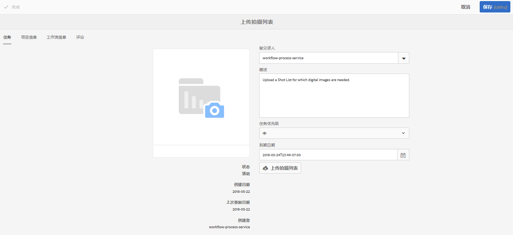

   单击 **完成** 图标以完成任务。

1. 点按/单击 **完成** 图标以完成任务。

### 上传照片拍摄任务 {#upload-photo-shoot-task}

如果您是编辑者，则可以上传 **shotlist.csv** 在上一任务中创建或上传的文件。

要上传的图像名称应以 **&quot;&lt;productid>_&quot;** 其中，产品ID引用自 **Id** 字段 **shotlist.csv** 文件。 例如，对于具有 **ID 397122** 在拍摄列表中，您可以上传名称为 **397122_highcontrast.jpg**, **397122_lowlight.png**，等等。

您可以直接上传图像，也可以上传包含图像的ZIP文件。 根据图像的名称，图像会放置在 **照片拍摄** 文件夹。

1. 在项目文件夹下，点按/单击 [任务卡](#tracking-project-progress) 查看工作流中的任务项。
1. 选择 **上传照片拍摄** 任务，然后点按/单击 **打开** 图标。

   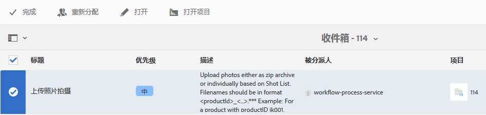

1. 点按/单击**上传照片拍摄**，然后上传照片拍摄图像。
1. 点按/单击 **完成** 图标以完成任务。

### 修饰照片拍摄任务 {#retouch-photo-shoot-task}

如果您有编辑权限，请执行“修饰照片拍摄”任务以编辑上传到“照片拍摄”文件夹的图像。

1. 在项目文件夹下，点按/单击 [任务卡](#tracking-project-progress) 查看工作流中的任务项。
1. 选择 **修饰照片拍摄** 任务，然后点按/单击 **打开** 图标。

   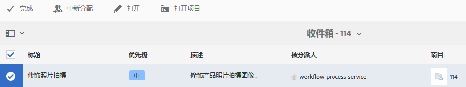

1. 点按/单击 **查看上传的资产** 链接 **修饰照片拍摄** 页面来浏览上传的图像。

   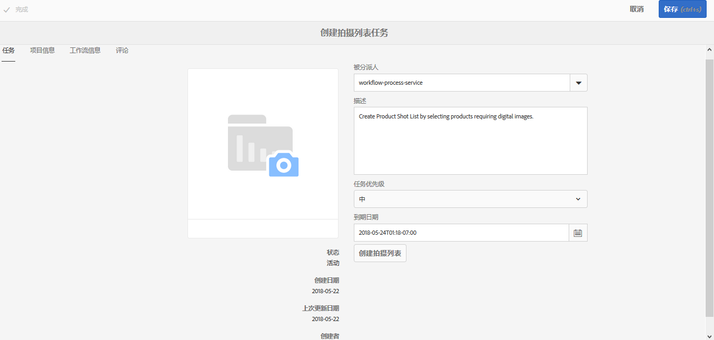

   如有必要，请使用Adobe Creative Cloud应用程序编辑图像。

   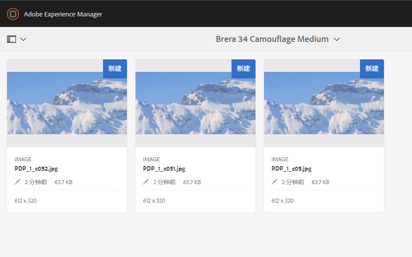

1. 点按/单击 **完成** 图标以完成任务。

### 审核和批准任务 {#review-and-approve-task}

在此任务中，您将审核摄影师上传的照片拍摄图像，并将图像标记为已批准使用。

1. 在项目文件夹下，点按/单击 [任务卡](#tracking-project-progress) 查看工作流中的任务项。
1. 选择 **审核和批准** 任务，然后点按/单击 **打开** 图标。

   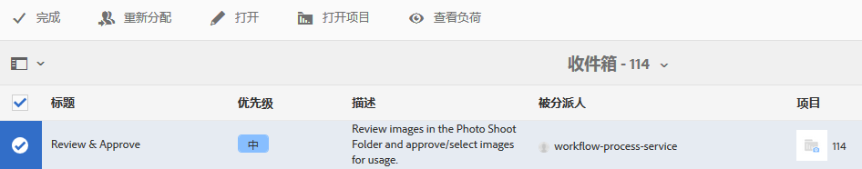

1. 在 **审核和批准** 页面，将审核任务分配给角色（例如“审阅人”），然后点按/单击**审核**以开始审核上传的产品图像。

   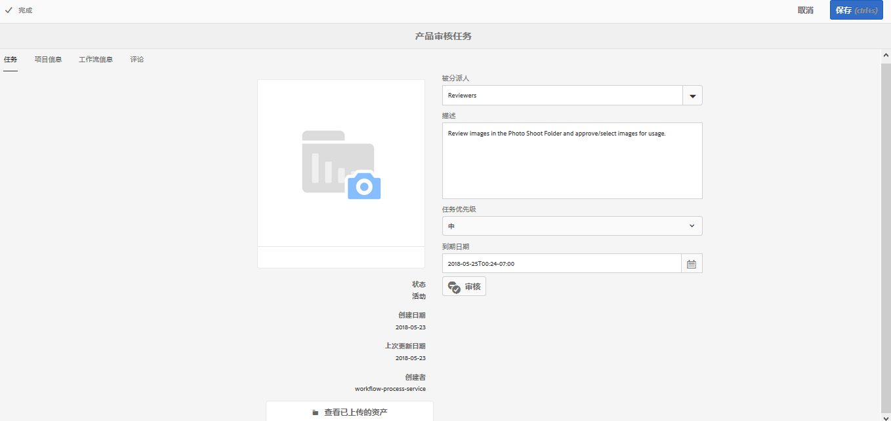

1. 选择产品图像，然后点按/单击工具栏中的批准图标，以将其标记为已批准。

   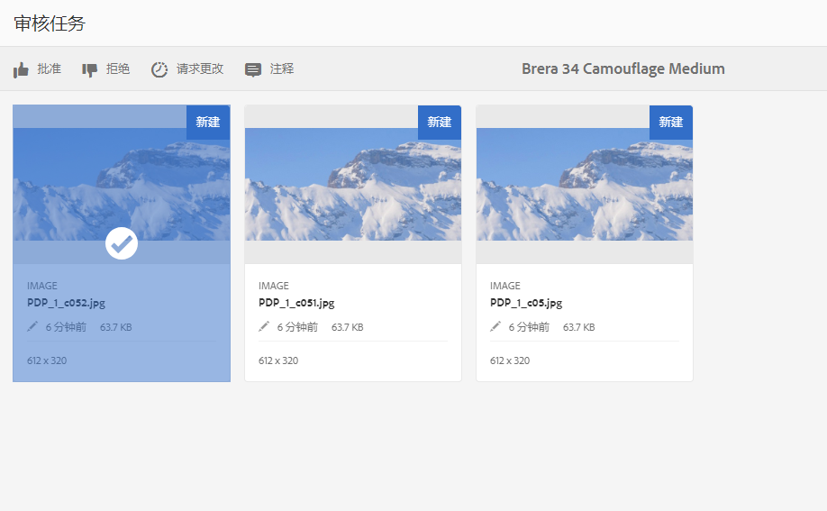

   批准图像后，图像上会显示一个已批准的横幅。

   >[!NOTE]
   您可能会遗漏一些产品，但没有任何图像。 稍后，您可以重新访问任务，并在完成后标记该任务完成。

1. 点按/单击 **完成**. 已批准的图像会与之前创建的空资产相关联。

您可以使用资产UI导航到项目资产，并验证已批准的图像。

点按/单击下一个级别，以根据您的产品数据层次结构查看产品。

创意项目将已批准的资产与引用的产品关联。 资产元数据会更新，其中包含**产品数据**选项卡中资产属性下的产品引用和基本信息，这些属性显示在AEM资产元数据部分中。

>[!NOTE]
在产品照片拍摄工作流（不进行商务集成）中，已批准的图像与产品没有关联。

### 移动到生产任务 {#move-to-production-task}

此任务会将已批准的资产移动到生产就绪文件夹，以使其可供使用。

1. 在项目文件夹下，点按/单击 [任务卡](#tracking-project-progress) 查看工作流中的任务项。
1. 选择 **迁移到生产环境** 任务，然后点按/单击 **打开** 图标。

   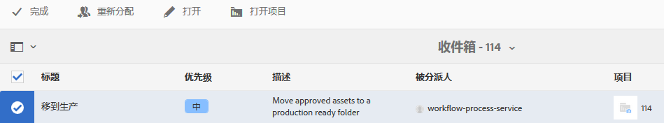

1. 要在将照片拍摄的已批准资产移动到生产就绪文件夹之前查看这些资产，请单击 **查看已批准的资产** 在 **迁移到生产环境** 任务页面。

   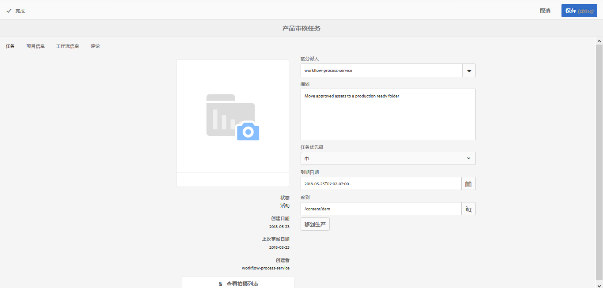

1. 在 **移动到** 字段。

   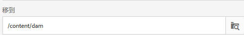

   点按/单击 **迁移到生产环境**. 关闭确认消息。资产会移至上述路径，并且会根据文件夹层次结构自动为每个产品的已批准资产创建旋转集。

1. 点按/单击 **完成** 图标。 最后一步标记为完成时，工作流将完成。

## 查看DAM资产元数据 {#viewing-dam-asset-metadata}

在您批准之后，资产会关联到相应的产品。 的 [属性页面](/help/assets/managing-assets-touch-ui.md#editing-properties) 现在，已批准资产中的 **产品数据** （链接的产品信息）选项卡。 此选项卡显示产品详细信息、SKU编号以及与资产关联的其他产品相关详细信息。 点按/单击 **编辑** 图标以更新资产属性。 与产品相关的信息保持只读状态。

点按/单击显示的链接，以导航到与资产关联的产品控制台中的相应产品详细信息页面。

## 自定义项目照片拍摄工作流 {#customizing-the-project-photo-shoot-workflows}

您可以根据要求自定义项目照片拍摄工作流。 这是一项基于角色的可选任务，您需要执行此任务来设置项目中变量的值。 之后，您可以使用配置的值来做出决策。

1. 单击/点按AEM徽标，然后导航到 **工具** > **工作流** > **模型** 以打开“工作流模型”(Workflow Models)页面。
1. 选择 **产品照片拍摄（商务集成）** 工作流或 **产品照片拍摄** 工作流和点击/点按 **编辑** 在编辑模式下打开工作流时，请执行此操作。
1. 打开 **项目** 任务，然后将 **创建基于角色的项目任务** 步骤。

   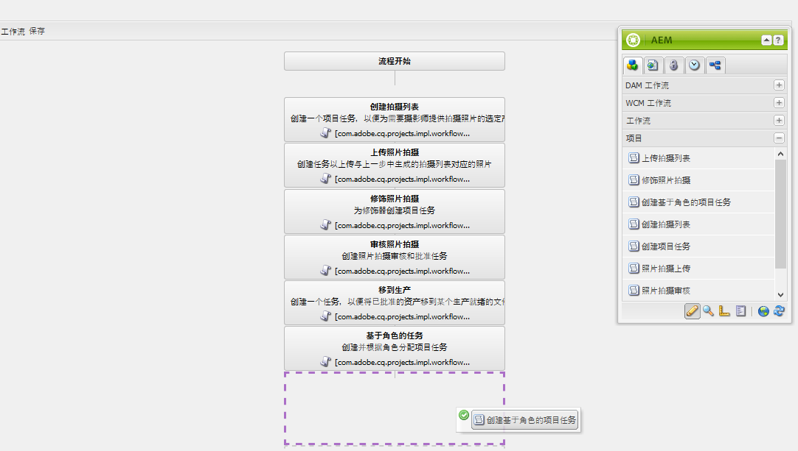

1. 打开 **基于角色的任务** 中。
1. 在 **任务** ，请为将在 **任务** 列表。 您还可以将任务分配给角色、设置默认优先级、提供描述，以及指定任务到期的时间。

   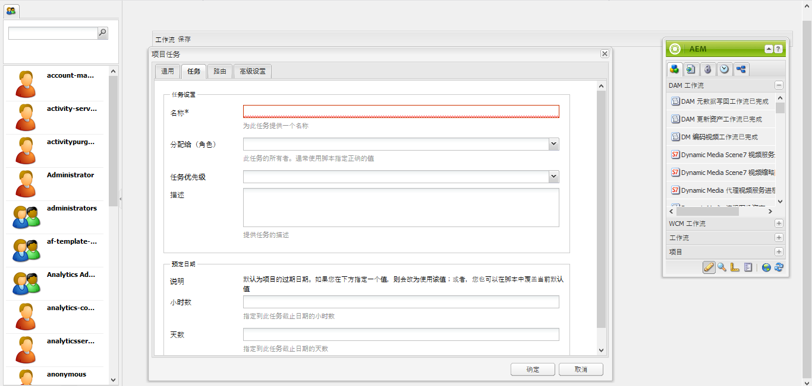

1. 在 **路由** 选项卡，指定任务的操作。 要添加多个操作，请点按/单击**添加项目**链接。

   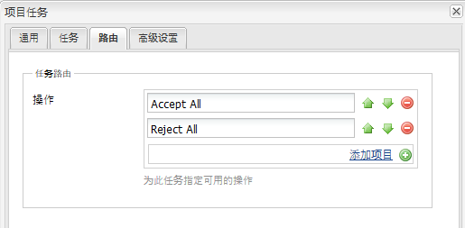

1. 添加选项后，单击 **确定** 以将更改添加到步骤。

   >[!NOTE]
   点按/单击 **确定** 不会在工作流中保存更改。 要在工作流中保存更改，请点按/单击 **保存**.

1. 打开 **工作流** 从Sidekick执行任务，并添加 **后藤** 任务。
1. 打开 **后藤** 任务，然后点按/单击 **进程** 选项卡。
1. 在 **脚本** 框：

```
   function check() {

   if (workflowData.getMetaDataMap().get("lastTaskAction","") == "Reject All") {

   return true

   }

   // set copywriter user in metadata

   var previousId = workflowData.getMetaDataMap().get("lastTaskCompletedBy", "");

   workflowData.getMetaDataMap().put("copywriter", previousId);

   return false;

   }
```

>[!NOTE]
有关工作流步骤中脚本编写的详细信息，请参阅 [为OR拆分定义规则](/help/sites-developing/workflows-models.md).

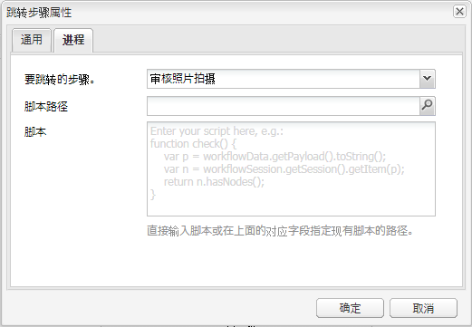

1. 点按/单击 **确定**.

1. 点按/单击 **保存** 以保存工作流。

   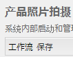

1. 在 [移动到生产任务](#move-to-production-task) 已完成，且已分配给所有者。

   具有“所有者”角色的用户可以完成该任务，并从注释弹出窗口的列表（从工作流步骤配置中添加的操作列表）中选择一项操作。

   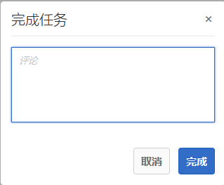

   选择相应的选项并单击 **完成** 运行 **跳转步骤** 中。

>[!NOTE]
启动服务器时，项目任务列表Servlet会缓存任务类型与下定义的URL之间的映射 `/libs/cq/core/content/projects/tasktypes`. 然后，您可以执行常规的叠加，并通过将自定义任务类型放在 `/apps/cq/core/content/projects/tasktypes`.
