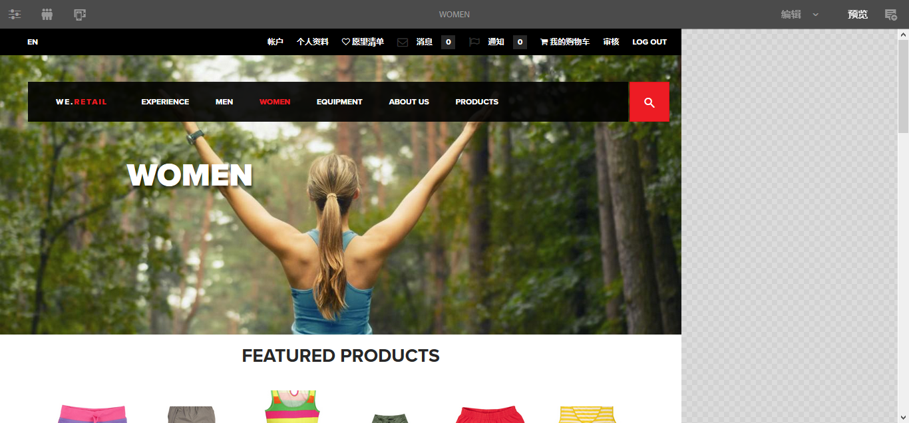

# 为移动设备创作页面{#authoring-a-page-for-mobile-devices}

>[!CAUTION]
>
>AEM 6.4已结束扩展支持，本文档将不再更新。 有关更多详细信息，请参阅 [技术支助期](https://helpx.adobe.com/cn/support/programs/eol-matrix.html). 查找支持的版本 [此处](https://experienceleague.adobe.com/docs/).

在创作移动设备页面时，页面会模拟移动设备的显示方式。 在创作页面时，您可以在多个模拟器之间切换，以查看最终用户在访问页面时看到的内容。

根据设备渲染页面的功能，将设备分组为类别功能、智能和触控。 当最终用户访问移动页面时，AEM会检测设备并发送与其设备组对应的呈现形式。

>[!NOTE]
>
>要基于现有标准网站创建移动站点，请创建标准网站的Live Copy。 (请参阅 [为不同渠道创建Live Copy](/help/sites-administering/msm-livecopy.md).)
>
>AEM 开发人员可以创建新设备组。(请参阅 [创建设备组过滤器](/help/sites-developing/groupfilters.md).)

请使用以下过程来创作移动页面：

1. 从全局导航中打开&#x200B;**站点**&#x200B;控制台。
1. 打开页面 **We.Retail** -> **美国** -> **英语**.

1. 切换到 **预览** 模式。
1. 单击页面顶部的设备图标以切换到所需的模拟器。
1. 将组件浏览器中的组件拖放到页面。

该页面类似于以下内容：

>[!NOTE]
>
>从移动设备中请求创作实例上的页面时，会禁用模拟器。
