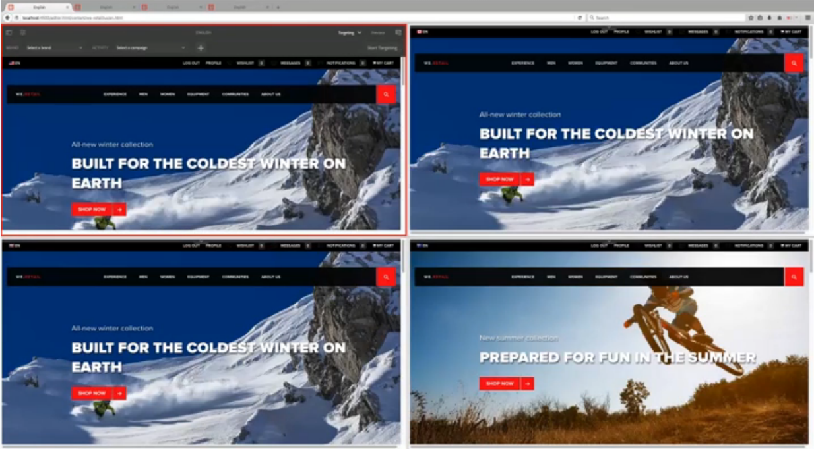

# 在多个站点中使用目标内容{#working-with-targeted-content-in-multisites}

>[!CAUTION]
>
>AEM 6.4已结束扩展支持，本文档将不再更新。 有关更多详细信息，请参阅 [技术支助期](https://helpx.adobe.com/cn/support/programs/eol-matrix.html). 查找支持的版本 [此处](https://experienceleague.adobe.com/docs/).

如果您需要在站点之间管理目标内容（如活动、体验和选件），则可以利用AEM内置的目标内容多站点支持功能。

>[!NOTE]
>
>使用目标内容的多站点支持是一项高级功能。 要使用此功能，您应该熟悉[多站点管理器](/help/sites-administering/msm.md)以及 [Adobe Target 与 AEM 的集成](/help/sites-administering/target.md)。

本文档介绍以下内容：

* 简要概述AEM目标内容的多站点支持功能。
* 介绍一些关于如何链接网站（在一个品牌中）的可能使用方案。
* 提供一个示例来演练营销人员如何使用此功能。
* 有关如何对目标内容实施多站点支持的详细说明。

要设置网站共享个性化内容的方式，您需要执行以下步骤：

1. [创建新区域](#creating-new-areas) 或 [将新区域创建为live copy](#creating-new-areas). 区域包含可供 *面积* 页面的页面；即，页面上定向组件的位置。 创建新区域会创建空区域，而创建新区域作为Live Copy则允许您跨站点结构继承内容。

1. [链接您的网站或页面](#linking-sites-to-an-area) 到某个区域。

您可以随时暂停或恢复继承。 此外，如果您不想暂停继承，则还可以创建本地体验。 默认情况下，除非另有指定，否则所有页面都使用主控区域。

## 目标内容的多站点支持简介 {#introduction-to-multisite-support-for-targeted-content}

目标内容的多站点支持功能现成可用，允许您将目标内容从通过MSM管理的主控页面推送到本地Live Copy，或者允许您管理此类内容的全局修改和本地修改。

可以在&#x200B;**区域**&#x200B;中管理目标内容。区域可将在不同站点中使用的目标内容（活动、体验和选件）分隔开来，并提供基于 MSM 的机制，以创建并管理目标内容的继承以及站点继承。这样，您就无需按照6.2之前AEM中的要求，在继承的站点中重新创建目标内容。

在某个区域中，只有链接到该区域的活动才会被推送到Live Copy。 默认情况下，会选择主控区域。 创建其他区域后，您可以将这些区域链接到您的网站或页面，以指示推送的目标内容。

站点或Live Copy链接到的区域包含需要在该站点或Live Copy上提供的活动。 默认情况下，站点或Live Copy会链接到主控区域，但您也可以链接主控区域以外的其他区域。

>[!NOTE]
>
>对目标内容使用多站点支持功能时，您应注意以下事项：
>
>* 使用转出或Live Copy时，需要MSM许可证。
>* 使用同步到Adobe Target时，需要Adobe Target许可证。
>

## 用例 {#use-cases}

您可以根据用例的不同，以多种方式设置目标内容的多站点支持。 本节从理论上介绍如何在一个品牌中使用此功能。 此外， [示例：根据地域定位内容](#example-targeting-content-based-on-geography)，则您可以在多个网站中看到定位内容的真实应用程序。

目标内容将封装在所谓的区域中，这些区域可定义网站或页面的范围。 这些区域在品牌级别进行定义。 一个品牌可以包含多个区域。 不同品牌之间的区域可以不同。 虽然一个品牌可能只包含主控区域，因此会在所有品牌之间共享，但另一个品牌可能包含多个品牌（例如，按地区）。 因此，品牌之间无需映射区域集。

例如，通过目标内容的多站点支持，您可以拥有两个（或更多）站点，这些站点 **one** 具有以下任一项的品牌：

* 完全&#x200B;*不同*&#x200B;的目标内容集 – 在一个站点中编辑目标内容不会影响其他站点。链接到不同区域的站点将读取并写入其自身的配置区域。例如：

   * 站点A链接到区域X
   * 站点B链接到区域Y

* *共享*&#x200B;的目标内容集 – 在一个站点中编辑会直接影响两个站点；通过让两个站点引用同一区域，可以实现此设置。链接到同一区域的站点共享该区域内的目标内容。例如：

   * 站点A链接到区域X
   * 站点B链接到区域X

* 通过 MSM 从其他站点&#x200B;*继承*&#x200B;的不同目标内容集 – 内容可从主区域单向转出到 Live Copy。例如：

   * 站点A链接到区域X
   * 站点B链接到区域Y（区域X的Live Copy）

您也可以 **多个** 在一个网站中使用的品牌，其复杂程度可能比此示例更高。

>[!NOTE]
>
>要从技术层面更详细地了解此功能，请参阅[如何构建目标内容的多站点管理](/help/sites-authoring/technical-multisite-targeted.md)。

## 示例：根据地理位置定位内容 {#example-targeting-content-based-on-geography}

通过为目标内容使用多站点功能，您可以共享、转出或隔离个性化内容。 为了更好地说明如何使用此功能，请考虑一种情景，即您想要控制如何根据地理位置推出目标内容，如以下场景所示：

同一网站有四个版本（基于地理位置）：

* 的 **美国** 网站位于左上角，是主控网站。 在此示例中，该选件在“定位”模式下打开。
* 此网站的其他三个版本包括 **加拿大**, **大不列颠**&#x200B;和 **澳大利亚**，这些都是Live Copy。 这些网站在预览模式下打开。

每个网站共享地理区域中的个性化内容：

* 加拿大与美国共享主控区。
* 英国与欧洲地区相连，并从主控地区继承。
* 澳大利亚站点由于位于南半球，季节性产品不适用，因此会有自己的个性化内容。

对于北半球，我们创建了一个冬季活动，不过是针对男性受众创建的，北美的营销人员想要为冬季活动启用一幅新图像，因此他们在美国站点中更改了原有图像。

刷新选项卡后，加拿大站点将更改为新图像，而无需我们执行任何操作。 这样做是因为它与美国有主控领域。 在大不列颠和澳大利亚的网站上，图像不会改变。

营销人员希望将这些更改推出到欧洲地区和 [转出Live Copy](/help/sites-administering/msm-livecopy.md) 通过点按或单击 **转出页**. 刷新选项卡后，大不列颠站点将具有新图像，因为欧洲区域从主控区域继承（转出后）。

澳大利亚站点中的图像保持不变，这是您期望的行为，因为现在是澳大利亚的夏季，并且营销人员不希望更改该内容。 澳大利亚的站点不会更改，因为它不会与任何其他区域共享某个区域，也不是其他区域的Live Copy。 营销人员从不担心澳大利亚站点的目标内容会被覆盖。

此外，对于区域是主控区域Live Copy的英国，您可以通过活动名称旁边的绿色指示器查看继承状态。 如果活动是继承的，则除非暂停或分离Live Copy，否则将无法对其进行修改。

您可以随时暂停继承或完全分离继承。 您还可以始终添加仅适用于该体验的本地体验，而不暂停继承。

>[!NOTE]
>
>要从技术层面更详细地了解此功能，请参阅[如何构建目标内容的多站点管理](/help/sites-authoring/technical-multisite-targeted.md)。

### 创建新区域与创建新区域作为Live Copy {#creating-a-new-area-versus-creating-a-new-area-as-livecopy}

在AEM中，您可以选择创建新区域或创建新区域作为Live Copy。 创建新区域会将活动和属于这些活动的任何内容（如选件、体验等）分组。 当您要创建一组完全不同的目标内容或共享一组目标内容时，可以创建新区域。

但是，如果您通过MSM在两个站点之间设置了继承，则您可能希望继承活动。 在这种情况下，您会创建一个新区域作为Live Copy，其中Y是X的Live Copy，因此也会继承所有活动。

>[!NOTE]
>
>当页面是链接到某个区域的 Live Copy，而该区域本身又是链接到页面 Blueprint 的区域的 Live Copy 时，默认转出会触发后续的目标内容转出。

例如，下图中有四个站点，其中两个站点共享主区域（以及该区域中的所有活动）；还有一个站点的区域是其他区域的 Live Copy，因此会在转出后共享活动；最后一个站点完全独立（因此其活动需要一个单独的区域）。

要在AEM中实现此目的，您需要执行以下操作：

* 站点A链接到主控区域 — 无需创建区域。 主控区域默认在AEM中处于选中状态。 站点A和B共享活动等。
* 站点B链接到主控区域 — 无需创建区域。 主控区域默认在AEM中处于选中状态。 站点A和B共享活动等。
* 站点C链接到“继承区域”，“继承区域”是“主控区域 — 创建区域”的Live Copy，您可以在其中根据“主控区域”创建Live Copy。 转出后，继承区域会从主控区域继承活动。
* 站点D链接到其自身的隔离区域 — 创建区域，在创建区域中创建一个全新的区域，但尚未定义活动。 隔离区域不会与任何其他站点共享活动。

## 创建新区域 {#creating-new-areas}

区域可以跨活动和选件。 在其中任一区域（例如活动）中创建区域后，另一个区域（例如，选件）中也会提供该区域。

>[!NOTE]
>
>默认情况下，当您点按或单击品牌名称时，名为“主区域”的默认区域会折叠，直到您创 **建** 其他区域为止。 然后，在“活动”或“选件”控制台中选 **择品牌****时，您会看到“区** 域 **** ”控制台。

要创建新区域，请执行以下操作：

1. 导航到&#x200B;**个性化** > **活动**&#x200B;或&#x200B;**选件**，然后导航到您的品牌。
1. 点按或单击&#x200B;**创建区域**。

   

1. 单击 **面积图** 图标，单击 **下一个**.
1. 在 **标题** 字段，输入新区域的名称。 （可选）选择标记。
1. 点按或单击&#x200B;**创建**。

   AEM会重定向到品牌窗口，其中会列出所创建的所有区域。 如果除了“主控区域”之外还有其他区域，则可以直接在品牌控制台中创建区域。

   

## 将区域创建为Live Copy {#creating-areas-as-live-copies}

您可以创建一个区域作为Live Copy，以便跨站点结构继承目标内容。

要创建区域作为Live Copy，请执行以下操作：

1. 导航到&#x200B;**个性化** > **活动**&#x200B;或&#x200B;**选件**，然后导航到您的品牌。
1. 点按或单击&#x200B;**创建区域作为 Live Copy**。

   

1. 选择要为其创建 Live Copy 的区域，然后单击&#x200B;**下一步**。

   

1. 在“名 **称** ”字段中，输入Live copy的名称。 默认情况下，包含子页面；通过选中“排除子页 **面”复选框** ，排除它们。

   

1. 在 **转出配置** 下拉菜单中，选择相应的配置。

   请参阅 [已安装的转出配置](/help/sites-administering/msm-sync.md#installed-rollout-configurations) ，以了解每个选项的描述。

   请参阅 [创建和同步Live Copy](/help/sites-administering/msm-livecopy.md) 以了解有关live copy的更多信息。

   >[!NOTE]
   >
   >如果将页面转出到 Live Copy，并且为 Blueprint 页面配置的区域同时也是为页面 Live Copy 配置的区域的 Blueprint，则 LiveAction **personalizationContentRollout** 会触发同步的 subRollout，它是&#x200B;**标准转出配置**&#x200B;的一部分。

1. 点按或单击&#x200B;**创建**。

   AEM会重定向到品牌窗口，其中会列出所创建的所有区域。 如果除了“主控区域”之外还有其他区域，则可以直接从品牌窗口创建区域。

   

## 将站点链接到区域 {#linking-sites-to-an-area}

您可以将区域链接到页面或网站。 所有子页面都会继承区域，除非子页面上的映射覆盖了这些页面。 不过，通常而言，您需要在站点级别建立链接。

链接时，只有选定区域中的活动、体验和选件才可用。 这样可防止意外混合独立管理的内容。 如果未配置其他区域，则使用每个品牌的主控区域。

>[!NOTE]
>
>引用了同一区域的页面或站点使用的是&#x200B;*相同*&#x200B;的共享活动、体验和选件集。编辑由多个站点共享的活动、体验或选件会影响所有站点。

要将站点链接到区域，请执行以下操作：

1. 导航到要链接到区域的网站（或页面）。
1. 选择网站或页面，然后点按或单击 **查看属性**.
1. 点按或单击&#x200B;**个性化**&#x200B;选项卡。
1. 在 **品牌** 菜单，选择要将区域链接到的品牌。 选择品牌后，可在 **区域引用** 菜单。

   

1. 从&#x200B;**区域引用**&#x200B;下拉菜单中选择相应的区域，然后点按或单击&#x200B;**保存**。

   

## 分离目标内容的Live Copy或暂停继承 {#detaching-live-copy-or-suspending-inheritance-of-targeted-content}

您可能希望暂停或分离目标内容的继承。 按活动暂停或分离Live Copy的操作。 例如，您可能想要修改活动中的体验，但如果该活动仍链接到继承的副本，则您将无法修改该体验或该活动的任何属性。

暂停Live Copy会暂时中断继承，但将来可以恢复继承。 分离Live Copy会永久中断继承。

要暂停或分离目标内容的继承，需要先在活动中恢复继承。如果页面或站点链接到的区域是 Live Copy，则可以查看活动的继承状态。

从其他网站继承的活动名称旁边会标记为绿色。 暂停的继承标记为红色，并且本地创建的活动没有图标。

>[!NOTE]
>
>* 您只能暂停或分离活动中的Live Copy。
>* 要扩展继承的活动，您无需暂停或分离Live Copy。 您始终可以创建 **新建** 该活动的本地体验和选件。 如果要修改现有活动，则需要暂停继承。
>

### 暂停继承 {#suspending-inheritance}

要在活动中暂停或分离目标内容的继承，请执行以下操作：

1. 导航到要在其中分离或暂停继承的页面，然后点按或单击 **定位** 中。
1. 如果您的页面链接到的是Live Copy区域，则会看到继承状态。 点按或单击&#x200B;**开始定位**。
1. 要在活动上暂停，请执行以下操作之一：

   1. 选择活动的元素，如受众。 AEM会自动显示“暂停Live Copy”确认框。 （在整个定位过程中，您可以通过点按或单击任何元素来暂停Live Copy。）
   1. 选择 **暂停Live Copy** 的下拉菜单。

   

1. 点按或单击&#x200B;**暂停**，以在活动中暂停继承。暂停继承的活动会标记为红色。

   

### 中断继承 {#breaking-inheritance}

要在活动中中断目标内容的继承，请执行以下操作：

1. 导航到要在其中将Live Copy从主控中分离的页面，然后点按或单击 **定位** 中。
1. 如果您的页面链接到的是Live Copy区域，则会看到继承状态。 点按或单击&#x200B;**开始定位**。
1. 从工 **具栏的下拉菜单中选择** “分离Live Copy”。 AEM会确认您是否要分离Live Copy。
1. 点按或单击 **分离** 将Live Copy与活动分离。 分离后，将不再显示有关继承的下拉菜单。 活动现在是本地活动。

   

## 恢复目标内容的继承 {#restoring-inheritance-of-targeted-content}

如果已暂停活动中目标内容的继承，则可以随时恢复继承。 但是，如果已分离Live Copy，则无法恢复继承。

要在活动中恢复目标内容的继承，请执行以下操作：

1. 导航到要在其中恢复继承的页面，然后点按或单击“模式”下拉菜单中的&#x200B;**定位**。
1. 点按或单击&#x200B;**开始定位**。
1. 从工具栏的下拉菜单中选择&#x200B;**恢复 Live Copy**。

   

1. 点按或单击 **恢复** 以确认要恢复live copy继承。 如果继续继承，则对当前活动所做的任何修改都将丢失。

## 删除区域 {#deleting-areas}

删除区域时，会删除该区域中的所有活动。 AEM会在您删除区域之前发出警告。 如果您删除了站点链接到的区域，则此品牌的映射会自动重新映射到主区域。

要删除区域，请执行以下操作：

1. 导航到&#x200B;**个性化** > **活动**&#x200B;或&#x200B;**选件**，然后导航到您的品牌。
1. 点按或单击要删除的区域旁边的图标。
1. 点按或单击 **删除** 并确认要删除该区域。
