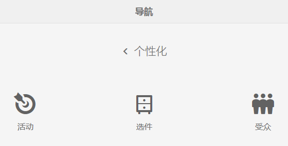
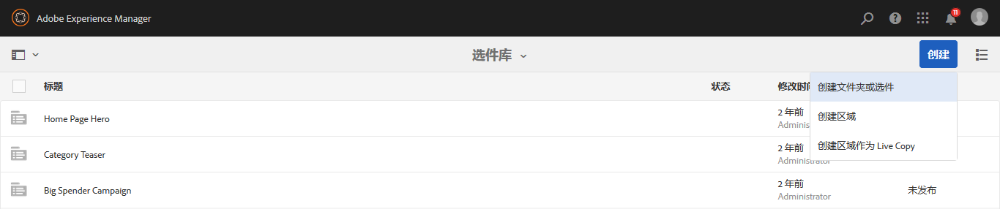
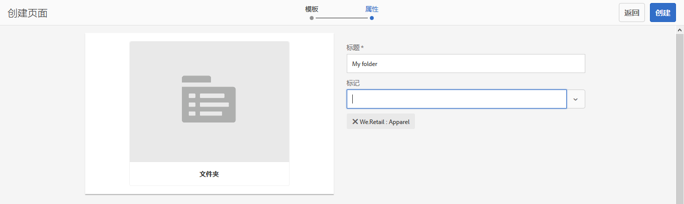
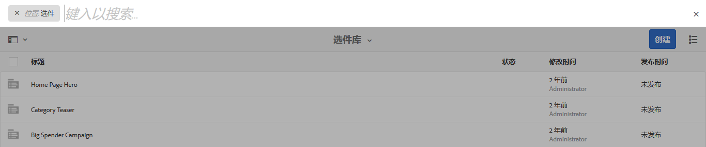

# 创建和管理选件{#creating-and-managing-offers}

>[!CAUTION]
>
>AEM 6.4已结束扩展支持，本文档将不再更新。 有关更多详细信息，请参阅 [技术支助期](https://helpx.adobe.com/cn/support/programs/eol-matrix.html). 查找支持的版本 [此处](https://experienceleague.adobe.com/docs/).

使用“选件”控制台可创建您可以 [在活动体验中使用](/help/sites-authoring/content-targeting-touch.md). 当多个体验需要同一选件时，在“选件”控制台中创建选件可节省时间：

* 在库中创建选件一次，并将其用于品牌活动的多个体验。
* 更改库中的选件，所做的更改会影响使用该选件的所有体验。

“选件”控制台按品牌组织选件。 每个品牌都包含一个可在品牌体验中使用的选件库。 使用文件夹定义用于在每个库中组织选件的层次结构。 使用逻辑文件夹结构，作者可以通过浏览轻松查找选件。 标记和搜索工具还允许作者查找选件。

## 使用“选件”控制台添加品牌 {#add-a-brand-using-the-offers-console}

创建与您的选件关联的品牌。 在“选件”控制台中打开品牌以访问其选件库，您可以在该库中创建文件夹和选件。

使用“选件”控制台创建品牌时，该品牌也会显示在 [活动控制台](/help/sites-authoring/activitylib.md) 您可以在此处添加和管理品牌的活动。

1. 在“导航”控制台中，单击或点按&#x200B;**个性化** > **选件**。

   

1. 依次单击或点按&#x200B;**创建**&#x200B;和&#x200B;**创建品牌**。
1. 选择品牌模板，然后单击或点按 **下一个**.
1. 键入您希望品牌在“选件”和“活动”控制台中显示的标题。 （可选）键入或选择一个或多个要与品牌关联的标记。
1. 单击或点按&#x200B;**创建**。

## 将文件夹添加到选件库 {#add-a-folder-to-an-offer-library}

向品牌的选件库中添加文件夹以组织和存储选件。 您可以在品牌下或其他文件夹下创建文件夹。

1. 在“选件”控制台中，打开要创建文件夹的位置。 例如，打开品牌以创建顶级文件夹，或打开库中的其他文件夹。
1. 单击或点按 **创建** > **创建文件夹或选件**.

   

1. 选择&#x200B;**文件夹**，然后单击&#x200B;**下一步**。
1. 键入您希望文件夹在选件库中显示的标题，然后键入或选择标记。

   

1. 单击或点按&#x200B;**创建**。

## 将选件添加到选件库 {#add-an-offer-to-an-offer-library}

将选件添加到品牌的选件库，以便将其添加到品牌的体验。 添加选件时，您会提供标题。 您还可以将选件与一个或多个标记关联以增强可搜索性。

创建选件后，您可以将其打开以创作内容。

1. 在“选件”控制台中，打开要创建选件的位置。 例如，打开品牌以创建顶级选件，或打开库中的文件夹。
1. 单击或点按 **创建** > **创建文件夹或选件**.

   

1. 选择 **选件页面** 模板，然后单击或点按 **下一个**.
1. 键入选件的标题，（可选）选择或键入一个或多个要与选件关联的标记，然后单击或点按 **创建**.
1. 在确认对话框中，要打开选件进行编辑，请单击或点按&#x200B;**打开页面**。

## 编辑选件 {#editing-an-offer}

打开选件并编辑您希望该选件在使用该选件的体验中显示的内容。 编辑在任何体验中使用的选件时，您所做的更改会显示在体验中。

您可以从选件库的文件夹或搜索结果中打开选件。 您还可以从使用该选件的体验中打开选件。

1. 在“选件”控制台中，点按或单击选件旁边的图标，然后单击或点按 **编辑**.
1. 与往常一样，向选件添加组件并编辑组件内容。

## 删除选件 {#deleting-an-offer}

删除不再需要的选件。 当您尝试删除在体验中使用的选件时，系统会提示您确认删除。 确认会删除选件并从体验中删除该选件。

在查看选件库中的文件夹内容或搜索结果时，您可以删除选件。

1. 在“选件”控制台中，点按或单击选件旁边的图标，然后单击或点按 **删除**.

   选择选件，然后单击或点按 **删除**.

1. 在出现的对话框中，单击或点按 **删除** 以确认删除。
1. 如果在一个或多个体验中使用选件，则会显示一个对话框，指示该选件已被引用：

   * 要删除选件并从体验中删除该选件，请单击或点按 **强制删除**.
   * 要保留选件，请单击或点按 **取消**.

## 搜索选件 {#searching-for-offers}

使用用于匹配标题的关键词搜索任何品牌的选件。

当前搜索条件显示在搜索结果旁边。 您还可以按列对结果进行升序或降序排序。 您可以从任何选件库的任意文件夹执行搜索。 无论当前文件夹如何，搜索结果都是相同的。

要搜索选件，请执行以下操作：

1. 在“选件”控制台顶部，单击或点按放大镜图标。默认情况下，仅限于搜索选件。
1. 输入关键字以搜索选件。 从结果中选择。
