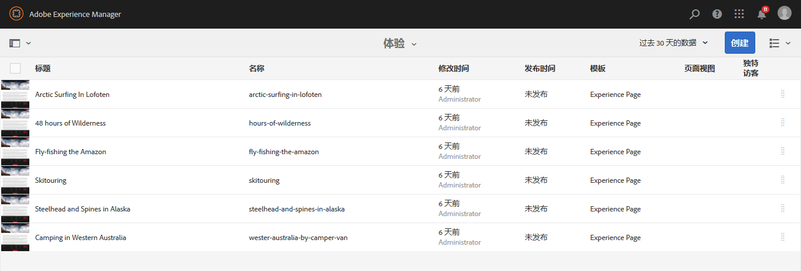
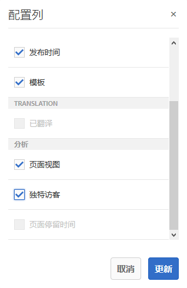
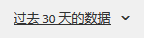

# 查看页面分析数据{#seeing-page-analytics-data}

>[!CAUTION]
>
>AEM 6.4已结束扩展支持，本文档将不再更新。 有关更多详细信息，请参阅 [技术支助期](https://helpx.adobe.com/cn/support/programs/eol-matrix.html). 查找支持的版本 [此处](https://experienceleague.adobe.com/docs/).

使用页面分析数据衡量页面内容的有效性。

## 从控制台中可见的Analytics {#analytics-visible-from-the-console}

页面分析数据显示在 [列表视图](/help/sites-authoring/basic-handling.md#list-view) 的子菜单。 当页面以列表格式显示时，默认情况下可使用以下列：

* 页面视图
* 独特访客
* 页面停留时间

每列显示当前报告时段的值，还指示该值自上一个报告时段以来是增加还是减少。 您看到的数据每12小时更新一次。

>[!NOTE]
>
>要更改更新期，请 [配置导入间隔](/help/sites-administering/adobeanalytics-connect.md#configuring-the-import-interval).

1. 打开 **站点** 控制台；例如 [http://localhost:4502/sites.html/content](http://localhost:4502/sites.html/content)
1. 在工具栏的最右侧（右上角），单击或点按图标以选择 **列表视图** (显示的图标取决于 [当前视图](/help/sites-authoring/basic-handling.md#viewing-and-selecting-resources))。

1. 同样，在工具栏的最右侧（右上角），单击或点按图标，然后选择 **查看设置**. 的 **配置列** 对话框。 进行所需的任何更改，然后使用进行确认 **更新**.

   

### 选择报告期 {#selecting-the-reporting-period}

选择在站点控制台中显示Analytics数据的报表时段：

* 过去 30 天的数据
* 过去 90 天的数据
* 本年度的数据

当前报表时段显示在站点控制台的工具栏（顶部工具栏的右侧）中。 使用下拉列表选择所需的报告时段。\

### 配置可用数据列 {#configuring-available-data-columns}

Analytics — 管理员用户组的成员可以配置站点控制台，以使作者能够查看额外的Analytics列。

>[!NOTE]
>
>当页面树包含与不同Adobe Analytics云配置关联的子项时，您无法为页面配置可用的数据列。

1. 在列表视图中，使用视图选择器（工具栏右侧），选择 **查看设置** 然后是A **添加自定义Analytics数据**.

   

1. 在“站点”控制台中选择要向作者显示的量度，然后单击 **添加**.

   显示的列将从Adobe Analytics中检索。

   

### 从网站打开内容分析 {#opening-content-insights-from-sites}

打开 [内容分析](/help/sites-authoring/content-insights.md) 从“站点”控制台中，进一步调查页面的有效性。

1. 在站点控制台中，选择要查看其内容分析的页面。
1. 在工具栏上，单击Analytics和Recommendations图标。

   

## 在页面编辑器中可见的Analytics(Activity Map) {#analytics-visible-from-the-page-editor-activity-map}

>[!CAUTION]
>
>由于 Adobe Analytics API 中的安全性更改，无法再使用 AEM 中包含的 Activity Map 版本。
>
>的 [ActivityMap插件由Adobe Analytics提供](https://experienceleague.adobe.com/docs/analytics/analyze/activity-map/getting-started/get-started-users/activitymap-install.html) 现在应使用。
