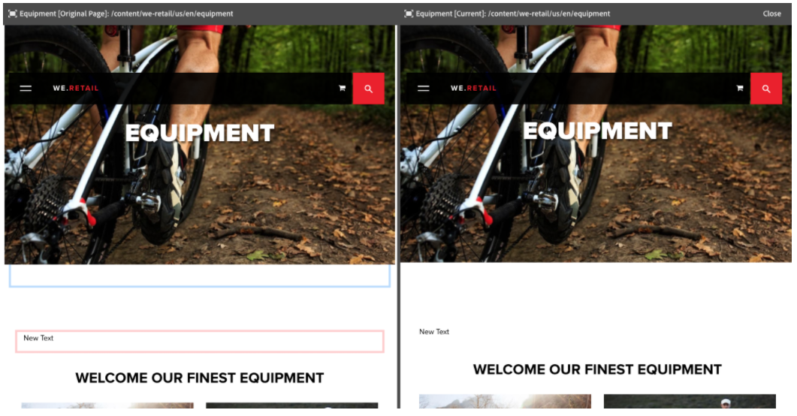
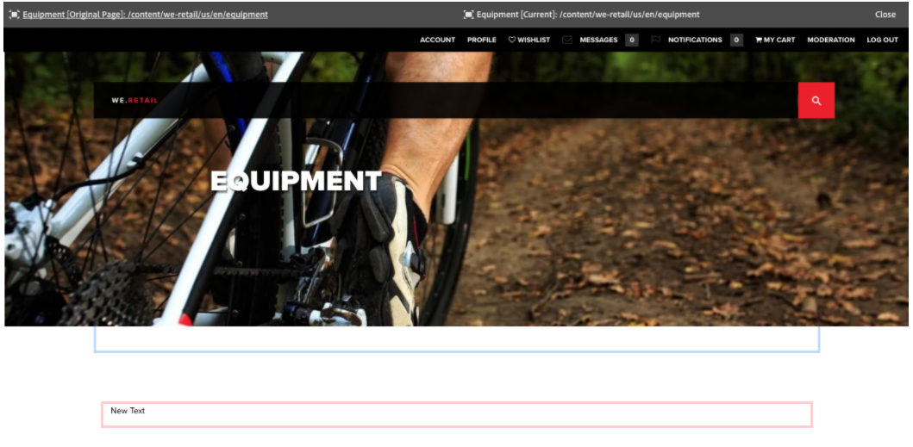

# 页面差异{#page-diff}

>[!CAUTION]
>
>AEM 6.4已结束扩展支持，本文档将不再更新。 有关更多详细信息，请参阅 [技术支助期](https://helpx.adobe.com/cn/support/programs/eol-matrix.html). 查找支持的版本 [此处](https://experienceleague.adobe.com/docs/).

## 简介 {#introduction}

内容创建是一个迭代过程。 高效创作需要能够查看从一个迭代到另一个迭代所发生的更改。 查看一个页面版本，然后查看另一个页面版本效率低下且容易出错。 作者希望能够轻松地将当前页面与其他版本并排比较。

使用页面差异功能，可以方便地并排比较两个页面，并突出显示它们之间的差异。

>[!CAUTION]
>
>如果您运行的版本低于AEM 6.4.3，则用户必须具有 **修改/创建/删除** 对节点的权限 `/content/versionhistory` 以便使用该功能。
>
>请参阅[开发和页面差异](/help/sites-developing/pagediff.md#operation-details)，以了解有关此功能的更多技术详细信息。

## 使用 {#use}

可以并排比较以下内容：

* [版本](/help/sites-authoring/working-with-page-versions.md#comparing-a-version-with-current-page) - 将页面的以前版本与其当前状态进行比较
* [Live Copy](/help/sites-administering/msm-livecopy.md#comparing-a-live-copy-page-with-a-blueprint-page) – 将 Live Copy 与其 Blueprint 进行比较
* [启动项](/help/sites-authoring/launches-editing.md#comparing-a-launch-page-to-its-source-page) – 将启动项与其源进行比较
* [语言副本](/help/sites-administering/tc-manage.md#comparing-language-copies) – 将翻译之前和翻译之后（重新翻译）的页面进行比较

请参阅有关如何在这些上下文中启动差异比较的各个主题。

### 差异的呈现 {#presentation-of-differences}

无论比较哪些内容，差异的呈现方式都保持不变。

* 启动差异比较时选择的内容将显示在左侧（差异入口点）。
* 比较内容显示在右侧（与选定内容进行比较的内容）。

例如，如果比较版本，则当前版本显示在左侧，先前版本显示在右侧。

两个页面的源会明确地显示在浏览器窗口顶部的标题栏中。

差异会在组件和HTML级别检测更改。 已更改的项目将以不同的颜色突出显示。

**组件更改**

* 浅绿色 — 已添加组件
* 粉红色 — 已删除组件
* 蓝色 — 组件已更改
* 蓝色 — 已移动组件

请注意，“已更改”和“已移动”的颜色是相同的。

**HTML更改**

* 深绿色 — 已添加HTML
* 红色 - 删除了 HTML

>[!NOTE]
>
>在比较语言副本时，会取消激活突出显示功能，因为在翻译中，所有内容都会发生更改，突出显示则没有任何好处。

### 全屏和退出 {#fullscreen-and-exiting}

为了集中查看特定内容，您可以单击并排差异比较任何一侧的全屏图标，以将其放大到整个浏览器窗口。

选定的一侧将填满整个窗口，但标题栏仍将保留在顶部，允许您在两个页面之间切换。

您也可以选择单击退出全屏图标来关闭全屏视图。

您可以随时通过单击标题中的关闭按钮退出并排差异比较。

## 限制 {#limitations}

在某些情况下，页面差异可能无法按预期检测到差异。

* 在比较版本和启动项时，差异不会考虑动态组件，如痕迹导航、菜单、产品列表或徽标（依赖站点结构呈现其内容的组件）。
* 对于版本，差异不会重新创建访问控制策略和Live Copy关系。
* 如果对图像进行了任何更改（如修改 alt、title 或 src 属性），则所做的更改将以蓝色突出显示。但是在某些情况下，图像的 src 属性采用 Base64 表示形式，即使两个图像看起来相同，它们也会因为 src 属性发生更改而被标记为不同。
* 差异无法检测图像旋转。
* 如果页面被移动，您将无法再对移动之前创建的任何版本执行差异比较。

   * 如果您遇到差异问题，请检查页面的[时间线](/help/sites-authoring/basic-handling.md#timeline)以查看页面是否已被移动。

>[!NOTE]
>
>各版本之间不能相互进行比较。只能将页面的当前版本与其他版本进行比较。当前版本始终是突出显示更改的版本。

>[!NOTE]
>
>有关页面差异机制的操作以及可能影响页面差异的限制的更多详细信息，请参阅 [开发人员文档](/help/sites-developing/pagediff.md) 功能的一部分。
