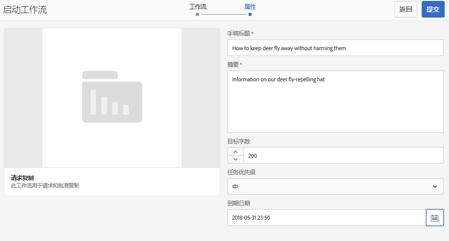
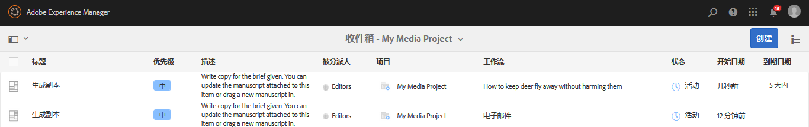
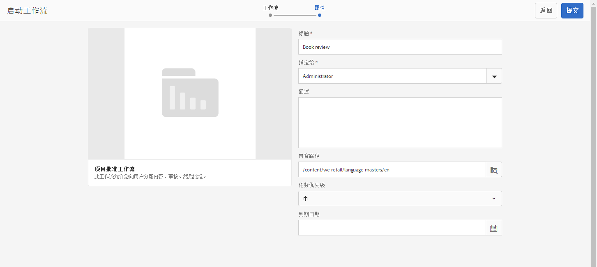
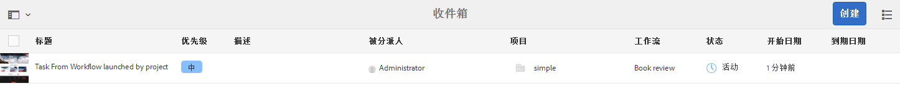
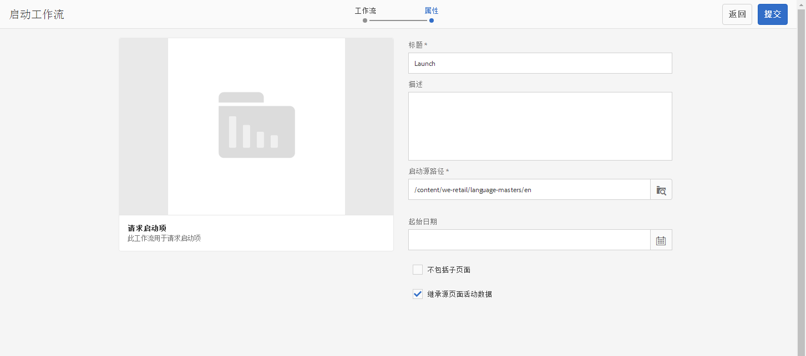
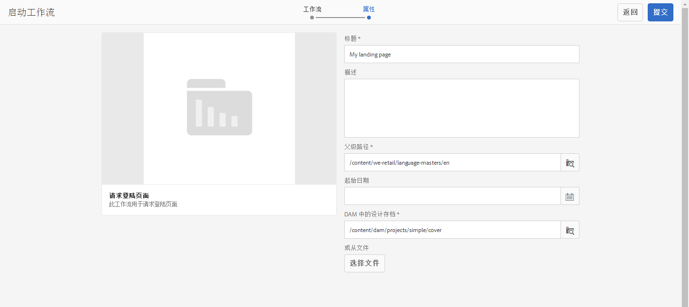
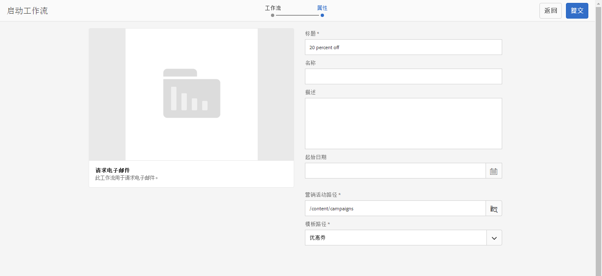
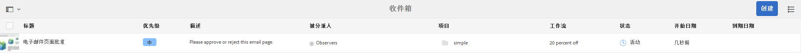

# 使用项目工作流{#working-with-project-workflows}

>[!CAUTION]
>
>AEM 6.4已结束扩展支持，本文档将不再更新。 有关更多详细信息，请参阅 [技术支助期](https://helpx.adobe.com/cn/support/programs/eol-matrix.html). 查找支持的版本 [此处](https://experienceleague.adobe.com/docs/).

开箱即用的项目工作流包括：

* **项目审批工作流** – 此工作流允许您将内容分配给用户进行审查和批准。
* **请求启动项** – 此工作流用于请求启动项。
* **请求登陆页面** – 此工作流用于请求登陆页面。
* **请求电子邮件** – 此工作流用于请求电子邮件。
* **产品照片拍摄和产品照片拍摄（商务）**  — 将资产与产品映射
* **DAM创建和翻译副本以及DAM创建语言副本**  — 为资产和文件夹创建已翻译的二进制文件、元数据和标记。

根据您选择的项目模板，您可以使用某些工作流：

|  | **简单项目** | **媒体项目** | **产品照片拍摄项目** | **翻译项目** |
|---|:-:|:-:|:-:|:-:|
| 请求副本 |  | x |  |  |
| 产品照片拍摄 |  | x | x |  |
| 产品照片拍摄（商务） |  |  | x |  |
| 项目批准 | x |  |  |  |
| 请求启动项 | x |  |  |  |
| 请求登陆页面 | x |  |  |  |
| 请求电子邮件 | x |  |  |  |
| DAM 创建语言副本&amp;ast; |  |  |  | x |
| DAM 创建和翻译语言副本&amp;ast; |  |  |  | x |

>[!NOTE]
>
>&amp;ast;这些工作流不会从项目中的&#x200B;**工作流**&#x200B;拼贴启动。请参阅 [为资产创建语言副本。](/help/sites-administering/tc-manage.md)

无论您选择哪种工作流，启动和完成工作流的步骤都是相同的。 只有步骤会更改。

您可以在项目中直接启动工作流（DAM创建语言副本或DAM创建和翻译语言副本除外）。 有关项目中任何未完成任务的信息，请参见 **任务** 拼贴。 用户图标旁边会显示需要完成的任务通知。

有关在AEM中使用工作流的更多信息，请参阅以下内容：

* [参与工作流](/help/sites-authoring/workflows-participating.md)
* [将工作流应用于页面](/help/sites-authoring/workflows-applying.md)
* [配置工作流](/help/sites-administering/workflows.md)

此部分介绍了可用于项目的工作流。

## 请求复制工作流 {#request-copy-workflow}

利用此工作流，可向用户请求手稿，然后对其进行批准。 要启动请求复制工作流，请执行以下操作：

1. 在您的媒体项目中，选择工作流拼 **贴中的+** 符号，然后选 **择** “请求复 **制工作流”**。
1. 输入手稿标题以及您所请求内容的简短摘要。 如果适用，请输入目标字数计数、任务优先级和到期日期。

   

1. 单击&#x200B;**创建**。工作流将启动。 任务将显示在 **任务** 拼贴。

   

## 产品照片拍摄工作流 {#product-photo-shoot-workflow}

详细介绍了产品照片拍摄工作流（商务和不商务） [创意项目](/help/sites-authoring/managing-product-information.md).

## 项目批准工作流程 {#project-approval-workflow}

在项目批准工作流中，您可以为用户分配内容，进行审核，然后批准该内容。

1. 在您的简单项目中，选择****+** 登录 **工作流** 拼贴并选择 **项目批准工作流程**.
1. 输入标题，然后从“团队”(Team)列表中选择要将其分配给的人员。 如果适用，请输入描述、内容路径、任务优先级和到期日期。

   

1. 单击&#x200B;**创建**。工作流将启动。 任务将显示在 **任务** 拼贴。

   

## 请求启动工作流 {#request-launch-workflow}

利用此工作流，可请求启动项。

1. 在您的简单项目中，选择&#x200B;**工作流**&#x200B;拼贴中的 **+** 符号，然后选择&#x200B;**请求启动工作流**。
1. 输入启动项的标题并提供启动项源路径。 您还可以添加描述和起始日期（如果适用）。 根据您希望启动项的行为方式，选择“继承源页面实时数据”或“排除子页面”。

   

1. 单击&#x200B;**创建**。工作流将启动。 该工作流会显示在&#x200B;**工作流**&#x200B;列表中（单击&#x200B;**工作流**&#x200B;拼贴中的省略号 **...** 可访问此列表）。

## 请求登陆页面工作流 {#request-landing-page-workflow}

利用此工作流，可请求登陆页面。

1. 在您的简单项目中，选择 **+** 登录 **工作流** 拼贴，然后选择“请求登陆页面工作流”。
1. 输入登陆页面的标题和父路径。 如果适用，请输入起始日期或为登陆页面选择文件。

   

1. 单击&#x200B;**创建**。工作流将启动。 任务将显示在 **任务** 拼贴。

## 请求电子邮件工作流 {#request-email-workflow}

利用此工作流，可请求电子邮件。 工作流与 **电子邮件** 拼贴。

1. 在您的媒体或简单项目中，选择 **+** 登录 **工作流** 拼贴并选择 **请求电子邮件工作流**.
1. 输入电子邮件标题以及营销活动和模板路径。 此外，您还可以提供名称、描述和起始日期。

   

1. 单击&#x200B;**创建**。工作流将启动。 任务将显示在 **任务** 拼贴。

   

## 为资产创建（和翻译）语言副本工作流 {#create-and-translate-language-copy-workflow-for-assets}

的 **创建语言副本** 和 **创建和翻译语言副本** 工作流在 [为资产创建语言副本。](/help/assets/translation-projects.md)
