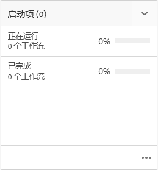

# 项目{#projects}

>[!CAUTION]
>
>AEM 6.4已结束扩展支持，本文档将不再更新。 有关更多详细信息，请参阅 [技术支助期](https://helpx.adobe.com/cn/support/programs/eol-matrix.html). 查找支持的版本 [此处](https://experienceleague.adobe.com/docs/).

通过“项目”，您可以将资源分组到一个实体中。 通过通用的共享环境，可以轻松管理项目。 您可以与项目关联的资源类型在AEM中称为拼贴。 拼贴可以包含项目和团队信息、资产、工作流及其他类型的信息，如[项目拼贴](#project-tiles)中详述。

>[!CAUTION]
>
>对于项目中的用户，如果要在使用“项目”功能（如创建项目、创建任务/工作流、查看和管理团队）时查看其他用户/组，这些用户需要具有 **/home/users** 和 **/home/groups**. 实现此操作的最简单方法是 **项目用户** 组读取访问权限 **/home/users** 和 **/home/groups**.

作为用户，您可以执行以下操作：

* 创建项目
* 将内容和资产文件夹关联到项目
* 删除项目
* 从项目中删除内容链接

请参阅以下其他主题：

* [管理项目](/help/sites-authoring/touch-ui-managing-projects.md)
* [处理任务](/help/sites-authoring/task-content.md)
* [使用项目工作流](/help/sites-authoring/projects-with-workflows.md)
* [创意项目和PIM集成](/help/sites-authoring/managing-product-information.md)

## 项目控制台 {#projects-console}

您可以在项目控制台中访问和管理AEM中的项目。

* 选择&#x200B;**时间线**，然后选择一个项目可查看其时间线。
* 单击/点按 **选择** 以进入选择模式。
* 单击 **创建** 添加项目。
* **切换活动项目** 允许您在所有项目和仅处于活动状态的项目之间切换。
* **显示统计信息视图** 用于查看有关任务完成的项目统计信息。

## 项目图块 {#project-tiles}

使用“项目”，您可以将不同类型的信息与项目关联。 这些名称 **图块**. 本节将介绍每个图块及其包含的信息类型。

您可以将以下图块与项目关联。 以下各节对每项内容进行了说明：

* 资产和资产收藏集
* 体验
* 链接
* 项目信息
* 团队
* 登录页面
* 电子邮件
* 工作流
* 启动项
* 任务

### 资产 {#assets}

在 **资产** 拼贴中，您可以收集用于特定项目的所有资产。

您可以直接在拼贴中上传资产。 此外，如果您具有Dynamic Media加载项，则可以创建图像集、旋转集或混合媒体集。

### 资产收藏集 {#asset-collections}

与资产类似，您可以添加 [资产收藏集](/help/assets/managing-collections-touch-ui.md) 直接转到您的项目。 您可以在资产中定义收藏集。

通过单击&#x200B;**添加收藏集**&#x200B;并从列表中选择相应的收藏集来添加收藏集。

### 体验 {#experiences}

的 **体验** “拼贴”用于向项目添加移动设备应用程序、网站或发布。

这些图标指示表示的体验类型：网站、移动应用程序或发布。单击+符号或单击添加体验 **并选择体验类型** ，以添加体验。

选择缩略图的路径，并在适用的情况下更改体验的缩略图。体验会在&#x200B;**体验**&#x200B;拼贴中进行分组。

### 链接 {#links}

链接拼贴允许您将外部链接与项目关联。

您可以使用易于识别的名称来命名链接并更改其缩略图。

### 项目信息 {#project-info}

“项目信息”拼贴提供有关项目的常规信息，包括描述、项目状态（不活动或活动）、到期日期和成员。 此外，您还可以添加项目缩略图，该缩略图会显示在“项目”主页面上。

您可以从该拼贴和“团队”拼贴中分配和删除团队成员（或者更改其角色）。

### 翻译作业 {#translation-job}

“翻译作业”拼贴是您开始翻译的位置，也是您查看翻译状态的位置。 要设置翻译，请参阅 [创建翻译项目](/help/assets/translation-projects.md).

单击&#x200B;**翻译作业**&#x200B;卡片底部的省略号可查看翻译工作流中的资产。翻译作业列表还会显示资产元数据和标记条目。这些条目指示资产的元数据和标记也会被翻译。

### 团队 {#team}

在此拼贴中，您可以指定项目团队的成员。 编辑时，您可以输入团队成员的名称并分配用户角色。

您可以在团队中添加和删除团队成员。此外，您还可以编辑向团队成员分配的[用户角色](#user-roles-in-a-project)。

### 登录页面 {#landing-pages}

的 **登陆** “页面”拼贴允许您请求新的登陆页面。

此工作流在 [创建登陆页面工作流](/help/sites-authoring/projects-with-workflows.md#request-landing-page-workflow).

### 电子邮件 {#emails}

的 **电子邮件** 磁贴可帮助您管理电子邮件请求。 它会启动“请求电子邮件”工作流。

有关更多信息，请参阅 [请求电子邮件工作流。](/help/sites-authoring/projects-with-workflows.md#request-email-workflow)

### 工作流 {#workflows}

您可以指定项目以遵循某些工作流。 如果有任何工作流正在运行，则其状态将显示在 **工作流** 拼贴。

您可以指定项目以遵循某些工作流。 根据您选择的项目，您可以使用的工作流会有所不同。

这些内容在 [使用项目工作流。](/help/sites-authoring/projects-with-workflows.md)

### 启动项 {#launches}

“启动项”拼贴显示已通过 [请求启动工作流。](/help/sites-authoring/projects-with-workflows.md)

### 任务 {#tasks}

任务允许您监视任何与项目相关的任务（包括工作流）的状态。 [处理任务](/help/sites-authoring/task-content.md)中详细介绍了任务。

## 项目模板 {#project-templates}

AEM 提供了三种不同的现成模板：

* 简单项目 – 任何不适合其他类别的项目的参考示例（综合）。它包括三个基本角色（所有者、编辑者和观察者）和四个工作流（项目批准、请求启动项、请求登陆页面和请求电子邮件）。
* 媒体项目 – 适用于媒体相关活动的参考示例项目。它包括几个与媒体相关的项目角色（摄影师、编辑者、撰稿人、设计师、所有者和观察者）。它还包括两个与媒体内容相关的工作流 — 请求副本（用于请求和查看文本）和产品照片拍摄（用于管理与产品相关的照片）
* [产品照片拍摄项目](/help/sites-authoring/managing-product-information.md)  — 用于管理与电子商务相关的产品照片的参考示例。 它包括以下角色：摄影师、编辑者、照片修饰者、所有者、创意总监、社交媒体营销人员、营销经理、审阅者和观察者。
* [翻译项目](/help/sites-administering/translation.md) – 用于管理翻译相关活动的参考示例。它包括三个基本角色（所有者、编辑者和观察者）。此外，它还包括两个可在工作流用户界面中访问的工作流。

根据您选择的模板，您可以使用不同的选项，特别是有关用户角色和工作流的选项。

## 项目中的用户角色 {#user-roles-in-a-project}

在项目模板中设置了不同的用户角色，其使用原因主要有两点：

1. 权限。用户角色属于所列的三个类别之一：观察者、编辑者、所有者。 例如，摄影师或撰稿人将拥有与编辑者相同的权限。这些权限决定了用户可以对项目中的内容执行的操作。
1. 工作流。工作流可确定在项目中为谁分配任务。 任务可以与项目角色关联。例如，可以将任务分配给摄影师，这样所有具有摄影师角色的团队成员都将获得该任务。

所有项目都支持以下默认角色，让您管理安全和控制权限：

<table> 
 <tbody> 
  <tr> 
   <td>
<strong>角色</strong>
 </td> 
   <td>
<strong>描述</strong>
 </td> 
   <td>
<strong>权限</strong>
 </td> 
   <td>
<strong>组成员资格</strong>
 </td> 
  </tr> 
  <tr> 
   <td>
观察者
 </td> 
   <td>
具有此角色的用户可以查看项目详细信息，包括项目状态。
 </td> 
   <td>
项目的只读权限
 </td> 
   <td>
workflow-users 组
 </td> 
  </tr> 
  <tr> 
   <td>
编辑器
 </td> 
   <td>
具有此角色的用户可以上传和编辑项目的内容。
 
 
 </td> 
   <td> 
    <ul> 
     <li>对项目、关联的元数据和相关资产的读写权限。</li> 
     <li>上传拍摄列表、照片拍摄以及审核和批准资产的权限</li> 
     <li>/etc/commerce的写入权限</li> 
     <li>对特定项目具有修改权限</li> 
    </ul> </td> 
   <td>
workflow-users 组
 </td> 
  </tr> 
  <tr> 
   <td>
所有者
 </td> 
   <td>
具有此角色的用户可以启动项目。所有者可以创建项目、在项目中启动工作，还可以将已批准的资产移动到生产文件夹。 所有者还可以查看和执行项目中的所有其他任务。
 </td> 
   <td> 
    <ul> 
     <li>/etc/commerce的写入权限</li> 
    </ul> </td> 
   <td> 
    <ul> 
     <li>DAM用户组（能够创建项目）</li> 
     <li>项目管理员组（能够移动资产）</li> 
    </ul> </td> 
  </tr> 
 </tbody> 
</table>

对于创意项目，还提供了其他角色（例如，摄影师）。 您可以使用这些角色为特定项目派生自定义角色。

>[!NOTE]
>
>在创建项目并将用户添加各种角色时，将自动创建与项目关联的组以管理关联的权限。例如，名为 Myproject 的项目将有三个组，分别为 **Myproject 所有者**、**Myproject 编辑者**、**Myproject 观察者**。但是，如果删除了项目，这些组不会自动删除。管理员需要在&#x200B;**工具** > **安全** > **组**&#x200B;中手动删除这些组。
