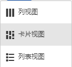
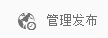

# 页面创作快速指南{#quick-guide-to-authoring-pages}

>[!CAUTION]
>
>AEM 6.4已结束扩展支持，本文档将不再更新。 有关更多详细信息，请参阅 [技术支助期](https://helpx.adobe.com/cn/support/programs/eol-matrix.html). 查找支持的版本 [此处](https://experienceleague.adobe.com/docs/).

这些步骤旨在作为在AEM中创作页面内容的关键操作的快速指南（简介）。

他们：

* 不提供全面的报道。
* 提供详细文档的链接。

有关使用 AEM 进行创作的完整详细信息，请参阅：

* [作者的首要步骤](/help/sites-authoring/first-steps.md)
* [使用创作环境](/help/sites-authoring/author-environment-tools.md)

## 一些快速提示 {#a-few-quick-hints}

在对具体细节进行概述之前，请查看下面这里的一些常规提示，这些提示值得牢记，特别是在您习惯了 [经典UI创作环境](/help/sites-classic-ui-authoring/classicui.md).

### 站点控制台 {#sites-console}

* **创建**

   * 此按钮在许多控制台中可用 - 出现的选项是上下文相关的，因此在不同的情况下可能有所改变。

* 在文件夹中对页面进行重新排序

   * 此操作可在[列表视图](/help/sites-authoring/basic-handling.md#list-view)中完成。更改将在其他视图中应用并可见。

* 更改UI

   * 可以从不同位置执行此操作。 请参阅 [选择您的UI](/help/sites-authoring/select-ui.md).

### 页面创作 {#page-authoring}

* 导航链接

   * ***链接不可用于导航*** 在 **编辑** 模式。 要使用需要的链接进行导航，请 [预览页面](/help/sites-authoring/editing-content.md#previewing-pages) 使用以下任一方法：

      * [预览模式](/help/sites-authoring/editing-content.md#preview-mode)
      * [以发布的形式查看](/help/sites-authoring/editing-content.md#view-as-published)

* 不再从页面编辑器启动/创建工作流和版本；现在从 [时间轴](/help/sites-authoring/basic-handling.md#timeline) （可从控制台访问）。

>[!NOTE]
>
>有许多键盘快捷键可以简化创作体验。
>
>* [编辑页面时的键盘快捷键](/help/sites-authoring/page-authoring-keyboard-shortcuts.md)
>* [控制台的键盘快捷键](/help/sites-authoring/keyboard-shortcuts.md)

## 查找页面 {#finding-your-page}

1. 打开&#x200B;**站点**&#x200B;控制台（使用&#x200B;**全局导航**&#x200B;中的[站点](/help/sites-authoring/basic-handling.md#global-navigation)选项 - 它将在您选择 Adobe Experience Manager（左上方）时以下拉菜单的形式触发）。

1. 通过点按/单击相应的页面，在树中向下导航。页面资源的显示方式取决于您所使用的视图 - [卡片视图、列表视图或列视图](/help/sites-authoring/basic-handling.md#viewing-and-selecting-resources)：

   

1. 使用[标头中的痕迹导航](/help/sites-authoring/basic-handling.md#the-header)对树进行向上导航，这允许您返回到选定的位置：

   

### 创建新页面 {#creating-a-new-page}

1. [导航到要创建新页面的位置](#finding-your-page)。
1. 使用 **创建** 图标，然后选择 **页面** 从列表中：

   

1. 此时将打开向导，引导您在 [创建新页面](/help/sites-authoring/managing-pages.md#creating-a-new-page). 按照屏幕上的说明操作。

## 选择页面以执行进一步操作 {#selecting-your-page-for-further-action}

您可以选择一个页面，以便对其执行操作。 选择页面将自动更新工具栏，以显示与该资源相关的操作。

如何选择页面取决于您在控制台中使用的视图：

1. 卡片视图：

   * 进入选择模式（按） [选择所需的资源](/help/sites-authoring/basic-handling.md#viewing-and-selecting-resources) 与：

      * 移动设备：点按并按住
      * 台式机：the [快速操作](/help/sites-authoring/basic-handling.md#quick-actions)  — 勾号图标：

         

      * 卡片上将覆盖一个勾号，表示已选择该页面。
   >[!NOTE]
   >
   >进入选择模式后， **选择** 图标（勾号）将更改为 **取消选择** 图标（十字）。

1. 列表视图：

   * 点按/单击所需资源的缩略图 - 缩略图上将覆盖一个勾号，表示已选择该页面。

1. 列视图：

   * 点按/单击所需资源的缩略图 - 缩略图上将覆盖一个勾号，表示已选择该页面。

## 快速操作（仅限卡片视图/桌面） {#quick-actions-card-view-desktop-only}

1. [导航](#finding-your-page)到要执行操作的页面。
1. 将鼠标指针悬停在代表所需资源的卡片上；将显示快速操作：

   

## 编辑页面内容 {#editing-your-page-content}

1. [导航](#finding-your-page)到要编辑的页面。
1. 使用“编辑”（铅笔）图标[打开要编辑的页面](/help/sites-authoring/managing-pages.md#opening-a-page-for-editing)：

   

   可以从以下位置访问该图标：

   * [快速操作（仅限卡片视图/桌面）](#quick-actions-card-view-desktop-only) 对应的资源。
   * [选择页面](#selecting-your-page-for-further-action)后显示的工具栏。

1. 在编辑器打开时，您可以：

   * [向页面中添加新组件](/help/sites-authoring/editing-content.md#inserting-a-component) 按：

      * 打开侧面板
      * 选择组件选项卡( [组件浏览器](/help/sites-authoring/author-environment-tools.md#components-browser))
      * 将所需组件拖动到页面上。

      可以通过以下图标打开（或关闭）侧面板：

      

   * [编辑现有组件的内容](/help/sites-authoring/editing-content.md#edit-configure-copy-cut-delete-paste) 在页面上：

      * 通过点按或单击打开组件工具栏。使用 **编辑** （铅笔）图标以打开对话框。
      * 通过点按并按住或双击慢速打开组件的就地编辑器。 将显示可用的操作（对于某些组件，这将是一个有限的选择）。
      * 要查看所有可用的操作，请使用进入全屏模式：

      

   * [配置现有组件的属性](/help/sites-authoring/editing-content.md#component-edit-dialog)

      * 通过点按或单击打开组件工具栏。使用 **配置** （扳手）图标打开对话框。
   * [移动组件](/help/sites-authoring/editing-content.md#moving-a-component) 以下任一项：

      * 将所需的组件拖动到其新位置。
      * 通过点按或单击打开组件工具栏。根据需要依次使用&#x200B;**剪切**&#x200B;和&#x200B;**粘贴**&#x200B;图标。
   * [复制（并粘贴）](/help/sites-authoring/editing-content.md#edit-configure-copy-cut-delete-paste) 组件：

      * 通过点按或单击打开组件工具栏。根据需要依次使用&#x200B;**复制**&#x200B;和&#x200B;**粘贴**&#x200B;图标。
      >[!NOTE]
      >
      >您可以将组件&#x200B;**粘贴**&#x200B;到同一页面或其他页面。如果在剪切/复制操作之前粘贴到已打开的其他页面，则表明该页面需要刷新。

   * [删除](/help/sites-authoring/editing-content.md#edit-configure-copy-cut-delete-paste)组件：

      * 通过点按或单击打开组件工具栏，然后使用&#x200B;**删除**&#x200B;图标。
   * [添加注释](/help/sites-authoring/annotations.md#annotations) 到页面：

      * 选择 **注释** 模式（语音气泡图标）。 使用 **添加注释** （加号）图标。 使用右上方的 X 退出注释模式。

      

   * [预览页面](/help/sites-authoring/editing-content.md#preview-mode) （查看该内容在发布环境中的显示方式）

      * 选择 **预览** 中。
   * 使用 **编辑** 下拉选择器。

   >[!NOTE]
   >
   >要使用内容中的链接进行导航，您必须使用 [预览模式](/help/sites-authoring/editing-content.md#preview-mode).

## 编辑页面属性 {#editing-the-page-properties}

有两种（主要）方法 [编辑页面属性](/help/sites-authoring/editing-page-properties.md):

* 从&#x200B;**站点**&#x200B;控制台中：

   1. [导航到页面](#finding-your-page) 要发布。
   1. 选择 **属性** 图标：

      * [快速操作（仅限卡片视图/桌面）](#quick-actions-card-view-desktop-only) 对应的资源。
      * [选择页面](#selecting-your-page-for-further-action)后显示的工具栏。

   

* 将会显示页面属性。您可以进行需要的更新，然后使用“保存”保留这些更改

   * When [编辑页面](#editing-your-page-content):

      1. 打开 **页面信息** 菜单。
      1. 选择 **打开属性** 打开用于编辑属性的对话框。

         

## 发布页面（或取消发布） {#publishing-your-page-or-unpublishing}

有两种主要方法 [发布页面](/help/sites-authoring/publishing-pages.md) （以及取消发布）：

* 从&#x200B;**站点**&#x200B;控制台中：

   1. [导航到页面](#finding-your-page) 要发布。
   1. 从以下任一位置选择&#x200B;**快速发布**&#x200B;图标：

      * [快速操作（仅限卡片视图/桌面）](#quick-actions-card-view-desktop-only) 对应的资源。
      * [选择页面](#selecting-your-page-for-further-action)后显示的工具栏（还可以访问[稍后发布](/help/sites-authoring/publishing-pages.md#manage-publication)）。

   

* When [编辑页面](#editing-your-page-content):

   1. 打开 **页面信息** 菜单。
   1. 选择 **发布页面**.

   

* 从控制台取消发布页面只能通过&#x200B;**管理发布**&#x200B;选项完成，该选项仅在工具栏上可用（不能通过快速操作）。

   的 **取消发布页面** 选项仍可通过 **页面信息** 菜单。

   

   请参阅 [发布页面](/help/sites-authoring/publishing-pages.md#unpublishing-pages) 以了解更多信息。

## 移动、复制并粘贴或删除页面 {#move-copy-and-paste-or-delete-your-page}

1. [导航到页面](#finding-your-page) 要移动、复制并粘贴或删除。
1. 使用以下任一方式根据需要选择复制（然后粘贴）、移动或删除图标：

   * [快速操作（仅限卡片视图/桌面）](#quick-actions-card-view-desktop-only) 所需资源。
   * [选择页面](#selecting-your-page-for-further-action)后显示的工具栏。

   * 复制：

      * 复制后，您将需要导航到新位置并进行粘贴。
   * 移动：

      * 将打开相应的向导来收集移动页面时所需的信息。按照屏幕上的说明操作。
   * 删除：

      * 系统将要求您确认该操作。
   >[!NOTE]
   >
   >快速操作中并未提供“删除”操作。

## 锁定页面（然后解锁） {#locking-your-page-then-unlocking}

[锁定页面](/help/sites-authoring/editing-content.md#locking-a-page) ，可阻止其他作者在您处理页面时对其进行处理。 可以找到“锁定”（和“解锁”）图标／按钮：

* [选择页面](#selecting-your-page-for-further-action)后显示的工具栏。
* 编辑页面时显示的[“页面信息”下拉菜单](#editing-the-page-properties)。
* 编辑页面（页面处于锁定状态）时显示的页面工具栏

例如，“锁定”图标如下所示：

## 访问页面引用 {#accessing-page-references}

在“引用”边栏中，可以[快速访问对页面的引用/从页面进行的引用](/help/sites-authoring/author-environment-tools.md#references)。

1. 使用工具栏图标选择&#x200B;**引用**（在[选择您的页面](#selecting-your-page-for-further-action)之前或之后）：

   

   此时会显示引用类型列表：

   

1. 点按/单击所需的引用类型，以显示更多详细信息并（在适当时）执行进一步的操作。

## 创建页面版本 {#creating-a-version-of-your-page}

1. 要打开“时间线”边栏，请使用工具栏图标选择&#x200B;**[时间线](/help/sites-authoring/basic-handling.md#timeline)**（在[选择您的页面](#selecting-your-page-for-further-action)之前或之后）：

   

1. 点按/单击“时间轴”列右下方的向上箭头以显示其他按钮，包括 **另存为版本**.

   

1. 选择&#x200B;**另存为版本**，然后再选择&#x200B;**创建**。

## 恢复/比较页面版本 {#restoring-comparing-a-version-of-your-page}

恢复和/或比较页面版本时所使用的机制基本相同：

1. 使用工具栏图标选择&#x200B;**[时间线](/help/sites-authoring/basic-handling.md#timeline)**（在[选择您的页面](#selecting-your-page-for-further-action)之前或之后）：

   

   如果页面的某个版本已经保存，则会在“时间线”中列出该版本。

1. 点按/单击要恢复的版本 — 这将显示其他操作按钮：

   * **恢复到此版本**

      * 将恢复该版本。
   * **显示差异**

      * 将打开页面，并突出显示（两个版本之间）的差异。
