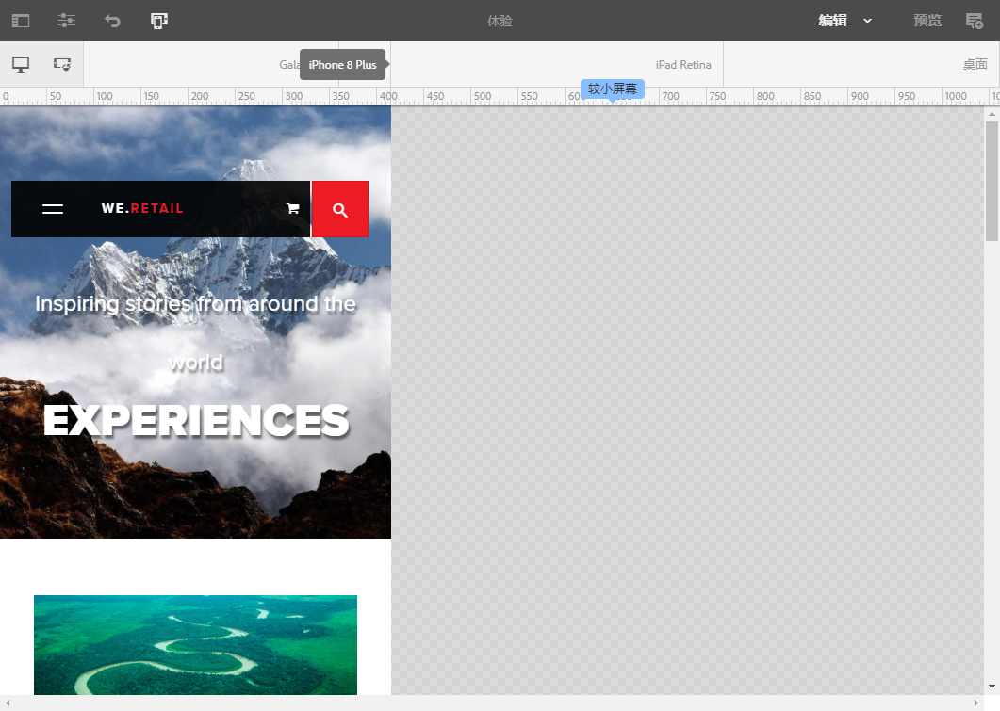
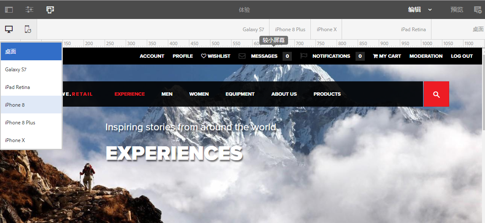
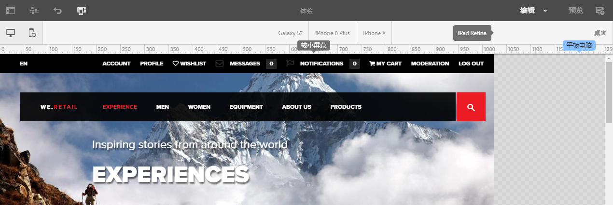
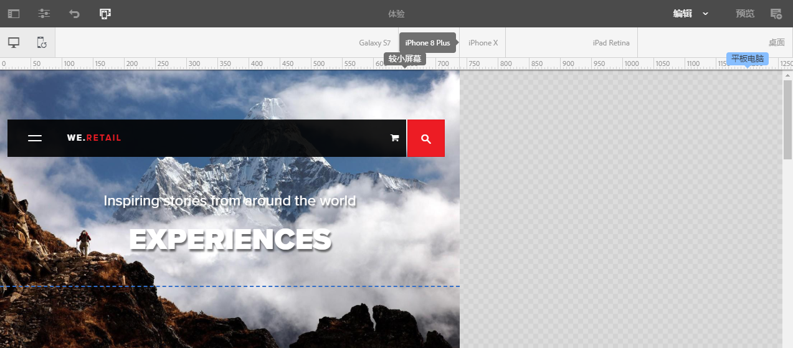
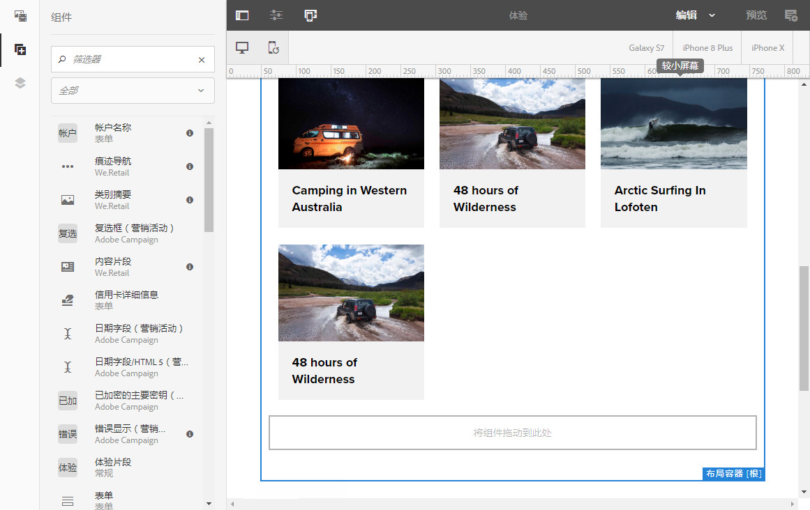
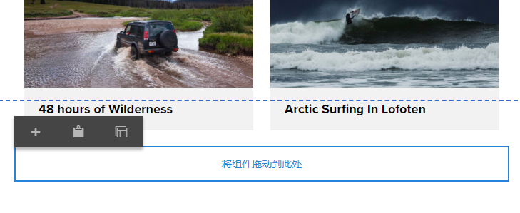
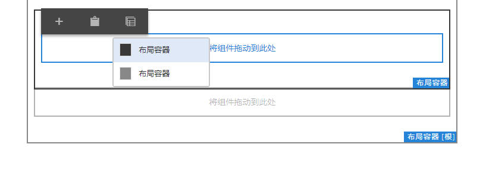
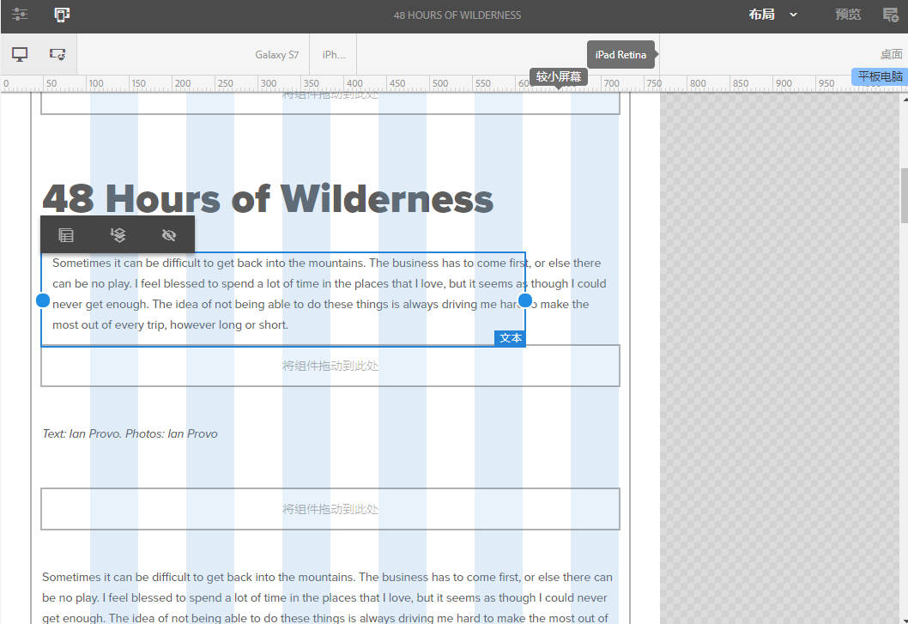
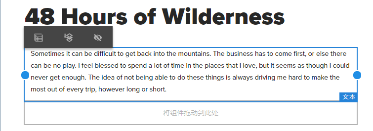

# 响应式布局{#responsive-layout}

AEM 让您能够使用&#x200B;**布局容器**&#x200B;组件为页面实现响应式布局。

由此提供的段落系统让您能够将组件放置在响应式网格内。此网格可以根据设备/窗口大小和格式重新安排布局。此组件可与[**布局&#x200B;**模式](/help/sites-authoring/responsive-layout.md#defining-layouts-layout-mode)配合使用，让您能够根据设备创建和编辑响应式布局。

布局容器：

* 提供水平对齐网格功能，还可以将组件并排放入网格，并且定义它们何时应该折叠/重排。
* 使用预定义的断点（例如，对于手机、平板电脑等），让您能够为相关设备/方向定义所需的内容行为。

   * 例如，您可以自定义组件的大小，或者在特定设备上是否可以看到组件。

* 可以进行嵌套，从而允许使用列控件。

随后，用户可以使用模拟器查看内容将在特定设备上的呈现方式。

>[!CAUTION]
>
>尽管布局容器组件在经典 UI 中可用，但是只有在触屏优化 UI 中才能使用和支持其全部功能。

AEM 使用一组机制为页面实现响应式布局：

* [**布局容器&#x200B;**](#adding-a-layout-container-and-its-content-edit-mode)组件

   此组件在[组件浏览器](/help/sites-authoring/author-environment-tools.md#components-browser)中可用，而且提供了一个网格段落系统，让您能够在响应式网格内添加和放置组件。您也可以将此组件设置为页面上的默认段落系统。

* [**布局模式&#x200B;**](/help/sites-authoring/responsive-layout.md#defining-layouts-layout-mode)

   将布局容器放置到页面上后，就可以使用&#x200B;**布局**&#x200B;模式在响应式网格内放置内容。

* [**模拟器&#x200B;**](#selecting-a-device-to-emulate)模拟器让您能够创建并编辑响应式网站，这些网站可以根据设备/窗口大小，通过以交互方式调整组件大小来重新安排布局。随后，用户可以使用模拟器查看内容的呈现方式。

通过这些响应式网格机制，您可以：

* 根据设备宽度（与设备类型和方向有关），使用断点来定义不同的内容布局。
* 使用这些相同的断点和内容布局来确保您的内容可对桌面浏览器窗口的大小做出响应。
* 使用水平对齐网格功能，从而允许您将组件放入网格中，根据需要调整大小，定义它们何时应该折叠/重排成并排或上下放置的形式。
* 为特定设备布局隐藏组件。
* 实现列控件。

根据您的项目，可以将布局容器用作您页面的默认段落系统，或用作可通过组件浏览器添加到页面中的组件（或同时用作两者）。

>[!NOTE]
>
>Adobe 提供了响应式布局的 [GitHub 文档](https://adobe-marketing-cloud.github.io/aem-responsivegrid/)，前端开发人员可以参考该文档，以便在 AEM 之外使用 AEM 网格，例如在为将来的 AEM 站点创建静态 HTML 模型时。

>[!NOTE]
>
>通过对模板进行配置，可以启用上述机制。See [Configuring Responsive Layout](/help/sites-administering/configuring-responsive-layout.md) for further information.

## 布局定义、设备模拟和断点 {#layout-definitions-device-emulation-and-breakpoints}

在创建网站内容时，您可能希望确保内容的显示方式适合用来查看内容的设备。

AEM 允许您根据设备的宽度定义布局：

* 模拟器让您能够在各种设备上模拟这些布局。除设备类型以外，通过&#x200B;**旋转设备**&#x200B;选项选择的方向也可能会因宽度的改变而影响所选的断点。
* 断点是区分各种布局定义的分界点。

   * 断点可有效地定义任何使用特定布局的设备的最大宽度（以像素为单位）。
   * 断点通常适用于一系列选定的设备，具体视设备显示器的宽度而定。
   * 断点的范围会向左扩展，直至到达下一个断点。
   * 您无法明确地选择断点，选择设备和方向将会自动选择相应的断点。

**桌面**&#x200B;设备没有特定的宽度，因此它与默认的断点（即，高于上次所配置断点的所有断点）有关。

>[!NOTE]
>
>尽管可以为每台单独的设备定义断点，但这会大大增加定义和维护布局所需的工作量。

在使用模拟器时，您可以选择特定的设备以进行模拟和定义布局，并且相关的断点也将会突出显示。您所做的任何布局更改将适用于断点所适用的其他设备；即位于活动断点标记左侧、但尚未到达下一个断点标记的任何设备。

例如，当您选择 **iPhone 6 Plus** 设备（定义为宽度 540 像素）进行模拟和布局时，断点&#x200B;**手机**（定义为 768 像素）也将被激活。您对 **iPhone 6** 所做的任何布局更改将适用于&#x200B;**手机**&#x200B;断点下的其他设备，如 **iPhone 5**（定义为 320 像素）。

## 选择要模拟的设备 {#selecting-a-device-to-emulate}

1. 打开需要编辑的页面。例如：

   `http://localhost:4502/editor.html/content/we-retail/us/en/experience.html`

1. 从顶部工具栏中选择&#x200B;**模拟器**&#x200B;图标：

   

1. 此时将打开模拟器工具栏。

   

   模拟器工具栏会显示其他布局选项：

   * **旋转设备** - 允许您将设备从垂直（纵向）方向旋转到水平（横向）方向，反之亦然。

    

   * **选择设备** - 从列表中定义要模拟的特定设备（请参阅下一步以了解详细信息）。

   

1. 要选择特定设备进行模拟，您可以使用下列任一方法：

   * 使用“选择设备”图标并从下拉选择器中进行选择。
   * 点按/单击模拟器工具栏中的设备指示器。

   

1. 选择特定设备后，您可以：

   * 查看选定设备的活动标记，如 **iPad。**
   * 查看相应[断点](/help/sites-authoring/responsive-layout.md#layout-definitions-device-emulation-and-breakpoints)的活动标记，如&#x200B;**平板电脑**。

   

   * 蓝色虚线表示选定设备（此处为 **iPhone 6**）的“折页”**。

   

   * 折页可被视为内容的分页符（不要与[断点](/help/sites-authoring/responsive-layout.md#layout-definitions-device-emulation-and-breakpoints)相混淆）。显示此线可方便地指明用户在滚动之前可在设备上看到的内容部分。
   * 如果所模拟的设备高度高于屏幕大小，将不会显示折页线。
   * 显示折页是为了方便作者查看，在已发布的页面上则不会显示折页。

## 添加布局容器及其内容（编辑模式）{#adding-a-layout-container-and-its-content-edit-mode}

**布局容器**&#x200B;是一个段落系统，该系统：

* 包含其他组件。
* 可定义布局。
* 可对更改做出响应。

>[!NOTE]
>
>如果&#x200B;**布局容器**&#x200B;尚不可用，则必须明确地[为段落系统/页面激活布局容器](/help/sites-administering/configuring-responsive-layout.md)（例如，使用[**设计&#x200B;**模式激活](/help/sites-authoring/default-components-designmode.md)）。

1. 布局 **容器在组件浏览器中** ，可作为标准 [组件使用](/help/sites-authoring/author-environment-tools.md#components-browser)。 从此处，您可以将其拖动到页面上的所需位置，随后您将看到将组件拖动到 **此处占位符** 。
1. 接下来，您可以向布局容器中添加组件。这些组件将存放实际的内容：

   

## 选择布局容器并对其执行操作（编辑模式）{#selecting-and-taking-action-on-a-layout-container-edit-mode}

与其他组件一样，您可以先选择布局容器，然后再对其执行剪切、复制、删除等操作（在&#x200B;**编辑**&#x200B;模式下）：

>[!CAUTION]
>
>由于布局容器是段落系统，因此删除该组件即意味着同时删除布局网格以及容器中包含的所有组件（及其内容）。

1. 如果将鼠标悬停在网格占位符上或点按网格占位符，将显示操作菜单。

   

   您需要选择&#x200B;**父项**&#x200B;选项。

   

1. 如果嵌套了布局组件，则选择&#x200B;**父项**&#x200B;选项会显示一个下拉选择框，允许您选择嵌套的布局容器或其父项。

   当您将鼠标悬停在下拉选择框中的容器名称上时，页面上将显示它们的轮廓。

   * 级别最低的嵌套布局容器将显示黑色轮廓。
   * 级别次于最低的嵌套布局容器将显示深灰色轮廓。
   * 后续的每个容器将以灰色阴影逐渐变浅的方式显示。

   

1. 此时将突出显示整个网格及其内容。在显示的操作工具栏中，您可以选择一项操作，例如&#x200B;**删除**。

   

## 定义布局（布局模式）{#defining-layouts-layout-mode}

>[!NOTE]
>
>您可以为每个[断点](#layout-definitions-device-emulation-and-breakpoints)定义单独的布局（由模拟的设备类型和方向决定）。

要为通过布局容器实施的响应式网格配置布局，您需要使用&#x200B;**布局**&#x200B;模式。

可以通过两种方式启动&#x200B;**布局**&#x200B;模式。

* 使用[工具栏中的模式菜单](/help/sites-authoring/author-environment-tools.md#page-modes)并选择&#x200B;**布局**&#x200B;模式

   * 像切换到&#x200B;**编辑**&#x200B;模式或&#x200B;**定位**&#x200B;模式一样，选择&#x200B;**布局**&#x200B;模式。
   * **布局**&#x200B;模式会一直保持下去，直到您通过模式选择器选择其他模式后，才会离开&#x200B;**布局**&#x200B;模式。

* 在[编辑单个组件时。](/help/sites-authoring/editing-content.md#edit-component-layout)

   * 使用组件快速操作菜单中的&#x200B;**布局**&#x200B;选项，您可以切换到&#x200B;**布局**&#x200B;模式。
   * 在编辑组件期间将一直处于&#x200B;**布局**&#x200B;模式，在焦点转到其他组件后，才会还原至&#x200B;**编辑**&#x200B;模式。

在布局模式下，您可以对网格执行各种操作：

* 使用蓝色圆点调整内容组件的大小。大小调整操作将始终与网格对齐。调整大小时，背景网格将显示出来，以帮助进行对齐：

   

   >[!NOTE]
   >
   >在调整&#x200B;**图像**&#x200B;等组件的大小时，其比例和比率将保持不变。

* 单击/点按内容组件后，您可以使用工具栏执行以下操作：

   * **父项**

      允许您选择整个布局容器组件，以对整体执行操作。

   * **浮动到新行**

      组件将移至新行，具体取决于网格中的可用空间。

   * **隐藏组件**

      组件将变得不可见(可以从布局容器的工具栏中恢复)。
   

* 在&#x200B;**布局**&#x200B;模式下，您可以点按/单击&#x200B;**将组件拖动到此处**&#x200B;来选择整个组件。此时将显示此模式的工具栏。

   根据布局组件的状态及属于该布局的组件，工具栏将具有不同的选项。例如：

   * **父项** - 选择父组件。

   

   * **显示隐藏的组件** - 显示所有或各个组件。数字表示当前存在的隐藏组件数量。计数器显示隐藏的组件数量。

   

   * **还原断点布局** - 还原到默认的布局。这意味着不再强制使用自定义布局。

   

   * **浮动到新行** - 在间距允许的情况下将组件向上移动一个位置。

   

   * **隐藏组件** - 隐藏当前的组件。

   

   >[!NOTE]
   >
   >在以上示例中，浮动和隐藏操作之所以可用，是因为此布局容器嵌套在一个父布局容器内。

   * **取消隐藏组**&#x200B;件选择父组件可显示包含 
**显示隐藏的组件** 。 在此示例中，隐藏了两个组件。
   

   选择&#x200B;**显示隐藏的组件**&#x200B;选项时，当前隐藏的组件将以蓝色显示在它们的原始位置。

   

   选择&#x200B;**全部恢复**&#x200B;将取消隐藏所有隐藏的组件。

