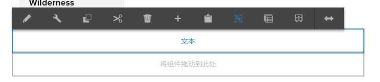
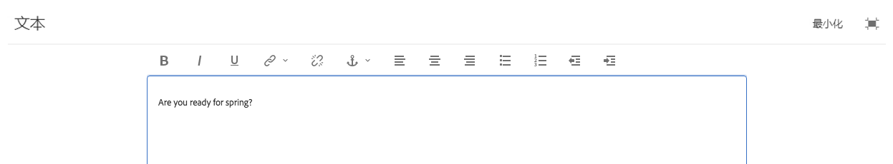

# Using the Rich Text Editor to author content {#using-the-rich-text-editor-to-author-content}

富文本编辑器(RTE)是在AEM页面中创作文本的基本构建块。 许多组件（如文本、文本和图像以及表）都基于RTE。

>[!NOTE]
>
>无法按预期方式将嵌套列表复制到 RTE。从 Microsoft Word 中复制嵌套列表时，您需要在 RTE 中粘贴文本后手动清理列表。

## 就地编辑 {#in-place-editing}

只需点按或单击，即可选择基于文本的组件，这将显示组 [件工具栏](../sites-authoring/editing-content.md#edit-configure-copy-cut-delete-paste)。

再次点按／单击，或通过慢速多次点按／单击打开就地编辑功能（它有自己的工具栏）初始选择组件。 在此处，您可以编辑内容并进行基本的格式更改。

此工具栏提供了以下选项：

* **格式**: 设置粗体、斜体和下划线格式。

* **列表**: 创建项目符号或编号列表或设置缩进。

* **超链接**

* **取消链接**

* **全屏**

* **关闭**

* **保存**

## 全屏编辑 {#full-screen-editing}

对于基于文本的组件，从工具栏中选择全屏模式将打开富文本编辑器并隐藏页面内容的其余部分。

全屏模式显示由管理员配置的富文本编辑器的所有选项。 这些配置可能因AEM实 [例而异](../sites-administering/rich-text-editor.md) ，具体取决于管理员或AEM开发人员提供的配置。 如果您发现某个选项缺失，请要求您的管理员使其可用。

其他富文本编辑器选项包括：

* **锚点**：在文本中创建一个可在以后链接或引用的锚点。
* **左对齐文本**
* **居中对齐文本**
* **右对齐文本**

要关闭全屏模式，请单击最小化图标。

