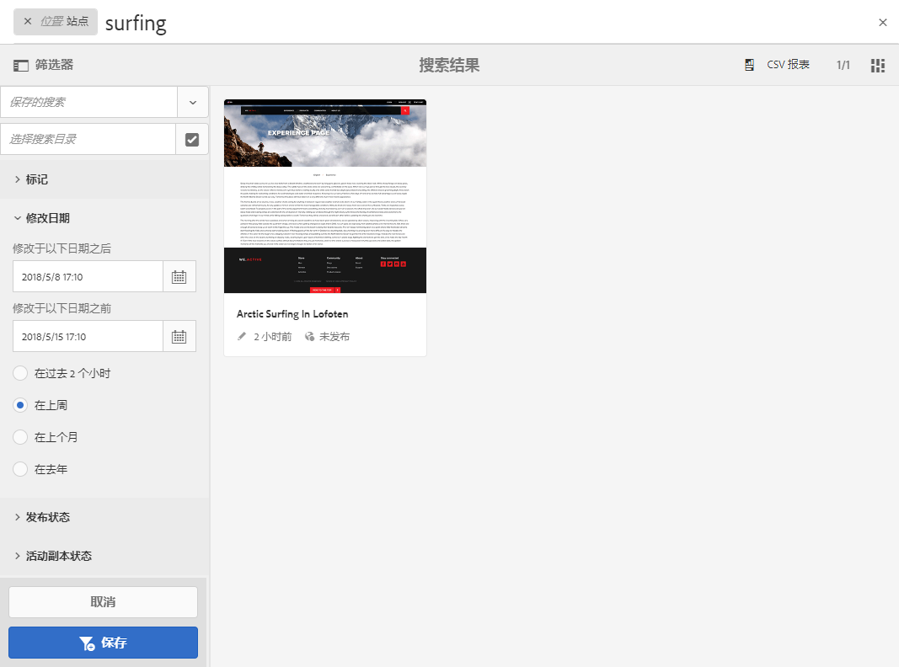

# 搜索{#search-features}

>[!CAUTION]
>
>AEM 6.4已结束扩展支持，本文档将不再更新。 有关更多详细信息，请参阅 [技术支助期](https://helpx.adobe.com/cn/support/programs/eol-matrix.html). 查找支持的版本 [此处](https://experienceleague.adobe.com/docs/).

AEM 的创作环境提供了多种内容搜索机制，具体取决于资源类型。

>[!NOTE]
>
>在创作环境之外，还可以使用其他机制进行搜索，例如 [查询生成器](/help/sites-developing/querybuilder-api.md) 和 [CRXDE Lite](/help/sites-developing/developing-with-crxde-lite.md).

## 搜索基础知识 {#search-basics}

可从顶部工具栏中使用搜索功能：

使用搜索边栏可以：

* 搜索特定的关键字、路径或标记。
* 按照特定于资源的条件进行筛选，例如修改日期、页面状态和文件大小等。
* 定义和使用[保存的搜索](#saved-searches) - 均基于以上条件。

>[!NOTE]
>
>显示搜索边栏时，还可以使用热键 `/`（正斜杠）调用搜索。

## 搜索和筛选 {#search-and-filter}

要搜索和筛选您的资源，请执行以下操作：

1. 打开 **搜索** （带有工具栏中的放大镜）并输入搜索词。 将会提出建议，并且可以选择：

   

   默认情况下，搜索结果将被限制在您的当前位置（例如控制台和相关的资源类型）：

   

1. 如果需要，您可以删除位置过滤器（选中要删除的过滤器上的 **X**），以在所有控制台/资源类型之间进行筛选。
1. 将显示结果，并根据控制台和相关资源类型进行分组。

   您可以选择一种特定的资源（用于未来操作），或通过选择所需的资源类型向下展开；例如&#x200B;**查看全部站点**：

   

1. 如果您需要进一步向下展开，请选择“边栏”符号（左上方）以打开侧面板&#x200B;**过滤器和选项**。

   

   根据资源类型，搜索将显示预定义的搜索/筛选条件选择。

   侧面板允许您选择：

   * 保存的搜索
   * 搜索目录
   * 标记
   * 搜索条件；例如，修改日期、发布状态、LiveCopy状态。

   >[!NOTE]
   >
   >搜索条件可能会有所不同：
   >
   >* 根据您选择的资源类型；例如，资产和社区标准显然是专用的。
   >* 您的实例作为 [搜索Forms](/help/sites-administering/search-forms.md) 可以自定义(对应于AEM中的位置)。

   

1. 您还可以添加其他搜索词：

   

1. 使用 **X**（右上方）关闭&#x200B;**搜索**。

>[!NOTE]
>
>在搜索结果中选择项目时，搜索条件会被保留。
>
>当您在搜索结果页面上选择某个项目时，如果使用浏览器后退按钮返回到搜索页面，则搜索条件仍将存在。

## 保存的搜索 {#saved-searches}

除了按各种方面进行搜索之外，您还可以保存特定的搜索配置以供在以后的阶段检索和使用：

1. 定义搜索标准并选择 **保存**.

   

1. 指定名称，然后使用&#x200B;**保存**&#x200B;进行确认。

   

1. 在下次访问搜索面板时，您可以从选择器中选择保存的搜索：

   

1. 保存后，您可以：

   * 使用 **x** （根据保存的搜索的名称）以启动新查询（保存的搜索本身将不会被删除）。
   * **编辑保存的搜索**，更改搜索条件，然后 **保存** 再次。

通过选择保存的搜索并单击搜索面板底部的&#x200B;**编辑保存的搜索**，可以修改保存的搜索。

