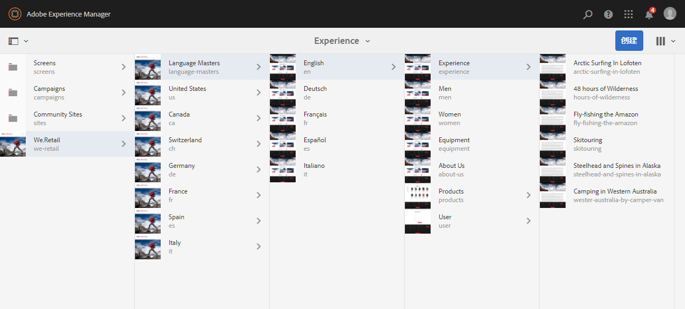
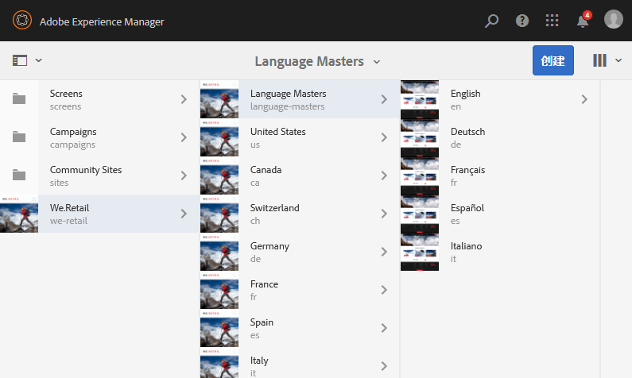
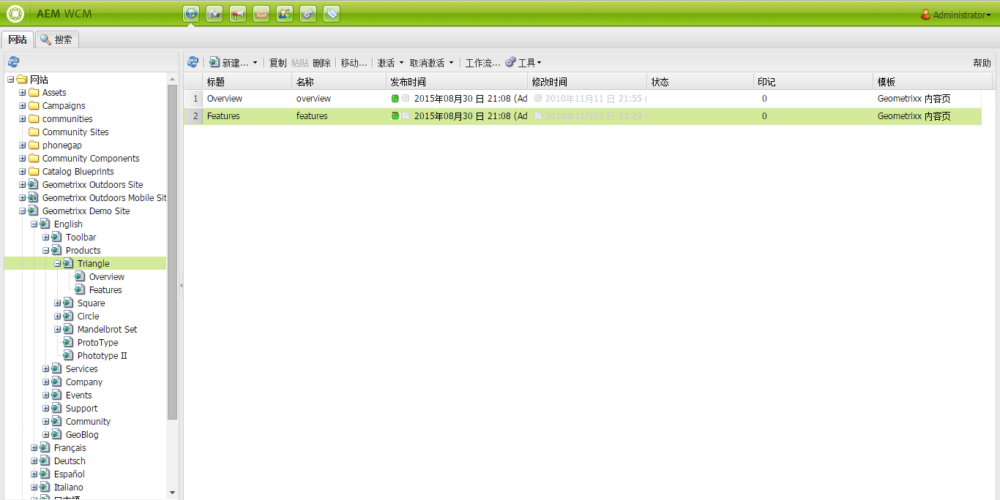
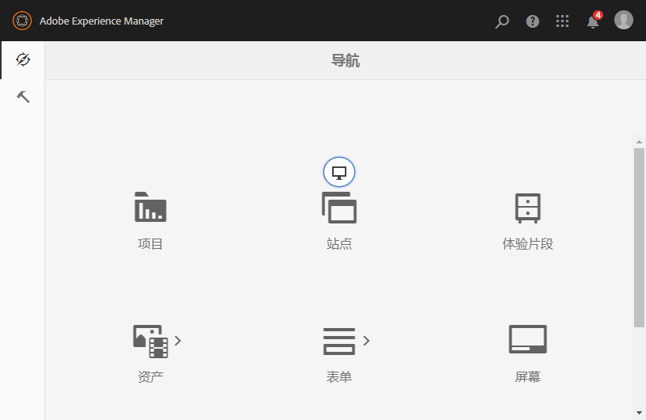
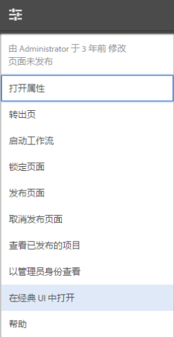

# 选择您的UI{#selecting-your-ui}

>[!CAUTION]
>
>AEM 6.4已结束扩展支持，本文档将不再更新。 有关更多详细信息，请参阅 [技术支助期](https://helpx.adobe.com/cn/support/programs/eol-matrix.html). 查找支持的版本 [此处](https://experienceleague.adobe.com/docs/).

## 了解UI

创作环境允许：

* [创作](/help/sites-authoring/author.md) (包括 [页面创作](/help/sites-authoring/author-environment-tools.md), [管理资产](/help/assets/home.md), [社区](/help/communities/author-communities.md))

* [管理](/help/sites-administering/home.md) 在网站上生成和维护内容时需要的任务

提供了两个图形用户界面来实现此目的。 这些浏览器可通过任何现代浏览器访问。

1. 触屏优化UI

   * 这是现代的默认AEM UI。
   * 主色调为灰色，界面干净平整。
   * 设计用于触控和桌面设备，但在所有设备上的外观都是相同的 [查看和选择资源](/help/sites-authoring/basic-handling.md#viewing-and-selecting-resources) 略有不同（点按与点击）。

      * 桌面:

   

   * 平板电脑设备（或台式机宽度小于1024像素）：

   

1. 经典 UI

   * 这是旧版UI，已在AEM中提供多年。
   * 主色调为绿色。
   * 它专为在桌面设备上使用而设计。
   * 以下文档重点介绍现代用户界面。 有关在经典UI中进行创作的信息，请参阅 [经典UI创作文档](/help/sites-classic-ui-authoring/classicui.md).

   

## 切换UI

尽管触屏UI现在是标准UI，并且 [功能对等性](../release-notes/touch-ui-features-status.md) 网站的管理和编辑已接近完成，用户有时可能希望切换到 [经典UI](/help/sites-classic-ui-authoring/classicui.md). 可以使用多个选项来执行此操作。

>[!NOTE]
>
>有关与经典UI的功能对等性状态的详细信息，请参阅 [触屏UI对等功能](../release-notes/touch-ui-features-status.md) 文档。

您可以在多个位置定义要使用的UI:

* [为实例配置默认UI](#configuring-the-default-ui-for-your-instance)  — 这将设置用户登录时显示的默认UI，但用户可能能够覆盖此设置，并为其帐户或当前会话选择其他UI。

* [为帐户设置经典UI创作](/help/sites-authoring/select-ui.md#setting-classic-ui-authoring-for-your-account)  — 这将设置编辑页面时默认使用的UI，不过用户可以覆盖此设置，为其帐户或当前会话选择其他UI。

* [为当前会话切换到经典UI](#switching-to-classic-ui-for-the-current-session)  — 这会将当前会话切换到经典UI。

* 对于 [页面创作系统会根据UI进行某些覆盖](#ui-overrides-for-the-editor).

>[!CAUTION]
>
>切换到经典UI的各种选项并非直接可用，必须为您的实例专门配置这些选项。
>
>请参阅 [启用对经典UI的访问](/help/sites-administering/enable-classic-ui.md) 以了解更多信息。

>[!NOTE]
>
>从以前版本升级的实例将保留经典UI用于页面创作。
>
>升级后，页面创作不会自动切换到触屏优化UI，但您可以使用 [OSGi配置](/help/sites-deploying/configuring-osgi.md) 的 **WCM创作UI模式服务** ( `AuthoringUIMode` 服务)。 请参阅 [编辑器的UI覆盖](#ui-overrides-for-the-editor).

## 为实例配置默认UI {#configuring-the-default-ui-for-your-instance}

系统管理员可以使用配置启动和登录时显示的UI [根映射](/help/sites-deploying/osgi-configuration-settings.md).

该设置可能会被用户默认设置或会话设置所覆盖。

## 为帐户设置经典UI创作 {#setting-classic-ui-authoring-for-your-account}

每个用户都可以访问 [用户首选项](/help/sites-authoring/user-properties.md) 用于定义他/她是否希望使用经典UI进行页面创作（而不是默认UI）。

该设置可能会被会话设置覆盖。

## 为当前会话切换到经典UI {#switching-to-classic-ui-for-the-current-session}

使用触屏优化UI时，桌面用户可能希望还原到经典（仅限桌面）UI。 可通过以下几种方法切换到当前会话的经典UI:

* **导航链接**

   >[!CAUTION]
   >
   >切换到经典UI的此选项并非直接可用，必须为您的实例专门配置此选项。
   >
   >
   >请参阅 [启用对经典UI的访问](/help/sites-administering/enable-classic-ui.md) 以了解更多信息。

   如果启用了此设置，则每当您将鼠标悬停在适用的控制台上时，都会显示一个图标（显示器的符号），点按/单击该图标将在经典UI中打开相应的位置。

   例如， **站点** to **siteadmin**:

   

* **URL**

   经典UI可通过欢迎屏幕的URL()访问 `welcome.html`. 例如：

   `http://localhost:4502/welcome.html`

   >[!NOTE]
   >
   >触屏优化UI可以通过 `sites.html`. 例如：
   >
   >
   >`http://localhost:4502/sites.html`

### 编辑页面时切换为经典UI {#switching-to-classic-ui-when-editing-a-page}

>[!CAUTION]
>
>切换到经典UI的此选项并非直接可用，必须为您的实例专门配置此选项。
>
>请参阅 [启用对经典UI的访问](/help/sites-administering/enable-classic-ui.md) 以了解更多信息。

如果启用， **打开经典UI** 可从 **页面信息** 对话框：

### 编辑器的UI覆盖 {#ui-overrides-for-the-editor}

在页面创作时，系统可能会覆盖用户或系统管理员定义的设置。

* 创作页面时：

   * 在使用 `cf#` 中。 例如：

      `http://localhost:4502/cf#/content/geometrixx/en/products/triangle.html`

   * 在使用 `/editor.html` 在URL中或使用触控设备时。 例如：

      `http://localhost:4502/editor.html/content/geometrixx/en/products/triangle.html`

* 任何强制操作都是临时的，并且仅对浏览器会话有效

   * 将根据是否启用触屏( `editor.html`)或classic( `cf#`)。

* 通过打开页面时 `siteadmin`，将检查是否存在：

   * Cookie
   * 用户首选项
   * 如果两者都不存在，则默认使用 [OSGi配置](/help/sites-deploying/configuring-osgi.md) 的 **WCM创作UI模式服务** ( `AuthoringUIMode` 服务)。

>[!NOTE]
>
>如果 [用户已经定义了页面创作首选项](#setting-classic-ui-authoring-for-your-account)，则不会通过更改OSGi属性来覆盖该值。

>[!CAUTION]
>
>由于使用了Cookie（如前面所述），因此不建议执行以下任一操作：
>
>* 手动编辑URL — 非标准URL可能会导致未知情况和功能缺失。
>* 同时打开两个编辑器 — 例如，在单独的窗口中打开。
>

