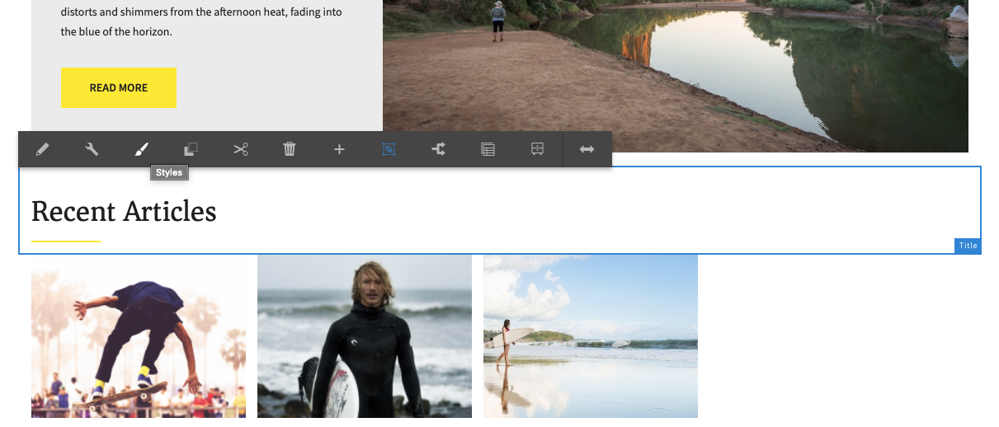

# 样式系统{#style-system}

>[!CAUTION]
>
>AEM 6.4已结束扩展支持，本文档将不再更新。 有关更多详细信息，请参阅 [技术支助期](https://helpx.adobe.com/cn/support/programs/eol-matrix.html). 查找支持的版本 [此处](https://experienceleague.adobe.com/docs/).

样式系统允许模板作者在组件的内容策略中定义样式类，以便内容作者在页面上编辑组件时能够选择这些类。这些样式可以作为组件的替代可视化变量，从而使组件变得更加灵活。

这样，您就无需为每个样式开发自定义组件，也无需自定义组件对话框来启用此类样式功能。 它可提供更多可重用的组件，无需任何AEM后端开发，即可快速轻松地适应内容作者的需求。

## 用例 {#use-case}

模板作者不仅需要能够为内容作者配置组件的工作方式，还需要能够配置组件的许多替代可视化变量。

同样，内容作者不仅需要能够构建和排列其内容，还需要能够选择内容的视觉呈现方式。

样式系统针对模板作者和内容作者的要求提供了统一的解决方案：

* 模板作者可以在组件的内容策略中定义样式类。
* 然后，内容作者在页面上编辑组件时，可以从下拉菜单中选择这些类，以应用相应的样式。

然后，样式类会插入到组件的装饰包装器元素中，以便组件开发人员不必关心如何处理样式（而不提供其CSS规则）。

## 概述 {#overview}

通常，可通过以下形式来使用样式系统。

1. Web 设计人员创建组件的不同可视化变量。

1. 向 HTML 开发人员提供组件的 HTML 输出以及要实施的所需可视化变量。

1. HTML 开发人员定义与每个可视化变量对应的 CSS 类，该类将插入到组件的包装元素中。

1. HTML 开发人员为每个可视化变量实施相应的 CSS 代码（和可选 JS 代码），以使它们按照定义的方式显示。

1. AEM 开发人员将提供的 CSS（和可选 JS）放置在[客户端库](/help/sites-developing/clientlibs.md)中并对其进行部署。

1. AEM 开发人员或模板作者配置页面模板并编辑每个已设置样式的组件的策略，从而添加定义的 CSS 类、为每种样式提供用户友好名称，并指示可组合的样式。

1. 之后，AEM 页面作者可以在页面编辑器中通过组件工具栏的样式菜单选择设计的样式。

请注意，实际上只在AEM中执行最后三个步骤。 这意味着，无需AEM即可完成所有必要CSS和Javascript的所有开发。

实际实施样式只需在AEM上部署并在所需模板的组件中进行选择即可。

下图说明了样式系统的架构。

## 使用 {#use}

为了演示该功能，我们将使用核心组件的[标题组件](https://www.adobe.com/go/aem_cmp_title_v2_cn)的 [WKND](https://experienceleague.adobe.com/docs/experience-manager-learn/getting-started-wknd-tutorial-develop/overview.html?lang=zh-Hans) 实施作为示例。

下面的[作为内容作者](#as-a-content-author)和[作为模板作者](#as-a-template-author)部分介绍了如何使用 WKND 样式系统来测试样式系统的功能。

如果您希望为自己的组件使用样式系统，请执行以下操作：

1. 按照部分中所述，将CSS安装为客户端库 [概述](#overview).
1. 按照部分中的所述，配置您希望向内容作者提供的CSS类 [作为模板作者](#as-a-template-author).
1. 然后，内容作者可以按照部分中所述使用样式 [作为内容作者](#as-a-content-author).

### 作为内容作者 {#as-a-content-author}

1. 安装 WKND 项目后，导航到 WKND 的英语母版主页 `http://<host>:<port>/sites.html/content/wknd/language-masters/en`，然后编辑该页面。
1. 选择该页面下方的&#x200B;**标题**&#x200B;组件

   

1. 点按或单击&#x200B;**列表**&#x200B;组件工具栏上的&#x200B;**样式**&#x200B;按钮以打开样式菜单，然后更改该组件的外观。

   

   >[!NOTE]
   >
   >在此示例中，**颜色**&#x200B;样式（**黑色**、**白色**&#x200B;和&#x200B;**灰色**）是互斥的，而&#x200B;**样式**&#x200B;选项（**下划线**、**右对齐**&#x200B;和&#x200B;**最小间距**）则可以组合使用。这可以在[模板中配置为模板作者](#as-a-template-author)。

### 作为模板作者 {#as-a-template-author}

1. 编辑 WKND 的英语母版主页 `http://<host>:<port>/sites.html/content/wknd/language-masters/en` 时，通过&#x200B;**页面信息 > 编辑模板**&#x200B;来编辑该页面的模板。

   

1. 通过点按或单击&#x200B;**标题**&#x200B;组件的&#x200B;**策略**&#x200B;按钮，编辑该组件的策略。

   

1. 在属性的“样式”选项卡中，您可以看到样式的配置方式。

   

   * **群组名称：** 样式可以在样式菜单中分组到一起，内容作者在配置组件样式时将看到该样式菜单。
   * **样式可以合并：** 允许同时选择该组中的多个样式。
   * **样式名称：** 配置组件样式时将向内容作者显示的样式描述。
   * **CSS类：** 与样式关联的CSS类的实际名称。

   使用拖动手柄排列组和组内样式的顺序。 使用添加或删除图标在组中添加或删除组或样式。

>[!CAUTION]
>
>配置为组件策略的样式属性的 CSS 类（以及任何必需的 Javascript）必须部署为[客户端库](/help/sites-developing/clientlibs.md)才能正常工作。

## 设置 {#setup}

核心组件版本 2 及更高版本完全支持使用样式系统，并且无需进行额外配置。

只有为您自己的自定义组件启用样式系统，或者[在“编辑”对话框中启用可选的“样式”选项卡](#enable-styles-tab-edit)时，才需执行以下步骤。

### 在“设计”对话框中启用“样式”选项卡 {#enable-styles-tab-design}

为了使组件能够与 AEM 的样式系统结合使用并在其“设计”对话框中显示“样式”选项卡，组件开发人员必须通过对组件进行以下设置来包含“样式”选项卡：

* `path = "/mnt/overlay/cq/gui/components/authoring/dialog/style/tab_design/styletab"`
* `sling:resourceType = "granite/ui/components/coral/foundation/include"`

配置组件后，由页面作者配置的样式将由AEM自动插入到装饰元素上，AEM会自动将该装饰元素包裹在每个可编辑的组件周围。 组件本身无需执行任何其他操作即可实现此目的。

### 在“编辑”对话框中启用“样式”选项卡 {#enable-styles-tab-edit}

自AEM 6.4.7.0版起，“编辑”对话框中的可选“样式”选项卡现已可用。 与“设计”对话框选项卡不同，“编辑”对话框中的选项卡对于样式系统的正常运行来说并不是必需的，但它是内容作者设置样式的可选替代界面。

可以采用与“设计”对话框选项卡类似的方式包括“编辑”对话框选项卡：

* `path = "/mnt/overlay/cq/gui/components/authoring/dialog/style/tab_edit/styletab"`
* `sling:resourceType = "granite/ui/components/coral/foundation/include"`

>[!NOTE]
>
>默认情况下，“编辑”对话框中的“样式”选项卡处于未启用状态。

### 具有元素名称的样式 {#styles-with-element-names}

开发人员还可以使用 `cq:styleElements` 字符串数组属性为组件上的样式配置允许的元素名称列表。然后，在设计对话框中策略的样式选项卡中，模板作者还可以选择要为每个样式设置的元素名称。 这将设置包装器元素的元素名称。

此属性在 `cq:Component` 节点上设置。例如：

* `/apps/<yoursite>/components/content/list@cq:styleElements=[div,section,span]`

>[!CAUTION]
>
>避免为可组合的样式定义元素名称。 定义多个元素名称后，优先级的顺序为：
>
>1. HTL 优先于所有内容：`data-sly-resource="${'path/to/resource' @ decorationTagName='span'}`
>1. 然后，在多个活动样式中，会采用组件策略中配置的样式列表中的第一个样式。
>1. 最后，组件的 `cq:htmlTag`/`cq:tagName` 将被视为回退值。

>

这种定义样式名称的功能对于极其通用的组件（如布局容器或内容片段组件）非常有用，可为它们提供更多含义。

例如，使用该功能可以为布局容器提供 `<main>`、`<aside>`、`<nav>` 等语义。
