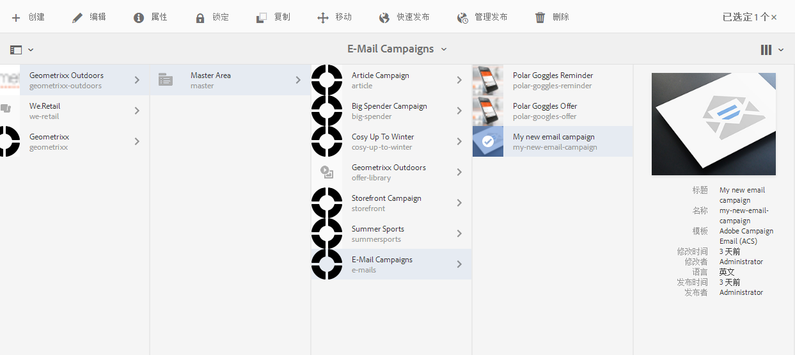

# 定位您的 Adobe Campaign{#targeting-your-adobe-campaign}

要定位您的 Adobe Campaign 新闻稿，您需要先设置分段，分段仅在经典 UI 中可用（适用于 Client Context）。之后，您可以为 Adobe Campaign 创建目标体验。此部分对这两项操作都进行了说明。

## 在 AEM 中设置分段  {#setting-up-segmentation-in-aem}

要设置分段，您需要使用经典 UI 来设置区段。其余步骤可以在标准 UI 中执行。

设置分段包括创建区段、品牌、营销活动和体验。

>[!NOTE]
>
>需要将区段 ID 映射到 Adobe Campaign 端的区段 ID。

### 创建区段 {#creating-segments}

要创建区段，请执行以下操作：

1. 打开位于&#x200B;**&lt;host>&lt;a2/>&lt;port>/miscadmin#/etc/segmentation**&#x200B;的[分段控制台。](http://localhost:4502/miscadmin#/etc/segmentation)
1. 创建新页面并输入标题——例如，**AC区段**-并选择&#x200B;**区段(Adobe Campaign)**&#x200B;模板。
1. 在左侧的树视图中选择已创建的页面。
1. 创建一个区段（例如定位男性用户），方法是在您创建的名为“Male”的区段下创建一个新页面，然后选择&#x200B;**区段 (Adobe Campaign)** 模板。
1. 打开创建的区段页面，然后将&#x200B;**区段 ID** 从 Sidekick 拖放到该页面上。
1. 多次-单击特征，输入表示Adobe Campaign中定义的男性段的ID，例如&#x200B;**MALE**，然后单击&#x200B;**确定**。 应显示以下消息：*`targetData.segmentCode == "MALE"`*
1. 重复执行这些步骤以创建另一个区段，例如，定位女性用户的区段。

### 创建品牌  {#creating-a-brand}

要创建品牌，请执行以下操作：

1. 在&#x200B;**站点**&#x200B;中，导航到&#x200B;**营销活动**&#x200B;文件夹（例如，在 We.Retail 中）。
1. 单击&#x200B;**创建页面**&#x200B;并输入页面标题（例如 We.Retail Brand），然后选择&#x200B;**品牌**&#x200B;模板。

### 创建营销活动 {#creating-a-campaign}

要创建营销活动，请执行以下操作：

1. 打开刚刚创建的&#x200B;**品牌**&#x200B;页面。
1. 单击&#x200B;**创建页面**&#x200B;并输入页面标题（例如 We.Retail Campaign），然后选择&#x200B;**营销活动**&#x200B;模板并单击&#x200B;**创建**。

### 创建体验  {#creating-experiences}

要为区段创建体验，请执行以下操作：

1. 打开刚刚创建的&#x200B;**营销活动**&#x200B;页面。
1. 通过单击&#x200B;**创建页面**&#x200B;并输入页面标题（例如，当您为Male区段创建体验时，输入Male），为区段创建体验，然后选择&#x200B;**体验**&#x200B;模板。
1. 打开创建的体验页面。
1. 单击&#x200B;**编辑**，然后单击“区段”下的&#x200B;**添加项目**。
1. 输入公线段的路径，例如&#x200B;**/etc/segmentation/ac-segments/male**，然后单击&#x200B;**确定**。 应显示以下消息：*体验针对：Male*
1. 重复执行上述步骤以便为所有区段都创建体验，例如针对女性目标。

## 创建包含目标内容的新闻稿  {#creating-a-newsletter-with-targeted-content}

创建区段、品牌、营销活动和体验后，您可以创建包含目标内容的新闻稿。创建体验后，您可以将体验与区段相关联。

>[!NOTE]
>
>[仅 Geometrixx 中提供了电子邮件示例](/help/sites-developing/we-retail.md)。请从“包共享”中下载 Geometrixx 示例内容。

要创建包含目标内容的新闻稿，请执行以下操作：

1. 创建包含目标内容的新闻稿：在Geometrixx Outdoors中的电子邮件活动下，单击或点按&#x200B;**创建** > **页面**，然后选择一个Adobe Campaign邮件模板。

   

1. 在新闻稿中，添加一个“文本与个性化”组件。
1. 在该“文本与个性化”组件中添加文本，例如“This is the default”。
1. 单击&#x200B;**编辑**&#x200B;旁边的箭头，然后选择&#x200B;**定位**。
1. 从“品牌”下拉菜单中选择您的品牌，然后选择您的营销活动。（这是您之前创建的品牌和营销活动）。
1. 单击&#x200B;**开始定位**。您会看到您的区段显示在“受众”区域中。如果已定义的区段都不匹配，则会使用默认体验。

   >[!NOTE]
   >
   >默认情况下，AEM 附带的电子邮件示例使用 Adobe Campaign 作为定位引擎。对于自定义新闻稿，您可能需要选择 Adobe Campaign 作为定位引擎。定位时，请点按或单击工具栏中的“+”，为新活动输入标题，然后选择 **Adobe Campaign** 作为定位引擎。

1. 单击&#x200B;**默认**，然后单击您添加的“文本与个性化”组件，此时您会看到带有箭头的靶心图标。单击该图标以定位此组件。

   

1. 导航到另一个区段 (Male)，单击&#x200B;**添加选件**，然后单击加号图标 (+)。接着，编辑该选件。
1. 导航到另一个区段 (Female)，单击&#x200B;**添加选件**，然后单击加号图标 (+)。接着，编辑该选件。
1. 单击&#x200B;**Next**&#x200B;查看“映射”，然后单击&#x200B;**Next**&#x200B;查看“设置”(不适用于Adobe Campaign)，然后单击&#x200B;**保存**。

   当 Adobe Campaign 中的分发使用内容时，AEM 会自动为 Adobe Campaign 生成正确的定位代码。

1. 在 Adobe Campaign 中，创建您的分发 - 选择&#x200B;**使用 AEM 内容的电子邮件分发**，然后根据需要选择本地 AEM 帐户并确认您的更改。

   在 HTML 视图中，目标组件的不同体验会包含在 Adobe Campaign 定位代码中。

   

   >[!NOTE]
   >
   >如果您也在 Adobe Campaign 中设置了区段，则单击&#x200B;**预览**&#x200B;会显示每个区段的体验。

