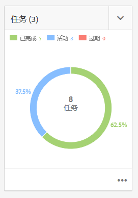
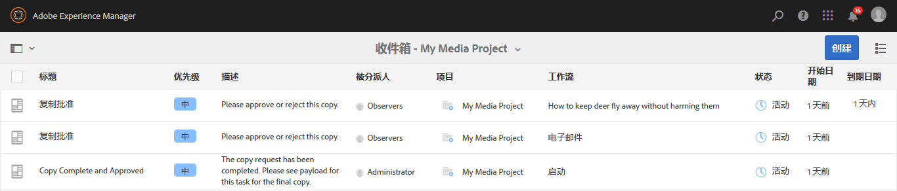
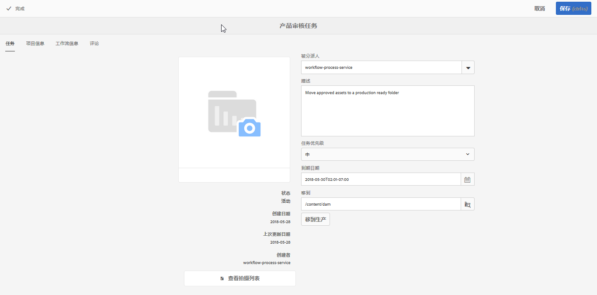
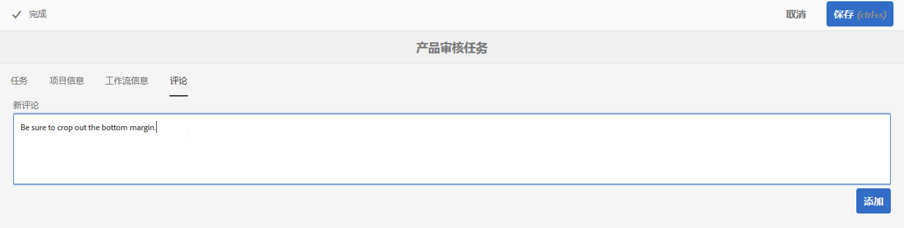
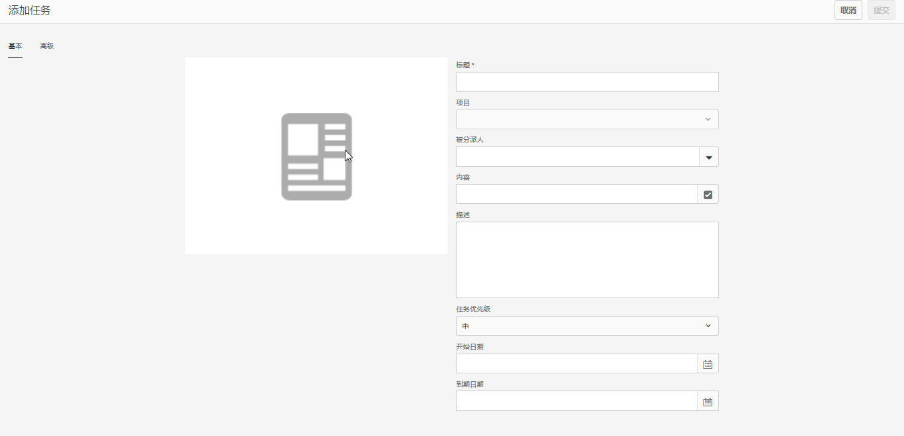
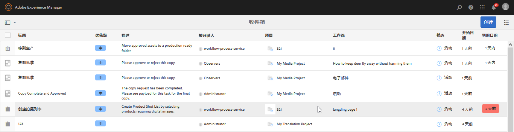
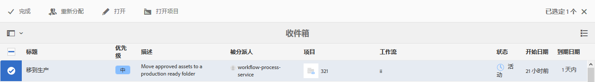

# 处理任务{#working-with-tasks}

>[!CAUTION]
>
>AEM 6.4已结束扩展支持，本文档将不再更新。 有关更多详细信息，请参阅 [技术支助期](https://helpx.adobe.com/cn/support/programs/eol-matrix.html). 查找支持的版本 [此处](https://experienceleague.adobe.com/docs/).

任务表示要对内容完成的工作项。 为您分配任务后，该任务会显示在您的工作流收件箱中。 任务项在“类型”列中具有任务值。

项目中还使用任务来确定当前任务（包括工作流任务）的完整程度。

## 跟踪项目进度 {#tracking-project-progress}

您可以通过查看项目中由 **任务** 拼贴。 项目进度可由以下方式决定：

* **任务拼贴：**&#x200B;项目详细信息页面上的“任务拼贴”中描述了项目的整体进度。

* **任务列表：**&#x200B;单击“任务拼贴”时，将显示任务列表。此列表包含与项目相关的所有任务的详细信息。

同时列出工作流任务以及您直接在 **任务** 拼贴。

### 任务拼贴 {#task-tile}

如果项目具有任何相关任务，则项目中会显示“任务拼贴”。 “任务拼贴”显示项目的当前状态。 这基于工作流中的现有任务，不包括随着工作流的继续而将生成的任何任务。 任务拼贴中显示以下信息：

* 已完成任务的百分比
* 活动任务的百分比
* 逾期任务的百分比

### 查看或修改项目中的任务 {#viewing-or-modifying-the-tasks-in-a-project}

除了跟踪进度之外，您还可能希望查看有关项目的更多信息或修改项目。

#### 任务列表 {#task-list}

单击“任务”拼贴中的省略号(...)可显示与项目相关的任务列表。 任务被父工作流划分。 任务详细信息与元数据一起显示，如到期日期、被分派人、优先级和状态。

#### 任务详细信息 {#task-details}

有关特定任务的详细信息，请在任务列表中，点按/单击该任务，然后打开**任务详**。

### 查看和修改任务注释 {#viewing-and-modifying-task-comments}

在任务详细信息中，您可以编辑或添加注释。 此外，项目中的所有注释都会显示在“注释”区域中。

### 添加任务 {#adding-tasks}

您可以向项目添加新任务。 然后，这些任务会显示在任务拼贴中，并可在通知收件箱中对执行操作。

要添加任务，请执行以下操作：

1. 在项目的任务拼贴 **中** ，点按／单击+图标。 此时将 **打开“添加任务** ”窗口。
1. 输入有关任务的信息。 任务的标题以及任务分配给的组是必填项。 其他信息（如内容路径、描述、任务优先级和到期日期）是可选的。 此外，您还可以选择 **高级** 选项卡，输入任务的名称，该名称用于命名URL。

   

1. 点按/单击&#x200B;**创建**。

## 在收件箱中处理任务 {#working-with-tasks-in-the-inbox}

访问任务的另一种方式是从收件箱。 从收件箱中，您可以打开内容以实施所需的更改。 完成后，将任务状态设置为“已完成”。 将任务分配给您所属的用户组后，任务也会显示在您的收件箱中。 在这种情况下，组的任何成员都可以执行工作并完成任务。

要完成任务，请选择任务并单击 **完成**. 向任务中添加信息，然后单击 **完成**. 请参阅 [您的收件箱](/help/sites-authoring/inbox.md) 以了解更多信息。

