# 管理项目{#managing-projects}

>[!CAUTION]
>
>AEM 6.4已结束扩展支持，本文档将不再更新。 有关更多详细信息，请参阅 [技术支助期](https://helpx.adobe.com/cn/support/programs/eol-matrix.html). 查找支持的版本 [此处](https://experienceleague.adobe.com/docs/).

通过“项目”，您可以将资源分组到一个实体中来组织项目。

在 **项目** 控制台中，您可以访问项目并对其执行操作：

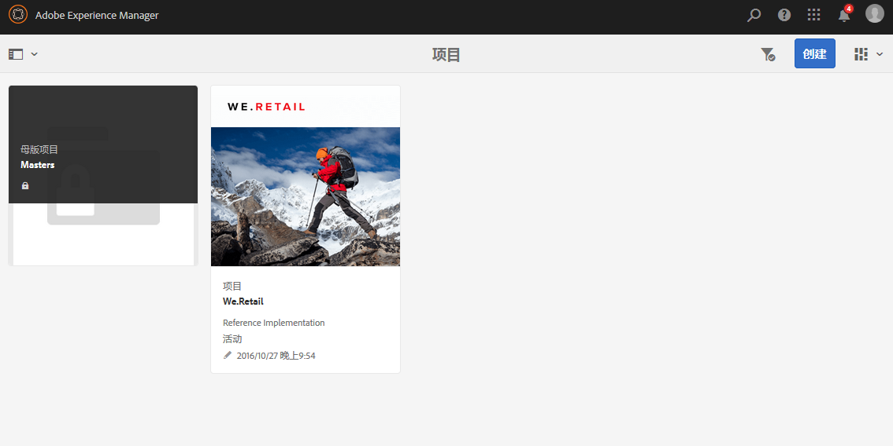

在“项目”中，您可以创建项目、将资源与项目关联，以及删除项目或资源链接。 您可能希望打开图块以查看其内容并向图块中添加项目。 本主题介绍了这些过程。

>[!NOTE]
>
>6.2引入了将项目组织到文件夹中的功能。 在项目页面上，您可以创建项目或文件夹。
>
>如果创建了文件夹，则会将用户转到该文件夹，以便他们创建其他文件夹或项目。 它有助于根据产品促销活动、位置、翻译语言等类别将项目组织到文件夹中。
>
>可以在列表视图中查看项目和文件夹，也可以进行搜索。

>[!CAUTION]
>
>对于项目中的用户，如果要在使用“项目”功能（如创建项目、创建任务/工作流、查看和管理团队）时查看其他用户/组，这些用户需要具有 **/home/users** 和 **/home/groups**. 实现此操作的最简单方法是 **项目用户** 组读取访问权限 **/home/users** 和 **/home/groups**.

## 创建项目 {#creating-a-project}

AEM开箱即用地提供了以下模板，供您在创建项目时选择：

* 简单项目
* 媒体项目
* 产品照片拍摄项目
* 翻译项目

从项目到项目，创建项目的过程相同。 项目类型之间的差异包括可用的用户角 [色](/help/sites-authoring/projects.md) 和工 [作流](/help/sites-authoring/projects-with-workflows.md)。  要创建新项目，请执行以下操作：

1. 在“ **项目**”中，点按／单 **击创建** ，以打开创 **建项目向导** :
1. 选择模板. 开箱即用，简单项目，媒体项目， [翻译项目](/help/sites-administering/tc-manage.md)和 [产品照片拍摄产品](/help/sites-authoring/managing-product-information.md) 可用，单击 **下一个**.

   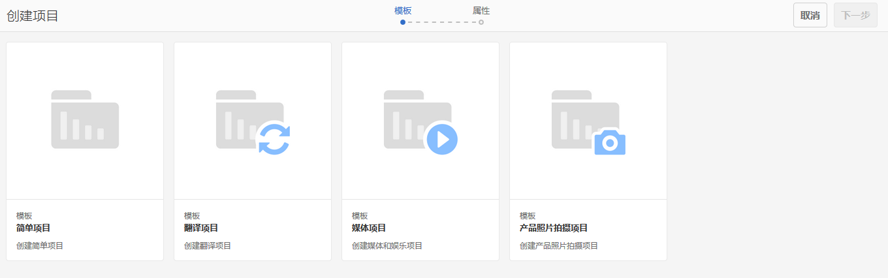

1. 定义&#x200B;**标题**&#x200B;和&#x200B;**描述**，然后根据需要添加&#x200B;**缩略图**&#x200B;图像。您还可以添加或删除用户及其所属的组。 此外，单击 **高级** 添加URL中使用的名称。

   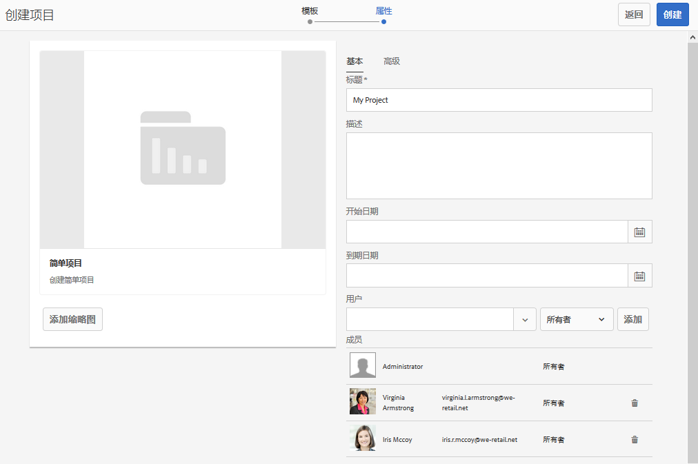

1. 点按/单击&#x200B;**创建**。确认会询问您是要打开新项目还是返回控制台。

### 将资源与项目关联 {#associating-resources-with-your-project}

由于项目允许您将资源分组到一个实体中，因此您需要将资源与项目关联。 这些资源称为 **图块**. 可添加的资源类型在 [项目图块](/help/sites-authoring/projects.md#project-tiles).

要将资源与项目关联，请执行以下操作：

1. 从 **项目** 控制台。
1. 点按/单击 **添加拼贴** ，然后选择要链接到项目的图块。 您可以选择多种类型的拼贴。

   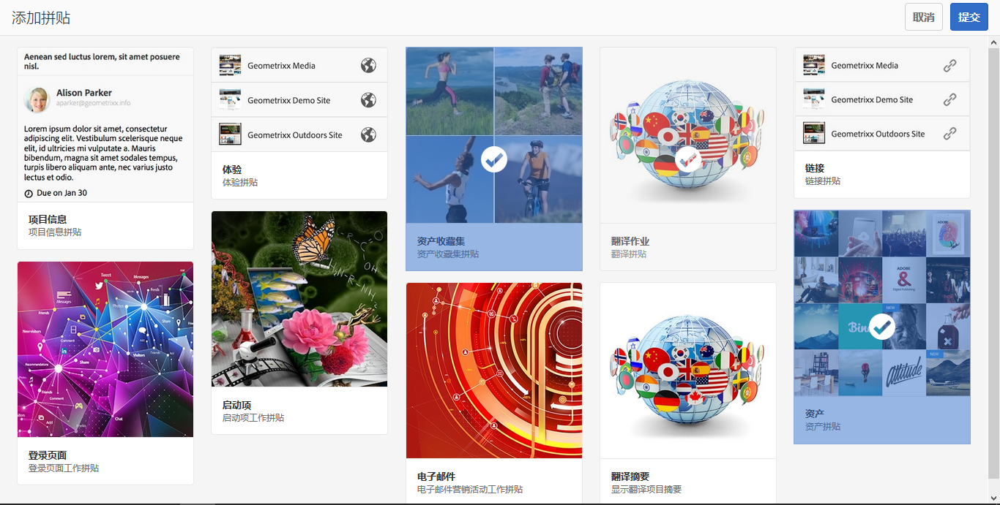

   >[!NOTE]
   >
   >有关可与项目关联的项目拼贴的详细说明，请参阅[项目拼贴](/help/sites-authoring/projects.md#project-tiles)。

1. 点按/单击&#x200B;**创建**。您的资源随即会链接到项目，从现在开始，您便可以从项目中访问该资源。

### 删除项目或资源链接 {#deleting-a-project-or-resource-link}

可使用同样的方法从控制台中删除项目或项目中的链接资源：

1. 导航到相应的位置：

   * 要删除项目，请转到 **项目** 控制台。
   * 要删除项目中的资源链接，请在&#x200B;**项目**&#x200B;控制台中打开相应的项目。

1. 单击&#x200B;**选择**&#x200B;并选择您的项目或资源链接，以进入选择模式。
1. 点按/单击&#x200B;**删除**。

1. 您需要在对话框中确认删除。 如果确认，则删除项目或资源链接。 点按/单击&#x200B;**取消选择**&#x200B;可退出选择模式。

>[!NOTE]
>
>在创建项目并将用户添加各种角色时，将自动创建与项目关联的组以管理关联的权限。例如，名为 Myproject 的项目将有三个组，分别为 **Myproject 所有者**、**Myproject 编辑者**、**Myproject 观察者**。但是，如果删除了项目，这些组不会自动删除。管理员需要在&#x200B;**工具** > **安全** > **组**&#x200B;中手动删除这些组。

### 将项目添加到图块 {#adding-items-to-a-tile}

在某些图块中，您可能想要添加多个项目。 例如，您可能同时运行了多个工作流或多个体验。

要向图块中添加项目，请执行以下操作：

1. 在 **项目**，导航到项目，然后单击要将项目添加到的图块上的添加+图标。

   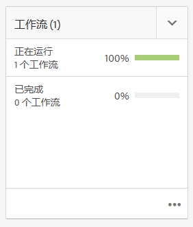

1. 像创建新拼贴时一样，向拼贴中添加项目。 描述了项目图块 [此处](/help/sites-authoring/projects.md#project-tiles). 在此示例中，添加了另一个工作流。

   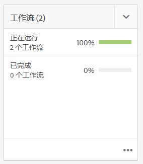

### 打开图块 {#opening-a-tile}

您可能想要查看当前图块中包含哪些项目，或者修改或删除图块中的项目。

要打开图块以便查看或修改项目，请执行以下操作：

1. 在项目控制台中，点按/单击省略号(...)

   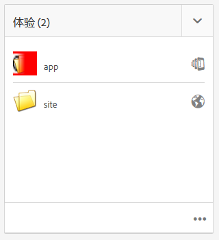

1. AEM会列出该拼贴中的项目。 您可以进入选择模式以修改或删除项目。

   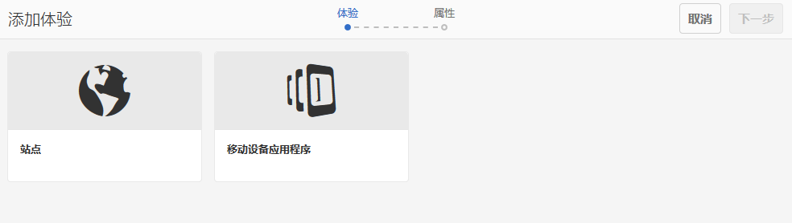

## 查看项目统计信息 {#viewing-project-statistics}

要查看项目统计信息，请在 **项目** 控制台，单击 **显示统计信息视图**. 此时会显示每个项目的完成级别。 单击 **显示统计信息视图** 再次转到 **项目** 控制台。

### 查看项目时间线 {#viewing-a-project-timeline}

项目时间线提供了项目中的资产上次使用时间的相关信息。要查看项目时间线，请单击/点按&#x200B;**时间线**，然后进入选择模式并选择项目。资产会显示在左侧窗格中。单击/点按&#x200B;**时间线**&#x200B;可返回到&#x200B;**项目**&#x200B;控制台。

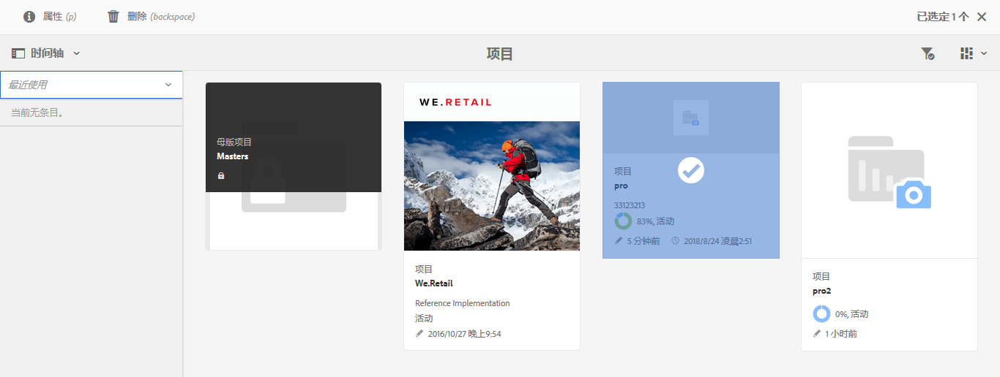

### 查看活动/不活动的项目 {#viewing-active-inactive-projects}

要在活动和不活动的项目之间切换，请在&#x200B;**项目**&#x200B;控制台中单击&#x200B;**切换活动的项目**。如果该图标旁边有一个复选标记，则它会显示活动项目。

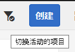

如果该图标旁边显示有一个 x，则显示的是不活动的项目。

## 将项目设为非活动或活动 {#making-projects-inactive-or-active}

如果您已完成某个项目，但仍希望保留该项目的信息，则可能希望该项目处于非活动状态。

要将项目设为非活动（或活动），请执行以下操作：

1. 在 **项目** 控制台中，打开您的项目，然后找到 **项目信息** 拼贴。

   >[!NOTE]
   如果此拼贴尚未在您的项目中，则可能需要添加它。 请参阅 [添加图块](#adding-items-to-a-tile).

1. 点按/单击&#x200B;**编辑**。
1. 将选择器从&#x200B;**活动**&#x200B;更改为&#x200B;**不活动**（反之亦然）。

   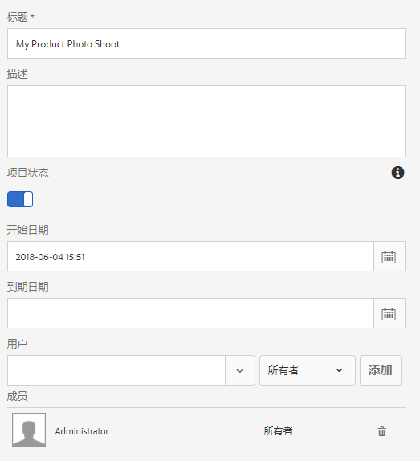

1. 点按/单击&#x200B;**完成**&#x200B;以保存更改。
