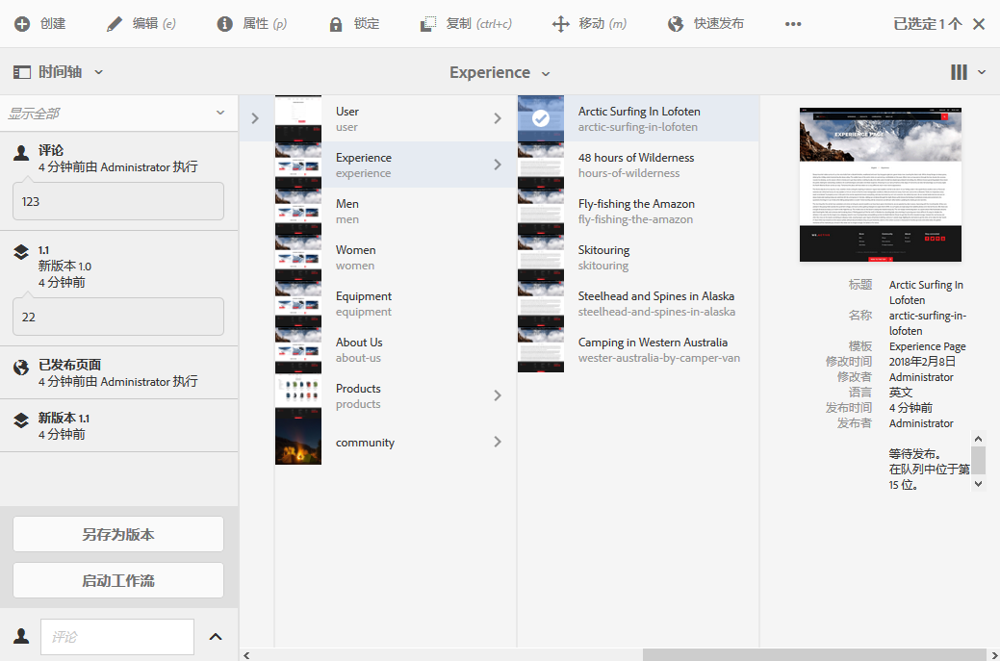
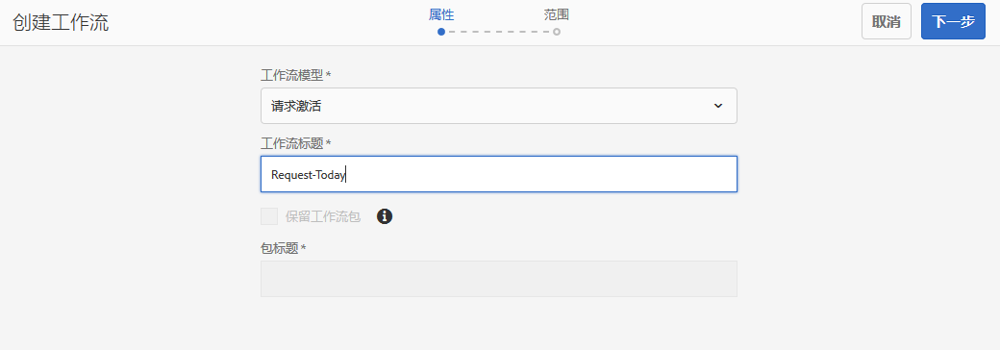
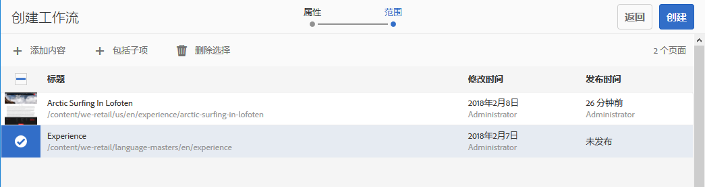

# 将工作流应用于页面{#applying-workflows-to-pages}

>[!CAUTION]
>
>AEM 6.4已结束扩展支持，本文档将不再更新。 有关更多详细信息，请参阅 [技术支助期](https://helpx.adobe.com/cn/support/programs/eol-matrix.html). 查找支持的版本 [此处](https://experienceleague.adobe.com/docs/).

进行创作时，您可以调用工作流以在页面上执行操作；也可以应用多个工作流。

应用工作流时，您可以指定以下信息：

* 要应用的工作流。

   您可以应用任何工作流（您有权访问，由 AEM 管理员分配）。

* （可选）帮助在用户收件箱中标识工作流实例的标题。
* 工作流负载；这可以是一个或多个页面。

工作流可从以下位置启动：

* the **[站点](#starting-a-workflow-from-the-sites-console)** 控制台。
* 编辑页面时，从 **[页面信息](#starting-a-workflow-from-the-page-editor)**.

>[!NOTE]
>
>另请参阅：
>
>* [如何将工作流应用到DAM资产](/help/assets/assets-workflow.md).
>* [使用项目工作流](/help/sites-authoring/projects-with-workflows.md)。
>

>[!NOTE]
>
>AEM管理员可以 [使用其他多种方法启动工作流](/help/sites-administering/workflows-starting.md).

## 从站点控制台启动工作流 {#starting-a-workflow-from-the-sites-console}

您可以通过以下任一方式启动工作流：

* the **[创建](#starting-a-workflow-from-the-sites-toolbar)** 选项。
* the **[时间轴](#starting-a-workflow-from-the-timeline)** 站点控制台的边栏。

在这两种情况下，您都需要：

* [在创建工作流向导中指定工作流详细信息](#specifying-workflow-details-in-the-create-workflow-wizard).

### 从站点工具栏启动工作流 {#starting-a-workflow-from-the-sites-toolbar}

您可以从&#x200B;**站点**&#x200B;控制台的工具栏中启动工作流：

1. 导航到所需的页面并选择该页面。

1. 现在，您可以从工具栏的&#x200B;**创建**&#x200B;选项中选择&#x200B;**工作流**。

   

1. 的 **创建工作流** 向导将帮助您 [指定工作流详细信息](#specifying-workflow-details-in-the-create-workflow-wizard).

### 从时间线启动工作流 {#starting-a-workflow-from-the-timeline}

您可以从&#x200B;**时间线**&#x200B;中启动要应用于所选资源的工作流。

1. [选择资源](/help/sites-authoring/basic-handling.md#viewing-and-selecting-resources)，然后打开[时间线](/help/sites-authoring/basic-handling.md#timeline)（或打开时间线，然后选择资源）。
1. 可以使用评论字段中的箭头显示&#x200B;**启动工作流**：

   

1. 的 **创建工作流** 向导将帮助您 [指定工作流详细信息](#specifying-workflow-details-in-the-create-workflow-wizard).

### 在创建工作流向导中指定工作流详细信息 {#specifying-workflow-details-in-the-create-workflow-wizard}

的 **创建工作流** 向导将帮助您选择工作流并指定所需的详细信息。

打开 **创建工作流** 向导：

* the **[创建](#starting-a-workflow-from-the-sites-toolbar)** 选项。
* the **[时间轴](#starting-a-workflow-from-the-timeline)** 站点控制台的边栏。

您可以指定详细信息：

1. 在 **属性** 步骤中，定义了工作流的基本选项：

   * **工作流模型**
   * **工作流标题**

      * 您可以为此实例指定标题，以帮助您在以后的阶段对其进行识别。

   根据工作流模型，还可以使用以下选项。 这些选项允许在工作流完成后保留创建为有效负载的包。

   * **保留工作流包**
   * **包标题**

      * 您可以为包指定标题，以帮助进行标识。
   >[!NOTE]
   >
   >为多资源支持配置了工作流并选择了多个资源时，**保留工作流包**&#x200B;选项可用。

   完成后，单击&#x200B;**下一步**&#x200B;继续。

   

1. 在&#x200B;**范围**&#x200B;步骤中，您可以选择：

   * **添加内容**&#x200B;以打开[路径浏览器](/help/sites-authoring/author-environment-tools.md#path-browser)并选择其他资源；在浏览器中，单击/点按&#x200B;**选择**&#x200B;以将内容添加到工作流实例。
   * 现有资源以查看其他操作：

      * **包括子项**，指定将该资源的子项包含在工作流中。

         系统将打开一个对话框，允许您根据以下各项优化选择：

         * 仅包括下级子项.
         * 仅包括已修改的页面.
         * 仅包括已发布的页面.

         指定的任何子项都将添加到工作流将应用到的资源列表中。

      * **删除选定内容** 从工作流中删除该资源。

   

   >[!NOTE]
   >
   >如果添加其他资源，则可以使用&#x200B;**返回**，在&#x200B;**属性**&#x200B;步骤中调整&#x200B;**保留工作流包**&#x200B;的设置。

1. 使用&#x200B;**创建**&#x200B;关闭向导并创建工作流实例。“站点”控制台中会显示通知。

## 从页面编辑器启动工作流 {#starting-a-workflow-from-the-page-editor}

编辑页面时，您可以选择 **页面信息** 中。 下拉菜单具有选项 **在工作流中启动**. 此选项将打开一个对话框，您可以在其中指定所需的工作流，如果需要，还可以指定标题：

