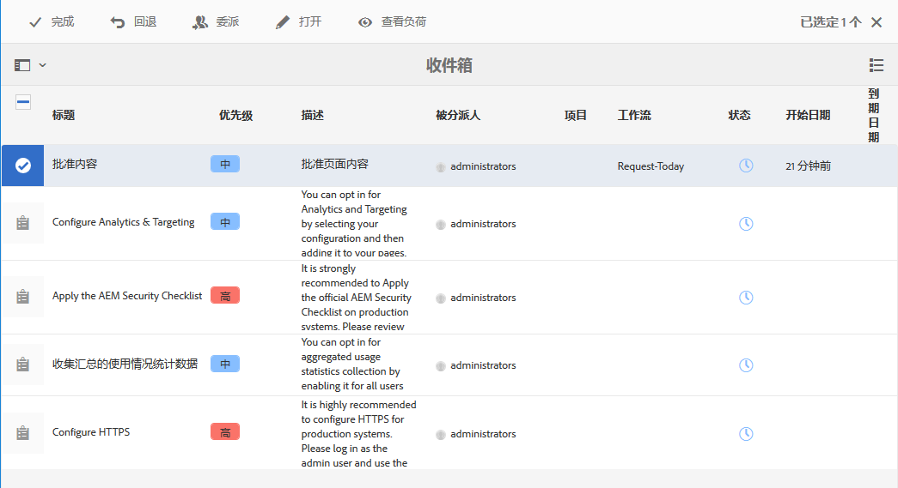
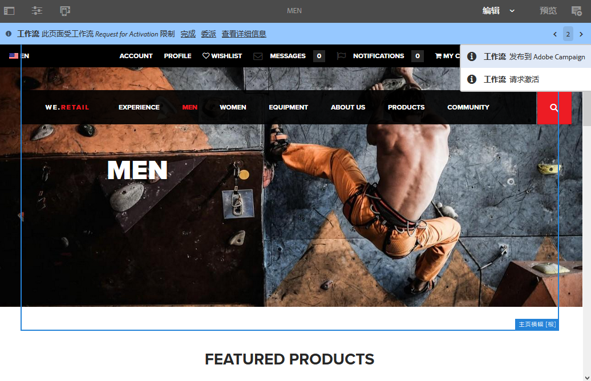
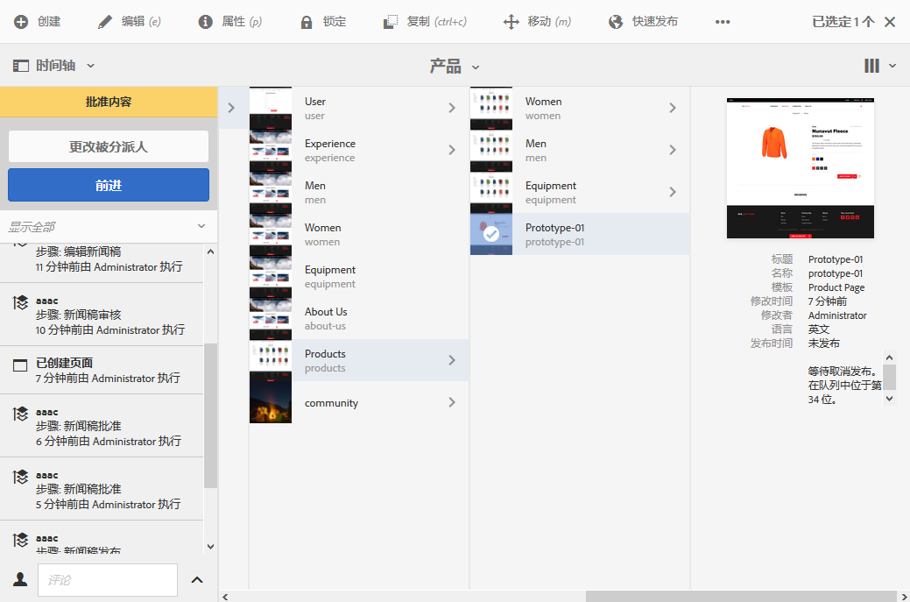
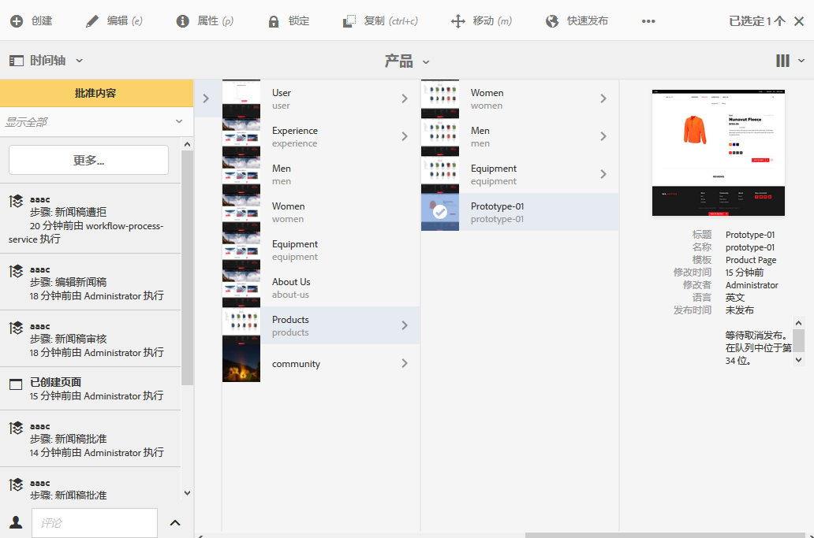
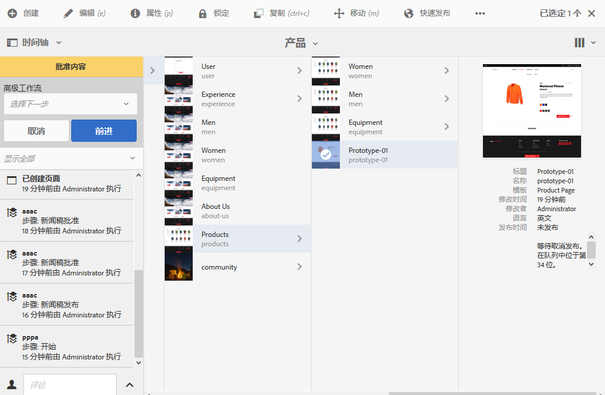
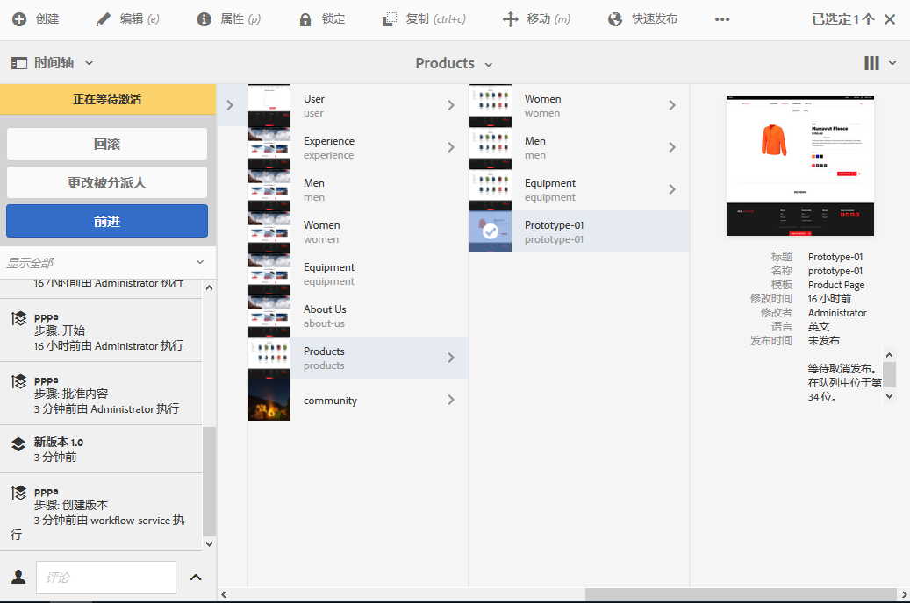
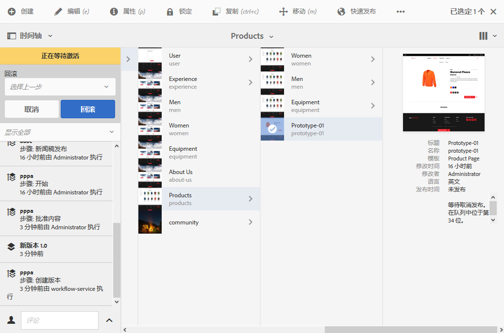
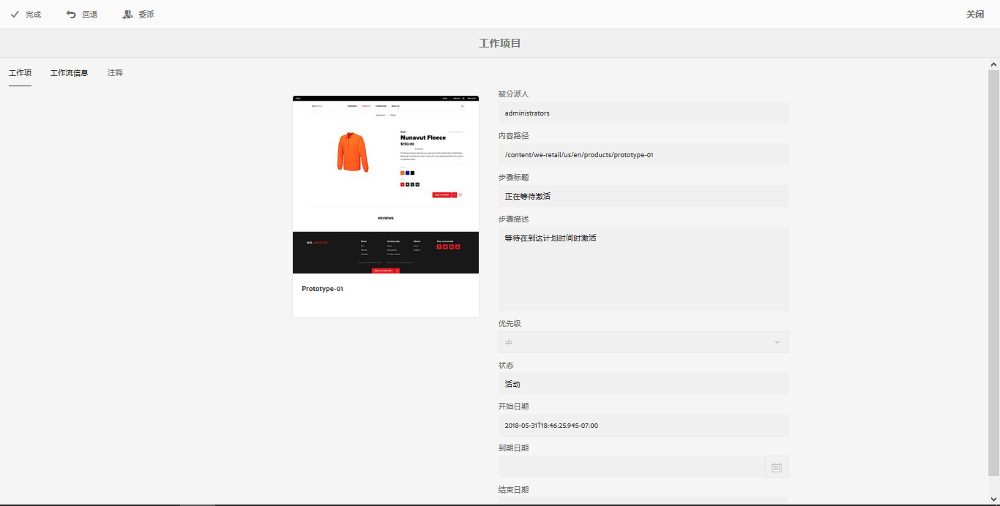
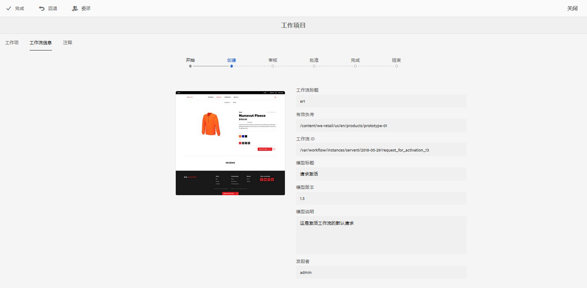

# 参与工作流{#participating-in-workflows}

工作流通常包括需要人员对页面或资产执行活动的步骤。工作流会选择要执行活动的用户或组，并将工作项分配给该用户或组。用户收到通知后，便可以执行相应的操作：

* [查看通知](#notifications-of-available-workflow-actions)
* [完成参与者步骤](#completing-a-participant-step)
* [委派参与者步骤](#delegating-a-participant-step)
* [对参与者步骤执行回退](#performing-step-back-on-a-participant-step)
* [打开工作流项目以查看详细信息（并执行操作）](#opening-a-workflow-item-to-view-details-and-take-actions)
* [查看工作流有效负荷（多个资源）](#viewing-the-workflow-payload-multiple-resources)

## 可用工作流操作的通知 {#notifications-of-available-workflow-actions}

为您分配了工作项(例如批准内 **容**)后，将显示各种警报和／或通知：

* 您的[通知](/help/sites-authoring/inbox.md)指示符（工具栏）上的数字将会递增：

   

* 该工作项将在您的通知[收件箱](/help/sites-authoring/inbox.md)中列出：

   

* 当您使用页面编辑器时，状态栏将显示：

   * 应用于页面的工作流的名称；例如“请求激活”。
   * 当前用户可在工作流的当前步骤中使用的任何操作；例如“完成”、“委派”、“查看详细信息”。
   * 页面需执行的工作流数量。您可以：

      * 使用向左/向右箭头浏览各种工作流的状态信息。
      * 单击/点按实际数字以打开所有适用工作流的下拉列表，然后选择您希望在状态栏中显示的工作流。

   

   >[!NOTE]
   >
   >The status bar is only visible to users with workflow privileges; for example, members of the `workflow-users` group.
   >
   >
   >如果当前用户直接参与工作流的当前步骤，则会显示相应的操作。

* 当打开资源的&#x200B;**时间轴**&#x200B;时，将会显示工作流步骤。当单击/点按警报横幅时，也会显示可用的操作：

   

### 完成参与者步骤 {#completing-a-participant-step}

您可以完成一个工作项，从而使工作流进入到下一步。

在此操作中，您可以指示：

* **下一步**：要执行的下一个步骤；您可以从提供的列表中进行选择
* **评论**：如果需要

您可以通过以下任一方式完成参与者步骤：

* [收件箱](#completing-a-participant-step-inbox)
* [页面编辑器](#completing-a-participant-step-page-editor)
* [时间轴](#completing-a-participant-step-timeline)
* [打开工作流项目以查看详细信息](#opening-a-workflow-item-to-view-details-and-take-actions)时。

#### 完成参与者步骤 - 收件箱 {#completing-a-participant-step-inbox}

请按照以下过程完成工作项：

1. 打开 **[AEM 收件箱](/help/sites-authoring/inbox.md)**。
1. 选择要对其执行操作的工作流项目（点按/单击缩略图）。
1. Select **Complete** from the toolbar.
1. 此时将打开&#x200B;**完成工作项目**&#x200B;对话框。Select the **Next Step** from the drop down selector and add a **Comment** if required.
1. Use **OK** to complete the step (or the **Cancel** to abort the action).

#### 完成参与者步骤 - 页面编辑器 {#completing-a-participant-step-page-editor}

请按照以下过程完成工作项：

1. 打开[要编辑的页面](/help/sites-authoring/managing-pages.md#opening-a-page-for-editing)。
1. Select **Complete** from the status bar at the top.
1. 此时将打开&#x200B;**完成工作项目**&#x200B;对话框。Select the **Next Step** from the drop down selector and add a **Comment** if required.
1. Use **OK** to complete the step (or the **Cancel** to abort the action).

#### 完成参与者步骤 - 时间轴 {#completing-a-participant-step-timeline}

您也可以使用时间轴来完成并推进步骤：

1. Select the required page and open **Timeline** (or open **Timeline** and select the page):

   

1. 单击/点按警报横幅以显示可用的操作。选择&#x200B;**前进**：

   

1. 根据工作流，您可以选择下一步：

   

1. 选择&#x200B;**前进**&#x200B;以确认操作。

### 委派参与者步骤 {#delegating-a-participant-step}

如果某个步骤已分配给您，但由于某种原因您无法采取操作，则您可以将该步骤委派给其他用户或组。

可向其进行委派的用户取决于工作项分配到的对象：

* 如果将工作项分配给某个组，则可以向该组的成员进行委派。
* 如果将工作项分配给某个组，然后该组又将其委派给某个用户，则可以向该组的成员和该组进行委派。
* 如果将工作项分配给单个用户，则不能委派工作项。

在此操作中，您可以指示：

* **用户**：您要向其进行委派的用户；您可以从提供的列表中进行选择
* **评论**：如果需要

您可以通过以下任一方式委派参与者步骤：

* [收件箱](#delegating-a-participant-step-inbox)
* [页面编辑器](#delegating-a-participant-step-page-editor)
* [时间轴](#delegating-a-participant-step-timeline)
* [打开工作流项目以查看详细信息](#opening-a-workflow-item-to-view-details-and-take-actions)时。

#### 委派参与者步骤 - 收件箱 {#delegating-a-participant-step-inbox}

请按照以下过程委派工作项：

1. 打开 **[AEM 收件箱](/help/sites-authoring/inbox.md)**。
1. 选择要对其执行操作的工作流项目（点按/单击缩略图）。
1. Select **Delegate** from the toolbar.
1. 此时将打开一个对话框。Specify the **User** from the drop down selector (this can also be a group) and add a **Comment** if required.
1. Use **OK** to complete the step (or the **Cancel** to abort the action).

#### 委派参与者步骤 - 页面编辑器 {#delegating-a-participant-step-page-editor}

请按照以下过程委派工作项：

1. 打开[要编辑的页面](/help/sites-authoring/managing-pages.md#opening-a-page-for-editing)。
1. Select **Delegate** from the status bar at the top.
1. 此时将打开一个对话框。Specify the **User** from the drop down selector (this can also be a group) and add a **Comment** if required.
1. Use **OK** to complete the step (or the **Cancel** to abort the action).

#### 委派参与者步骤 - 时间轴 {#delegating-a-participant-step-timeline}

您也可以使用时间轴来委派和/或分配步骤：

1. Select the required page and open **Timeline** (or open **Timeline** and select the page).
1. 单击/点按警报横幅以显示可用的操作。选择&#x200B;**更改被分派人**：

   

1. 指定新的被分派人：

   

1. Select **Assign** to confirm the action.

### 对参与者步骤执行回退 {#performing-step-back-on-a-participant-step}

如果您发现需要重复一个步骤或一系列步骤，您可以执行回退。此操作允许您选择之前已在工作流中执行过的步骤，以进行重新处理。工作流会返回到您指定的步骤，然后从此处继续执行。

在此操作中，您可以指示：

* **上一步**：要返回到的步骤；您可以从提供的列表中进行选择
* **评论**：如果需要

您可以通过以下任一方式对参与者步骤执行后退：

* [收件箱](#performing-step-back-on-a-participant-step-inbox)
* [页面编辑器](#performing-step-back-on-a-participant-step-page-editor)
* [时间轴](#performing-step-back-on-a-participant-step-timeline)
* [打开工作流项目以查看详细信息](#opening-a-workflow-item-to-view-details-and-take-actions)时。

#### 对参与者步骤执行回退 - 收件箱 {#performing-step-back-on-a-participant-step-inbox}

请按照以下过程执行回退：

1. 打开 **[AEM 收件箱](/help/sites-authoring/inbox.md)**。
1. 选择要对其执行操作的工作流项目（点按/单击缩略图）。
1. Select **Step Back** to open the dialog.

1. Specify the **Previous Step** and add a **Comment** if required.
1. Use **OK** to complete the step (or the **Cancel** to abort the action).

#### 对参与者步骤执行回退 - 页面编辑器 {#performing-step-back-on-a-participant-step-page-editor}

请按照以下过程执行回退：

1. 打开[要编辑的页面](/help/sites-authoring/managing-pages.md#opening-a-page-for-editing)。
1. Select **Step Back** from the status bar at the top.
1. Specify the **Previous Step** and add a **Comment** if required.
1. Use **OK** to complete the step (or the **Cancel** to abort the action).

#### 对参与者步骤执行回退 - 时间轴 {#performing-step-back-on-a-participant-step-timeline}

您也可以使用时间轴来回滚（回退）到上一步：

1. Select the required page and open **Timeline** (or open **Timeline** and select the page).
1. 单击/点按警报横幅以显示可用的操作。选择&#x200B;**回滚**：

   

1. 指定工作流应返回到的步骤：

   

1. Select **Roll back** to confirm the action.

### Opening a Workflow Item to View Details (and Take Actions) {#opening-a-workflow-item-to-view-details-and-take-actions}

查看工作流工作项的详细信息并执行相应的操作。

工作流详细信息会以选项卡的形式显示，并且工具栏中会提供相应的操作：

* **“工作项** ”选项卡：

   

* **工作流信息**

   

   如果为该模型配置了[工作流暂存](/help/sites-developing/workflows.md#workflow-stages)，则可以根据以下内容查看进度：

   

* **注释**

   

您可以通过以下任一方式打开工作项详细信息：

* [收件箱](#performing-step-back-on-a-participant-step-inbox)
* [页面编辑器](#performing-step-back-on-a-participant-step-page-editor)

#### 打开工作流详细信息 - 收件箱 {#opening-workflow-details-inbox}

要打开工作流项目并查看其详细信息，请执行以下操作：

1. 打开 **[AEM 收件箱](/help/sites-authoring/inbox.md)**。
1. 选择要对其执行操作的工作流项目（点按/单击缩略图）。
1. Select **Open** to open the information tabs.

1. 如果需要，选择相应的操作，提供任何详细信息，然后单击&#x200B;**确定**&#x200B;进行确认（或单击&#x200B;**取消**）。
1. Use **Save** or **Cancel** to exit.

#### 打开工作流详细信息 - 页面编辑器 {#opening-workflow-details-page-editor}

要打开工作流项目并查看其详细信息，请执行以下操作：

1. 打开[要编辑的页面](/help/sites-authoring/managing-pages.md#opening-a-page-for-editing)。
1. Select **View Details** from the status bar to open the information tabs.

1. 如果需要，选择相应的操作，提供任何详细信息，然后单击&#x200B;**确定**&#x200B;进行确认（或单击&#x200B;**取消**）。
1. Use **Save** or **Cancel** to exit.

### Viewing the Workflow Payload (Multiple Resources) {#viewing-the-workflow-payload-multiple-resources}

您可以查看与工作流实例关联的有效负荷的详细信息。最初会显示资源包，之后您可以深入查看各个页面。

要查看工作流实例的有效负荷和资源，请执行以下操作：

1. 打开 **[AEM 收件箱](/help/sites-authoring/inbox.md)**。
1. 选择要对其执行操作的工作流项目（点按/单击缩略图）。
1. Select **View Payload** from the toolbar to open the dialog.

   由于工作流包只是存储库中路径的指针集合，因此您可以在此处添加/删除/修改条目以调整工作流包所引用的内容。使用&#x200B;**资源定义**&#x200B;组件可添加新条目。

   

1. 可以使用这些链接打开各个页面。

