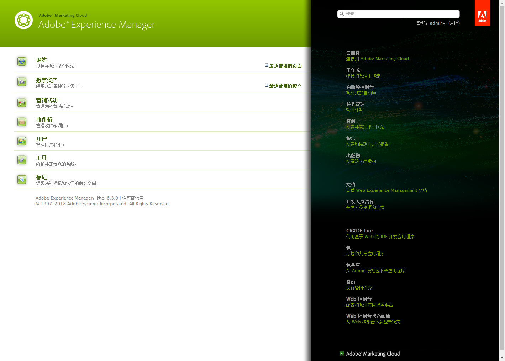
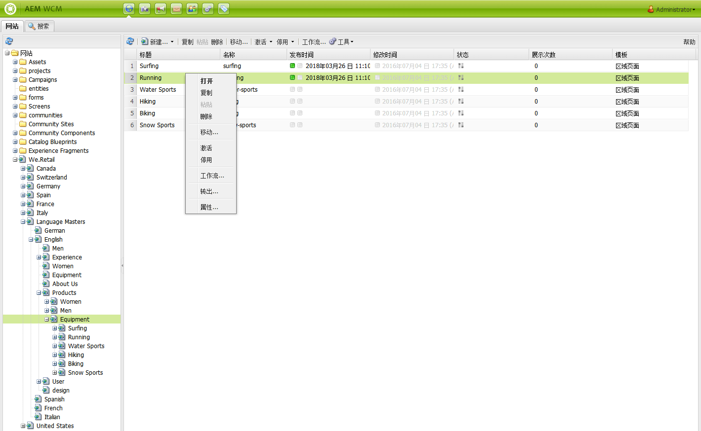

# 基本处理{#basic-handling}

>[!CAUTION]
>
>AEM 6.4已结束扩展支持，本文档将不再更新。 有关更多详细信息，请参阅 [技术支助期](https://helpx.adobe.com/cn/support/programs/eol-matrix.html). 查找支持的版本 [此处](https://experienceleague.adobe.com/docs/).

>[!NOTE]
>
>* 本页面旨在概述使用AEM创作环境时的基本操作。 它使用&#x200B;**站点**&#x200B;控制台作为基础。
>
>* 某些功能并非在所有控制台中都可用，而/或某些控制台中提供了其他功能。 其他页面上将更详细地介绍有关各个控制台及其相关功能的特定信息。
>* 用户在整个 AEM 环境中都可以使用各种键盘快捷键，尤其是在[使用控制台](/help/sites-classic-ui-authoring/author-env-keyboard-shortcuts.md)和[编辑页面](/help/sites-classic-ui-authoring/classic-page-author-keyboard-shortcuts.md)时。
>

## 欢迎屏幕 {#the-welcome-screen}

经典UI提供了一系列控制台选项，它们使用大家熟知的机制进行导航和启动操作，包括单击、双击和 [上下文菜单](#context-menus).

登录后，将显示欢迎屏幕，其中提供了指向控制台和服务的链接列表：

## 控制台 {#consoles}

主要控制台包括：

<table> 
 <tbody> 
  <tr> 
   <td><strong>控制台</strong></td> 
   <td><strong>用途</strong></td> 
  </tr> 
  <tr> 
   <td><strong>欢迎</strong></td> 
   <td>提供对AEM主要功能的概述和直接访问（通过链接）。</td> 
  </tr> 
  <tr> 
   <td><strong>数字资产</strong>  </td> 
   <td>通过这些控制台，您可以导入和 <a href="/help/sites-classic-ui-authoring/classicui-assets.md">管理数字资产</a> 例如图像、视频、文档和音频文件。 然后，这些资产便可由在同一AEM实例上运行的任何网站使用。 </td> 
  </tr> 
  <tr> 
   <td><strong>启动项</strong></td> 
   <td>这有助于您管理 <a href="/help/sites-classic-ui-authoring/classic-launches.md">启动次数</a>;这些功能允许您为一个或多个已激活网页的未来版本开发内容。  <i>注意：在触屏优化UI中，“站点”控制台中与“引用”边栏中的功能大致相同。</i> <i>如果需要，可以从“工具”控制台访问此控制台；依次选择操作和启动项。</i></td> 
  </tr> 
  <tr> 
   <td><strong>收件箱 </strong></td> 
   <td>在许多情况下，工作流的子任务中会涉及许多人员，每人必须完成其步骤后才能将工作转交给下一个人。 收件箱允许您查看与此类任务相关的通知。 请参阅 <a href="/help/sites-administering/workflows.md">使用工作流</a>.   </td> 
  </tr> 
  <tr> 
   <td><strong>标记</strong></td> 
   <td>“标记”控制台让您可以管理标记。 标记是短名称或短语，可用于对内容片段进行分类和添加注释，从而更便于查找和组织。 有关详细信息，请参阅 <a href="/help/sites-classic-ui-authoring/classic-feature-tags.md">使用和管理标记</a>.</td> 
  </tr> 
  <tr> 
   <td><strong>工具</strong></td> 
   <td>的 <a href="/help/sites-administering/tools-consoles.md">工具控制台</a> 提供对一些专用工具和控制台的访问权限，这些工具和控制台可帮助您管理网站、数字资产及内容存储库的其他方面。</td> 
  </tr> 
  <tr> 
   <td><strong>用户</strong></td> 
   <td>通过这些控制台，您可以管理用户和组的访问权限。 有关详细信息，请参阅 <a href="/help/sites-administering/security.md">用户管理和安全</a>.  </td> 
  </tr> 
  <tr> 
   <td><strong>网站</strong></td> 
   <td>“站点”/“网站”控制台允许您 <a href="/help/sites-classic-ui-authoring/classic-page-author.md">创建、查看和管理网站</a> 在AEM实例上运行。 通过这些控制台，您可以创建、复制、移动和删除网站页面、启动工作流，以及激活（发布）页面。 您还可以打开页面进行编辑。  </td> 
  </tr> 
  <tr> 
   <td><strong>工作流</strong></td> 
   <td>工作流是定义的一系列步骤，用于描述完成某些任务的过程。 在很多情况下，任务中会涉及许多人员，每个人必须完成其步骤，然后才能将工作转交给下一个人。 通过工作流控制台，您可以构建工作流模型并管理正在运行的工作流实例。 请参阅 <a href="/help/sites-administering/workflows.md">使用工作流</a>.  </td> 
  </tr> 
 </tbody> 
</table>

的 **网站** 控制台提供了两个窗格，供您导航和管理页面：

* 左窗格

   这会显示网站的树结构以及这些网站中的页面。

   它还显示有关其他方面或AEM的信息，包括项目、Blueprint和资产。

* 右窗格

   这会显示页面（在左窗格中选定的位置），并可用于执行操作。

从这里，您可以 [管理页面](/help/sites-authoring/managing-pages.md) 使用工具栏、上下文菜单或打开页面以执行进一步操作。

>[!NOTE]
>
>所有控制台的基本操作都是相同的。 本节重点介绍 **网站** 控制台，因为它是创作时使用的主控制台。

## 访问帮助 {#accessing-help}

在各种控制台（例如，网站）上， **帮助** 按钮，将打开包共享或文档站点。

编辑页面时， [sidekick还具有用于访问帮助的按钮](/help/sites-classic-ui-authoring/classic-page-author-env-tools.md#accessing-help).

## 使用网站控制台导航 {#navigating-with-the-websites-console}

的 **网站** 控制台以树结构（左窗格）列出内容页面。 为便于导航，可以根据需要展开(+)或折叠(-)树结构的各个部分：

* 单击页面名称（在左窗格中）将：

   * 在右侧窗格中列出子页面
   * 同时展开左窗格中的结构。

      出于性能原因，此操作取决于子节点的数量。 在标准安装下，此扩展方法在 `30` 或子节点较少。

* 双击页面名称（左窗格）也会展开树，不过，由于同时打开页面，因此效果并不那么明显。

>[!NOTE]
>
>此默认值( `30`)可在siteadmin小组件的特定于应用程序的配置中按控制台进行更改：
>
>在siteadmin节点上：
>
>设置属性的值：\
>`treeAutoExpandMax`\
>开启:\
>`/apps/wcm/core/content/siteadmin`
>
>或者在主题中全球范围：\
>设置值：\
>`TREE_AUTOEXPAND_MAX`\
>中的:\
>`/apps/cq/ui/widgets/themes/default/widgets/wcm/SiteAdmin.js`
>
>请参阅 [CQ小组件API中的SiteAdmin](https://helpx.adobe.com/experience-manager/6-4/sites/developing/using/reference-materials/widgets-api/index.html?class=CQ.wcm.SiteAdmin) 以了解更多详细信息。

## 网站控制台上的页面信息 {#page-information-on-the-websites-console}

右窗格 **网站** 控制台提供了列表视图，其中包含有关页面的信息：

以下内容可供使用；默认显示这些字段的子集：

<table> 
 <tbody> 
  <tr> 
   <td><strong>列</strong></td> 
   <td><strong>描述</strong></td> 
  </tr> 
  <tr> 
   <td>缩略图</td> 
   <td>显示页面的缩略图。</td> 
  </tr> 
  <tr> 
   <td>标题</td> 
   <td>页面上显示的标题</td> 
  </tr> 
  <tr> 
   <td>名称</td> 
   <td>页面的AEM名称</td> 
  </tr> 
  <tr> 
   <td>发布时间</td> 
   <td>指示页面是否已发布，并提供发布日期和时间。</td> 
  </tr> 
  <tr> 
   <td>修改时间</td> 
   <td>指示页面是否已修改，并提供修改日期和时间。 要保存任何修改，必须激活页面。</td> 
  </tr> 
  <tr> 
   <td>Scene7 Publish</td> 
   <td>指示页面是否已发布到Scene7。  </td> 
  </tr> 
  <tr> 
   <td>状态</td> 
   <td>指示页面的当前状态，如页面是否属于工作流或Live Copy的一部分，或页面当前是否已锁定。</td> 
  </tr> 
  <tr> 
   <td>展示次数</td> 
   <td>以点击数显示页面上的活动。</td> 
  </tr> 
  <tr> 
   <td>模板</td> 
   <td>指示页面所基于的模板。</td> 
  </tr> 
  <tr> 
   <td>在工作流中</td> 
   <td>指示页面何时处于工作流中。</td> 
  </tr> 
  <tr> 
   <td>锁定者</td> 
   <td>显示页面何时被锁定以及锁定该页面的用户帐户。</td> 
  </tr> 
  <tr> 
   <td>Live Copy</td> 
   <td>指示页面何时成为Live Copy的一部分。</td> 
  </tr> 
 </tbody> 
</table>

>[!NOTE]
>
>要选择可见的列，请将鼠标悬停在列标题上。 此时将显示一个下拉菜单，您可以从此处使用 **列** 选项。

中页面旁边的颜色 **已发布** 和 **已修改** 列指示发布状态：

| **列** | **颜色** | **描述** |
|---|---|---|
| 发布时间 | 绿色 | 发布成功。 内容已发布。 |
| 发布时间 | 黄色 | 发布挂起。 系统尚未收到发布确认。 |
| 发布时间 | 红色 | 发布失败. 与发布实例没有连接。 这也意味着内容已停用。 |
| 发布时间 | *blank* | 此页面从未发布过。 |
| 修改时间 | 蓝色 | 自上次发布以来已修改页面。 |
| 修改时间 | *blank* | 此页面从未修改过，或自上次发布后未修改过。 |

## 上下文菜单 {#context-menus}

经典UI使用众所周知的机制进行导航和启动操作，包括单击和双击。 根据当前情况，还提供一系列上下文菜单（通常使用鼠标右键打开）：

