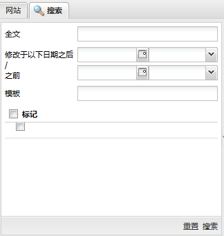
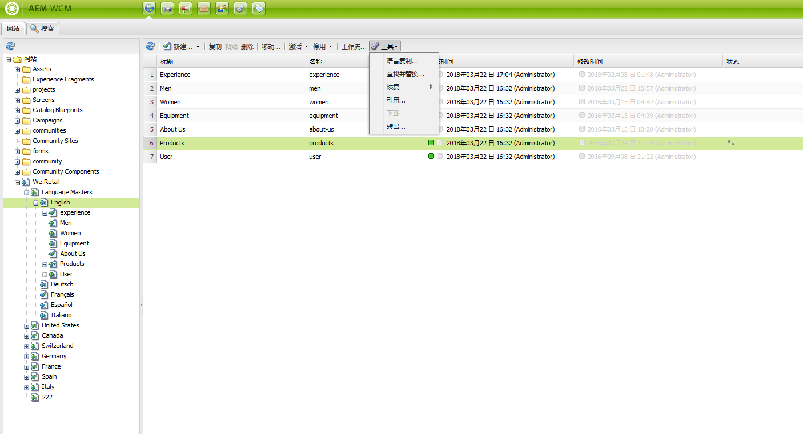
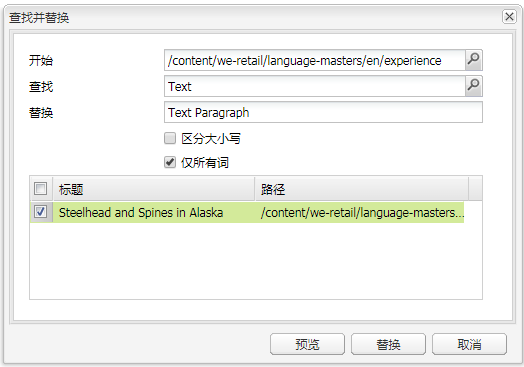

# 搜索{#search-features}

>[!CAUTION]
>
>AEM 6.4已结束扩展支持，本文档将不再更新。 有关更多详细信息，请参阅 [技术支助期](https://helpx.adobe.com/cn/support/programs/eol-matrix.html). 查找支持的版本 [此处](https://experienceleague.adobe.com/docs/).

AEM 的创作环境提供了多种内容搜索机制，具体取决于资源类型。

>[!NOTE]
>
>在创作环境之外，还可以使用其他机制进行搜索，例如 [查询生成器](/help/sites-developing/querybuilder-api.md) 和 [CRXDE Lite](/help/sites-developing/developing-with-crxde-lite.md).

## 搜索基础知识 {#search-basics}

要访问搜索面板，请单击 **搜索** 选项卡。

通过搜索面板，您可以在所有网站页面中进行搜索。 它包含用于以下内容的字段和小组件：

* **全文**:搜索指定的文本
* **修改时间：之后/之前**:仅搜索在特定日期之间更改的页面
* **模板**:仅根据指定的模板搜索这些页面
* **标记**:仅搜索具有指定标记的页面

>[!NOTE]
>
>在为 [Lucene搜索](/help/sites-deploying/queries-and-indexing.md) 您可以在 **全文**:
>
>* [通配符](https://lucene.apache.org/core/5_3_1/queryparser/org/apache/lucene/queryparser/classic/package-summary.html#Wildcard_Searches)
>* [布尔运算符](https://lucene.apache.org/core/5_3_1/queryparser/org/apache/lucene/queryparser/classic/package-summary.html#Boolean_operators)
>
>* [正则表达式](https://lucene.apache.org/core/5_3_1/queryparser/org/apache/lucene/queryparser/classic/package-summary.html#Regexp_Searches)
>* [字段分组](https://lucene.apache.org/core/5_3_1/queryparser/org/apache/lucene/queryparser/classic/package-summary.html#Field_Grouping)
>* [提升](https://lucene.apache.org/core/5_3_1/queryparser/org/apache/lucene/queryparser/classic/package-summary.html#Boosting_a_Term)
>

通过单击 **搜索** 在窗格底部。 单击 **重置** 以清除搜索标准。

## 过滤器 {#filter}

在不同位置，可以设置（并清除）过滤器，以细化和优化视图：

## 查找和替换 {#find-and-replace}

在 **网站** 控制台 **查找和替换** 菜单选项，可在网站的某个部分中搜索并替换字符串的多个实例。

1. 选择要执行查找和替换操作的根页面或文件夹。
1. 选择 **工具** then **查找和替换**:

   

1. 的 **查找和替换** 对话框会执行以下操作：

   * 确认查找操作应开始的根路径
   * 定义要查找的术语
   * 定义应替换该词的词
   * 指示搜索是否应区分大小写
   * 指示是否只应找到整个字（否则，还会找到子字符串）

   单击 **预览** 列出已找到术语的位置。 您可以选择/清除要替换的特定实例：

   

1. 单击 **替换** 来替换所有实例。 系统将要求您确认该操作。

查找和替换Servlet的默认范围涵盖以下属性：

* `jcr:title`
* `jcr:description`
* `jcr:text`
* `text`

使用Apache Felix Web管理控制台(例如， `http://localhost:4502/system/console/configMgr`)。 选择 `CQ WCM Find Replace Servlet (com.day.cq.wcm.core.impl.servlets.FindReplaceServlet)` 并根据需要配置范围。

>[!NOTE]
>
>在标准AEM安装中，查找和替换使用Lucene实现搜索功能。
>
>Lucene可索引长度高达16k的字符串属性。 将不会搜索超过此值的字符串。
