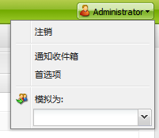
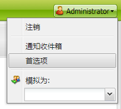
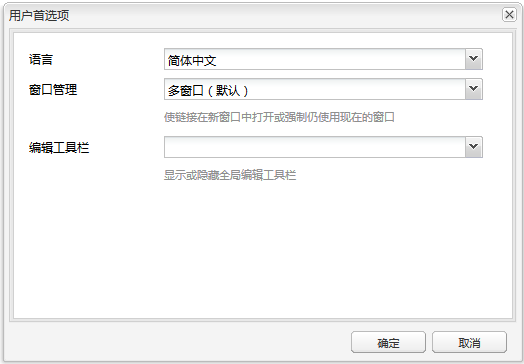

# 配置帐户环境{#configuring-your-account-environment}

AEM 提供了配置帐户和创作环境某些方面的功能。

使用[帐户设置](#account-settings)和[用户首选项](#user-preferences)，可以定义以下选项和首选项：

* **编辑工具栏** 选择是否要使用全局编辑工具栏。此工具栏（显示在浏览器窗口顶部）为您提供 
**复制**、剪 **切、**&#x200B;粘贴 **、删** **** 除按钮，以便与该页面上的段落组件配合使用：

   * 需要时显示（默认）
   * 始终显示
   * 保持隐藏

* **模拟为** 借助[模拟为](/help/sites-administering/security.md#impersonating-another-user)功能，用户可以代表其他用户工作。

* **语**
言创作环境的UI所使用的语言。从可用列表中选择所需的语言。

* **窗口管理** 选择下列任何一项：

   * 多窗口（默认）:页面将在新窗口中打开。
   * 单一窗口：页面将在当前窗口中打开。

## 帐户设置 {#account-settings}

用户图标允许您访问以下各种选项：

* 注销
* [模拟为](/help/sites-administering/security.md#impersonating-another-user)
* [用户首选项](#user-preferences)
* [通知收件箱](/help/sites-classic-ui-authoring/author-env-inbox.md)

## 用户首选项 {#user-preferences}

每位用户均可为自己设置某些属性。可从控制台右上角的&#x200B;**首选项**&#x200B;对话框中执行此操作。

该对话框提供以下选项：

