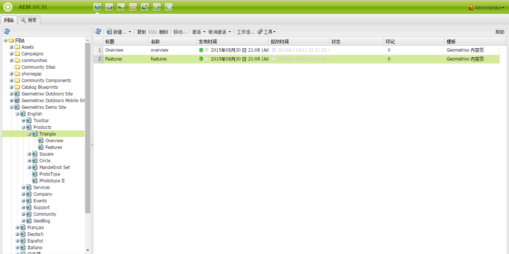
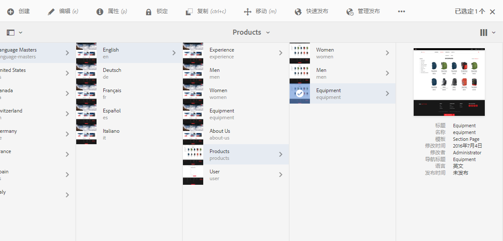
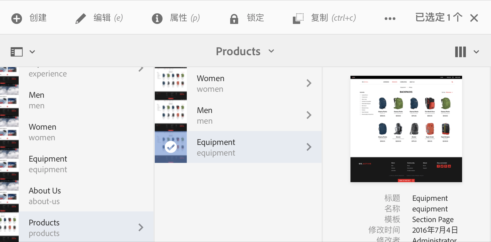

# 使用创作环境{#working-with-the-author-environment}

>[!CAUTION]
>
>AEM 6.4已结束扩展支持，本文档将不再更新。 有关更多详细信息，请参阅 [技术支助期](https://helpx.adobe.com/cn/support/programs/eol-matrix.html). 查找支持的版本 [此处](https://experienceleague.adobe.com/docs/).

>[!NOTE]
>
>以下文档重点介绍经典UI。 有关在现代化触屏优化UI中进行创作的信息，请参阅 [标准创作文档](/help/assets/assets.md).

利用创作环境，可执行与以下各项相关的任务：

* [创作](/help/sites-authoring/author.md) (包括 [页面创作](/help/sites-authoring/qg-page-authoring.md) 和 [管理资产](/help/assets/assets.md))

* [管理](/help/sites-administering/administer-best-practices.md) 在网站上生成和维护内容时需要的任务

提供了两个图形用户界面来实现此目的，这些用户界面可通过任何现代浏览器访问：

1. 经典 UI

   * 此UI在AEM中一直可用多年。
   * 主色调为绿色。
   * 它专为在桌面设备上使用而设计。
   * 不再维护。
   * 以下文档重点介绍此经典UI。 有关在基于触屏的现代用户界面中进行创作的信息，请参阅 [标准创作文档](/help/sites-authoring/author.md).
   

1. 触屏优化UI

   * 这是现代化的标准AEM UI。
   * 主色调为灰色，界面干净平整。
   * 它专为在触控和桌面设备上使用而设计（针对触控进行了优化）。 但是，所有设备的外观都是一样的 [查看和选择资源](/help/sites-authoring/basic-handling.md) 略有不同（点按与点击）。
   * 请参阅 [标准创作文档](/help/sites-authoring/author.md) 有关如何使用触屏UI进行创作的更多详细信息。 以下文档重点介绍经典UI。

   * 桌面:
   

   * 平板电脑设备（或台式机宽度小于1024像素）：
   
