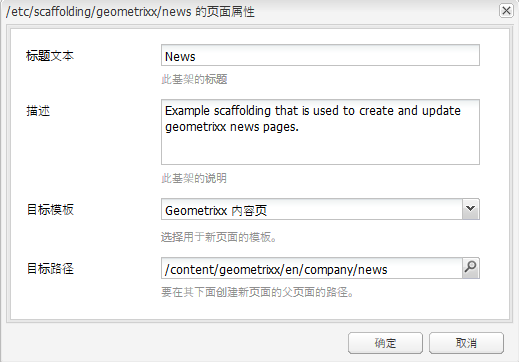
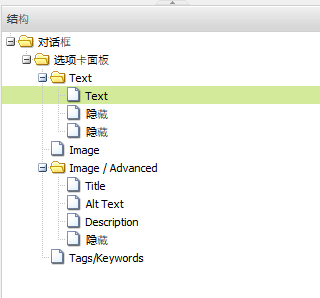
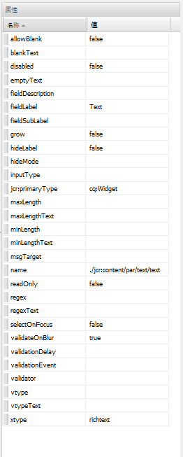
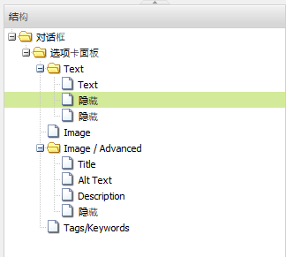
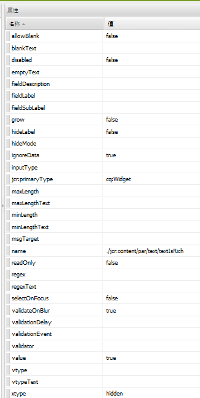
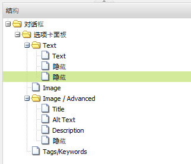
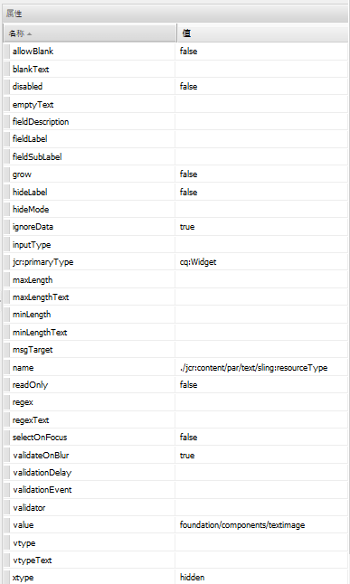

# 基架{#scaffolding}

>[!CAUTION]
>
>AEM 6.4已结束扩展支持，本文档将不再更新。 有关更多详细信息，请参阅 [技术支助期](https://helpx.adobe.com/cn/support/programs/eol-matrix.html). 查找支持的版本 [此处](https://experienceleague.adobe.com/docs/).

有时，您可能需要创建大量结构相同但内容不同的页面。 通过标准AEM界面，您需要创建每个页面，将相应的组件拖动到页面上，并逐个填充每个组件。

使用基架，您可以创建表单（基架），其中的字段反映您需要的页面结构，然后使用此表单轻松地基于此结构创建页面。

>[!NOTE]
>
>基架（在经典UI中） [遵循MSM继承](#scaffolding-with-msm-inheritance).

## 基架的工作原理 {#how-scaffolding-works}

支架存储在 **工具** 站点管理控制台。

* 打开 **工具** 控制台，单击 **默认页面基架**.

* 在此下，单击 **geometrixx**.
* 在 **geometrixx** 你会找到 *基架页面* 调用 **新闻**. 双击以打开此页。

基架由一个表单和四个重要参数组成，前者包含将构成要创建页面的每段内容的字段，后者通过 **页面属性** 基架页面的。

基架页面属性包括：

* **标题文本**:这是此基架页面本身的名称。 在此示例中，它名为“News”。
* **描述**:它显示在基架页面标题下方。
* **目标模板**:这是此基架在创建新页面时将使用的模板。 在本例中，它是 *Geometrrixx内容页面* 模板。

* **目标路径**:这是此基架将在其下创建新页面的父页面的路径。 在本例中，路径为 */content/geometrixx/en/news*.

基架的主体是表单。 当用户希望使用基架创建页面时，他会填写表单并单击 *创建*，位于底部。 在 **新闻** 上面的表单示例包含以下字段：

* **标题**:这是要创建的页面的名称。 每个基架上始终存在此字段。
* **文本**:此字段对应于生成页面上的文本组件。
* **图像**:此字段对应于生成页面上的图像组件。
* **图像/高级**: **标题**:图像的标题。

* **图像/高级**: **替换文本**:图像的替换文本。

* **图像/高级**: **描述**:图像的描述。

* **图像/高级**: **大小**:图像的大小。

* **标记/关键词**:要分配给此页面的元数据。 每个基架上始终存在此字段。

## 创建基架 {#creating-a-scaffold}

要创建新基架，请转到 **工具** 控制台，然后 **默认页面基架** 并创建新页面。 将提供单个页面模板类型， *基架模板。*

*转到&#x200B;**页面属性**，并将*&#x200B;标题文本&#x200B;*,*&#x200B;描述&#x200B;*,*&#x200B;目标模板&#x200B;*和*&#x200B;目标路径&#x200B;*，如上所述。*

*接下来，您必须定义此基架将创建的页面的结构。 为此，请进入基架页面的设计模式。 随即会显示一个链接，用于编辑 **对话框编辑器**.

使用对话框编辑器，您可以指定每次使用此基架创建新页面时将创建的属性。

基架的对话框定义的工作方式与组件类似(请参阅 [组件](/help/sites-developing/components.md))。 但是，有一些重要差异也适用：

* 组件对话框定义呈现为普通对话框（例如，对话框编辑器的中间窗格中所示），而基架对话框定义虽然在对话框编辑器中显示为普通对话框，但在基架页面上却呈现为基架表单(如 **新闻** 基架)。
* 组件对话框仅提供定义单个特定组件内容所需的那些值的字段。 基架对话框必须为要创建的页面每个段落中的每个属性提供字段。
* 对于组件对话框，用于呈现指定内容的组件是隐式的，因此 `sling:resourceType` 创建段落后，会自动填写段落的属性。 对于基架，必须为给定段落定义内容和分配的组件的所有信息都必须由对话框本身提供。 在基架对话框中，必须使用 *隐藏* 字段，以在创建页面时提交此信息。

示例 **新闻** 对话框编辑器中的基架对话框有助于解释其工作方式。 进入基架页面的设计模式，然后单击对话框编辑器链接。

现在，单击对话框字段 **对话框>选项卡面板>文本>文本**，如下所示：

此字段的属性列表将显示在对话框编辑器的右侧，如下所示：

请注意此字段的name属性。 它有价值

。/jcr:content/par/text/text

这是在scaffold用于创建页面时，此字段的内容将写入到的属性的名称。 该属性以相对路径表示，该路径来自表示要创建页面的节点。 它会指定属性文本，在节点文本下方，该节点文本位于节点par下方，节点par本身是页面节点下方jcr:content节点的子项。

这定义要输入到此字段中的文本的内容存储位置。 但是，我们还需要为此内容指定另外两个特征：

* 存储在此处的字符串必须解释为 *富文本*&#x200B;和
* 应使用哪个组件将此内容渲染到生成页面。

请注意，在常规的组件对话框中，您不必指定此信息，因为该信息隐含在对话框已绑定到特定组件这一事实中。

要指定这两段信息，请使用隐藏字段。 单击第一个隐藏字段 **对话框>选项卡面板>文本>隐藏**，如下所示：

此隐藏字段的属性如下所示：

此隐藏字段的name属性为

`./jcr:content/par/text/textIsRich`

这是一个布尔属性，用于解释存储在 `./jcr:content/par/text/text.`

因为我们知道该文本应解释为我们指定的 `value` 此字段的属性为 `true`.

>[!CAUTION]
>
>对话框编辑器允许用户更改 *现有* 属性。 要添加新属性，用户必须使用 [CRXDE Lite](/help/sites-developing/developing-with-crxde-lite.md). 例如，当使用对话框编辑器将新的隐藏字段添加到对话框定义时，它没有 *值* 属性（即名为“value”的属性）。 如果相关的隐藏字段要求默认 *值* 属性，则必须使用其中一个CRX工具手动添加此属性。 无法使用对话框编辑器本身添加值。 但是，一旦属性存在，就可以使用对话框编辑器编辑其值。

通过单击第二个隐藏字段可以看到，如下所示：

此隐藏字段的属性如下所示：

此隐藏字段的name属性为

`./jcr:content/par/text/sling:resourceType`

和为此属性指定的固定值为

`foundation/components/textimage`

&quot;这指定用于呈现此段落文本内容的组件是 *文本图像* 组件。 使用 `isRichText` 在其他隐藏字段中指定的布尔值，组件可以呈现存储在 `./jcr:content/par/text/text` 以所需的方式。

## 使用MSM继承的基架 {#scaffolding-with-msm-inheritance}

在经典UI中，基架与MSM继承完全集成（如果适用）。

当您在 **基架** 模式（使用Sidekick底部的图标）任何受继承约束的组件都将如下所示：

* 锁符号（对于大多数组件而言）；例如，文本和标题)
* 带有文本的蒙版 **单击可取消继承** （对于图像组件）

这表示在取消继承之前，无法编辑组件。

>[!NOTE]
>
>这类似于 [编辑页面内容时继承的组件](/help/sites-authoring/editing-content.md#inheritedcomponentsclassicui).

单击锁定符号或图像图标可中断继承：

* 符号将变为打开的挂锁。
* 解锁后，您可以编辑内容。

解锁后，您可以通过单击已解锁的挂锁符号来恢复继承 — 这将丢失您所做的任何编辑。

>[!NOTE]
>
>如果在页面级别取消继承（从“页面属性”的“Live Copy”选项卡中），则所有组件都可以在 **基架** 模式（它们将显示为已解锁状态）。
