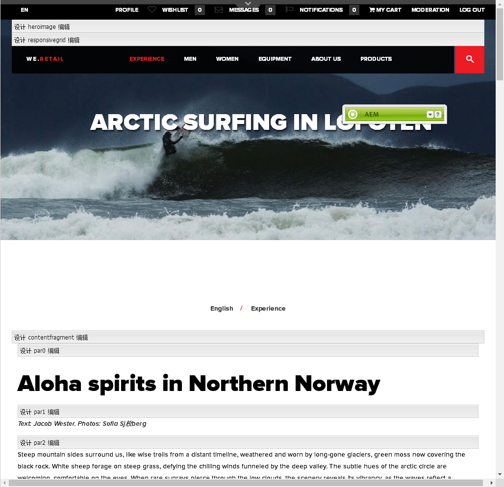
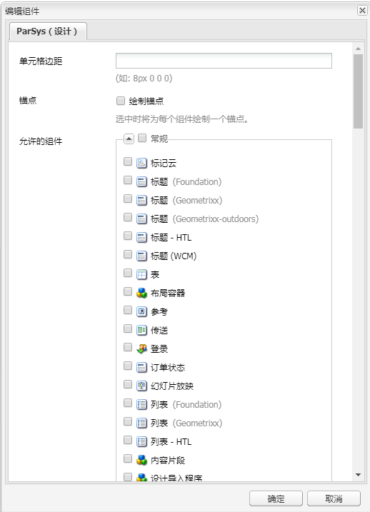
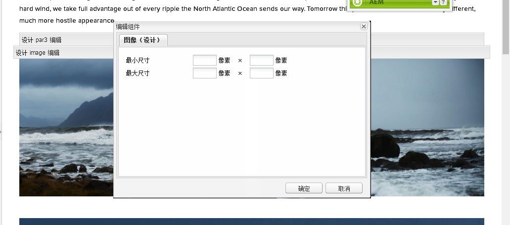

# 在设计模式下配置组件{#configuring-components-in-design-mode}

>[!CAUTION]
>
>AEM 6.4已结束扩展支持，本文档将不再更新。 有关更多详细信息，请参阅 [技术支助期](https://helpx.adobe.com/cn/support/programs/eol-matrix.html). 查找支持的版本 [此处](https://experienceleague.adobe.com/docs/).

当开箱即用安装AEM实例时，Sidekick中会立即提供一系列组件。

除了这些组件之外，还提供了各种其他组件。 您可以使用设计模式来 [启用/禁用此类组件](#enabledisablecomponentsusingdesignmode). 在页面上启用并找到该组件后，您可以使用设计模式 [配置组件设计的方面](#configuringcomponentsusingdesignmode) 编辑属性参数。

>[!NOTE]
>
>编辑这些组件时必须小心。 设计设置通常是整个网站设计中不可缺少的部分，因此只应由具有相应权限（和经验）的人更改设置，通常是管理员或开发人员。 请参阅 [开发组件](/help/sites-developing/components.md) 以了解更多信息。

这实际上涉及添加或删除在页面的段落系统中允许使用的组件。 段落系统( `parsys`)是包含所有其他段落组件的复合组件。 段落系统允许作者向页面中添加不同类型的组件，因为它包含所有其他段落组件。 每个段落类型都表示为一个组件。

例如，产品页面的内容可能包含具有以下内容的段落系统：

* 产品的图像（以图像或文本时间段的形式）
* 产品描述（作为文本段落）
* 具有技术数据的表（作为表段落）
* 用户填写的表单（在表单开始、表单元素和表单结束段落时）

>[!NOTE]
>
>请参阅 [开发组件](/help/sites-developing/components.md#paragraphsystem) 和 [模板和组件的使用准则](/help/sites-developing/dev-guidelines-bestpractices.md#guidelines-for-using-templates-and-components) 有关 `parsys`.

## 启用/禁用组件 {#enable-disable-components}

在设计模式下，Sidekick将最小化，您可以配置可用于创作的组件：

1. 要进入设计模式，请打开要编辑的页面，然后使用Sidekick图标：

   

1. 单击 **编辑** (a)段制(**段落设计**)。

   

1. 此时将打开一个对话框，其中列出了Sidekick中显示的组件组及其包含的各个组件。

   根据需要选择添加或删除要在Sidekick中提供的组件。

   

1. 在“设计”模式下，Sidekick会最小化。 通过单击箭头，可以最大化Sidekick并返回编辑模式：

   

## 配置组件的设计 {#configuring-the-design-of-a-component}

在设计模式下，您还可以配置单个组件的属性。 每个组件都有其自己的参数，以下示例显示了 **图像** 组件：

1. 要进入设计模式，请打开要编辑的页面，然后使用Sidekick图标：

   

1. 您可以配置组件的设计。

   例如，如果您单击 **编辑** (**图像设计**)，您可以配置组件特定的参数：

   

1. 单击 **确定** 以保存更改。

1. 在“设计”模式下，Sidekick会最小化。 通过单击箭头，可以最大化Sidekick并返回编辑模式：

   
