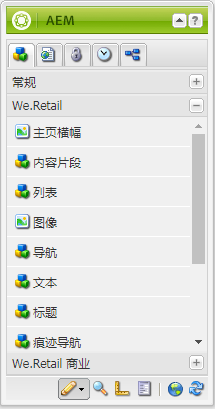
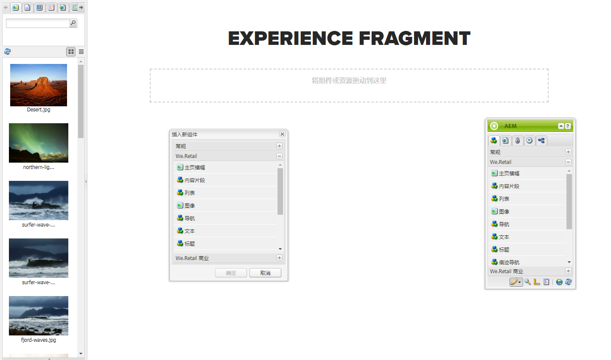
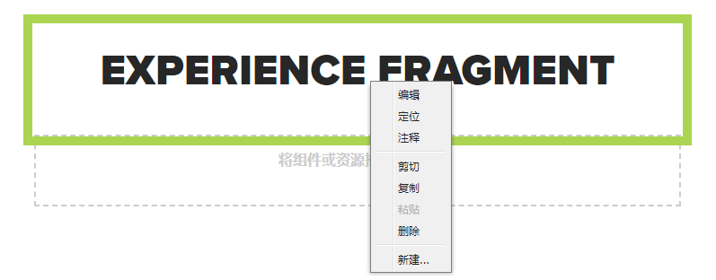
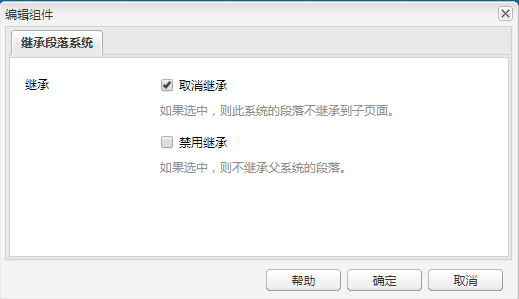
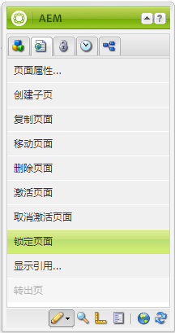

# 编辑页面内容{#editing-page-content}

>[!CAUTION]
>
>AEM 6.4已结束扩展支持，本文档将不再更新。 有关更多详细信息，请参阅 [技术支助期](https://helpx.adobe.com/cn/support/programs/eol-matrix.html). 查找支持的版本 [此处](https://experienceleague.adobe.com/docs/).

创建页面（新页面或者作为启动项或 Live Copy 的一部分）后，您可以编辑内容，以进行所需的更新。

内容是使用可拖动到页面上的组件（适用于内容类型）进行添加的。 然后，可以就地编辑、移动或删除这些内容。

>[!NOTE]
>
>您的帐户需要 [适当的访问权限](/help/sites-administering/security.md) 和 [权限](/help/sites-administering/security.md#permissions) 编辑页面；例如，添加、编辑或删除组件、添加注释、解锁。
>
>如果您遇到任何问题，我们建议您与系统管理员联系。

## Sidekick {#sidekick}

在创作页面时，Sidekick是一个关键工具。 创作页面时，该页面将处于浮动状态，因此始终可见。

提供了多个选项卡和图标，包括：

* 组件
* 页面
* 信息
* 版本控制
* 工作流
* 模式
* 基架
* ClientContext
* 网站

这些功能提供对多种功能的访问；包括：

* [选择组件](/help/sites-classic-ui-authoring/classic-page-author-env-tools.md#sidekick)
* [显示引用](/help/sites-classic-ui-authoring/classic-page-author-env-tools.md#showing-references)
* [访问审核日志](/help/sites-classic-ui-authoring/classic-page-author-env-tools.md#audit-log)
* [切换模式](/help/sites-classic-ui-authoring/classic-page-author-env-tools.md#page-modes)
* [创建](/help/sites-classic-ui-authoring/classic-page-author-work-with-versions.md#creating-a-new-version), [恢复](/help/sites-classic-ui-authoring/classic-page-author-work-with-versions.md#restoring-a-page-version-from-sidekick) 和 [比较](/help/sites-classic-ui-authoring/classic-page-author-work-with-versions.md#comparing-with-a-previous-version) 版本

* [发布](/help/sites-classic-ui-authoring/classic-page-author-publish-pages.md#publishing-a-page), [取消发布](/help/sites-classic-ui-authoring/classic-page-author-publish-pages.md#unpublishing-a-page) 页面

* [编辑页面属性](/help/sites-classic-ui-authoring/classic-page-author-edit-page-properties.md)

* [基架](/help/sites-authoring/scaffolding.md)

* [客户端上下文](/help/sites-administering/client-context.md)

## 插入组件 {#inserting-a-component}

### 插入组件 {#inserting-a-component-1}

打开页面后，即可开始添加内容。 要执行此操作，您需要添加组件（也称为段落）。

要插入新组件，请执行以下操作：

1. 选择要插入的段落类型的方法有多种：

   * 双击标有的区域 **将组件或资产拖动到此处……** - **插入新组件** 工具栏。 选择组件并单击 **确定**.
   * 从浮动工具栏（称为Sidekick）中拖动组件以插入新段落。
   * 右键单击现有段落并选择 **新建……**  — 此时将打开插入新组件工具栏。 选择组件并单击 **确定**.

   

1. 在Sidekick和 **插入新组件** 工具栏中会显示可用组件（段落类型）的列表。 这些部分可以拆分为不同的部分（例如，“常规”、“列”等），这些部分可根据需要进行扩展。

   根据您的生产环境，这些选项可能会有所不同。 有关组件的完整详细信息，请参阅 [默认组件](/help/sites-classic-ui-authoring/classic-page-author-default-components.md).

1. 在页面上插入所需的组件。 然后双击段落，此时将打开一个窗口，用于配置段落和添加内容。

### 使用内容查找器插入组件 {#inserting-a-component-using-the-content-finder}

您还可以通过从 [内容查找器](/help/sites-classic-ui-authoring/classic-page-author-env-tools.md#the-content-finder). 这将自动为包含资产的相应类型创建新组件。

这适用于以下资产类型（某些类型将取决于页面/段落系统）：

| 资产类型 | 生成的组件类型 |
|---|---|
| 图像 | 图像 |
| 文档 | 下载 |
| 产品 | 产品 |
| 视频 | 闪光灯 |

>[!NOTE]
>
>可针对您的安装配置此行为。请参阅 [配置段落系统以便拖动资产可创建组件实例](/help/sites-developing/developing-components.md#configuring-a-paragraph-system-so-that-dragging-an-asset-creates-a-component-instance) 以了解更多详细信息。

要通过拖动以上某一资产类型创建组件，请执行以下操作：

1. 确保页面处于&#x200B;[**编辑**&#x200B;模式](/help/sites-classic-ui-authoring/classic-page-author-env-tools.md#page-modes)。
1. 打开 [内容查找器](/help/sites-classic-ui-authoring/classic-page-author-env-tools.md#the-content-finder).
1. 将所需的资产拖动到所需位置。 的 [组件占位符](#componentplaceholder) 显示组件在放置时的位置。

   将在所需位置创建与资产类型相应的组件 — 组件将包含选定的资产。

1. [编辑](#editmovecopypastedelete) 组件（如果需要）。

## 编辑组件（内容和属性） {#editing-a-component-content-and-properties}

要编辑现有段落，请执行以下操作之一：

* **双击** 要打开的段落。 您会看到与使用现有内容创建段落时相同的窗口。 进行更改并单击 **确定**.

* **右键单击** 段落并单击 **编辑**.

* **单击** 在段落上两次（缓慢双击）以进入就地编辑模式。 您将能够直接编辑页面上的文本，而不是在对话框窗口中编辑。 在此模式下，页面顶部将提供一个工具栏。 只需进行更改，系统便会自动保存这些更改。

## 移动组件 {#moving-a-component}

要移动段落，请执行以下操作：

>[!NOTE]
>
>您也可以使用[剪切并粘贴](#cut-copy-paste-a-component)来移动组件。

1. 选择要移动的段落：

   

1. 将段落拖到新位置 — AEM用绿色复选标记指示可将段落移至的位置。 将其拖放到所需位置。
1. 您的段落将被移动：

   

## 删除组件 {#deleting-a-component}

要删除段落，请执行以下操作：

1. 选择段落并 **右键单击**:

   

1. 选择 **删除** 中。 AEM WCM会请求您确认是否要删除该段落，因为此操作无法撤消。
1. 单击&#x200B;**确定**。

>[!NOTE]
>
>如果已设置 [显示全局编辑工具栏的用户属性](/help/sites-classic-ui-authoring/author-env-user-props.md) 您还可以使用 **复制**, **剪切**, **粘贴**, **删除** 按钮。\
>各种 [键盘快捷键](/help/sites-classic-ui-authoring/classic-page-author-keyboard-shortcuts.md) 也可用。

## 剪切/复制/粘贴组件 {#cut-copy-paste-a-component}

当 [删除组件](#deleting-a-component) 您可以使用上下文菜单复制、剪切和/或粘贴组件

>[!NOTE]
>
>如果已设置 [显示全局编辑工具栏的用户属性](/help/sites-classic-ui-authoring/author-env-user-props.md) 您还可以使用 **复制**, **剪切**, **粘贴**, **删除** 按钮。
>
>各种 [键盘快捷键](/help/sites-classic-ui-authoring/classic-page-author-keyboard-shortcuts.md) 也可用。

>[!NOTE]
>
>仅同一页面支持剪切、复制和粘贴内容。

## 继承组件 {#inherited-components}

继承组件可能是多种情况的产物，包括：

* [多站点管理](/help/sites-administering/msm.md);也与 [基架](/help/sites-classic-ui-authoring/classic-feature-scaffolding.md#scaffolding-with-msm-inheritance).

* [启动项](/help/sites-classic-ui-authoring/classic-launches.md) （当基于Live Copy时）。
* 具体组件；例如Geometrixx中的“继承段落系统”。

您可以取消（随后也可以重新启用）继承。根据组件的不同，可从以下位置执行此操作：

1. **Live Copy**

   如果某个组件是Live Copy或启动项的一部分，则会由一个挂锁图标指示该组件。 您可以单击挂锁图标以取消继承。

   * 选择组件后，将显示挂锁图标；例如：

   

   * 挂锁图标也显示在组件对话框中；例如：

   

1. **继承的段落系统**

   配置对话框。 例如，与Geometrixx中的“继承段落系统”一样：

   

## 添加注释 {#adding-annotations}

[批注](/help/sites-classic-ui-authoring/classic-page-author-annotations.md) 允许其他作者对您的内容提供反馈。 它通常用于审核和验证目的。

## 预览页面 {#previewing-pages}

Sidekick下边框中有两个图标，这些图标对于预览页面很重要：

* 铅笔图标显示您当前处于编辑模式，在该模式下可以添加、修改、移动或删除内容。

   

* 放大镜图标允许您选择预览模式，在该模式下，页面会像在发布环境中一样显示（有时还需要刷新页面）：

   

   在预览模式下，Sidekick将会减小，单击向下箭头图标可返回编辑模式：

   

## 查找并替换 {#find-replace}

要对同一短语进行更大范围的编辑，请 **[查找和替换](/help/sites-classic-ui-authoring/author-env-search.md#find-and-replace)** 菜单选项，可在网站的某个部分中搜索并替换字符串的多个实例。

## 锁定页面 {#locking-a-page}

AEM允许您锁定页面，这样其他人就无法修改页面内容。 当您对一个特定页面进行大量编辑，或者需要冻结页面一段时间时，此功能非常有用。

>[!CAUTION]
>
>锁定页面时，应当格外小心，因为只有锁定页面的人（或具有管理员权限的帐户）才能解锁页面。

要锁定页面，请执行以下操作：

1. 在 **网站** 选项卡，选择要锁定的页面。
1. 双击该页面以将其打开进行编辑。
1. 在 **页面** sidekick选项卡，选择 **锁定页面**:

   

   此时将显示一条消息，指示您的页面已锁定给其他用户。 此外，在 **网站** 控制台中， AEM WCM会将页面显示为锁定状态并指示锁定页面的用户。

   

## 解锁页面 {#unlocking-a-page}

要解锁页面，请执行以下操作：

1. 在 **网站** 选项卡，选择要解锁的页面。
1. 双击该页面以将其打开。
1. 在 **页面** sidekick选项卡，选择 **解锁页面**.

## 撤消和重做页面编辑 {#undoing-and-redoing-page-edits}

当页面的内容框架具有焦点时，请使用以下键盘快捷键：

* 撤消：Ctrl+Z(Windows)或Cmd+Z(Mac)
* 重做：Ctrl+Y(Windows)或Cmd+Y(Mac)

当您撤消或重做一个或多个段落的删除、添加或重新定位时，受影响的段落会闪烁（默认行为）高亮显示。

>[!NOTE]
>
>有关撤消和重做页面编辑时可执行操作的完整详细信息，请参阅[撤消和重做页面编辑 - 理论](#undoing-and-redoing-page-edits-the-theory)。

## 撤消和重做页面编辑 – 理论 {#undoing-and-redoing-page-edits-the-theory}

>[!NOTE]
>
>系统管理员可以 [配置撤消/重做功能的各个方面](/help/sites-administering/config-undo.md) 根据实例的要求。

AEM会存储您所执行操作的历史记录以及您执行这些操作的顺序。 因此，您可以按照执行顺序撤消多个操作。 然后，您可以使用重做重新应用一个或多个操作。

如果选择了内容页面上的某个元素，则撤消和重做命令将应用于选定的项目，如文本组件。

撤消和重做命令的行为与其他软件程序中的行为类似。 在您对内容做出决策时，可使用命令恢复网页的最近状态。 例如，如果您将文本段落移至页面上的其他位置，可以使用撤消命令移回该段落。如果您随后又决定移动段落，请使用重做命令。

>[!NOTE]
>
>您可以：
>
>* 只要您在执行撤消操作后没有进行页面编辑，就可以执行重做操作。
>* 最多可撤消20个编辑操作（默认设置）。
>* 也可使用 [键盘快捷键](/help/sites-classic-ui-authoring/classic-page-author-keyboard-shortcuts.md) 以执行撤消和重做操作。
>

您可以对以下类型的页面更改使用撤消和重做：

* 添加、编辑、删除和移动段落
* 段落内容的就地编辑
* 在页面中复制、剪切和粘贴项目
* 跨页面复制、剪切和粘贴项目
* 添加、删除和更改文件和图像
* 添加、删除和更改注释和草图
* 对基架的更改
* 添加和删除引用
* 在组件对话框中更改属性值。

在创作页面时，表单组件渲染的表单字段不会指定值。 因此，撤消和重做命令不会影响您对这些类型组件的值所做的更改。 例如，您无法撤消在下拉列表中选择某个值的操作。

>[!NOTE]
>
>对文件和图像的更改执行撤消和重做操作需要特殊的权限。此外，文件和图像更改的撤消历史记录至少持续数小时。 但是，在此之后，将无法保证可以撤消这些更改。 您的管理员可以提供权限并更改10小时的默认时间。
