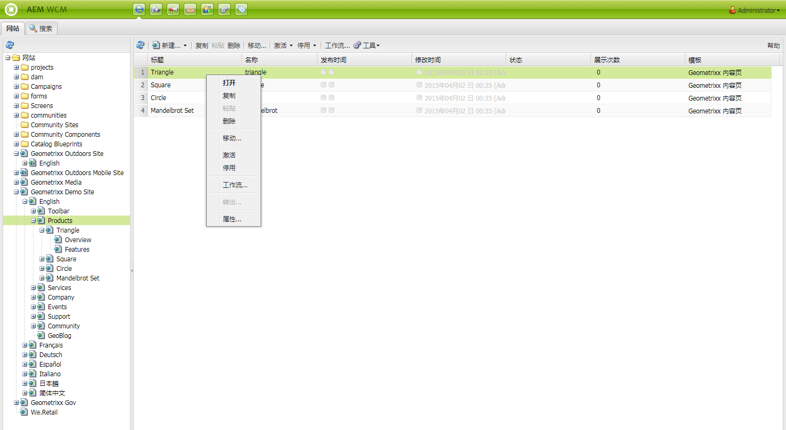
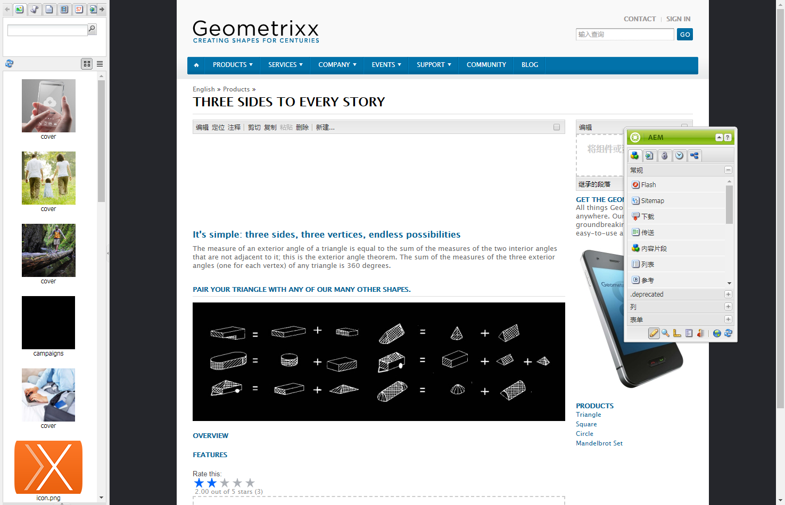
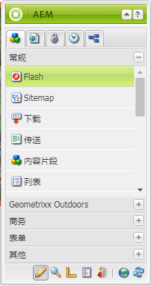
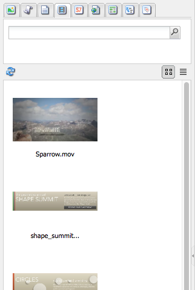
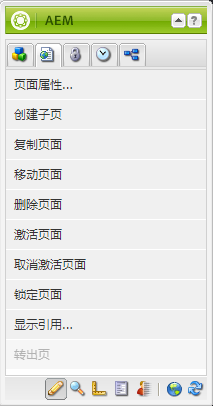
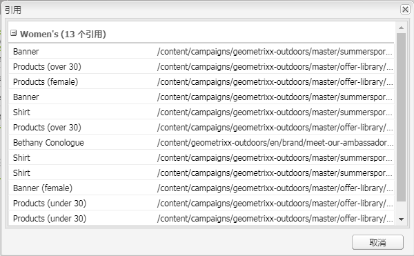
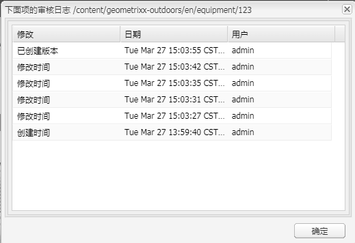

# 创作 — 环境和工具{#authoring-the-environment-and-tools}

>[!CAUTION]
>
>AEM 6.4已结束扩展支持，本文档将不再更新。 有关更多详细信息，请参阅 [技术支助期](https://helpx.adobe.com/cn/support/programs/eol-matrix.html). 查找支持的版本 [此处](https://experienceleague.adobe.com/docs/).

AEM 的创作环境提供了各种可用于组织和编辑内容的机制. 可以从各种控制台和页面编辑器访问提供的工具。

## 站点管理 {#site-administration}

的 **网站** 控制台允许您管理和导航您的网站。 使用两个窗格，可以展开网站的结构并对所需元素执行操作：

## 编辑页面内容 {#editing-your-page-content}

经典UI中使用内容查找器和Sidekick，有一个单独的页面编辑器：

`http://localhost:4502/cf#/content/geometrixx/en/products/triangle.html`

## 访问帮助 {#accessing-help}

各种 **帮助** 可以从AEM内直接访问资源：

以及访问 [控制台工具栏中的帮助](/help/sites-classic-ui-authoring/author-env-basic-handling.md#accessing-help)，您还可以从Sidekick访问帮助(使用？ 图标):

或者，通过使用 **帮助** 按钮；这将显示上下文相关帮助。

## Sidekick {#sidekick}

的 **组件** 使用sidekick的选项卡，可浏览可添加到当前页面的组件。 可以展开所需的组，然后将组件拖动到页面上的所需位置。

## 内容查找器 {#the-content-finder}

内容查找器是在编辑页面时在存储库内查找资产和/或内容的一种快速、简便的方法。

您可以使用内容查找器来查找一系列资源。 在适当情况下，您可以将项目拖放到页面上的段落中：

* [图像](#finding-images)
* [文档](#finding-documents)
* [电影](#finding-movies)
* [Dynamic Media浏览器](/help/sites-administering/scene7.md#scene7contentbrowser)
* [页面](/help/sites-classic-ui-authoring/classic-page-author-env-tools.md#finding-pages)
* [段落](#referencing-paragraphs-from-other-pages)
* [产品](/help/sites-classic-ui-authoring/classic-page-author-env-tools.md#products)
* 或 [按存储库结构浏览网站](#the-content-finder)

通过所有选项，您可以 [搜索特定项目](#the-content-finder).

### 查找图像 {#finding-images}

此选项卡列出了存储库中的所有图像。

在页面上创建图像段落后，可以将某个项目拖放到段落中。

### 查找文档 {#finding-documents}

此选项卡列出了存储库中的所有文档。

在页面上创建“下载”段落后，可以将项目拖放到段落中。

### 查找影片 {#finding-movies}

此选项卡列出了存储库中的所有影片(例如，Flash项目)。

在页面上创建了相应的段落(例如Flash)后，可以将项目拖放到段落中。

### 产品 {#products}

此选项卡列出了所有产品。 在页面上创建了相应的段落（例如“产品”）后，可以将项目拖放到段落中。

### 查找页面 {#finding-pages}

此选项卡显示所有页面。 双击任意页面以将其打开进行编辑。

### 从其他页面中引用段落 {#referencing-paragraphs-from-other-pages}

此选项卡允许您搜索其他页面。 将列出该页面中的所有段落。 然后，您可以将某个段落拖到当前页面，这将创建对原始段落的引用。

### 使用完整存储库视图 {#using-the-full-repository-view}

此选项卡显示存储库中的所有资源。

### 在内容浏览器中使用搜索 {#using-search-with-the-content-browser}

在所有选项上，您可以搜索特定项目。 将列出与搜索模式匹配的所有标记和任何资源：

您还可以使用通配符进行搜索。 支持的通配符包括：

* `*`  — 匹配零个或多个字符的序列。

* `?`  — 匹配单个字符。

>[!NOTE]
>
>有一个伪属性“name”，必须用于执行通配符搜索。

例如，如果有一个图像的名称为：

`ad-nmvtis.jpg`

以下搜索模式将找到它（以及与该模式匹配的任何其他图像）：

* `name:*nmv*`
* `name:AD*`  — 字符匹配为 *not* 区分大小写。
* `name:ad?nm??is.*`  — 您可以在查询中使用任意数量的通配符。

>[!NOTE]
>
>您还可以使用 [SQL2](https://helpx.adobe.com/experience-manager/6-4/sites/developing/using/reference-materials/javadoc/org/apache/jackrabbit/commons/query/sql2/package-summary.html) 搜索。

## 显示引用 {#showing-references}

AEM允许您查看哪些页面已链接到您当前正在处理的页面。

要显示直接页面引用，请执行以下操作：

1. 在Sidekick中，选择 **页面** 选项卡。

   

1. 选择 **显示引用……** AEM会打开引用窗口，并显示哪些页面引用选定页面，包括其路径。

   

在某些情况下，可以从Sidekick执行其他操作，包括：

* [启动项](/help/sites-classic-ui-authoring/classic-launches.md)
* [Live Copy](/help/sites-administering/msm.md)

* [Blueprint](/help/sites-administering/msm-best-practices.md)

其他 [可以在“网站”控制台中查看页面间关系](/help/sites-classic-ui-authoring/author-env-basic-handling.md#page-information-on-the-websites-console).

## 审查日志 {#audit-log}

的 **审核日志** 可从 **信息** 选项卡。 其中列出了当前页面上最近执行的操作；例如：

## 页面信息 {#page-information}

网站控制台 [提供有关页面当前状态的信息](/help/sites-classic-ui-authoring/author-env-basic-handling.md#page-information-on-the-websites-console) 如发布、修改、锁定、Live Copy等。

## 页面模式 {#page-modes}

使用经典UI编辑页面时，可以使用Sidekick底部的图标访问各种模式：

Sidekick底部的图标行用于切换处理页面的模式：

* [编辑](/help/sites-classic-ui-authoring/classic-page-author-edit-mode.md)

   这是默认模式，允许您通过添加或删除组件以及进行其他更改来编辑页面。

* [预览](/help/sites-classic-ui-authoring/classic-page-author-edit-content.md#previewing-pages)

   利用此模式，可预览页面以最终形式在网站上显示时的样子。

* [Design](/help/sites-classic-ui-authoring/classic-page-author-design-mode.md#main-pars-procedure-0)

   在此模式下，您可以通过配置可访问的组件来编辑页面设计。

>[!NOTE]
>
>还提供其他选项：
>
>* [基架](/help/sites-classic-ui-authoring/classic-feature-scaffolding.md)
>* [ClientContext](/help/sites-administering/client-context.md)
>* 网站 — 将打开“网站”控制台。
>* 重新加载 — 将刷新页面。

## 键盘快捷键 {#keyboard-shortcuts}

可以使用各种[键盘快捷键](/help/sites-classic-ui-authoring/classic-page-author-keyboard-shortcuts.md)。
