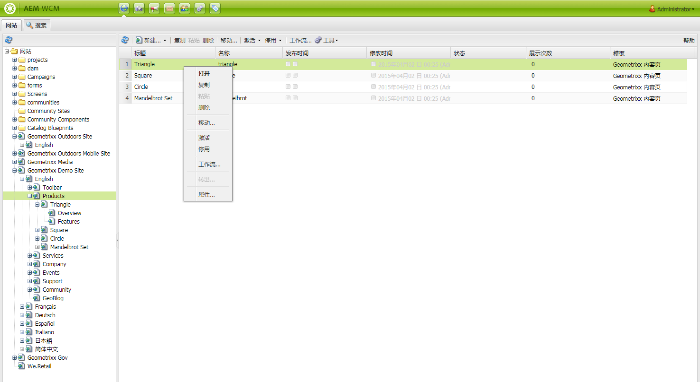
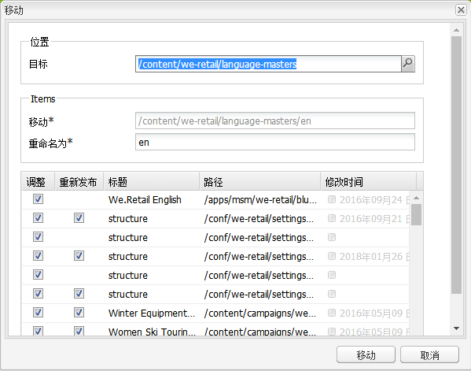
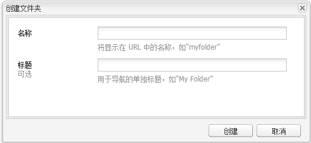

# 创建和组织页面{#creating-and-organizing-pages}

此部分介绍如何使用 Adobe Experience Manager (AEM) 创建和管理页面，以便您随后能够在这些页面上[创建内容](/help/sites-classic-ui-authoring/classic-page-author-edit-content.md)。

>[!NOTE]
>
>要在页面上执行创建、复制、移动、编辑和删除等操作，您的帐户必须拥有[适当的访问权利](/help/sites-administering/security.md)和[权限](/help/sites-administering/security.md#permissions)。
>
>如果您遇到任何问题，我们建议您与系统管理员联系。

## 组织您的网站 {#organizing-your-website}

作为作者，您需要在 AEM 内组织您的网站。这包括创建和命名您的内容页面，因此：

* 您可以轻松地在创作环境中找到这些页面
* 您站点的访客可以方便地在发布环境中浏览这些页面

您还可以使用[文件夹](#creating-a-new-folder)来帮助组织内容。

网站结构可以被视为包含内容页面的&#x200B;*树结构*。这些内容页面的名称用于组成 URL，而标题则会在查看页面内容时显示出来。

下面显示了从 Geometrixx 站点提取的内容；以 `Triangle` 页面为例，我们将通过以下路径对其进行访问：

* 创作环境

   `http://localhost:4502/cf#/content/geometrixx/en/products/triangle.html`

* 发布环境

   `http://localhost:4503/content/geometrixx/en/products/triangle.html`

   根据实例的配置，在发布环境中使用`/content`可能是可选的。

```xml
  /content
    /geometrixx
      /en
        /toolbar...
        /products
          /triangle
            /overview 
            /features
          /square...
          /circle...
          /...
        /...
      /fr...
      /de...
      /es...
      /...
    /...
```

此结构可以从“网站”控制台中查看，您可以使用该控制台在树结构](/help/sites-classic-ui-authoring/author-env-basic-handling.md#main-pars-text-15)中导航。[



### 页面命名惯例 {#page-naming-conventions}

在创建新页面时，需填写以下两个关键字段：

* **[标题](#title)**：

   * 它会在控制台中向用户显示并在编辑中的页面内容顶部显示。
   * 此字段为必填字段。

* **[名称](#name)**：

   * 用于生成 URI。
   * 此字段的用户输入是可选的。如果未指定，名称会从标题派生。

创建新页面时，AEM将根据AEM和JCR实行的惯例](/help/sites-developing/naming-conventions.md)验证页面名称。[

实施和允许使用的字符列表因UI而略有不同（触屏UI更为广泛），但最低允许使用的字符数为：

* 从“a”到“z”
* 从“A”到“Z”
* 从“0”到“9”
* _（下划线）
* `-`（连字符/减号）

如果您要确保名称能被接受/使用，就只能使用这些字符（如果您需要所有允许字符的完整详细信息，请参阅[命名惯例](/help/sites-developing/naming-conventions.md)）。

#### 标题 {#title}

如果您在创建新页面时只提供一个页面&#x200B;**标题**，AEM 将从此字符串派生页面&#x200B;**名称**[，并依据 AEM 和 JCR 实行的惯例验证此名称。](/help/sites-developing/naming-conventions.md)在这两个 UI 中，包含无效字符的&#x200B;**标题**&#x200B;字段将被接受，不过派生的名称将把无效的字符替换掉。例如：

| 标题 | 派生的名称 |
|---|---|
| Schön | schoen.html |
| SC%&amp;ast;ç+ | sc---c-.html |

#### 名称 {#name}

如果您在创建新页面时提供页面&#x200B;**名称**[，AEM 将依据 AEM 和 JCR 实行的惯例验证此名称。](/help/sites-developing/naming-conventions.md)

在经典UI中，**无法在**&#x200B;名称&#x200B;**字段中输入无效字符**。

>[!NOTE]
>在触屏UI中，您&#x200B;**无法在**&#x200B;名称&#x200B;**字段中提交无效的字符**。 当 AEM 检测到无效字符时，此字段将会突出显示，并出现一条说明性消息以指示需要删除/替换的字符。

>[!NOTE]
>
>应避免使用 ISO-639-1 定义的双字母代码，除非该页面是语言根页面。
>
>请参阅[准备翻译内容](/help/sites-administering/tc-prep.md)以了解更多信息。

### 模板 {#templates}

在 AEM 中，模板可指定特定类型的页面。模板将作为要创建的任何新页面的基础。

模板可定义页面结构，包括缩略图图像和其他属性。例如，对于产品页面、Sitemap 和联系人信息，您可能有不同的模板。模板由[组件](#components)构成。

AEM 附带了一些现成的模板。预提供的模板取决于各个网站，（创建新页面时）需要提供的信息取决于使用的 UI。关键的字段如下：

* **标题**
在生成的网页上显示的标题。

* **名称**
在命名页面时使用。

* **模板**
可在生成新页面时使用的模板列表。

### 组件 {#components}

组件是AEM提供的元素，旨在让您能够添加特定类型的内容。AEM附带一系列功能完备的现成组件；这包括：

* 文本
* 图像
* 幻灯片放映
* 视频
* 更多

创建并打开页面后，您可以[使用](/help/sites-classic-ui-authoring/classic-page-author-edit-content.md#insertinganewparagraph)组件添加内容，该组件可从[Sidekick](/help/sites-classic-ui-authoring/classic-page-author-env-tools.md#sidekick)中获取。

## 管理页面 {#managing-pages}

### 创建新页面 {#creating-a-new-page}

除非已提前为您创建所有页面，否则必须先创建页面，然后才能开始创建内容：

1. 从&#x200B;**网站**&#x200B;控制台中，选择要在哪个级别创建新页面。

   在以下示例中，您将在左侧窗格中显示的&#x200B;**产品**&#x200B;级别下创建页面；右侧窗格显示了&#x200B;**产品**&#x200B;级别下已存在的页面。

   

1. 在&#x200B;**新建...** 菜单（单击&#x200B;**新建...** 旁边的箭头）中，选择&#x200B;**新建页面...**。**创建页面**&#x200B;窗口将会打开。

   单击&#x200B;**新建...** 本身也会充当&#x200B;**新建页面...** 选项的快捷方式。

1. 通过&#x200B;**创建页面**&#x200B;对话框可以：

   * 提供&#x200B;**标题**；向用户显示此标题。
   * 提供&#x200B;**名称**；该名称用于生成 URI。如果未指定，名称将从标题派生。

      * 如果您在创建新页面时提供页面&#x200B;**名称**，AEM 将依据 AEM 和 JCR 实行的惯例[验证此名称](/help/sites-developing/naming-conventions.md)。
      * 在经典 UI 中，您在&#x200B;**名称**&#x200B;字段中&#x200B;**无法输入无效的字符**。
   * 单击要用于创建新页面的模板。

      可基于模板创建新页面；例如，确定内容页面的基本布局。
   >[!NOTE]
   >
   >请参阅[页面命名惯例](#page-naming-conventions)。

   创建新页面至少需要提供&#x200B;**标题**&#x200B;和所需模板的信息。

   

   >[!NOTE]
   >
   >如果要在 URL 中使用 Unicode 字符，请设置“别名”(`sling:alias`) 属性（[页面属性](/help/sites-classic-ui-authoring/classic-page-author-edit-page-properties.md)）。

1. 单击&#x200B;**创建**&#x200B;以创建页面。您将返回到&#x200B;**网站**&#x200B;控制台，在此可以看到用于新页面的条目。

   控制台提供了有关页面的信息（例如，上次编辑时间和编辑人），这些信息会在必要时进行更新。

   >[!NOTE]
   >
   >您也可以在编辑现有页面时创建页面。使用Sidekick的&#x200B;**Page**&#x200B;选项卡中的**创建子页面**，将在正在编辑的页面下直接创建新页面。

### 打开页面进行编辑 {#opening-a-page-for-editing}

可通过以下任一方法打开要[编辑](/help/sites-classic-ui-authoring/classic-page-author-edit-content.md#editing-a-component-content-and-properties)的页面：

* 从&#x200B;**网站**&#x200B;控制台中，**双击**&#x200B;页面条目，以将其打开进行编辑。

* 从“**网站**”控制台中，可以&#x200B;**右键单击**（上下文菜单）页面项目，然后从菜单中选择“**打开**”。

* 打开页面后，可通过单击超链接导航到站点中的其他页面（以对其进行编辑）。

### 复制和粘贴页面  {#copying-and-pasting-a-page}

复制时，可以复制以下任一内容：

* 单个页面
* 页面以及所有子页面

1. 从&#x200B;**网站**&#x200B;控制台中，选择要复制的页面。

   >[!NOTE]
   >
   >在此阶段，您是要复制单个页面还是下层子页面，这并无关系。

1. 单击“**复制**”。

1. 导航到新位置并单击：

   * **粘贴** - 粘贴页面以及所有子页面
   * **Shift + 粘贴** - 仅粘贴选定页面

   将在新位置粘贴页面。

   >[!NOTE]
   >
   >如果现有页面已具有相同名称，可能会自动调整页面名称。

   >[!NOTE]
   >
   >您也可以从 Sidekick 的“**页面**”选项卡中使用“**复制页面**”。此时将打开一个对话框，您可以在此处指定目标，等等。

### 移动或重命名页面 {#moving-or-renaming-page}

>[!NOTE]
>
>重命名页面也需遵循指定新页面名称时用到的[页面命名惯例](#page-naming-conventions)。

移动或重命名页面的过程是相同的。通过同一操作可以：

* 将页面移动至新位置
* 在同一位置重命名页面
* 将页面移动至新位置，同时进行重命名

AEM 还有一项功能是允许您更新指向重命名或被移动页面的内部链接。此操作非常灵活，可以一个页面一个页面地执行。

要移动或重命名页面，请执行以下操作：

1. 触发移动操作有多种不同的方法：

   * 从“**网站**”控制台中，单击以选择页面，然后选择“**移动...**”。
   * 从&#x200B;**网站**&#x200B;控制台中，还可以选择页面项目，然后&#x200B;**右键单击**&#x200B;并选择&#x200B;**移动...**。
   * 编辑页面时，可以从 Sidekick 的&#x200B;**页面**&#x200B;选项卡中选择&#x200B;**移动页面**。

1. **移动**&#x200B;窗口将会打开；在此可为页面指定新位置、新名称或同时指定两者。

   

   该页面还会列出引用所移动页面的任何页面。根据引用页面的状态，您可以调整这些链接和/或重新发布页面。

1. 相应填写以下字段：

   * **目标**

      使用 Sitemap（通过下拉选择器提供）可选择应将页面移动到的位置。

      如果只想重命名页面，可忽略此字段。

   * **移动**

      指定要移动的页面 - 通常在默认情况下填充，具体取决于开始移动操作的方式和位置。

   * **重命名为**

      默认情况下，将显示当前页面标签。指定新页面标签（如果需要）。

   * **调整**

      更新所列页面上指向被移动页面的链接：例如，如果页面 A 包含指向页面 B 的链接，则在页面 B 移动时，AEM 会调整页面 A 上的链接。

      可为各个引用页面选择/取消选择此操作。

   * **重新发布**

      重新发布引用页面；同样可为各个页面选择此操作。
   >[!NOTE]
   >
   >如果页面已经激活，则移动页面会自动将其取消激活。默认情况下，页面将在移动完成后重新激活，但通过取消选中&#x200B;**移动**&#x200B;窗口中页面的&#x200B;**重新发布**&#x200B;字段，可以更改这一行为。

1. 单击&#x200B;**移动**。此时将需要进行确认。单击&#x200B;**确定**&#x200B;以确认。

   >[!NOTE]
   >
   >页面标题不会更新。

### 删除页面 {#deleting-a-page}

1. 可从多个位置删除页面：

   * 在&#x200B;**网站**&#x200B;控制台中，单击以选择页面，然后右键单击并从显示的菜单中选择&#x200B;**删除**。
   * 在&#x200B;**网站**&#x200B;控制台中，单击以选择页面，然后从工具栏菜单中选择&#x200B;**删除**。
   * 在 Sidekick 中，使用&#x200B;**页面**&#x200B;选项卡选择&#x200B;**删除页面** - 此操作将删除当前打开的页面。

1. 在选择删除页面后，必须确认请求 - 因为此操作无法撤消。

   >[!NOTE]
   >
   >删除后，如果该页面已发布，则可以恢复最新（或特定）版本，但如果后来做过进一步的修改，则恢复版本的内容可能与最新版本并不完全相同。有关更多详细信息，请参阅[如何恢复页面](/help/sites-classic-ui-authoring/classic-page-author-work-with-versions.md#restoringpages)。

>[!NOTE]
>
>如果页面已经激活，则在删除前会自动将其取消激活。

### 锁定页面 {#locking-a-page}

您可以在控制台中或者在编辑单个页面时[锁定/解锁页面](/help/sites-classic-ui-authoring/classic-page-author-edit-content.md#locking-a-page)。关于页面是否已被锁定的信息也会显示在这两个位置。

### 创建新文件夹 {#creating-a-new-folder}

>[!NOTE]
>
>文件夹也需遵循在指定新文件夹名称时用到的[页面命名惯例](#page-naming-conventions)。

1. 打开&#x200B;**网站**&#x200B;控制台并导航到所需的位置。
1. 在&#x200B;**新建...** 菜单（单击&#x200B;**新建...** 旁边的箭头）中，选择&#x200B;**新建文件夹...**。
1. 此时将打开&#x200B;**创建文件夹**&#x200B;对话框。您可在此输入&#x200B;**名称**&#x200B;和&#x200B;**标题**：

   

1. 选择&#x200B;**创建**&#x200B;以创建文件夹。
