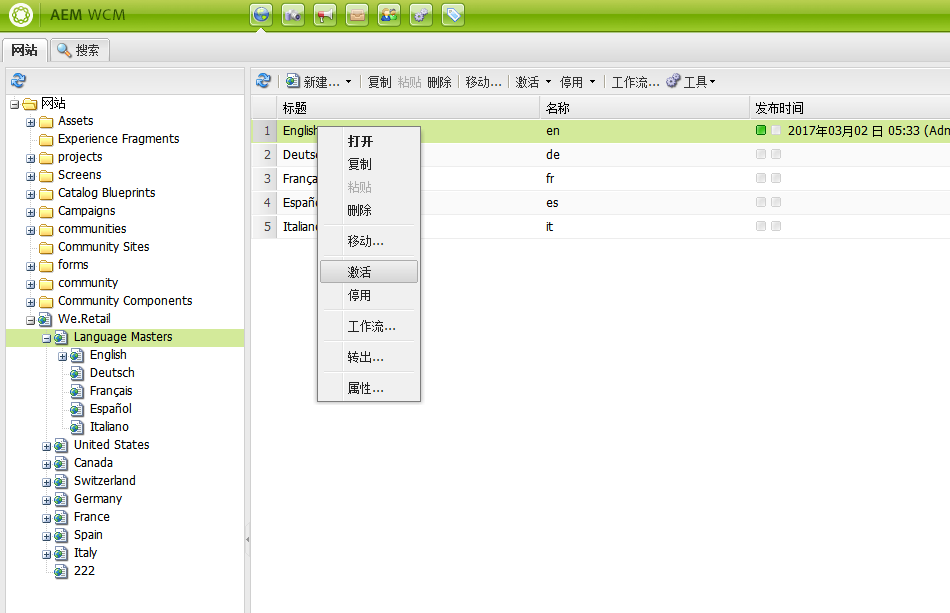
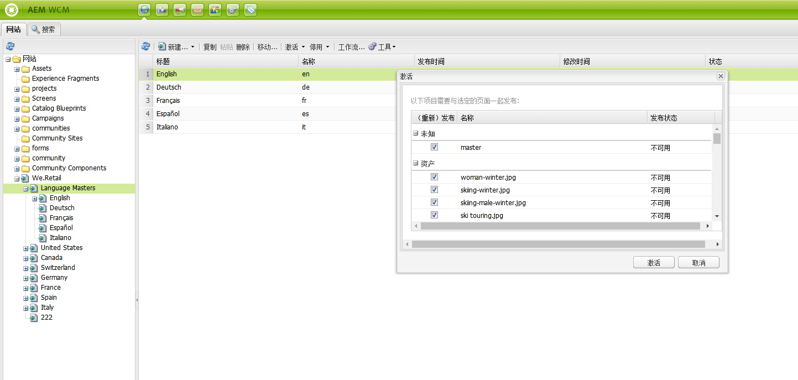
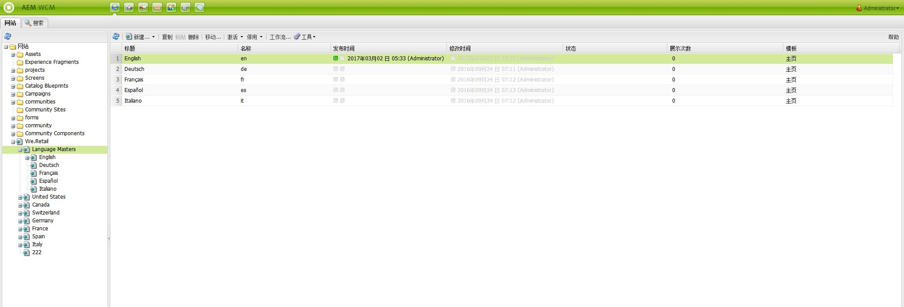
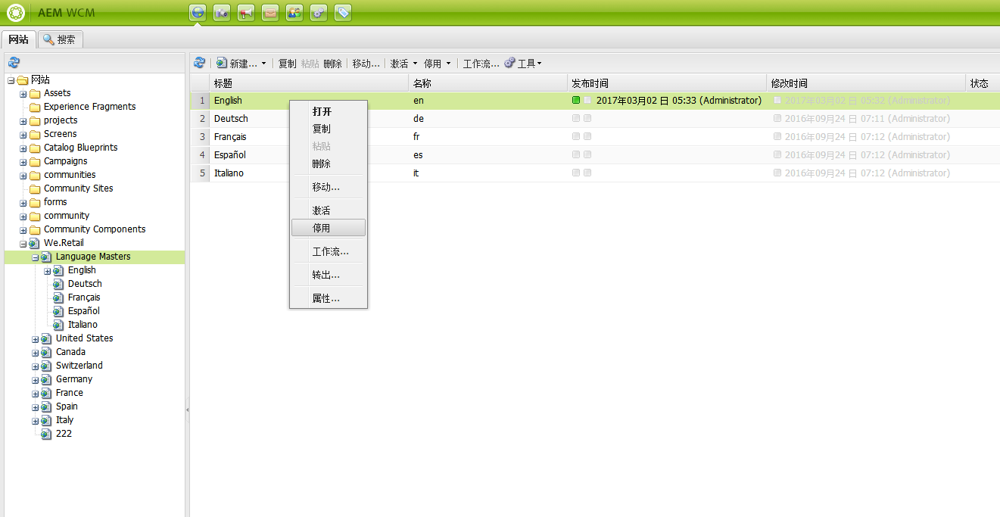
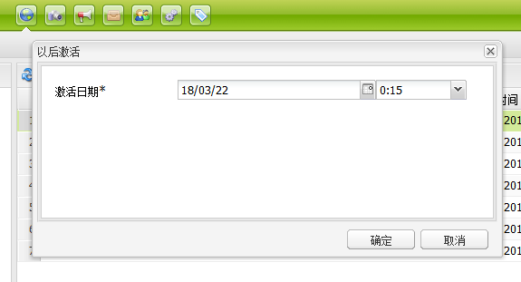
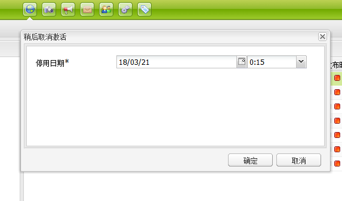
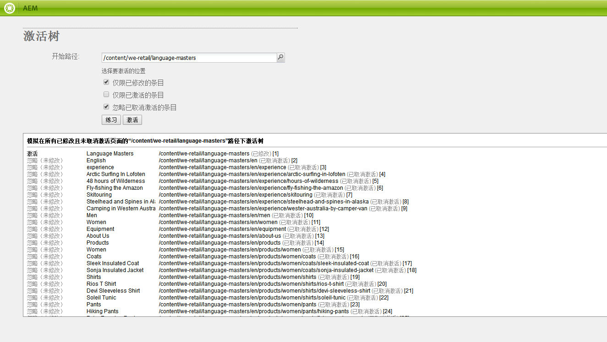

# 发布页面{#publishing-pages}

>[!CAUTION]
>
>AEM 6.4已结束扩展支持，本文档将不再更新。 有关更多详细信息，请参阅 [技术支助期](https://helpx.adobe.com/cn/support/programs/eol-matrix.html). 查找支持的版本 [此处](https://experienceleague.adobe.com/docs/).

在创作环境中创建并审核内容后，其目标是使其可在您的公共网站（发布环境）上使用。

这称为发布页面。 当您要从发布环境中删除页面时，称为取消发布。 发布和取消发布页面时，该页面会在创作环境中保留以供进一步更改，直到将其删除为止。

您还可以立即发布/取消发布页面，或者在某个预定义的将来日期/时间发布/取消发布页面。

>[!NOTE]
>
>某些与发布相关的术语可能会混淆：
>
>* **发布/取消发布**
   >  这些是在发布环境中公开提供（或不公开提供）您的内容的主要操作术语。
>
>* **激活／取消激活**
   >  这两个术语与发布/取消发布同义。
>
>* **复制**
   >  这些是技术术语，用于描述数据（例如页面内容、文件、代码、用户评论）从一个环境移动到另一个环境（例如在发布或反向复制用户评论时）的移动。
>

>[!NOTE]
>
>如果您没有发布特定页面所需的权限，请执行以下操作：
>
>* 将触发一个工作流，向相应的人员通知您的发布请求。
>* 将显示一条消息（很短时间）来通知您。
>

## 发布页面 {#publishing-a-page}

激活页面的方法有两种：

* [从网站控制台](#activating-a-page-from-the-websites-console)
* [从页面本身的Sidekick中](#activating-a-page-from-sidekick)

>[!NOTE]
>
>您还可以使用 [激活树](#howtoactivateacompletesectiontreeofyourwebsite) 工具控制台中的。

### 从网站控制台激活页面 {#activating-a-page-from-the-websites-console}

您可以在网站控制台中激活页面。 在打开页面并修改其内容后，您将返回到“网站”控制台：

1. 在网站控制台中，选择要激活的页面。
1. 选择 **激活**，可从顶部菜单或选定页面项目的下拉菜单中选择。

   要激活页面及其所有子页面的内容，请使用 [**工具** 控制台](/help/sites-classic-ui-authoring/classic-page-author-publish-pages.md#howtoactivateacompletesectiontreeofyourwebsite).

   

   >[!NOTE]
   >
   >如有必要，AEM会要求您激活或重新激活与页面链接的任何资产。 您可以选中或清除用于激活这些资产的复选框。

1. 如有必要，AEM会要求您激活或重新激活与页面链接的任何资产。 您可以选中或清除用于激活这些资产的复选框。

   

1. AEM WCM可激活选定的内容。 发布的一个或多个页面将显示在 [网站控制台](/help/sites-classic-ui-authoring/author-env-basic-handling.md#page-information-on-the-websites-console) （标记为绿色），其中包含有关谁激活了内容以及激活日期和时间的信息。

   

### 从Sidekick激活页面 {#activating-a-page-from-sidekick}

您还可以在打开页面进行编辑时激活该页面。

打开页面并修改其内容后，您可以：

1. 选择 **页面** 选项卡。
1. 单击 **激活页面**.

   窗口的右上方会显示一条消息，确认页面已激活。

## 取消发布页面 {#unpublishing-a-page}

要从发布环境中删除页面，请停用内容。

要停用页面，请执行以下操作：

1. 在网站控制台中，选择要停用的页面。
1. 选择 **停用**，可从顶部菜单或选定页面项目的下拉菜单中选择。 系统会要求您确认删除。

   

1. 刷新 [网站控制台](/help/sites-classic-ui-authoring/author-env-basic-handling.md#page-information-on-the-websites-console) 内容将标记为红色，表示内容不再发布。

   

## 稍后激活/停用 {#activate-deactivate-later}

### 以后激活 {#activate-later}

要安排您稍后的激活，请执行以下操作：

1. 在网站控制台中，转到 **激活** 菜单，然后选择 **稍后激活**.
1. 在打开的对话框中，您提供激活的日期和时间，然后单击 **确定**. 这会创建在指定时间激活的页面版本。

   

稍后激活会启动一个工作流，用于在指定时间激活此版本的页面。 相反，稍后取消激活则会启动一个工作流，用于在特定时间取消激活此版本的页面。

如果要取消此激活/取消激活，请转到 [工作流控制台](/help/sites-administering/workflows-administering.md#main-pars-title-3-yjqslz-refd) 终止相应的工作流。

### 稍后取消激活 {#deactivate-later}

要安排稍后取消激活，请执行以下操作：

1. 在网站控制台中，转到 **停用** 菜单，然后选择 **稍后取消激活**.

1. 在打开的对话框中，提供停用的日期和时间，然后单击 **确定**.

   

**延迟停用** r启动一个工作流，以在特定时间停用此版本的页面。

如果要取消此取消激活，请转到 [工作流控制台](/help/sites-administering/workflows-administering.md#main-pars-title-3-yjqslz-refd) 终止相应的工作流。

## 计划激活/停用（开/关时间） {#scheduled-activation-deactivation-on-off-time}

您可以使用 **开始时间** 和 **关闭时间** 的 [页面属性](/help/sites-classic-ui-authoring/classic-page-author-edit-page-properties.md).

### 确定页面发布状态 — 经典UI {#determining-page-publication-status-classic-ui}

状态可从 [网站控制台](/help/sites-classic-ui-authoring/author-env-basic-handling.md#page-information-on-the-websites-console). 颜色表示发布状态。

## 激活网站的完整部分（树） {#activating-a-complete-section-tree-of-your-website}

从 **网站** 选项卡。 当您输入或更新了大量内容页面（所有内容页面都驻留在同一根页面下）后，可以更轻松地通过一个操作来激活整个树。 您还可以执行练习来模拟激活并突出显示要激活的页面。

1. 打开 **工具** 控制台，方法是从 **欢迎** 页面，然后双击 **复制** 打开控制台( `http://localhost:4502/etc/replication.html`)。

   

1. 在 **复制** 控制台，单击 **激活树**.

   以下窗口( `http://localhost:4502/etc/replication/treeactivation.html`)。

   

1. 输入 **开始路径**. 这会指定要激活（发布）的节的根路径。 系统将考虑激活此页面及其下的所有页面（或在选择“练习”时，系统将模拟激活这些页面）。
1. 根据需要激活选择标准：

   * **仅已修改**:仅激活已修改的页面。
   * **仅激活**:仅激活已（已）激活的页面。 充当一种重新激活的形式。
   * **忽略已停用**:忽略任何已停用的页面。

1. 选择要执行的操作：

   1. 选择 **干流** 如果要检查哪些页面 *wild* 激活。 这只是模拟操作，不会激活任何页面。
   1. 选择 **激活** 。
